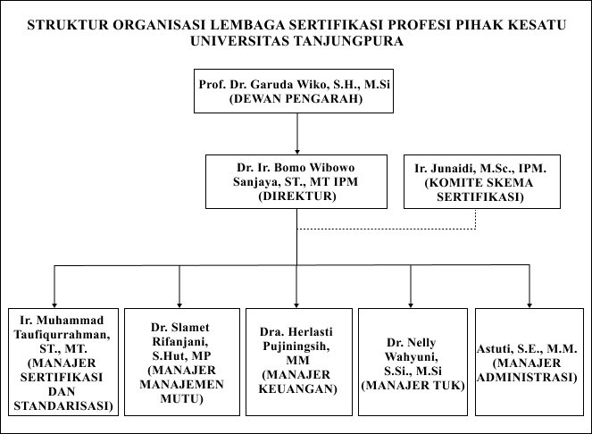

# PENDAHULUAN

## Latar Belakang

Sertifikasi kompetensi merupakan bukti formal yang mengakui kemampuan dan keahlian mereka dalam bidang tertentu. Sertifikasi ini tidak hanya menunjukkan penguasaan pengetahuan teoretis, tetapi juga keterampilan praktis yang sesuai dengan standar industri. Dalam dunia kerja yang semakin kompetitif, lulusan dengan sertifikasi kompetensi memiliki nilai tambah yang signifikan di mata pemberi kerja. Dengan demikian, mahasiswa yang memiliki sertifikasi kompetensi diharapkan lebih siap menghadapi tantangan di dunia kerja modern yang terus berkembang.

Untuk mendukung kebutuhan tersebut, Universitas Tanjungpura (UNTAN) mendirikan Lembaga Sertifikasi Profesi (LSP) yang bertanggung jawab dalam menyelenggarakan proses sertifikasi kompetensi. LSP UNTAN berdiri pada tanggal 21 Agustus 2023 berdasarkan Surat Keputusan Rektor Universitas Tanjungpura No. 3214/UN22/OT.00/2023. Lembaga ini bertujuan untuk memastikan bahwa mahasiswa dapat memperoleh sertifikasi yang sesuai dengan standar industri guna meningkatkan daya saing mereka di dunia kerja. Berikut adalah struktur organisasi LSP UNTAN.

Namun, dalam implementasinya, proses pendaftaran sertifikasi di LSP UNTAN masih menghadapi beberapa tantangan. Saat ini, LSP UNTAN telah memiliki *website* profil, tetapi belum mendukung fitur pendaftaran secara langsung. Mahasiswa yang ingin mendaftar sertifikasi harus mengisi berkas administrasi seperti formulir APL 1 dan APL 2 melalui Google Form yang disematkan di *website* profil tersebut, yang kemudian diverifikasi oleh admin dan asesor. Jika memenuhi syarat, mahasiswa akan menerima pemberitahuan melalui email untuk mengikuti pra-asesmen sebelum dijadwalkan mengikuti asesmen. Mahasiswa juga perlu melakukan pembayaran administrasi jika direkomendasikan untuk mengikuti asesmen melalui *virtual account*. Setelah asesmen selesai dan mahasiswa dinyatakan kompeten, sertifikat akan diterbitkan. Proses yang belum terintegrasi dalam satu sistem yang terpusat ini mengakibatkan pengelolaan data menjadi kurang efisien, serta berpotensi menimbulkan kendala dalam komunikasi dan administrasi. Selain itu, penggunaan dokumen fisik dalam proses sertifikasi menyebabkan permasalahan dalam penyimpanan dan pengelolaan berkas. Dokumen yang menumpuk dapat menyulitkan pencarian data, meningkatkan risiko kehilangan atau kerusakan berkas, serta membutuhkan ruang penyimpanan yang besar.

Untuk mengatasi permasalahan ini, diperlukan solusi berbasis teknologi yang dapat meningkatkan efisiensi dan efektivitas sistem pendaftaran sertifikasi di LSP UNTAN. Salah satu solusi yang tepat adalah penerapan *Progressive Web App* (PWA). PWA merupakan aplikasi web inovatif yang mampu memberikan pengalaman pengguna mirip dengan aplikasi native, tanpa perlu diunduh dari toko aplikasi seperti Google Play atau App Store. Alasan peneliti menggunakan PWA karena memungkinkan pengembangan satu aplikasi yang dapat diakses di berbagai perangkat tanpa perlu membuat versi terpisah untuk web dan *mobile*, sehingga menghemat waktu dan sumber daya. Dengan PWA, mahasiswa dapat mengakses layanan sertifikasi kapan saja dan di mana saja dengan lebih mudah dan praktis.

Pengembangan PWA dalam sistem informasi LSP UNTAN difokuskan pada digitalisasi proses pendaftaran sertifikasi, mulai dari pengisian formulir, verifikasi dokumen, hingga pemberitahuan hasil asesmen. Dengan sistem yang lebih terintegrasi dan mudah diakses, diharapkan layanan sertifikasi menjadi lebih efisien, transparan, serta meningkatkan pengalaman pengguna bagi dari sisi mahasiswa, asesor, maupun admin.

## Perumusan Masalah

Berdasarkan latar belakang yang telah diuraikan sebelumnya, maka rumusan masalah dalam penelitian ini adalah bagaimana mengembangkan sistem informasi LSP UNTAN dengan menggunakan *Progressive Web App* (PWA) yang dapat memfasilitasi proses pendaftaran sertifikasi secara daring di Lembaga Sertifikasi Profesi (LSP) UNTAN.

## Tujuan Penelitian

Maka penelitian ini bertujuan untuk mengembangkan sistem informasi LSP UNTAN dengan menggunakan *Progressive Web App* (PWA) yang dapat memfasilitasi proses pendaftaran sertifikasi secara daring di Lembaga Sertifikasi Profesi (LSP) UNTAN.

## Pembatasan Masalah

Pembatasan masalah bertujuan untuk mempersempit ruang lingkup penelitian sehingga proses perancangan dan pengembangannya menjadi lebih fokus dan terstruktur. Adapun batasan masalah dalam penelitian ini, yaitu:

1.  Pendaftaran sertifikasi hanya mencakup sertifikasi awal dan tidak termasuk perpanjangan sertifikasi, karena LSP UNTAN merupakan P1, P1 yang mana LSP P1 tidak melayani perpanjangan sertifikasi (BNSP, 2017). LSP P1 itu sendiri adalah LSP yang didirikan oleh lembaga pendidikan dan atau pelatihan dengan tujuan utama melaksanakan sertifikasi kompetensi kerja terhadap peserta pendidikan/pelatihan berbasis kompetensi dan /atau sumber daya manusia dari jejaring kerja lembaga induknya, sesuai ruang lingkup yang diberikan oleh BNSP. LSP P2 adalah LSP yang didirikan oleh industri atau instansi dengan tujuan utama melaksanakan sertifikasi kompetensi kerja terhadap sumber daya manusia lembaga induknya, sumber daya manusia dari pemasoknya dan atau sumber daya manusia dari jejaring kerjanya, sesuai ruang lingkup yang diberikan oleh BNSP. LSP P3 adalah LSP yang didirikan oleh asosiasi industri dan/atau asosiasi profesi dengan tujuan melaksanakan sertifikasi kompetensi kerja untuk sektor dan atau profesi tertentu sesuai ruang lingkup yang diberikan oleh BNSP, artinya LSP P3 menyediakan sertifikasi bagi masyarakat umum yang memenuhi persyaratan (BNSP, 2014).

2.  Mereka yang bisa mengikuti sertifikasi adalah mahasiswa aktif UNTAN dan mahasiswa yang terafiliasi dengan UNTAN (misalnya, ada mahasiswa universitas lain yang sedang melakukan mbkm di UNTAN).

3.  Pembayaran asesmen dapat dilakukan oleh asesi melalui virutal account yang disiapkan oleh pihak LSP.

## Sistematika Penulisan

Sistematika dari penulisan tugas akhir ini dibagi menjadi 5 Bab pembahasan yaitu sebagai berikut:

**BAB I Pendahuluan** adalah bab yang menjelaskan mengenai latar belakang permasalahan, rumusan masalah, maksud dan tujuan, pembatasan masalah, dan sistematika penulisan.

**BAB II Tinjauan Pustaka** adalah bab yang menjelaskan mengenai tinjauan pustaka, dasar-dasar teori, rujukan, metode yang berhubungan dengan judul dan uraian sistematis tentang hasil-hasil penelitian yang didapat oleh penelitian terdahulu.

**BAB III Metodologi Penelitian** adalah bab yang membahas tentang diagram alir penelitian, metode penelitian, analisis kebutuhan sistem dan perancangan sistem.

**BAB IV Hasil dan Pembahasan** yaitu bab yang berisi hasil penelitian yang telah dilakukan dan hasil pengujian terhadap kinerja dari aplikasi yang telah dibangun.

**BAB V Kesimpulan dan Saran** yaitu pada bab ini memaparkan kesimpulan yang didapatkan dari aplikasi yang dibangun dan saran untuk mengembangkan aplikasi.

\newpage