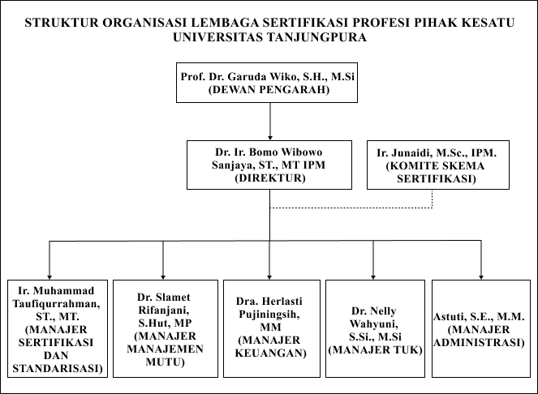

\pagenumbering{arabic}
\setcounter{page}{1}

# PENDAHULUAN

## Latar Belakang

Sertifikasi kompetensi merupakan bukti formal yang mengakui kemampuan dan keahlian mereka dalam bidang tertentu. Sertifikasi ini tidak hanya menunjukkan penguasaan pengetahuan teoretis, tetapi juga keterampilan praktis yang sesuai dengan standar industri. Dalam dunia kerja yang semakin kompetitif, lulusan dengan sertifikasi kompetensi memiliki nilai tambah yang signifikan di mata pemberi kerja. Dengan demikian, mahasiswa yang memiliki sertifikasi kompetensi diharapkan lebih siap menghadapi tantangan di dunia kerja modern yang terus berkembang.

Untuk mendukung kebutuhan tersebut, Universitas Tanjungpura (UNTAN) mendirikan Lembaga Sertifikasi Profesi (LSP) yang bertanggung jawab dalam menyelenggarakan proses sertifikasi kompetensi. LSP UNTAN berdiri pada tanggal 21 Agustus 2023 berdasarkan Surat Keputusan Rektor Universitas Tanjungpura No. 3214/UN22/OT.00/2023. Lembaga ini bertujuan untuk memastikan bahwa mahasiswa dapat memperoleh sertifikasi yang sesuai dengan standar industri guna meningkatkan daya saing mereka di dunia kerja. Berikut adalah struktur organisasi LSP UNTAN.

Namun, dalam implementasinya, proses pendaftaran sertifikasi di LSP UNTAN masih menghadapi beberapa tantangan. Saat ini, LSP UNTAN telah memiliki *website* profil, tetapi belum mendukung fitur pendaftaran secara langsung. Mahasiswa yang ingin mendaftar sertifikasi harus mengisi berkas administrasi seperti dokumen APL 1, APL 2, dan bukti pembayaran melalui Google Form yang disematkan di *website* profil tersebut, yang kemudian diverifikasi oleh admin dan asesor. Jika memenuhi syarat, mahasiswa akan menerima pemberitahuan melalui email/Whatsapp untuk mengikuti asesmen. Setelah asesmen selesai dan mahasiswa dinyatakan kompeten, sertifikat akan diterbitkan. Proses yang belum terintegrasi dalam satu sistem yang terpusat ini mengakibatkan pengelolaan data menjadi kurang efisien, serta berpotensi menimbulkan kendala dalam komunikasi dan administrasi. Selain itu, penggunaan dokumen fisik dalam proses sertifikasi menyebabkan permasalahan dalam penyimpanan dan pengelolaan berkas. Dokumen yang menumpuk dapat menyulitkan pencarian data, meningkatkan risiko kehilangan atau kerusakan berkas, serta membutuhkan ruang penyimpanan yang besar.

Untuk mengatasi permasalahan ini, diperlukan solusi yang dapat meningkatkan efisiensi dan efektivitas sistem pendaftaran sertifikasi di LSP UNTAN. Salah satunya adalah pengembangan aplikasi berbasis *Progressive Web App* (PWA). PWA merupakan arsitektur aplikasi web yang mampu memberikan pengalaman pengguna menyerupai aplikasi *native*, tanpa memerlukan proses pengunduhan dari toko aplikasi seperti Google Play atau App Store. Pemilihan teknologi ini didasari oleh efisiensi pengembangan, di mana satu basis kode dapat berjalan optimal di berbagai perangkat tanpa perlu membangun versi web dan *mobile* secara terpisah. Melalui implementasi PWA, mahasiswa tidak lagi harus berpindah antar platform pihak ketiga, melainkan dapat mengakses seluruh ekosistem layanan sertifikasi secara terpusat dalam satu antarmuka yang terintegrasi dan lebih praktis.

Pengembangan aplikasi LSP UNTAN ini secara spesifik difokuskan pada digitalisasi proses pendaftaran sertifikasi, mulai dari pendaftaran, verifikasi dokumen, hingga penerimaan notifikasi pemberian sertifikat secara *real-time*. Dengan hadirnya sistem yang terpusat ini, diharapkan layanan sertifikasi menjadi lebih efisien, transparan, serta mampu meningkatkan pengalaman pengguna secara menyeluruh, baik dari sisi Asesi, Asesor, maupun Admin.

## Perumusan Masalah

Berdasarkan latar belakang yang telah diuraikan sebelumnya, maka rumusan masalah dalam penelitian ini adalah bagaimana mengembangkan aplikasi dengan menggunakan *Progressive Web App* (PWA) yang dapat memfasilitasi proses pendaftaran sertifikasi secara daring di Lembaga Sertifikasi Profesi (LSP) UNTAN?

## Tujuan Penelitian

Maka penelitian ini bertujuan untuk mengembangkan aplikasi LSP UNTAN dengan menggunakan *Progressive Web App* (PWA) yang dapat memfasilitasi proses pendaftaran sertifikasi secara daring di Lembaga Sertifikasi Profesi (LSP) UNTAN.

## Pembatasan Masalah

Pembatasan masalah bertujuan untuk mempersempit ruang lingkup penelitian sehingga proses perancangan dan pengembangannya menjadi lebih fokus dan terstruktur. Adapun batasan masalah dalam penelitian ini, yaitu:

1.  Pendaftaran sertifikasi hanya mencakup sertifikasi awal dan tidak termasuk perpanjangan sertifikasi.

2.  Mereka yang bisa mengikuti sertifikasi adalah mahasiswa aktif UNTAN dan mahasiswa yang terafiliasi dengan UNTAN (misalnya, ada mahasiswa universitas lain yang sedang melakukan MBKM di UNTAN).

3.  Pembayaran asesmen dapat dilakukan oleh asesi melalui *virtual account* yang disiapkan oleh pihak LSP.

4. Metode pengembangan perangkat lunak yang digunakan dibatasi pada metode *System Development Life Cycle* (SDLC) model *Waterfall*.

5. Pengujian sistem hanya mencakup pengujian fungsional menggunakan metode *Black Box Testing*, serta pengujian standar kelayakan dan performa PWA menggunakan *Lighthouse Testing*.

## Sistematika Penulisan

Sistematika dari penulisan tugas akhir ini dibagi menjadi 5 Bab pembahasan yaitu sebagai berikut:

**BAB I Pendahuluan** adalah bab yang menjelaskan mengenai latar belakang permasalahan, rumusan masalah, maksud dan tujuan, pembatasan masalah, dan sistematika penulisan.

**BAB II Tinjauan Pustaka** adalah bab yang menjelaskan mengenai tinjauan pustaka, dasar-dasar teori, rujukan, metode yang berhubungan dengan judul dan uraian sistematis tentang hasil-hasil penelitian yang didapat oleh penelitian terdahulu.

**BAB III Metodologi Penelitian** adalah bab yang membahas tentang diagram alir penelitian, metode penelitian, analisis kebutuhan sistem dan perancangan sistem.

**BAB IV Hasil dan Pembahasan** yaitu bab yang berisi hasil penelitian yang telah dilakukan dan hasil pengujian terhadap kinerja dari aplikasi yang telah dibangun.

**BAB V Kesimpulan dan Saran** yaitu pada bab ini memaparkan kesimpulan yang didapatkan dari aplikasi yang dibangun dan saran untuk mengembangkan aplikasi.

\newpage