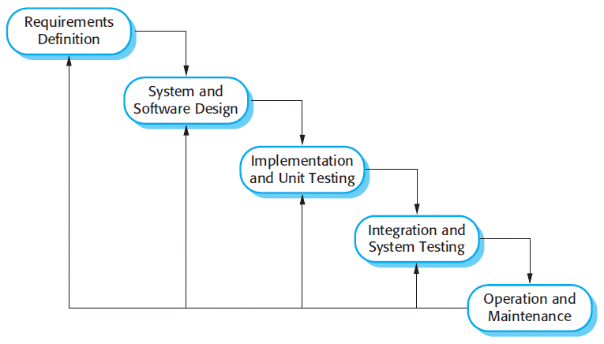

# TINJAUAN PUSTAKA

## Penelitian Terkait

Dalam penelitian ini, penulis meninjau berbagai studi sebelumnya yang relevan dengan topik sertifikasi dan PWA. Penelitian-penelitian terdahulu ini menjadi landasan penting dalam pengembangan penelitian ini.

Dikutip dari jurnal penelitian terdahulu yang relevan dengan penelitian ini berjudul "Aplikasi Manajemen Pendaftaran Uji Sertifikasi Kompetensi pada Lembaga Sertifikasi Profesi Berbasis Web". Jurnal tersebut menjelaskan pengembangan aplikasi manajemen sertifikasi kompetensi berbasis web sebagai solusi untuk mengatasi permasalahan dalam proses sertifikasi yang konvensional dan memakan waktu. Aplikasi ini dirancang untuk mempermudah peserta dalam mendaftar, mengajukan dokumen, dan memantau status sertifikasi secara real-time, sehingga menghilangkan kebutuhan pertemuan fisik dan mempercepat proses administrasi. Aplikasi ini dibangun menggunakan *framework* Laravel, bahasa pemrograman PHP, dan basis data MySQL, dengan metode pengembangan *Prototipyng* yang memungkinkan perbaikan cepat terhadap desain dan kode. Pengujian aplikasi dilakukan melalui metode *User Acceptance Test* (UAT) untuk mengevaluasi kepuasan pengguna. Berdasarkan hasil perencanaan dan uji coba, aplikasi ini berhasil memenuhi kebutuhan, dengan fungsi yang baik dan tingkat kepuasan pengguna mencapai 91% [@sari2023].

Dikutip dari jurnal penelitian terdahulu yang relevan dengan penelitian ini berjudul "Aplikasi Pendaftaran Uji Kompetensi Berbasis Web untuk LSP P1 Politeknik Negeri Ambon". Jurnal tersebut menjelaskan penelitian yang dilakukan dalam membangun sebuah aplikasi pendaftaran uji kompetensi berbasis web yang bertujuan mempermudah mahasiswa dalam memperoleh informasi, mendaftarkan diri, serta menjadwalkan pelaksanaan ujian kompetensi. Aplikasi ini dikembangkan dengan metode Waterfall menggunakan bahasa pemrograman PHP dan *framework* CodeIgniter 3 serta Bootstrap versi 4. Mahasiswa dapat melakukan registrasi sebagai asesi. Administrator mengelola jadwal sertifikasi, sehingga proses pendaftaran dan penjadwalan lebih terstruktur dan efisien. Aplikasi ini diharapkan dapat mengatasi masalah administrasi, seperti tercecernya berkas pendaftaran dan ketidakefisienan waktu karena mahasiswa harus datang ke lokasi untuk proses pendaftaran [@dahoklory2024].

Dikutip dari jurnal penelitian terdahulu yang relevan dengan penelitian ini berjudul "Pengembangan Aplikasi Jurnal Emosi Berbasis *Progressive Web App*". Penelitian tersebut dilakukan untuk mengembangkan aplikasi yang bertujuan untuk menjadi alat penanganan stres untuk mengelola emosi dan suasana hati. Aplikasi dibangun dengan metode *Rapid Applicaiton Development*, *framework* Vue JS, dan *Backend* Firebase. Aplikasi ini memiliki hasil pengujian *System Usability Scale* sebesar 88.25%. Aplikasi itu mampu mencatat dan melacak perubahan emosi pengguna serta mampu dijalankan di perangkat desktop dan *mobile*, dan juga dapat digunakan secara luring dengan performa yang cukup baik. Dimana aplikasi juga dapat diunduh dalam perangkat *mobile* layaknya aplikasi *native* [@putra2023].

Dikutip dari jurnal penelitian terdahulu yang relevan dengan penelitian ini berjudul "Prototype Aplikasi Registrasi Donor Darah Palang Merah Indonesia (PMI) Kota Bengkulu Menggunakan Metode *Progressive Web App*". Jurnal tersebut menjelaskan penelitian yang dilakukan untuk mengembangkan dan menguji sebuah aplikasi registrasi donor darah berbasis PWA yang dapat meningkatkan kemudahan dan efisiensi proses registrasi donor darah di PMI. Aplikasi dibangun dengan metode *Prototyping*, bahasa pemrograman PHP, dan basis data MySQL. Hasil penelitian menunjukkan bahwa aplikasi registrasi donor darah berbasis PWA berhasil memenuhi tujuan penelitian dan memberikan kontribusi positif bagi proses registrasi donor darah di PMI, dengan waktu tunggu yang lebih singkat dan akses informasi yang lebih cepat. Selain itu, integrasi data yang lebih baik memungkinkan petugas PMI untuk mengelola data donor dengan lebih efektif [@irawan2024].

## Lembaga Sertifikasi Profesi

Lembaga Sertifikasi Profesi (LSP) adalah organisasi independen yang dibentuk oleh para pemangku kepentingan antara lain industri, asosiasi profesi, asosiasi perusahaan dan para pakar pada sektor atau bidang keahlian tertentu yang telah diakreditasi dan memperoleh lisensi dari Badan Nasional Sertifikasi Profesi (BNSP) sebagai pelaksana uji kompetensi dan sertifikasi kompetensi. Lisensi diberikan melalui proses akreditasi oleh BNSP yang menyatakan bahwa LSP bersangkutan telah memenuhi syarat untuk melakukan kegiatan sertifikasi profesi [@hartika2021]. Asesor adalah individu yang memahami prosedur pelaksanaan asesmen, telah mengikuti pelatihan khusus untuk menjadi asesor, dan telah memperoleh sertifikasi kompeten sebagai asesor yang diterbitkan oleh BNSP [@bnsp2013]. Asesmen adalah proses evaluasi yang mencakup pengetahuan, keterampilan, dan sikap kerja melalui pengumpulan bukti kompetensi untuk menentukan apakah kompetensi telah tercapai, serta memastikan bahwa seseorang dapat menunjukkan kompetensinya sesuai standar yang diharapkan di lingkungan kerja [@bnsp2013]. Asesi adalah tenaga kerja yang memiliki latar belakang pendidikan, pelatihan, dan/atau pengalaman kerja yang sesuai dengan standar kompetensi yang akan dinilai [@bnsp2013].

## Sistem Informasi

Sistem informasi didefinisikan secara teknis sebagai sekumpulan komponen yang saling berhubungan yang bekerja sama untuk mengumpulkan, memproses, menyimpan, dan mendistribusikan informasi guna mendukung pengambilan keputusan dan pengawasan dalam organisasi. Ciri khas utama dari sistem informasi adalah bahwa sistem ini bukan sekadar teknologi (*hardware/software*), melainkan kombinasi dari tiga dimensi utama yaitu organisasi, manajemen, dan teknologi. Sistem informasi merupakan bagian tak terpisahkan dari organisasi. Ini mencakup struktur hierarki, proses bisnis, budaya organisasi, dan orang-orang yang bekerja di dalamnya. Tugas manajemen adalah memahami situasi yang dihadapi organisasi, membuat keputusan, dan merumuskan rencana tindakan untuk memecahkan masalah organisasi. Teknologi informasi adalah alat yang digunakan manajer untuk menghadapi perubahan. Ini mencakup perangkat keras, perangkat lunak, teknologi pengelolaan data, dan teknologi jaringan/telekomunikasi. ada tiga aktivitas dasar yang menjadi ciri cara kerja sistem informasi dalam menghasilkan informasi. Mengumpulkan data mentah (*input*). Mengubah data mentah menjadi bentuk yang berarti (*processing*). Mentransfer informasi yang sudah diproses kepada orang atau aktivitas yang akan menggunakannya (*output*) [@laudon2006].

## *Progressive Web App*

*Progressive Web App* (PWA) bukanlah sebuah kerangka kerja baru atau teknologi tunggal, melainkan serangkaian praktik terbaik dan API modern yang bekerja bersamaan. PWA dideskripsikan sebagai aplikasi web yang memanfaatkan fitur-fitur modern pada peramban untuk memberikan pengalaman pengguna yang setara dengan aplikasi *native*.

Konsep dasar PWA adalah "peningkatan progresif" (*progressive enhancement*), yang berarti aplikasi akan tetap berfungsi pada peramban lama, namun akan memberikan fitur canggih seperti kemampuan *offline* dan notifikasi pada peramban modern yang mendukungnya [@ater2017].

### *Web App Manifest*

*Web App Manifest* adalah berkas berformat JSON yang menyediakan informasi mengenai aplikasi web kepada peramban. File ini memungkinkan aplikasi web untuk dipasang (*installed*) ke layar utama perangkat pengguna, memberikan pengalaman peluncuran yang mirip dengan aplikasi *native*.

Di dalam *Web App Manifest*, pengembang dapat mendefinisikan berbagai properti seperti [@ater2017]:

1.  `name` dan `short_name`: Nama yang akan ditampilkan pada layar utama dan di bawah ikon aplikasi.
2.  `icons`: Daftar ikon dengan berbagai ukuran yang akan digunakan oleh sistem operasi saat aplikasi dipasang.
3.  `start_url`: Halaman spesifik yang akan dimuat ketika pengguna membuka aplikasi melalui ikon di layar utama.
4.  `display`: Mengatur tampilan aplikasi, seperti menyembunyikan bilah alamat peramban (*browser UI*) agar aplikasi terlihat layar penuh (*standalone*).

### *Service Worker*

*Service Worker* didefinisikan sebagai sebuah skrip yang berjalan di latar belakang peramban, terpisah dari halaman web itu sendiri. *Service Worker* bertindak sebagai perantara (*proxy*) antara aplikasi web, peramban, dan jaringan internet [@ater2017].

Fungsi utama *Service Worker* adalah memberikan kendali penuh kepada pengembang atas lalu lintas jaringan. Hal ini memungkinkan pengembang untuk memanipulasi permintaan jaringan, menyajikan respons dari *cache*, dan membuat aplikasi berfungsi secara *offline*. Selain itu, *Service Worker* memiliki siklus hidup (*lifecycle*) sendiri yang independen dari halaman web, yang memungkinkan fitur seperti *background sync* dan *push notifications* tetap berjalan meskipun halaman web telah ditutup.

### Kelebihan PWA

Kelebihan utama PWA meliputi [@ater2017].

1.  Kemampuan *Offline*: PWA dapat memuat konten secara instan, bahkan ketika kondisi jaringan buruk atau tidak ada koneksi internet sama sekali, berkat teknologi Service Worker.
2.  Dapat Diunduh (*Installability*): Pengguna dapat menambahkan aplikasi ke layar utama (*home screen*) perangkat mereka tanpa harus melalui toko aplikasi (*app store*), menciptakan pengalaman yang terasa terintegrasi dengan perangkat.
3.  Keterlibatan Pengguna (*Engagement*): PWA mendukung fitur *push notifications* yang memungkinkan aplikasi untuk melibatkan kembali pengguna, mirip dengan aplikasi *native*.
4.  Kecepatan: Dengan strategi *caching* yang tepat, PWA dapat menghilangkan ketergantungan pada jaringan untuk memuat tampilan antarmuka pengguna (*user interface*), sehingga aplikasi terasa sangat cepat.

### Kekurangan PWA

Tantangan atau batasan PWA, antara lain [@ater2017].

1.  Dukungan Peramban: Tidak semua peramban mendukung seluruh fitur PWA secara bersamaan. Misalnya, pada saat buku *Building Progressive Web Apps* (yang menjadi referensi peneliti) karya Tal Ater diterbitkan, peramban Safari belum mendukung *Service Worker*, meskipun aplikasi tetap dapat berjalan sebagai situs web biasa.
2.  Batasan Platform: Meskipun PWA membawa banyak fitur *native* ke peramban, masih ada batasan akses ke perangkat keras tertentu dibandingkan dengan aplikasi *native* murni yang memiliki akses penuh ke API sistem operasi.

## PHP

PHP adalah bahasa skrip sisi *server* yang memiliki kapabilitas luas dalam menangani logika aplikasi web. Keunggulan utama PHP modern terletak pada dukungannya yang masif terhadap paradigma Pemrograman Berorientasi Objek serta penanganan tipe data kompleks seperti *array* dan *string*. Fleksibilitas ini memungkinkan PHP untuk tidak hanya menghasilkan konten HTML, tetapi juga memproses data dari berbagai jenis basis data seperti MySQL dan NoSQL, serta menghasilkan format luaran non-teks seperti PDF maupun grafik secara dinamis [@tatroe2020].

## Laravel

Laravel didefinisikan sebagai kerangka kerja (*framework*) aplikasi web berbasis PHP dan bersifat *open source* yang dirancang untuk memfasilitasi pengembangan sistem yang kompleks dengan sintaks yang ekspresif dan elegan. Kerangka kerja ini mengadopsi arsitektur *Model-View-Controller* (MVC) dan menyediakan standar konvensi (*opinionated defaults*) yang membantu pengembang membangun aplikasi secara terstruktur dan efisien.

Keunggulan utama Laravel terletak pada kemampuannya menyediakan ekosistem fitur yang komprehensif dan siap pakai (out-of-the-box). Fitur-fitur krusial seperti otentikasi pengguna, mekanisme validasi *input* yang ketat, serta manajemen basis data melalui *Eloquent Object-Relational Mapping* (ORM) dan *Query Builder* tersedia secara bawaan. Hal ini tidak hanya mempercepat proses pengembangan, tetapi juga menjamin keamanan dan konsistensi kode program dibandingkan membangun sistem dari nol.

Dalam pengembangan aplikasi ini, Laravel difungsikan sebagai fondasi *backend* yang terintegrasi erat dengan antarmuka pengguna melalui pustaka Inertia.js. Pendekatan ini memungkinkan penerapan arsitektur *Monolith*, di mana Laravel tetap memegang kendali penuh atas manajemen *routing* dan *controller*, namun masih dapat memvisualisasikan tampilan berbasis komponen Vue.js tanpa perlu membangun RESTful API yang terpisah dan kompleks. Fitur *Migrations* tetap digunakan untuk manajemen skema basis data MySQL agar terorganisir [@Stauffer2019].

## Javascript

JavaScript adalah bahasa pemrograman tingkat tinggi, dinamis, dan *interpreted* yang sangat cocok untuk gaya pemrograman berorientasi objek maupun fungsional. Mayoritas situs web modern menggunakannya untuk menciptakan pengalaman pengguna yang interaktif.

Keunggulan utama JavaScript modern terletak pada fleksibilitas dan ekosistemnya yang luas. Bahasa ini tidak lagi hanya berjalan di sisi klien (*client-side*) untuk memanipulasi elemen HTML, tetapi juga memiliki kemampuan untuk menangani proses asinkron (*asynchronous*) yang kompleks. Hal ini memungkinkan aplikasi untuk melakukan permintaan data ke *server* tanpa perlu memuat ulang halaman (*reload*), serta menjalankan skrip di latar belakang yang terpisah dari halaman utama [@Flanagan2020]. Dalam penelitian ini, JavaScript sebagai bahasa untuk menginisialisasi Vue.js dan membuat *Service Worker*. 

## Vuejs

Menurut [@Rojas2020], Vue.js merupakan kerangka kerja (*framework*) JavaScript yang bersifat *open source* dan progresif untuk membangun antarmuka pengguna dengan prinsip *incrementally adoptable*. Karakteristik ini memungkinkan Vue.js untuk diadopsi secara bertahap, di mana pustaka intinya difokuskan secara eksklusif pada lapisan tampilan (*view layer*). Hal ini memberikan kemudahan bagi pengembang untuk mempelajari dan mengintegrasikannya dengan pustaka lain atau proyek yang sudah berjalan.

Keunggulan Vue.js yang menonjol terletak pada beberapa fitur utamanya, antara lain penggunaan Virtual *Document Object Model* (DOM) yang merupakan representasi pohon memori ringan dari HTML DOM asli untuk meningkatkan efisiensi pembaruan tampilan, serta sistem komponen yang memungkinkan pembuatan elemen kustom yang dapat digunakan kembali (*reusable*). Selain itu, Vue.js menyediakan templat berbasis HTML yang mengikat DOM dengan data instansi Vue, serta memiliki ukuran pustaka yang relatif ringan jika dibandingkan dengan *framework* JavaScript lainnya, sehingga sangat ideal untuk membangun aplikasi yang berorientasi pada performa tinggi [@Rojas2020].

Dalam penelitian ini, Vue.js diimplementasikan sebagai teknologi sisi klien yang bekerja secara sinergis dengan Laravel melalui jembatan Inertia.js. Penerapan Vue.js sangat krusial dalam arsitektur PWA yang dibangun, karena fitur-fiturnya memungkinkan pembuatan aplikasi yang cepat, berperforma tinggi, dan memiliki kemampuan untuk berfungsi secara *offline*. Dengan memanfaatkan manipulasi DOM yang efisien dan arsitektur berbasis komponen, aplikasi ini mampu memberikan pengalaman pengguna yang reaktif dan responsif menyerupai aplikasi *native*.

## Inertia

Inertia.js adalah penghubung langsung antara Laravel dan Vue.js yang memungkinkan pembangunan *Single Page Application* (SPA) tanpa memerlukan REST API dengan memanfaatkan *server-side routing* dan *client-side rendering*. Keunggulan utamanya pengembang tidak perlu membangun dan mengelola REST API yang kompleks ataupun menangani *routing* di sisi klien. Saat pengguna berpindah halaman, Inertia mencegat permintaan tersebut dan mengirimkannya ke server sebagai permintaan asinkron (AJAX) dengan header khusus. Laravel kemudian secara cerdas merespons dengan objek JSON yang berisi nama komponen dan data (*props*), bukan dokumen HTML utuh, sehingga Vue.js dapat memperbarui tampilan secara instan tanpa memuat ulang *browser*. Dalam penelitian ini, Inertia.js memegang peranan vital sebagai pengikat arsitektur sistem. Teknologi ini memungkinkan logika bisnis dan validasi data tetap terpusat di Laravel (*backend*), sementara interaktivitas antarmuka dikelola oleh Vue.js (*frontend*) [@Zulkahfi2025].

## *System Development Life Cycle* (SDLC)

*System Development Life Cycle* (SDLC) adalah proses untuk menentukan bagaimana sebuah sistem informasi dapat mendukung kebutuhan bisnis, merancangnya, membangunnya, dan menyerahkannya kepada pengguna [@Dennis2012].

Untuk mengimplementasikan siklus hidup pengembangan sistem tersebut, penelitian ini menggunakan model *Waterfall* yang dikemukakan oleh Ian Sommerville. Model *Waterfall* sebagai pendekatan yang mengambil aktivitas proses fundamental seperti spesifikasi, pengembangan, validasi, dan evolusi dan merepresentasikannya sebagai fase-fase proses yang terpisah dan berurutan, seperti sebuah air terjun. Karena sifatnya yang mengalir dari satu fase ke fase berikutnya [@sommerville2011]. Kelebihan dari *Waterfall* adalah kualitas dari sistem yang dihasilkan akan baik dan meminimilasir kesalahan yang mungkin akan terjadi, karena pelaksanaannya dilakukan secara bertahap [@wahid2020].

Berikut adalah tahapan-tahapan dari metode *Waterfall* [@sommerville2011].

a.  *Requirements Definition*, tahap ini bertujuan untuk mengumpulkan kebutuhan sistem termasuk batasan dan layanan yang akan ditawarkan oleh sistem melalui komunikasi dengan pengguna.

b.  *System and Software Design*, proses perancangan sistem mengalokasikan persyaratan ke sistem perangkat keras atau perangkat lunak dengan membangun arsitektur sistem secara keseluruhan. Perancangan perangkat lunak melibatkan identifikasi dan penggambaran abstraksi sistem perangkat lunak fundamental dan hubungan di antara mereka.

c.  *Implementation and Unit Testing*, selama tahap ini, desain perangkat lunak diwujudkan dalam bentuk serangkaian program atau unit program. Pengujian unit melibatkan verifikasi bahwa setiap unit memenuhi spesifikasinya.

d.  *Integration and System Testing*, unit-unit program atau program-program individual diintegrasikan dan diuji sebagai suatu sistem yang lengkap untuk memastikan bahwa persyaratan perangkat lunak telah terpenuhi. Setelah pengujian, sistem perangkat lunak dikirimkan kepada pelanggan.

e.  *Operation and Maintenance*, ini adalah fase siklus hidup terpanjang. Sistem dipasang dan digunakan secara praktis. Pemeliharaan melibatkan perbaikan kesalahan yang tidak ditemukan pada tahap awal siklus hidup, peningkatan implementasi unit sistem, dan peningkatan layanan sistem saat persyaratan baru ditemukan.

## *Unified Modelling Language* (UML)

*Unified Modeling Language* (UML) adalah bahasa pemodelan utama yang digunakan untuk menganalisis, menentukan, dan merancang sistem perangkat lunak [@Booch2007].

### Diagram *Use Case*

Dalam UML, diagram *use case* didefinisikan sebagai representasi visual yang menggambarkan konteks serta fungsionalitas dari sistem yang akan dibangun. Diagram ini secara spesifik memetakan interaksi antara entitas eksternal (aktor) dengan sistem. Kemampuan visualisasi ini menjadikan diagram *use case* sebagai instrumen vital untuk menjembatani kesenjangan komunikasi dan menyelaraskan pemahaman antara pemangku kepentingan bisnis dan tim pengembang. Diagram *use case* secara khusus memvisualisasikan siapa (atau apa) yang berinteraksi dengan sistem serta apa yang diinginkan dunia luar agar sistem tersebut lakukan [@Booch2007]. Simbol-simbol diagram *use case* dapat dilihat pada Tabel \ref{tab:simbol-usecase} berikut.

\begin{longtable}{|p{3.5cm}|p{10.5cm}|}
\caption{Simbol-Simbol Diagram \textit{Use Case}}\label{tab:simbol-usecase} \\
\hline
\centering\textbf{Simbol} & \textbf{Keterangan} \\ \hline
\endfirsthead
\hline
\centering\textbf{Simbol} & \textbf{Keterangan} \\ \hline
\endhead
\hline
\endfoot
\hline
\endlastfoot
\raggedright \textbf{\textit{Use Case}} \par \centering \includegraphics[width=2.5cm]{images/simbol/usecase/usecase.png} & 
Fungsionalitas yang disediakan oleh sistem dalam bentuk unit-unit yang berinteraksi dan bertukar pesan antara satu sama lain serta dengan aktor. \\ \hline
\raggedright \textbf{Aktor} \par \centering \includegraphics[width=0.5cm]{images/simbol/usecase/aktor.png} & 
Orang, proses, atau sistem lain yang berinteraksi dengan sistem informasi yang akan dibuat di luar sistem informasi. \\ \hline
\raggedright \textbf{Asosiasi} \par \centering \includegraphics[width=2.5cm]{images/simbol/usecase/asosiasi.png} & 
Merupakan kesatuan eksternal yang berinteraksi dengan sistem. \\ \hline
\raggedright \textbf{Generalisasi} \par \centering \includegraphics[width=2.5cm]{images/simbol/usecase/generalisasi.png} & 
Relasi antara \textit{use case} di mana \textit{use case} yang satu lebih umum dari \textit{use case} yang lain. \\ \hline
\raggedright \textbf{\textit{Include}} \par \centering \includegraphics[width=2.5cm]{images/simbol/usecase/include.png} & 
Relasi antara \textit{use case} tambahan dan \textit{use case} utama, di mana \textit{use case} tambahan membutuhkan \textit{use case} utama agar dapat berfungsi. \\ \hline
\raggedright \textbf{\textit{Extends}} \par \centering \includegraphics[width=2.5cm]{images/simbol/usecase/extend.png} & 
Relasi antara \textit{use case} tambahan dan \textit{use case} utama, di mana \textit{use case} utama tetap dapat berjalan sendiri tanpa bergantung pada \textit{use case} tambahan. \\ \hline

\end{longtable}

### Diagram *Activity*

Diagram *activity* didefinisikan sebagai representasi visual yang menggambarkan alur aktivitas dalam suatu sistem, proses bisnis, maupun alur kerja (*workflow*). Diagram ini secara spesifik memfokuskan pada aktivitas-aktivitas yang dijalankan serta mengidentifikasi entitas (siapa atau apa) yang bertanggung jawab atas pelaksanaannya. Dalam tahap analisis, diagram ini menjadi instrumen fundamental untuk mendetailkan skenario *use case* dan memahami perilaku eksekusi sistem tingkat tinggi tanpa perlu melibatkan kompleksitas detail pertukaran pesan internal yang teknis [@Booch2007]. Simbol-simbol diagram *activity* dapat dilihat pada Tabel \ref{tab:simbol-activity} berikut.

\begin{longtable}{|p{3.5cm}|p{10.5cm}|}
\caption{Simbol-Simbol Diagram \textit{Activity}}\label{tab:simbol-activity} \\
\hline
\centering\textbf{Simbol} & \centering\textbf{Keterangan} \tabularnewline \hline
\endfirsthead
\hline
\centering\textbf{Simbol} & \centering\textbf{Keterangan} \tabularnewline \hline
\endhead
\hline
\endfoot
\hline
\endlastfoot
\raggedright \textbf{\textit{Initial Node}} \par \centering \includegraphics[width=1cm]{images/simbol/activity/initial.png} & 
Menunjukkan awal dari aliran aktivitas dalam suatu diagram. Biasanya digambarkan dengan lingkaran hitam penuh. \\ \hline
\raggedright \textbf{\textit{Action}} \par \centering \includegraphics[width=3cm]{images/simbol/activity/action.png} & 
Mempresentasikan eksekusi dari suatu langkah atau instruksi dalam alur kerja. Digambarkan dengan persegi panjang dengan sudut membulat. \\ \hline
\raggedright \textbf{\textit{Decision Node}} \par \centering \includegraphics[width=2.5cm]{images/simbol/activity/decision.png} & 
Simbol pilihan yang memiliki satu aliran masuk dan dua atau lebih aliran keluar berdasarkan syarat (kondisi) tertentu. \\ \hline
% \raggedright \textbf{\textit{Fork Node}} \par \centering \includegraphics[width=2.5cm]{images/simbol/activity/fork.png} & Digunakan untuk memecah satu aliran menjadi beberapa aliran yang berjalan secara paralel (bersamaan). \\ \hline
% \raggedright \textbf{\textit{Join Node}} \par \centering \includegraphics[width=2.5cm]{images/simbol/activity/join.png} & Digunakan untuk menggabungkan kembali beberapa aliran paralel menjadi satu aliran tunggal. \\ \hline
% \raggedright \textbf{\textit{Control Flow}} \par \centering \includegraphics[width=2cm]{images/simbol/activity/flow.png} & Garis panah yang menunjukkan urutan atau arah aliran dari satu aktivitas ke aktivitas berikutnya. \\ \hline
\raggedright \textbf{\textit{Final Node}} \par \centering \includegraphics[width=1cm]{images/simbol/activity/final.png} & 
Menunjukkan akhir dari seluruh aliran aktivitas dalam diagram. Digambarkan dengan lingkaran dengan titik di tengahnya (seperti mata sapi). \\ \hline

\end{longtable}

### Diagram *Class*

Diagram *Class* merupakan sebuah diagram yang merepresentasikan struktur logis dari sebuah sistem. Diagram ini memvisualisasikan keberadaan kelas-kelas serta hubungan (*relationships*) yang terjalin di antaranya. Selama analisis, diagram *class* digunakan untuk menunjukkan peran dan tanggung jawab umum entitas yang menentukan perilaku sistem. Selama perancangan, diagram *class* digunakan untuk menggambarkan struktur kelas-kelas yang membentuk arsitektur sistem [@Booch2007]. Simbol-simbol diagram *class* dapat dilihat pada Tabel \ref{tab:simbol-class} berikut.

\begin{longtable}{|p{3.5cm}|p{10.5cm}|}
\caption{Simbol-Simbol Diagram \textit{Class}}\label{tab:simbol-class} \\
\hline
\centering\textbf{Simbol} & \centering\textbf{Keterangan} \tabularnewline \hline
\endfirsthead
\hline
\centering\textbf{Simbol} & \centering\textbf{Keterangan} \tabularnewline \hline
\endhead
\hline
\endfoot
\hline
\endlastfoot

\raggedright \textbf{\textit{Class}} \par \centering \includegraphics[width=2.5cm]{images/simbol/class/classname.png} & Struktur utama yang mendefinisikan objek, terdiri dari tiga bagian: nama kelas, atribut properti, dan metode. \\ \hline

\raggedright \textbf{Asosiasi} \par \centering \includegraphics[width=2.5cm]{images/simbol/class/asosiasi.png} & Hubungan statis antar kelas yang menunjukkan bahwa satu kelas memiliki keterkaitan dengan kelas lainnya. \\ \hline

\raggedright \textbf{Agregasi} \par \centering \includegraphics[width=2.5cm]{images/simbol/class/agregasi.png} & Hubungan "bagian dari" (\textit{part-of}) di mana objek bagian dapat berdiri sendiri tanpa objek induknya. Digambarkan dengan garis dengan ujung belah ketupat kosong. \\ \hline

\raggedright \textbf{Komposisi} \par \centering \includegraphics[width=2.5cm]{images/simbol/class/komposisi.png} & Hubungan kepemilikan yang kuat di mana objek bagian tidak dapat hidup tanpa objek induknya. Digambarkan dengan belah ketupat hitam penuh. \\ \hline

\raggedright \textbf{Generalisasi} \par \centering \includegraphics[width=2.5cm]{images/simbol/class/generalisasi.png} & Menunjukkan hubungan pewarisan antara kelas induk (\textit{superclass}) dan kelas anak (\textit{subclass}). \\ \hline

\end{longtable}

## ERD

*Entity Relationship Diagram* (ERD) Menurut [@Elmasri2016], adalah model data konseptual tingkat tinggi yang digunakan pada fase perancangan basis data. Diagram ini berfungsi sebagai notasi visual untuk menyusun skema konseptual, yaitu deskripsi ringkas namun detail mengenai kebutuhan data pengguna tanpa melibatkan detail implementasi teknis. Karena sifatnya yang independen dari aspek teknis, ERD menjadi alat komunikasi yang efektif antara perancang sistem dan pengguna awam.

Komponen utama dalam ERD meliputi entitas, atribut, dan hubungan (*relationships*) antar entitas tersebut. Diagram ini juga memetakan batasan struktural seperti rasio kardinalitas (misalnya 1:1 atau 1:N) dan batasan partisipasi untuk memastikan integritas hubungan antar data.

*Data dictionary* atau sering disebut katalog DBMS, didefinisikan sebagai repositori penyimpanan metadata, yaitu data yang mendeskripsikan struktur basis data itu sendiri. Di dalamnya tersimpan definisi skema lengkap, mulai dari nama kolom, tipe data.

Perangkat lunak DBMS menggunakan katalog ini sebagai acuan utama saat mengakses atau memanipulasi data untuk memastikan bahwa setiap perubahan status data tetap valid dan sesuai dengan aturan struktur yang telah didefinisikan sebelumnya. Simbol-simbol ERD dapat dilihat pada Tabel \ref{tab:simbol-erd} berikut.

\begin{longtable}{|p{3.5cm}|p{10.5cm}|}
\caption{Simbol-Simbol \textit{Entity Relationship Diagram}}\label{tab:simbol-erd} \\
\hline
\centering\textbf{Simbol} & \centering\textbf{Keterangan} \tabularnewline \hline
\endfirsthead
\hline
\centering\textbf{Simbol} & \centering\textbf{Keterangan} \tabularnewline \hline
\endhead
\hline
\endfoot
\hline
\endlastfoot
\raggedright \textbf{\textit{Entity}} \par \centering \includegraphics[width=2.5cm]{images/simbol/erd/entity.png} & Kumpulan objek yang memiliki karakteristik yang sama dan dapat diidentifikasi secara unik. Digambarkan dengan bentuk persegi panjang. \\ \hline
\raggedright \textbf{\textit{Relationship}} \par \centering \includegraphics[width=2cm]{images/simbol/erd/relation.png} & Menunjukkan adanya hubungan atau keterkaitan antara dua atau lebih entitas. Digambarkan dengan bentuk belah ketupat (\textit{diamond}). \\ \hline
\raggedright \textbf{\textit{Attribute}} \par \centering \includegraphics[width=2cm]{images/simbol/erd/attribute.png} & 
Karakteristik atau properti yang mendeskripsikan suatu entitas. Digambarkan dengan bentuk oval. \\ \hline
\raggedright \textbf{Garis Penghubung} \par \centering \includegraphics[width=2cm]{images/simbol/erd/line.png} & Garis yang menghubungkan atribut ke entitas atau entitas ke relasi dalam diagram. \\ \hline

\end{longtable}

## MySQL

*Relational Database Management System* (RDBMS) didefinisikan sebagai sistem perangkat lunak yang dirancang khusus untuk mengimplementasikan model data relasional. Dalam konsep ini, data direpresentasikan sebagai sekumpulan tabel yang saling terhubung melalui nilai-nilai kunci yang sama, bukan melalui *pointer* fisik. Sistem ini menyediakan metode yang terstruktur dan aman bagi pengguna untuk membuat, memelihara, serta memanipulasi data menggunakan bahasa standar yang dikenal sebagai *Structured Query Language* (SQL).

MySQL disebut perangkat lunak basis data *open-source* RDBMS. MySQL dikenal karena fleksibilitasnya yang dapat beroperasi di berbagai sistem operasi seperti Windows, Linux, dan Mac OS X, serta sering menjadi pilihan utama sebagai *backend* penyimpanan data untuk aplikasi berbasis web. Meskipun tersedia secara gratis, MySQL menawarkan fitur-fitur tingkat lanjut seperti kemampuan replikasi bawaan dan skalabilitas yang mumpuni menjadikannya solusi yang andal bagi organisasi maupun pengembang individu dalam menjaga ketersediaan data dan integritas sistem [@Hoffer2011].

## *Black Box Testing*

*Black box testing*, yang juga dikenal sebagai pengujian perilaku (*behavioral testing*), merupakan metode pengujian yang berfokus pada persyaratan fungsional perangkat lunak. Berbeda dengan *white box testing* yang membedah logika internal program, *black box testing* memungkinkan penguji untuk memperoleh serangkaian kondisi input yang sepenuhnya menguji semua persyaratan fungsional program tanpa perlu mengetahui struktur kode aplikasinya [@Pressman2015].

Lebih lanjut, Pressman menjelaskan bahwa metode ini berusaha menemukan kesalahan dalam beberapa kategori spesifik, yaitu fungsi yang tidak benar atau hilang, kesalahan antarmuka (*interface errors*), kesalahan dalam struktur data atau akses basis data eksternal, kesalahan perilaku atau kinerja aplikasi, serta kesalahan inisialisasi dan terminasi.

\newpage