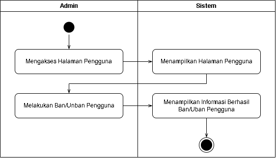
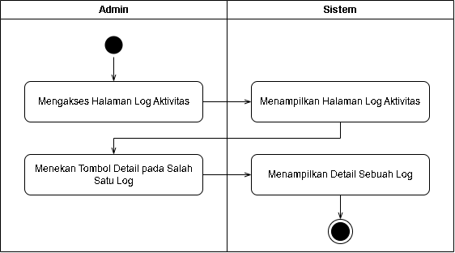
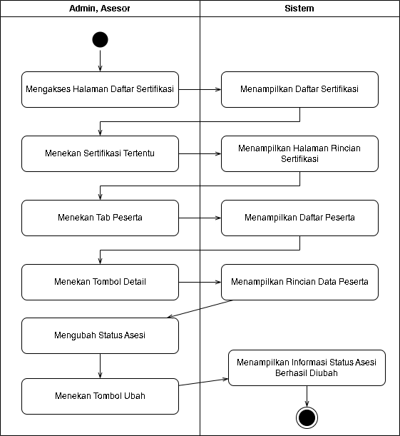
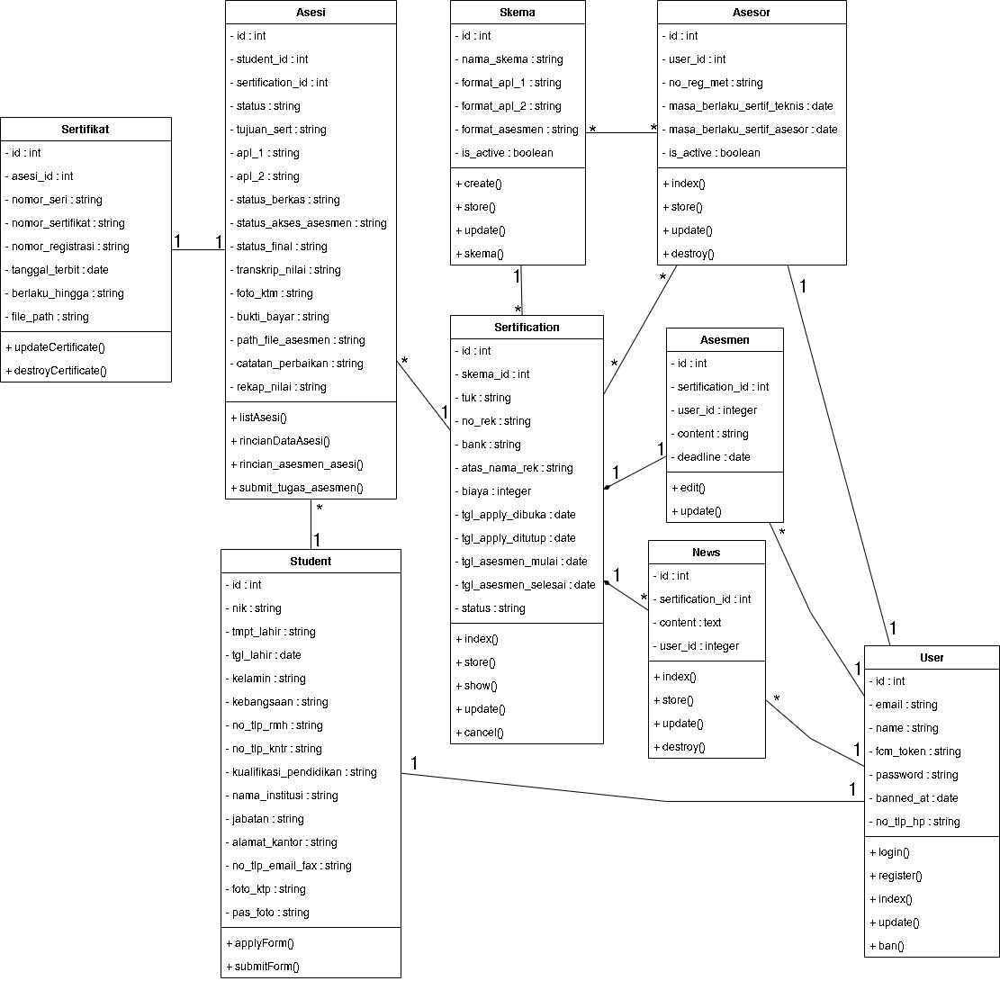
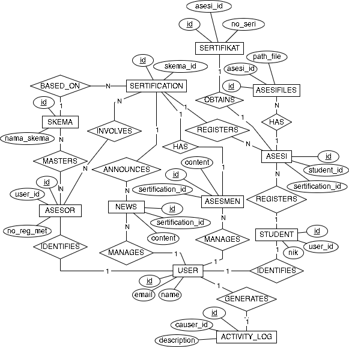

# METODOLOGI PENELITIAN

## Tahapan Penelitian

Tahapan pelaksanaan dalam penelitian yang telah peneliti rencanakan dan tahapan tersebut berfungsi menjadi panduan dalam proses pelaksanaan dalam melakukan penelitian, alur tahapan dapat dilihat pada Gambar \ref{fig:tahap-pen} berikut.

{width=3cm}

## Pengumpulan Data

Pada tahap ini, peneliti melakukan pengumpulan data dengan tiga metode yaitu studi pustaka yang merujuk pada penelitian-penelitian sebelumnya yang relevan dengan penelitian sekarang yang akan dilakukan. Wawancara dengan berinteraksi kepada narasumber melalui sesi tanya jawab untuk memahami seperti apa pendaftaran sertifikasi di LSP UNTAN. Mengidentifikasi kebutuhan pengguna seperti sistem pendaftaran seperti apa yang dibutuhkan oleh LSP UNTAN. Observasi yang dilakukan oleh peneliti adalah observasi dokumen, yaitu dokumen APL 1 dan APL 2.

## Analisis Kebutuhan

Setelah data terkumpul, dilakukan analisis untuk menentukan kebutuhan fungsional dan non-fungsional sistem. Hasil dari tahap ini adalah daftar fitur yang harus ada untuk memenuhi kebutuhan admin, asesor, dan asesi.

### Kebutuhan Fungsional

Kebutuhan fungsional menggambarkan fungsi atau layanan yang harus disediakan oleh sistem untuk memenuhi kebutuhan pengguna. Berdasarkan hasil pengumpulan data, kebutuhan fungsional sistem informasi LSP UNTAN adalah sebagai berikut.

A. Kebutuhan Admin

1. Sistem harus dapat menampilkan ringkasan data pendaftaran dan statistik pada halaman dashboard
2. Sistem harus dapat mengelola data skema sertifikasi.
3. Sistem harus dapat mengelola data sertifikasi
4. Sistem harus dapat menampilkan log aktivitas untuk memantau perubahan data.
5. Sistem harus dapat mengelola akun pengguna.
6. Sistem harus dapat mengelola sertifikat asesi

B. Kebutuhan Asesor

1. Sistem harus dapat memfasilitasi pengelolaan asesmen.
2. Sistem harus dapat mengelola data asesi yang berada di bawah pengawasannya.

C. Kebutuhan Bersama (Admin dan Asesor)

1. Sistem harus dapat mengelola pengumuman pada sertifikasi tertentu.
2. Sistem harus dapat mengelola data asesi.

D. Kebutuhan Asesi

1. Sistem harus dapat mengelola data profil asesi
2. Sistem harus dapat memfasilitasi pendaftaran pada skema sertifikasi yang berlangsung.
3. Sistem harus dapat mengunggah dokumen persyaratan pendaftaran dan hasil asesmen.
4. Sistem harus dapat melihat pengumuman sertifikasi yang diikuti asesi dan mengunduh sertifikat.

## Perancangan Sistem

Berdasarkan analisis kebutuhan, tahapan perancangan diawali dengan pendefinisian Arsitektur Sistem untuk menggambarkan alur komunikasi data antar pengguna dengan sistem. Selanjutnya, peneliti merancang detail fungsionalitas perangkat lunak menggunakan *Unified Modeling Language* (UML) seperti diagram *use case*,  diagram *activity* dan diagram *class*, serta perancangan basis data menggunakan *Entity Relationship Diagram* (ERD).

### Arsitektur Sistem

Gambar \ref{fig:arsitektur} menunjukkan arsitektur sistem, aktor-aktor yang dalam sistem ini adalah Admin, Asesor, dan Asesi. Ketiga aktor ini melalui *device* mereka dan sistem informasinya saling mengirim *request* dan *response*. misalnya aktor admin ingin membuka halaman login, *request* *get* tersebut akan dikirim ke *server* (yang dalam hal ini sistem informasi ini dan basis data), kemudian *server* akan mengirim *response* berupa tampilan login.

### Diagram *Use Case*

Diagram *use case* yang dibuat dalam penelitian ini dapat dilihat pada Gambar \ref{fig:usecase} berikut.

Diagram *use case* menggambarkan interaksi antara aktor dengan sistem. Pada perancangan *use case* sistem informasi LSP UNTAN terdapat tiga aktor yang terlibat yaitu Admin, Asesor, dan Asesi. Untuk lebih jelas dapat dilihat pada spesifikasi *use case* berikut.

#### Spesifikasi *Use Case* Melihat *Dashboard*
Spesifikasi ini menjelaskan bagaimana aktor Admin, Asesor, dan Asesi dapat mengakses halaman utama sistem untuk melihat ringkasan informasi atau statistik sesuai dengan peran yang dimiliki.

\begin{longtable}{|p{3.5cm}|>{\raggedright\arraybackslash}p{10.5cm}|}
\caption{Spesifikasi \textit{Use Case} Melihat Dashboard} \\
\hline
\endfirsthead
\hline
\endhead
\hline
\endfoot
\hline
\endlastfoot
Tujuan & Menyajikan ringkasan informasi, statistik penting, dan notifikasi status terkini sesuai dengan hak akses \\ \hline
Aktor & Admin, Asesor, Asesi \\ \hline
Pre-condition & Aktor sudah login \\ \hline
Main Flow & 
A. Aktor buka halaman dashboard. \newline
B. Sistem mengambil data rekapitulasi yang relevan. \newline
C. Sistem tampilkan halaman dashboard dengan widget informasi sesuai dengan peran. \\ \hline
Post-condition & Aktor memperoleh gambaran umum mengenai status kegiatan sertifikasi di dalam sistem. \\ \hline
\end{longtable}

#### Spesifikasi *Use Case* Kelola Skema Sertifikasi
Spesifikasi ini mendeskripsikan prosedur bagi Admin untuk melakukan manajemen data skema sertifikasi, termasuk fungsi menambah, memperbarui, serta menghapus data skema pada basis data.

\begin{longtable}{|p{3.5cm}|>{\raggedright\arraybackslash}p{10.5cm}|}
\caption{Spesifikasi \textit{Use Case} Mengelola Data Skema Sertifikasi} \\
\hline
\endfirsthead
\hline
\endhead
\hline
\endfoot
\hline
\endlastfoot
Tujuan & Mengelola data skema sertifikasi \\ \hline
Aktor & Admin \\ \hline
Pre-condition & Admin sudah login dan berada di halaman skema \\ \hline
Main Flow & 
A. Admin memilih tambah/edit data skema. \newline
B. Admin memasukkan data skema (nama, format file APL 1, 2, dst). \newline
C. Admin menekan tombol simpan. \newline
D. Sistem simpan. \\ \hline
Alternative Flow &
Kondisi 1 : Menghapus data skema. \newline
A1. Admin menekan tombol hapus pada salah satu skema. \newline
A2. Sistem meminta konfirmasi. \newline
A3. Admin mengonfirmasi. \newline
A4. Jika skema pernah terlibat di sertifikasi, sistem tampilkan pesan error. \newline
A5. Jika tidak, sistem hapus data skema. \\ \hline
Post-condition &
Jika simpan: Data skema tersimpan dan tersedia sebagai pilihan saat input data asesor. \newline
Jika hapus sukses: Data skema terhapus dari sistem. \newline
Jika hapus gagal: Data skema tetap ada dan tidak berubah. \\ \hline
\end{longtable}

#### Spesifikasi *Use Case* Kelola Asesor
Spesifikasi ini menjelaskan alur kerja Admin dalam mengelola akun asesor, yang meliputi pendaftaran data identitas serta pemberian otoritas terhadap skema sertifikasi tertentu.

\begin{longtable}{|p{3.5cm}|>{\raggedright\arraybackslash}p{10.5cm}|}
\caption{Spesifikasi \textit{Use Case} Kelola Asesor} \\
\hline
\endfirsthead
\hline
\endhead
\hline
\endfoot
\hline
\endlastfoot
Tujuan & Mengelola akun asesor \\ \hline
Aktor & Admin \\ \hline
Pre-condition & Admin telah login dan berada di halaman asesor \\ \hline
Main Flow &
A. Admin memilih tambah/edit data asesor. \newline
B. Admin memasukkan data asesor (email, nama, dan skema sertifikasi yang diampu). \newline
C. Admin menekan tombol simpan. \newline
D. Sistem menyimpan data. \newline
E. Jika data baru, sistem mengirimkan email aktivasi ke asesor. \\ \hline
Pragmatic Flow &
Kondisi 1 : Menghapus data asesor. \newline
A1. Admin menekan tombol hapus pada salah satu asesor. \newline
A2. Sistem meminta konfirmasi. \newline
A3. Admin mengonfirmasi. \newline
A4. Jika asesor sudah pernah terlibat di sertifikasi, sistem tampilkan pesan error. \newline
A5. Jika tidak, sistem hapus data asesor. \\ \hline
Post-condition &
Jika simpan: Akun asesor terbentuk dan email aktivasi terkirim. \newline
Jika hapus sukses:Data asesor terhapus dari sistem. \newline
Jika hapus gagal:Data asesor tetap ada dan tidak berubah. \\ \hline
\end{longtable}

#### Spesifikasi *Use Case* Kelola Pengguna
Spesifikasi ini memaparkan alur kerja admin dalam melakukan kontrol akses terhadap seluruh aktor (admin, asesor, dan asesi). Spesifikasi ini mencakup penangguhan akses bagi pengguna yang melanggar ketentuan, maupun pemulihan akses guna menjamin integritas penggunaan sistem.

\begin{longtable}{|p{3.5cm}|>{\raggedright\arraybackslash}p{10.5cm}|}
\caption{Spesifikasi \textit{Use Case} Kelola Pengguna} \\
\hline
\endfirsthead
\hline
\endhead
\hline
\endfoot
\hline
\endlastfoot
Tujuan & Mengelola status validasi dan hak akses login akun pengguna demi keamanan sistem. \\ \hline
Aktor & Admin \\ \hline
Pre-condition & Admin telah login dan berada di halaman daftar pengguna \\ \hline
Main Flow & 
A. Admin menekan tombol aksi perubahan status (Ban/Un-ban) pada salah satu pengguna. \newline
B. Sistem menampilkan pesan konfirmasi perubahan status. \newline
C. Admin mengonfirmasi tindakan tersebut. \newline
D. Sistem memperbarui status pengguna. \\ \hline
Post-condition &
Jika Ban: Pengguna tidak bisa login. \newline
Jika Un-ban: pengguna bisa login kembali. \\ \hline
\end{longtable}

#### Spesifikasi *Use Case* Melihat Log Aktivitas Sistem
Spesifikasi ini mendeskripsikan proses pemantauan jejak audit oleh Admin terhadap aktivitas dan perubahan data yang terjadi di dalam sistem. Fitur ini dirancang untuk meningkatkan aspek akuntabilitas dan keamanan, sehingga setiap tindakan krusial yang dilakukan oleh aktor di dalam Sistem Informasi LSP UNTAN dapat ditelusuri secara kronologis.

\begin{longtable}{|p{3.5cm}|>{\raggedright\arraybackslash}p{10.5cm}|}
\caption{Spesifikasi \textit{Use Case} Melihat Log Aktivitas Sistem} \\
\hline
\endfirsthead
\hline
\endhead
\hline
\endfoot
\hline
\endlastfoot
Tujuan & Memantau riwayat aktivitas dan perubahan data sistem untuk kebutuhan audit trail. \\ \hline
Aktor & Admin \\ \hline
Pre-condition & Admin telah melakukan login \\ \hline
Main Flow & A. Admin buka halaman log. \newline
B. Admin menekan tombol 'Detail' pada salah satu baris log. \newline
C. Sistem menampilkan rincian riwayat perubahan data. \\ \hline
Post-condition & Admin memperoleh rincian informasi riwayat perubahan data pada sistem. \\ \hline
\end{longtable}

#### Spesifikasi *Use Case* Kelola Sertifikasi
Spesifikasi ini menjelaskan langkah-langkah Admin dalam menginisiasi sebuah periode sertifikasi, mulai dari penentuan skema sertifikasi, penentuan Asesor, hingga penentuan jadwal pelaksanaan.

\begin{longtable}{|p{3.5cm}|>{\raggedright\arraybackslash}p{10.5cm}|}
\caption{Spesifikasi \textit{Use Case} Kelola Sertifikasi} \\
\hline
\endfirsthead
\hline
\endhead
\hline
\endfoot
\hline
\endlastfoot
Tujuan & Membuka, memperbarui, atau membatalkan jadwal sertifikasi \\ \hline
Aktor & Admin \\ \hline
Pre-condition & Admin telah login dan data Skema serta data Asesor sudah tersedia di database. \\ \hline
Main Flow & 
A. Admin memasukkan data (memilih skema, asesor, periode daftar, lokasi, biaya, nomor rekening bank). \newline
B. Admin menekan tombol simpan. \newline
C. Sistem simpan data sertifikasi dengan status berlangsung. \\ \hline
Pragmatic Flow &
Kondisi 1: Membatalkan Sertifikasi \newline
A1. Admin memilih sertifikasi yang ingin diubah. \newline
A2. Admin mengubah status menjadi 'Dibatalkan'. \newline
A3. Admin menekan tombol simpan. \newline
A4. Sistem simpan sehingga asesi tidak dapat lagi melakukan pendaftaran. \\ \hline
Post-condition & 
Jika Simpan: Asesi dapat melakukan pendaftaran. \newline
Jika Dibatalkan: Sertifikasi tetap tercatat di sistem namun akses pendaftaran ditutup untuk asesi. \\ \hline
\end{longtable}

#### Spesifikasi *Use Case* Kelola Pengumuman Sertifikasi
Spesifikasi ini menjelaskan bagaimana Admin atau Asesor mempublikasikan informasi penting terkait jalannya sertifikasi kepada para Asesi melalui modul pengumuman.

\begin{longtable}{|p{3.5cm}|>{\raggedright\arraybackslash}p{10.5cm}|}
\caption{Spesifikasi \textit{Use Case} Kelola Pengumuman Sertifikasi} \\
\hline
\endfirsthead
\hline
\endhead
\hline
\endfoot
\hline
\endlastfoot
Tujuan & Menyebarluaskan informasi atau instruksi penting terkait kegiatan sertifikasi kepada asesi untuk sertifikasi terkait \\ \hline
Aktor & Admin, Asesor \\ \hline
Pre-condition & Aktor telah melakukan login dan masuk ke halaman pengumuman \\ \hline
Main Flow &
A. Aktor buat/ubah teks pengumuman. \newline
B. Aktor menekan tombol simpan. \newline
C. Sistem simpan dan memberikan notifikasi ke asesi. \\ \hline
Pragmatic Flow &
Kondisi 1: Menghapus pengumuman yang ada. \newline
A1. Aktor menekan tombol hapus pada pengumuman yang ada. \newline
A2. Sistem menampilkan pesan konfirmasi. \newline
A3. Aktor mengonfirmasi dan sistem menghapus data tersebut. \\ \hline
Post-condition & 
Jika Simpan: Pengumuman terpublikasi dan dapat dilihat oleh asesi. \newline
Jika Hapus: Pengumuman dihapus dari sistem dan tidak lagi muncul di halaman asesi. \\ \hline
\end{longtable}

#### Spesifikasi *Use Case* Kelola Asesmen
Spesifikasi ini menunjukkan alur bagi Asesor untuk menetapkan persyaratan teknis atau instruksi kerja yang harus dipenuhi oleh Asesi sebagai bagian dari syarat uji kompetensi.

\begin{longtable}{|p{3.5cm}|>{\raggedright\arraybackslash}p{10.5cm}|}
\caption{Spesifikasi \textit{Use Case} Kelola Asesmen} \\
\hline
\endfirsthead
\hline
\endhead
\hline
\endfoot
\hline
\endlastfoot
Tujuan & Mengelola instruksi asesmen serta mengakses berkas-berkas hasil pengerjaan asesi untuk keperluan validasi secara luring \\ \hline
Aktor & Asesor \\ \hline
Pre-condition & Asesor telah melakukan login dan memilih skema sertifikasi yang sedang aktif diampu. \\ \hline
Main Flow &
A. Asesor buat/ubah teks instruksi asesmen pada sistem. \newline
B. Asesor menekan tombol simpan.  \newline
C. Sistem simpan dan memberikan notifikasi kepada asesi yang hak akses ke asesmennya sudah diberikan. \newline
D. Asesor melihat daftar unggahan berkas asesmen yang dikumpulkan asesi. \newline
E. Asesor mengunduh berkas-berkas tersebut untuk dilakukan peninjauan secara luring. \\ \hline
Pragmatic Flow &
Kondisi 1: Menghapus instruksi asesmen yang ada. \newline
A1. Asesor menekan tombol hapus pada instruksi yang ada. \newline
A2. Sistem menampilkan pesan konfirmasi. \newline
A3. Asesor mengonfirmasi dan sistem menghapus data tersebut. \\ \hline
Post-condition &
Jika Simpan: Instruksi asesmen terpublikasi dan berkas asesi berhasil diunduh. \newline
Jika Hapus: Instruksi terhapus dari sistem dan tidak lagi terlihat oleh asesi. \\ \hline
\end{longtable}

#### Spesifikasi *Use Case* Kelola Asesi
Spesifikasi ini merinci proses verifikasi berkas dan penentuan status kelayakan asesi yang dilakukan oleh Admin atau Asesor guna memantau perkembangan proses sertifikasi tiap peserta.

\begin{longtable}{|p{3.5cm}|>{\raggedright\arraybackslash}p{10.5cm}|}
\caption{Spesifikasi \textit{Use Case} Kelola Asesi} \\
\hline
\endfirsthead
\hline
\endhead
\hline
\endfoot
\hline
\endlastfoot
Tujuan & Memvalidasi kelengkapan administrasi, memberikan hak asesmen, dan menetapkan hasil akhir sertifikasi. \\ \hline
Aktor & Admin, Asesor \\ \hline
Pre-condition & Aktor telah melakukan login dan data pendaftaran asesi tersedia. \\ \hline
Main Flow & 
A. Aktor membuka daftar asesi dan memilih salah satu asesi untuk melihat detail. \newline
B. Aktor memilih dan menekan tombol simpan pada salah satu perubaha status berikut. \newline
1. Mengubah status berkas (perlu perbaikan / sudah lengkap). \newline
2. Mengubah hak akses asesmen (belum diberikan / diberikan). \newline
3. Mengubah status final (belum ditentukan / belum kompeten / kompeten / diskualifikasi). \newline
C.	Sistem simpan dan memberikan notifikasi kepada asesi. \\ \hline
Post-condition & Status asesi diperbarui. \\ \hline
\end{longtable}

#### Spesifikasi *Use Case* Kelola Sertifikat Asesi
Spesifikasi ini menjelaskan prosedur bagi Admin untuk mengunggah dokumen digital sertifikat kompetensi bagi Asesi yang telah dinyatakan lulus dan memenuhi syarat.

\begin{longtable}{|p{3.5cm}|>{\raggedright\arraybackslash}p{10.5cm}|}
\caption{Spesifikasi \textit{Use Case} Kelola Sertifikat Asesi} \\
\hline
\endfirsthead
\hline
\endhead
\hline
\endfoot
\hline
\endlastfoot
Tujuan & Mendokumentasikan data sertifikat dan mengunggah sertifikat digital untuk asesi yang kompeten. \\ \hline
Aktor & Admin \\ \hline
Pre-condition & Admin telah melakukan login dan Asesi memiliki status .final 'kompeten' \\ \hline
Main Flow & A. Admin menekan tombol unggah sertifikat. \newline
B. Admin mengisi data sertifikat (nomor registrasi, tanggal terbit, tanggal kadaluarsa, file sertifikat). \newline
C. Admin menekan tombol simpan. \newline
D. Sistem simpan dan notifikasi asesi. \\ \hline
Pragmatic Flow & Kondisi 1: Menghapus sertifikat. \newline
B1. Admin menekan tombol Hapus. \newline
B2. Sistem tampilkan konfirmasi. \newline
B3. Admin mengonfirmasi. \newline
B4. Sistem hapus sertifikat. \\ \hline
Post-condition & Jika simpan: Data sertifikat tercatat dan file sertifikatnya tersedia untuk diunduh oleh asesi. \newline
Jika hapus: Data sertifikat terhapus dan asesi tidak lagi bisa akses. \\ \hline
\end{longtable}

#### Spesifikasi *Use Case* Mendaftar Sertifikasi
Spesifikasi ini menjelaskan tahapan yang dilalui oleh Asesi untuk memilih skema yang diinginkan, mengisi formulir pendaftaran, hingga pengajuan berkas pendaftaran ke sistem.

\begin{longtable}{|p{3.5cm}|>{\raggedright\arraybackslash}p{10.5cm}|}
\caption{Spesifikasi \textit{Use Case} Mendaftar Sertifikasi} \\
\hline
\endfirsthead
\hline
\endhead
\hline
\endfoot
\hline
\endlastfoot
Tujuan & Mengajukan permohonan sertifikasi dengan melengkapi data diri dan mengunggah berkas persyaratan. \\ \hline
Aktor & Asesi \\ \hline
Pre-condition & Asesi telah login dan status jadwal dari sertifikasi yang ingin didaftar adalah 'dibuka'. \\ \hline
Main Flow & A. Asesi membuka halaman jadwal sertifikasi dan menekan tombol 'Daftar' pada skema sertifikasi. \newline
B. Asesi mengisi data diri dan berkas-berkas persyaratan. \newline
C. Asesi menekan tombol 'Daftar'. \newline
D. Sistem simpan data, mengubah status berkas asesi menjadi 'menunggu verifikasi berkas', dan mengirim notifikasi ke Admin dan Asesor. \newline
E. Sistem mengarahkan asesi ke halaman detail status pendaftarannya. \\ \hline
Post-condition & Jika simpan: Data pendaftaran tersimpan. \\ \hline
\end{longtable}

#### Spesifikasi *Use Case* Lihat Detail & Status Pendaftaran
Spesifikasi ini menunjukkan prosedur bagi Asesi untuk memantau progres pendaftaran mereka dan melihat detail dokumen yang telah dikirimkan sebelumnya.

\begin{longtable}{|p{3.5cm}|>{\raggedright\arraybackslash}p{10.5cm}|}
\caption{Spesifikasi \textit{Use Case} Lihat Detail dan Status Pendaftaran} \\
\hline
\endfirsthead
\hline
\endhead
\hline
\endfoot
\hline
\endlastfoot
Tujuan & Memantau perkembangan proses sertifikasi, melihat kembali berkas yang telah dikirim, serta mengetahui hasil validasi dari admin/asesor. \\ \hline
Aktor & Asesi \\ \hline
Pre-condition & Asesi telah login dan mendaftar pada sebuah sertifikasi. \\ \hline
Main Flow & A. Asesi mengakses halaman sertifikasi. \newline
B. Asesi menekan tombol 'lihat status' pada sertifikasi yang didaftar. \newline
C. Sistem menampilkan informasi lengkap pendaftaran seperti detail skema yang diikuti, daftar berkas yang telah diunggah, status terkini. \\ \hline
Post-condition & Asesi mendapatkan informasi terbaru mengenai perkembangan pendaftaran sertifikasinya. \\ \hline
\end{longtable}

#### Spesifikasi *Use Case* Akses Pengumuman Sertifikasi
Spesifikasi ini menjelaskan bagaimana Asesi dapat mengakses dan membaca setiap informasi atau pengumuman resmi yang dibagikan oleh pengelola LSP UNTAN.

\begin{longtable}{|p{3.5cm}|>{\raggedright\arraybackslash}p{10.5cm}|}
\caption{Spesifikasi \textit{Use Case} Akses Pengumuman Sertifikasi} \\
\hline
\endfirsthead
\hline
\endhead
\hline
\endfoot
\hline
\endlastfoot
Tujuan & Memperoleh informasi terkini dan pengumuman jadwal terkait proses sertifikasi. \\ \hline
Aktor & Asesi \\ \hline
Pre-condition & Asesi telah login dan mendaftar pada sebuah sertifikasi. \\ \hline
Main Flow & A. Asesi mengakses menu pengumuman. \newline
B. Sistem menampilkan daftar pengumuman terbaru. \newline
C. Asesi menekan salah satu pengumuman untuk melihat isi lengkapnya. \newline
D. Sistem menampilkan konten detail pengumuman. \\ \hline
Post-condition & Asesi mendapatkan informasi terkini terkait proses sertifikasi yang sedang berjalan. \\ \hline
\end{longtable}

#### Spesifikasi *Use Case* Unggah Tugas Asesmen
Spesifikasi ini merinci tahapan pengiriman tugas atau bukti kompetensi oleh Asesi kepada Asesor, yang hanya dapat dilakukan jika telah diberikan hak akses ke halaman Asesmen.

\begin{longtable}{|p{3.5cm}|>{\raggedright\arraybackslash}p{10.5cm}|}
\caption{Spesifikasi \textit{Use Case} Unggah Tugas Asesmen} \\
\hline
\endfirsthead
\hline
\endhead
\hline
\endfoot
\hline
\endlastfoot
Tujuan & Menyerahkan dokumen bukti kompetensi atau tugas asesmen ke asesor. \\ \hline
Aktor & Asesi \\ \hline
Pre-condition & Asesi telah melakukan login dan Asesi memiliki hak akses ke menu asesmen. \\ \hline
Main Flow & A. Asesi mengakses menu asesmen. \newline
B. Asesi unggah file tugas/asesmen (format zip/pdf/docx) sesuai instruksi. \newline
C. Asesi tekan kumpulkan. \newline
D. Sistem simpan dan notifikasi asesor. \\ \hline
Pragmatic Flow & Kondisi 1: Melewati batas waktu pengumpulan \newline
B1. Sistem mendeteksi waktu server saat ini telah melewati batas deadline. \newline
B2. Sistem menyembunyikan fungsi unggah berkas dan menampilkan pesan "Batas waktu pengumpulan berakhir. Anda tidak dapat lagi mengunggah tugas". \\ \hline
Post-condition & Jika simpan: Berkas tugas tersimpan dan bisa dilihat asesor. \newline
Jika gagal: Tidak ada perubahan data pada server dan menampilkan pesan peringatan jika syarat waktu telah lewat. \\ \hline
\end{longtable}

#### Spesifikasi *Use Case* Lihat Sertifikat
Spesifikasi ini menjelaskan cara Asesi untuk melihat atau mengunduh sertifikat digital sebagai bukti resmi kompetensi setelah dinyatakan lulus dari seluruh rangkaian asesmen.

\begin{longtable}{|p{3.5cm}|>{\raggedright\arraybackslash}p{10.5cm}|}
\caption{Spesifikasi \textit{Use Case} Lihat Sertifikat} \\
\hline
\endfirsthead
\hline
\endhead
\hline
\endfoot
\hline
\endlastfoot
Tujuan & Memperoleh bukti kelulusan berupa sertifikat digital resmi yang telah diunggah oleh Admin. \\ \hline
Aktor & Asesi \\ \hline
Pre-condition & Asesi telah login, status finalnya adalah 'kompeten' \\ \hline
Main Flow & A. Asesi membuka menu sertifikasi. \newline
B. Asesi menekan detail pada sertifikasi yang ingin diambil sertifikatnya. \newline
C. Sistem tampilkan detail asesi beserta tombol 'lihat sertifikat'. \newline
D. Asesi menekan tombol 'lihat sertifikat'. \newline
E. Sistem membuka file sertifikat di tab baru atau langsung mengunduhnya. \\ \hline
Pragmatic Flow & Kondisi 1: Sertifikat belum diunggah oleh Admin. \newline
C1. Sistem menyembunyikan tombol unduh sertifikatnya. \\ \hline
Post-condition & Jika berhasil: Asesi berhasil menyimpan file sertifikatnya. \newline
Jika gagal: Asesi mendapatkan kepastian status mengenai ketersediaan berkas sertifikat digitalnya. \\ \hline
\end{longtable}

### Diagram *Activity*

Diagram *activity* berikut ini menggambarkan alur kerja (*workflow*) dari sistem yang dirancang, yang menjelaskan interaksi antara aktor dengan sistem.

#### Diagram *Activity* Melihat *Dashboard*

Gambar \ref{fig:activity-melihat-dash} menunjukkan bagaimana aktor membuka halaman dashboard dan sistem menampilkan halaman dashboard yang berisi ringkasan data statistik atau menu utama sesuai dengan hak akses masing-masing pengguna.

#### Diagram *Activity* Kelola Skema Sertifikasi

Gambar \ref{fig:activity-kelola-skema} menunjukkan bagaimana Admin dalam melakukan pengelolaan data skema, yang meliputi proses menambah, mengubah, melihat, serta menghapus data skema sertifikasi yang tersedia di LSP UNTAN.

#### Diagram *Activity* Kelola Asesor

Gambar \ref{fig:activity-kelola-asesor} menunjukkan bagaimana Admin mengelola data asesor, mulai dari menambah, mengubah, melihat, dan menghapus asesor.

#### Diagram *Activity* Kelola Pengguna

Gambar \ref{fig:activity-kelola-asesor} menunjukkan bagaimana Admin mengelola akun pengguna di dalam sistem dengan menangguhkan atau membatalkan penangguhan akun pengguna. Pengguna yang ditangguhkan tidak dapat melakukan proses login hingga statusnya diaktifkan kembali.

#### Diagram *Activity* Melihat Log Aktivitas

Gambar \ref{fig:activity-melihat-log} menunjukkan bagaimana Admin mengakses rekam jejak aktivitas yang terjadi di dalam sistem.

#### Diagram *Activity* Kelola Sertifikasi

Gambar \ref{fig:activity-kelola-sertifikasi} ini menunjukkan bagaimana admin mengelola data sertifikasi meliputi menambah/membuka pendaftaran, mengubah, melihat, dan membatalkan.

#### Diagram *Activity* Kelola Pengumuman Sertifikasi

Gambar \ref{fig:activity-kelola-news} menunjukkan bagaimana Admin/Asesor membuat dan mempublikasikan informasi atau berita terkait kegiatan sertifikasi tertentu agar dapat dilihat oleh asesi.

#### Diagram *Activity* Kelola Asesmen

Gambar \ref{fig:activity-kelola-asesmen} menunjukkan bagaimana Asesor mengelola instruksi asesmen meliputi menambah, mengubah, melihat, dan menghapus asesmen.

#### Diagram *Activity* Kelola Asesi

Gambar \ref{fig:activity-kelola-asesi} menunjukkan proses transisi status Asesi (seperti: berkas sudah lengkap, diberikan hak akses ke menu asesmen, dinyatakan kompeten) berdasarkan hasil verifikasi dokumen atau hasil keputusan asesmen oleh Admin/Asesor.

#### Diagram *Activity* Kelola Sertifikat Asesi

Gambar \ref{fig:activity-kelola-sertifikat-asesi} menunjukkan proses pengunggahan salinan digital sertifikat kompetensi ke dalam sistem oleh Admin agar dapat diakses atau diunduh oleh Asesi yang telah dinyatakan kompeten.

#### Diagram *Activity* Mendaftar Sertifikasi

Gambar \ref{fig:activity-daftar-sertif} menunjukkan tahapan yang dilakukan oleh calon Asesi untuk memilih skema sertifikasi yang tersedia, mengisi formulir pendaftaran, hingga mengunggah dokumen persyaratan awal secara mandiri.

#### Diagram *Activity* Lihat Detail dan Status Pendaftaran

Gambar \ref{fig:activity-lihat-detail-pendaftaran} menunjukkan bagaimana Asesi melakukan pemantauan terhadap progres pendaftaran mereka, guna mengetahui apakah berkas telah diverifikasi atau memerlukan perbaikan.

#### Diagram *Activity* Akses Pengumuman Sertifikasi

Gambar \ref{fig:activity-lihat-news} menunjukkan bagaimana Asesi mengakses dan membaca informasi terbaru yang dipublikasikan oleh pihak LSP UNTAN untuk sertifikasi yang diikuti.

#### Diagram *Activity* Unggah Tugas Asesmen

Gambar \ref{fig:activity-unggah-asesmen} menunjukan bagaimana Asesi mengumpulkan dokumen bukti kompetensi atau tugas-tugas asesmen yang diberikan oleh Asesor sebagai bagian dari persyaratan uji kompetensi.

#### Diagram *Activity* Lihat Sertifikat

Gambar \ref{fig:activity-lihat-sertifikat} menunjukkan bagaimana Asesi untuk melihat pratinjau atau mengunduh sertifikat digital mereka setelah seluruh proses sertifikasi selesai dan dinyatakan kompeten.

### Diagram *Class*

Diagram *class* pada Gambar \ref{fig:diagram-class} menunjukkan struktur sistem secara statis dengan memperlihatkan kelas-kelas yang ada, atribut, metode, serta hubungan antar objek dalam Sistem Informasi LSP UNTAN. Diagram ini berfungsi sebagai representasi dari struktur basis data dan logika perangkat lunak yang akan diimplementasikan.

\begin{figure}[H]
    \centering
    \makebox[\textwidth][c]{\includegraphics[width=19cm]{images/class.png}}
    \caption{Diagram \textit{Class}}
    \label{fig:diagram-class}
\end{figure}

<!--  -->

### *Entity Relationship Diagram*

*Entity Relationship Diagram* (ERD) digunakan untuk memvisualisasikan struktur basis data dan hubungan antar entitas di dalam Sistem Informasi LSP UNTAN. Gambar \ref{fig:erd} menunjukkan bagaimana setiap tabel saling terintegrasi melalui *foreign key* guna menjamin integritas data.

Secara garis besar, relasi dalam sistem ini berpusat pada tabel `sertifications` sebagai objek utama, yang terhubung dengan tabel `users` sebagai aktor pengelola, serta tabel `asesis` yang berfungsi sebagai jembatan (*pivot*) bagi data pendaftaran mahasiswa. Struktur ini dirancang untuk mendukung skalabilitas data, seperti penambahan berkas lampiran pada `asesifiles` dan penerbitan sertifikat pada tabel `sertifikats`.

### *Data Dictionary*

Berikut adalah rincian struktur tabel yang digunakan dalam basis data Sistem Informasi LSP UNTAN. Penamaan tabel dan kolom dalam kamus data ini disesuaikan sepenuhnya dengan identitas fisik pada basis data sistem untuk menjaga konsistensi dokumentasi teknis.

#### Tabel Users

Tabel `users` digunakan untuk menyimpan data akun autentikasi serta pembagian hak akses (*role*) untuk semua aktor (Admin, Asesor, dan Asesi).

\begin{longtable}{|p{3cm}|p{3cm}|p{2.5cm}|>{\raggedright\arraybackslash}p{5.5cm}|}
\caption{Tabel Users} \\
\hline
Kolom & Tipe Data & Key & Keterangan \\ \hline
id & BIGINT (20) & Primary Key & ID Unik pengguna \\ \hline
name & VARCHAR (255) & - & Nama lengkap pengguna \\ \hline
email & VARCHAR (255) & - & Alamat *email* (unik) untuk login \\ \hline
password  & VARCHAR (255) & - & Kata sandi terenkripsi \\ \hline
role & VARCHAR (255) & - & Peran pengguna (Admin, Asesor, Asesi) \\ \hline
banned\_at & TIMESTAMP & - & Waktu ketika *user* ditangguhkan (tidak bisa login), null untuk default \\ \hline
email\_verified\_at & TIMESTAMP & - & Waktu ketika *email* pengguna terverifikasi \\ \hline
no\_tlp\_hp & VARCHAR (255) & - & No hp atau wa pengguna \\ \hline
fcm\_token & TEXT & - & Token Firebase Cloud Messaging, terisi ketika *user* mengizinkan untuk memberikan *push notification* \\ \hline
created\_at & TIMESTAMP & - & Waktu pembuatan data \\ \hline
updated\_at & TIMESTAMP & - & Waktu pembaruan data terakhir \\ \hline
\end{longtable}

#### Tabel Students

Tabel `students` digunakan untuk menyimpan profil biodata mahasiswa yang berelasi *one-to-one* ke tabel `users`. Setiap satu data pada tabel `students` hanya berhubungan dengan satu data pada tabel `users`.

\begin{longtable}{|p{3cm}|p{3cm}|p{2.5cm}|>{\raggedright\arraybackslash}p{5.5cm}|}
\caption{Tabel Students} \\
\hline
Kolom & Tipe Data & Key & Deskripsi \\ \hline
id & BIGINT (20) & Primary Key & ID Unik asesi \\ \hline
user\_id & BIGINT (20) & Foreign Key & FK ke tabel `users` \\ \hline
nik & VARCHAR (255) & - & NIK  \\ \hline
nim & VARCHAR (255) & - & NIM asesi \\ \hline
tmpt\_lhr & VARCHAR (255) & - & Tempat lahir asesi \\ \hline
tgl\_lhr & DATE & - & Tanggal lahir asesi \\ \hline
kelamin & VARCHAR (255) & - & Jenis kelamin asesi \\ \hline
kebangsaan & VARCHAR (255) & - & Kebangsaan asesi \\ \hline
no\_tlp\_rmh & VARCHAR (255) & - & No telepon rumah asesi \\ \hline
no\_tlp\_kntr & VARCHAR (255) & - & No telepon kantor asesi \\ \hline
kualifikasi\_pendidikan & VARCHAR (255) & - & Kualifikasi pendidikan terakhir asesi \\ \hline
nama\_institusi & VARCHAR (255) & - & Institusi tempat asesi kerja atau mengeyam pendidikan \\ \hline
jabatan & VARCHAR (255) & - & Jabatan asesi di institusi tersebut \\ \hline
alamat\_kantor & VARCHAR (255) & - & Alamat kantor/institusi asesi \\ \hline
no\_tlp\_email\_fax & VARCHAR (255) & - & No telpon, email, atau faxkantor/institusi asesi \\ \hline
foto\_ktp & VARCHAR (255) & - & Lokasi berkas foto ktp asesi tersimpan \\ \hline
pas\_foto & VARCHAR (255) & - & Lokasi berkas pas foto asesi tersimpan \\ \hline
created\_at & TIMESTAMP & - & Waktu pembuatan data \\ \hline
updated\_at & TIMESTAMP & - & Waktu pembaruan data terakhir \\ \hline
\end{longtable}

#### Tabel Asesors

Tabel `asesors` digunakan untuk menyimpan profil Asesor yang berelasi *one-to-one* ke tabel `users`. Setiap satu data pada tabel `asesors` hanya berhubungan dengan satu data pada tabel `users`.

\begin{longtable}{|p{3cm}|p{3cm}|p{2.5cm}|>{\raggedright\arraybackslash}p{5.5cm}|}
\caption{Tabel Asesor} \\
\hline
Kolom & Tipe Data & Key & Deskripsi \\ \hline
id & BIGINT(20) & Primary Key & ID unik asesor \\ \hline
user\_id & BIGINT(20) & Foreign Key & FK ke tabel `users` \\ \hline
no\_reg\_met & VARCHAR(255) & - & No registrasi asesor \\ \hline
masa\_berlaku\_sertif\_ \newline teknis & DATE & - & Masa berlaku sertifikat teknis asesor \\ \hline
masa\_berlaku\_sertif\_ \newline asesor & DATE & - & Masa berlaku sertifikat asesor \\ \hline
created\_at & TIMESTAMP & - & Waktu pembuatan data \\ \hline
updated\_at & TIMESTAMP & - & Waktu pembaruan data terakhir \\ \hline
\end{longtable}

#### Tabel Skemas

Tabel `skemas` digunakan untuk menyimpan data skema sertifikasi.

\begin{longtable}{|p{3cm}|p{3cm}|p{2.5cm}|>{\raggedright\arraybackslash}p{5.5cm}|}
\caption{Tabel Skemas} \\
\hline
Kolom & Tipe Data & Key & Deskripsi \\ \hline
id & BIGINT(20) & Primary Key & ID unik skema \\ \hline
format\_apl\_1 & VARCHAR(255) & - & Lokasi berkas FR APL 1 \\ \hline
format\_apl\_2 & VARCHAR(255) & - & Lokasi berkas FR APL 2 \\ \hline
format\_asesmen & VARCHAR(255) & - & Lokasi berkas zip untuk lampiran asesmen \\ \hline
created\_at & TIMESTAMP & - & Waktu pembuatan data \\ \hline
updated\_at & TIMESTAMP & - & Waktu pembaruan data terakhir \\ \hline
\end{longtable}

#### Tabel Sertifications

Tabel `sertifications` digunakan untuk menyimpan data sertifikasi yang berelasi *many-to-one* ke tabel `skemas`. Setiap satu data pada tabel `skemas` bisa memiliki lebih dari satu data di tabel `sertifications`.

\begin{longtable}{|p{3cm}|p{3cm}|p{2.5cm}|>{\raggedright\arraybackslash}p{5.5cm}|}
\caption{Tabel Sertifikasi} \label{tab:sertifikasi} \\
\hline
id & BIGINT(20) & Primary Key & ID unik sertifikasi \\ \hline
skema\_id & BIGINT(20) & Foreign Key & FK ke tabel skema \\ \hline
tuk & VARCHAR(255) & - & Tempat uji kompetensi \\ \hline
no\_rek & VARCHAR(255) & - & Nomor rekening untuk pembayaran sertifikasi \\ \hline
bank & VARCHAR(255) & - & Bank dari nomor rekening \\ \hline
atas\_nama\_rek & VARCHAR(255) & - & Atas nama dari nomor rekening \\ \hline
biaya & VARCHAR(255) & - & Biaya sertifikasi \\ \hline
tgl\_apply\_dibuka & DATE & - & Tanggal pendaftaran sertifikasi dibuka \\ \hline
tgl\_apply\_ditutup & DATETIME & - & Tanggal pendaftaran sertifikasi ditutup \\ \hline
tgl\_asesmen\_mulai & DATETIME & - & Tanggal asesmen dimulai \\ \hline
tgl\_asesmen\_selesai & DATE & - & Tanggal asesmen selesai \\ \hline
status & VARCHAR(255) & - & Status dari sertifikasi (berlangsung / selesai / dibatalkan) \\ \hline
created\_at & TIMESTAMP & - & Waktu pembuatan data \\ \hline
updated\_at & TIMESTAMP & - & Waktu pembaruan data terakhir \\ \hline
\end{longtable}

#### Tabel News

Tabel `news` digunakan untuk menyimpan data pengumuman tiap sertifikasi. Tabel ini memiliki relasi *many-to-one* terhadap tabel `sertifications`, di mana setiap satu sertifikasi dapat memiliki beberapa pengumuman. Selain itu, tabel ini juga *many-to-one* berelasi dengan tabel `users` untuk mengidentifikasi aktor (Admin/Asesor) yang membuat pengumuman tersebut.

\begin{longtable}{|p{3cm}|p{3cm}|p{2.5cm}|>{\raggedright\arraybackslash}p{5.5cm}|}
\caption{Tabel News} \label{tab:news} \\
\hline
\endfirsthead
\hline
\endhead
\hline
\endfoot
\hline
\endlastfoot
Kolom & Tipe Data & Key & Deskripsi \\ \hline
id & BIGINT(20) & Primary Key & ID unik pengumuman \\ \hline
sertification\_id & BIGINT(20) & Foreign Key & FK ke tabel sertifikasi \\ \hline
content & TEXT(65535) & - & Isi dari pengumuman \\ \hline
path\_file & VARCHAR(255) & - & lokasi file lampiran \\ \hline
user\_id & BIGINT(20) & Foreign Key & FK ke tabel users, menandakan siapa yang membuat pengumuman tersebut \\ \hline
created\_at & TIMESTAMP & - & Waktu pembuatan data \\ \hline
updated\_at & TIMESTAMP & - & Waktu pembaruan data terakhir \\ \hline
\end{longtable}

#### Tabel Asesmens

Tabel `asesmens` menyimpan data asesmen untuk suatu sertifikasi yang berelasi *one-to-one* ke tabel `sertifications`, artinya satu sertifikasi hanya punya satu data asesmen.

\begin{longtable}{|p{3cm}|p{3cm}|p{2.5cm}|>{\raggedright\arraybackslash}p{5.5cm}|}
\caption{Tabel Asesmen} \label{tab:asesmen} \\
\hline
Kolom & Tipe Data & Key & Deskripsi \\ \hline
id & BIGINT(20) & Primary Key & ID unik asesmen \\ \hline
sertification\_id & BIGINT(20) & Foreign Key & FK ke tabel sertifikasi \\ \hline
content & TEXT(65535) & - & Instruksi tertulis dari asesmen \\ \hline
path\_file & VARCHAR(255) & - & lokasi file lampiran \\ \hline
deadline & TIMESTAMP & - & Batas akhir pengumpulan asesmen \\ \hline
user\_id & BIGINT(20) & Foreign Key & FK ke tabel users, menandakan siapa yang membuat asesmen tersebut \\ \hline
created\_at & TIMESTAMP & - & Waktu pembuatan data \\ \hline
updated\_at & TIMESTAMP & - & Waktu pembaruan data terakhir \\ \hline
\end{longtable}

#### Tabel Asesis
Tabel *asesis* merupakan tabel pivot yang menghubungkan tabel `students` dan tabel `sertifications`. Tabel ini menyimpan data pendaftaran asesi, di mana satu mahasiswa dapat mendaftar ke berbagai sertifikasi (*one-to-many* dari `students`), dan satu sertifikasi dapat diikuti oleh banyak mahasiswa (*one-to-many* dari `sertifications`).

\begin{longtable}{|p{3cm}|p{3cm}|p{2.5cm}|>{\raggedright\arraybackslash}p{5.5cm}|}
\caption{Tabel Asesi} \label{tab:asesi} \\
\hline
Kolom & Tipe Data & Key & Deskripsi \\ \hline
id & BIGINT(20) & Primary Key & ID unik pendaftaran asesi \\ \hline
sertification\_id & BIGINT(20) & Foreign Key & FK ke tabel sertifikasi \\ \hline
student\_id & BIGINT(20) & Foreign Key & FK ke tabel students \\ \hline
tujuan\_sert & VARCHAR(225) & - & Tujuan asesi mengikuti sertifikasi \\ \hline
apl\_1 & VARCHAR(225) & - & Lokasi berkas APL 1 yang diinputkan asesi \\ \hline
apl\_2 & VARCHAR(225) & - & Lokasi berkas APL 2 yang diinputkan asesi \\ \hline
foto\_ktm & VARCHAR(225) & - & Lokasi berkas KTM yang diinputkan asesi \\ \hline
bukti\_bayar & VARCHAR(225) & - & Lokasi berkas bukti pembayaran yang diinputkan asesi \\ \hline
catatan\_perbaikan & VARCHAR(225) & - & Catatan perbaikan dari admin jika berkas kurang sesuai \\ \hline
status\_berkas & VARCHAR(225) & - & Status verifikasi berkas (Menunggu verifikasi admin) \\ \hline
status\_akses\_asesmen & VARCHAR(225) & - & Status izin akses ke menu asesmen \\ \hline
status\_final & VARCHAR(225) & - & Status kelulusan akhir (Kompeten / Belum Kompeten) \\ \hline
created\_at & TIMESTAMP & - & Waktu pembuatan data \\ \hline
updated\_at & TIMESTAMP & - & Waktu pembaruan data terakhir \\ \hline
\end{longtable}

Tabel asesifiles menyimpan data berkas lampiran pendukung yang diunggah Asesi ketika mendaftar sertifikasi, tabel ini dibuat terpisah dari tabel `asesis` agar tiap kemunculan datanya atomik. Tabel ini berelasi *many-to-one* ke tabel `asesis`, artinya seorang Asesi bisa punya lebih dari satu berkas lampiran.

\begin{longtable}{|p{3cm}|p{3cm}|p{2.5cm}|>{\raggedright\arraybackslash}p{5.5cm}|}
\caption{Tabel Asesifiles} \label{tab:asesifiles} \\
\hline
Kolom & Tipe Data & Key & Deskripsi \\ \hline
id & BIGINT(20) & Primary Key & ID unik tiap record \\ \hline
asesi\_id & BIGINT(20) & Foreign Key & FK ke tabel asesi \\ \hline
path\_file & VARCHAR(255) & - & Lokasi penyimpanan berkas di server \\ \hline
type & VARCHAR(225) & - & Tipe berkas (sertifikat\_pelatihan, dokumen\_pendukung\_lainnya, dsb.) \\ \hline
created\_at & TIMESTAMP & - & Waktu pembuatan data \\ \hline
updated\_at & TIMESTAMP & - & Waktu pembaruan data terakhir \\ \hline
\end{longtable}

#### Tabel Sertifikats

Tabel `sertifikats` digunakan untuk menyimpan data sertifikat digital yang diterbitkan bagi asesi. Tabel ini berelasi *one-to-one* ke tabel `asesis`, artinya setiap satu catatan pendaftaran asesi hanya dapat menghasilkan maksimal satu sertifikat.

\begin{longtable}{|p{3cm}|p{3cm}|p{2.5cm}|>{\raggedright\arraybackslash}p{5.5cm}|}
\caption{Tabel Sertifikats} \label{tab:sertifikats} \\
\hline
id & BIGINT(20) & Primary Key & ID unik tiap record \\ \hline
asesi\_id & BIGINT(20) & Foreign Key & FK ke tabel asesi \\ \hline
file\_path & VARCHAR(255) & - & Lokasi file sertifikat yang tersimpan \\ \hline
nomor\_seri & VARCHAR(255) & - & Nomor seri sertifikat \\ \hline
nomor\_sertifikat & VARCHAR(255) & - & Nomor sertifikat \\ \hline
nomor\_registrasi & VARCHAR(255) & - & Nomor registrasi sertifikat \\ \hline
tanggal\_terbit & DATE & - & Tanggal terbit sertifikat \\ \hline
berlaku\_hingga & DATE & - & Tanggal kadaluarsa sertifikat \\ \hline
created\_at & TIMESTAMP & - & Waktu pembuatan data \\ \hline
updated\_at & TIMESTAMP & - & Waktu pembaruan data terakhir \\ \hline
\end{longtable}

#### Tabel Activity_log

Tabel `activity_Log` digunakan untuk menyimpan data rekam jejak aktivitas sistem. Tabel ini menggunakan konsep relasi polimorfik melalui kolom `causer_id` dan `subject_id` untuk menyimpan referensi ID pengguna serta objek yang dimodifikasi tanpa terikat pada satu tabel spesifik. Hal ini agar semua rekam jejak bisa disimpan di satu tabel ini saja.

\begin{longtable}{|p{3cm}|p{3cm}|p{2.5cm}|>{\raggedright\arraybackslash}p{5.5cm}|}
\caption{Tabel Activity Log} \label{tab:activity_log} \\
\hline
id & BIGINT(20) & Primary Key & ID unik tiap record \\ \hline
log\_name & VARCHAR(255) & - & Kategori atau nama grup log \\ \hline
description & TEXT(65535) & - & Deskripsi aktivitas yang dilakukan \\ \hline
subject\_id & BIGINT(20) & - & ID dari objek yang dimodifikasi \\ \hline
subject\_type & VARCHAR(255) & - & Nama model/tabel objek yang dimodifikasi \\ \hline
event & VARCHAR(255) & - & Jenis kejadian (created, updated, deleted) \\ \hline
causer\_id & BIGINT(20) & - & ID pengguna yang melakukan aksi \\ \hline
causer\_type & VARCHAR(255) & - & Nama model pengguna (User) \\ \hline
properties & JSON & - & Detail data sebelum dan sesudah perubahan \\ \hline
batch\_uuid & UUID & - & ID unik pengelompokkan aktivitas dalam satu transaksi \\ \hline
created\_at & TIMESTAMP & - & Waktu pembuatan data \\ \hline
\end{longtable}

## Perancangan Skema Pengujian 

Bagian ini menjelaskan rencana pengujian yang akan dilakukan terhadap Sistem Informasi LSP UNTAN guna memastikan kualitas dan fungsionalitas perangkat lunak sesuai dengan persyaratan yang telah ditetapkan.

### Metode dan Teknik Pengujian

Metode pengujian yang dipilih adalah Black Box Testing dengan merujuk pada standar ISO-IEC-IEEE-29119 [@ISO/IEC/IEEE2013] untuk kolom-kolom dalam tiap kasus ujinya. Pengujian ini berfokus pada fungsionalitas sistem tanpa melibatkan struktur kode internal.

### Struktur Kasus Uji

Setiap pengujian akan didokumentasikan ke dalam sebuah tabel kasus uji dengan format sebagai berikut.

\begin{longtable}{|p{4.5cm}|p{9.5cm}|}
\caption{Definisi Komponen Skema Pengujian} \label{tab:def_pengujian} \\
\hline
Komponen Kolom & Penjelasan Isi \\ \hline
ID Test & Kode unik untuk mengidentifikasi setiap kasus uji (contoh: TC-01, artinya \textit{test case} 01). \\ \hline
Skenario Pengujian & Langkah-langkah atau urutan tindakan yang dilakukan oleh penguji pada sistem. \\ \hline
Input & Data atau aksi yang dimasukkan oleh pengguna (seperti teks, file, atau klik tombol) untuk menjalankan fungsi. \\ \hline
Output yang Diharapkan & Respon atau keluaran sistem yang dianggap benar secara fungsional terhadap input yang diberikan. \\ \hline
Status & Hasil akhir pengujian untuk menentukan apakah fungsi berjalan sesuai harapan (Berhasil/Gagal). \\ \hline
\end{longtable}

\newpage