# METODOLOGI PENELITIAN

## Tahapan Penelitian

Tahapan pelaksanaan dalam penelitian yang telah peneliti rencanakan dan tahapan tersebut berfungsi menjadi panduan dalam proses pelaksanaan dalam melakukan penelitian, alur tahapan dapat dilihat pada Gambar \ref{fig:tahap-pen} berikut.

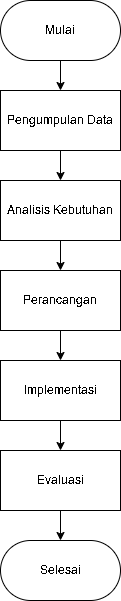{width=3cm}

## Pengumpulan Data

Pada tahap ini, peneliti melakukan pengumpulan data dengan tiga metode yaitu studi pustaka yang merujuk pada penelitian-penelitian sebelumnya yang relevan dengan penelitian sekarang yang akan dilakukan. Wawancara dengan berinteraksi kepada narasumber melalui sesi tanya jawab untuk memahami seperti apa pendaftaran sertifikasi di LSP UNTAN. Mengidentifikasi kebutuhan pengguna seperti sistem pendaftaran seperti apa yang dibutuhkan oleh LSP UNTAN. Observasi yang dilakukan oleh peneliti adalah observasi dokumen, yaitu dokumen APL 1 dan APL 2.

## Analisis Kebutuhan

Setelah data terkumpul, dilakukan analisis untuk menentukan kebutuhan fungsional dan non-fungsional sistem. Hasil dari tahap ini adalah daftar fitur yang harus ada untuk memenuhi kebutuhan admin, asesor, dan asesi.

### Kebutuhan Fungsional

Kebutuhan fungsional menggambarkan fungsi atau layanan yang harus disediakan oleh sistem untuk memenuhi kebutuhan pengguna. Berdasarkan hasil pengumpulan data, kebutuhan fungsional sistem informasi LSP UNTAN adalah sebagai berikut.

A. Kebutuhan Admin

1. Sistem harus dapat menampilkan ringkasan data pendaftaran dan statistik pada halaman *dashboard*.
2. Sistem harus dapat mengelola data skema sertifikasi.
3. Sistem harus dapat mengelola data sertifikasi.
4. Sistem harus dapat menampilkan log aktivitas untuk memantau perubahan data.
5. Sistem harus dapat mengelola akun pengguna.
6. Sistem harus dapat mengelola data asesi.

B. Kebutuhan Asesor

1. Sistem harus dapat memfasilitasi pengelolaan asesmen.
2. Sistem harus dapat mengelola data asesi yang berada di bawah pengawasannya.

C. Kebutuhan Asesi

1. Sistem harus dapat mengelola data profil asesi
2. Sistem harus dapat memfasilitasi pendaftaran pada skema sertifikasi yang berlangsung.
3. Sistem harus dapat mengunggah dokumen persyaratan pendaftaran dan hasil asesmen.
4. Sistem harus dapat melihat pengumuman sertifikasi yang diikuti asesi.

D. Kebutuhan Umum

1. Sistem harus dapat mengelola izin *push notification*
1. Sistem harus dapat memfasilitasi autentikasi

### Kebutuhan Non-Fungsional

Kebutuhan non-fungsional mendefinisikan atribut kualitas dan batasan operasional dari aplikasi yang dibangun. Berdasarkan analisis kebutuhan aplikasi LSP UNTAN berbasis PWA, kebutuhan non-fungsional ditetapkan pada empat aspek utama, yaitu keamanan, performa, skalabilitas, dan kompatibilitas *browser*.

A. Keamanan

1. Sistem wajib menerapkan protokol HTTPS (*Hypertext Transfer Protocol Secure*) untuk mengenkripsi pertukaran data antara pengguna dan *server*, yang juga merupakan syarat mutlak berjalannya *servie worker* pada PWA.

2. Sistem harus mengamankan data rahasia pengguna, seperti mengenkripsi kata sandi menggunakan fungsi *hashing* sebelum disimpan ke dalam basis data.

3. Sistem harus mengimplementasikan pembatasan hak akses (*authorization*) secara ketat agar setiap aktor (admin, asesor, asesi) hanya dapat mengakses halaman dan data sesuai dengan peranannya.

4. Sistem harus memvalidasi setiap berkas yang diunggah oleh pengguna (seperti formulir APL-01, APL-02, tugas asesmen) dengan menerapkan pembatasan tipe berkas (ekstensinya berupa ZIP, RAR, DOCx, XLSX, PPTX, PDF, JPG, JPEG atau PNG) dan batas ukuran maksimal berkas (misalnya 2 MB atau 5 MB) sesuai kebutuhan spesifik masing-masing berkas untuk meminimalisir risiko keamanan.

5. Sistem harus memproteksi direktori penyimpanan berkas agar tidak terekspos ke publik, sehingga berkas pendaftaran dan sertifikat hanya dapat diakses atau diunduh oleh pengguna yang memiliki hak akses (autentikasi dan otorisasi) yang sah.

B. Performa

1. Sistem harus memiliki waktu respons yang cepat dalam memuat halaman antarmuka agar pengguna tidak menunggu terlalu lama.

2. Sistem harus memanfaatkan teknologi *servie worker* (sebagai bagian dari PWA) untuk melakukan *caching* aset statis, sehingga performa pemuatan halaman tetap optimal meskipun dalam kondisi jaringan internet yang kurang stabil.

3. Pengiriman *push notification* harus diproses dan didistribusikan secara *real-time* dengan waktu jeda yang seminimal mungkin.

C. Skalabilitas

1. Sistem harus mampu menangani peningkatan jumlah pengguna yang mengakses aplikasi secara bersamaan, terutama pada masa puncak pendaftaran skema sertifikasi.

2. Sistem harus dirancang dengan struktur *database* yang baik agar tetap dapat memproses data dalam jumlah besar tanpa mengalami penurunan kinerja yang signifikan (misalnya tumpukan data unggahan tugas dan sertifikat dari waktu ke waktu).

D. Kompatibilitas *Browser*

1. Sistem harus dapat berjalan dengan baik dan mempertahankan fungsionalitas intinya di berbagai *browser* modern, seperti Google Chrome, Microsoft Edge, Mozilla Firefox, dan Safari.

2. Antarmuka sistem harus bersifat responsif, sehingga tampilan dapat menyesuaikan dengan mulus pada berbagai ukuran layar perangkat, mulai dari *desktop* hingga *mobile*.

3. Fitur spesifik PWA, seperti *Add to Home Screen* dan penerimaan *push notification*, harus berfungsi optimal pada perangkat dan *browser* yang mendukung standar *Web Push* API.

## Perancangan Sistem

Berdasarkan analisis kebutuhan, tahapan perancangan diawali dengan pendefinisian Arsitektur Sistem untuk menggambarkan alur komunikasi data antar pengguna dengan sistem. Selanjutnya, peneliti merancang detail fungsionalitas perangkat lunak menggunakan *Unified Modeling Language* (UML) seperti diagram *use case*,  diagram *activity* dan diagram *class*, serta perancangan basis data menggunakan *Entity Relationship Diagram* (ERD).

### Proses Bisnis

Rancangan proses bisnis usulan pada sistem informasi pendaftaran sertifikasi LSP UNTAN digambarkan untuk memperlihatkan alur interaksi antara asesi, admin, asesor, dan Sistem secara keseluruhan. Adapun alur proses bisnis tersebut dapat dilihat pada Gambar \ref{fig:proses-bisnis}.

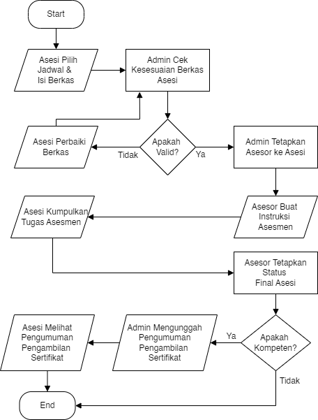{width=10cm}

Berdasarkan Gambar \ref{fig:proses-bisnis} di atas, alur proses bisnis dibagi menjadi tiga tahapan utama, yaitu:

1. Tahap Pendaftaran dan Verifikasi Berkas

Proses diawali oleh asesi yang memilih jadwal sertifikasi yang tersedia, kemudian mengisi formulir dan mengunggah berkas persyaratan. Selanjutnya, admin akan melakukan pengecekan terhadap kesesuaian berkas tersebut. Apabila berkas dinyatakan tidak valid, asesi harus memperbaiki dan mengunggah ulang berkasnya. Namun, apabila berkas dinyatakan valid, proses berlanjut ke tahap asesmen.

2. Tahap Pelaksanaan Asesmen

Bagi asesi dengan status pendaftaran yang telah divalidasi, admin akan menetapkan asesor ke asesi tersebut. Kemudian, asesor akan membuat dan memberikan tugas asesmen. Asesi kemudian wajib mengerjakan instruksi tersebut dan mengumpulkan jawaban atau hasil tugas asesmen kembali ke dalam sistem untuk dinilai.

3. Tahap Penilaian

Setelah asesi mengumpulkan tugas, asesor akan mengevaluasi hasil tersebut dan menetapkan status final kelulusan. Apabila asesi dinilai "Belum Kompeten", maka proses pendaftaran selesai sampai di tahap ini. Sebaliknya, apabila asesi dinilai "Kompeten", admin akan mengumumkan pengambilan sertifikat fisik, asesi dapat melihat pengumuman tersebut, dan proses bisnis dinyatakan selesai.

Sebagai catatan tambahan pada usulan proses bisnis ini, setiap kali terjadi perpindahan tahapan atau perubahan status (seperti perubahan status berkas, pemberian tugas baru, hingga ketersediaan sertifikat), sistem akan secara otomatis mendistribusikan pemberitahuan (*push notification*) secara *real-time* kepada perangkat aktor yang bersangkutan.

### Arsitektur Aplikasi

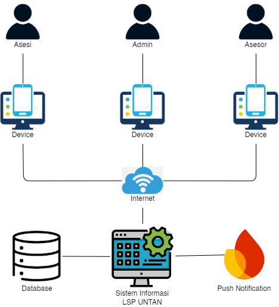{width=10cm}

Gambar \ref{fig:arsitektur} menunjukkan arsitektur sistem, aktor-aktor yang dalam sistem ini adalah admin, asesor, dan asesi. Ketiga aktor ini melalui *device* mereka dan sistem informasinya saling mengirim *request* dan *response*. misalnya aktor admin ingin membuka halaman *login*, *request* *get* tersebut akan dikirim ke *server* (yang dalam hal ini sistem informasi ini dan basis data), kemudian *server* akan mengirim *response* berupa tampilan *login*.

### Diagram *Use Case*

Diagram *use case* yang dibuat dalam penelitian ini dapat dilihat pada Gambar \ref{fig:usecase} berikut.

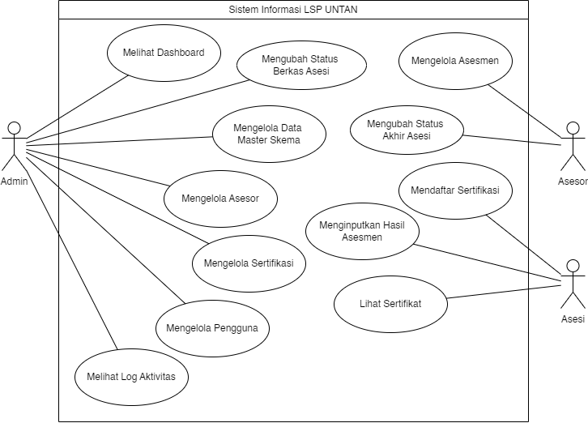

Diagram *use case* menggambarkan interaksi antara aktor dengan sistem. Pada perancangan *use case* sistem informasi LSP UNTAN terdapat tiga aktor yang terlibat yaitu admin, asesor, dan asesi. Untuk lebih jelas dapat dilihat pada spesifikasi *use case* berikut.

#### Spesifikasi *Use Case* Melihat *Dashboard*
Spesifikasi ini menjelaskan bagaimana aktor admin, asesor, dan asesi dapat mengakses halaman utama sistem untuk melihat ringkasan informasi atau statistik sesuai dengan peran yang dimiliki.

\captionsetup[longtable]{justification=raggedright, singlelinecheck=false}
\setlength{\LTcapwidth}{13.4cm}
\addtolength{\LTcapwidth}{4\tabcolsep}
\addtolength{\LTcapwidth}{3\arrayrulewidth}
\begin{longtable}{|p{2.9cm}|>{\raggedright\arraybackslash}p{10.5cm}|}
\caption{Spesifikasi \textit{Use Case} Melihat \textit{Dashboard}} \\
\hline
\endfirsthead
\hline
\endhead
\hline
\endfoot
\hline
\endlastfoot
Tujuan & Menyajikan ringkasan informasi, statistik penting, dan notifikasi status terkini sesuai dengan hak akses \\ \hline
Aktor & Admin, asesor, asesi \\ \hline
Kondisi Awal & Aktor sudah \textit{login} \\ \hline
Alur Utama & 
A. Aktor buka halaman \textit{dashboard}. \newline
B. Sistem mengambil data rekapitulasi yang relevan. \newline
C. Sistem tampilkan halaman \textit{dashboard} dengan \textit{widget} informasi sesuai dengan peran. \\ \hline
Kondisi Akhir & Aktor memperoleh gambaran umum mengenai status kegiatan sertifikasi di dalam sistem. \\ \hline
\end{longtable}

#### Spesifikasi *Use Case* Kelola Data Master Skema
Spesifikasi ini mendeskripsikan prosedur bagi admin untuk melakukan manajemen data skema sertifikasi, termasuk fungsi menambah, memperbarui, serta menghapus data skema pada basis data.

\captionsetup[longtable]{justification=raggedright, singlelinecheck=false}
\setlength{\LTcapwidth}{13.4cm}
\addtolength{\LTcapwidth}{4\tabcolsep}
\addtolength{\LTcapwidth}{3\arrayrulewidth}
\begin{longtable}{|p{2.9cm}|>{\raggedright\arraybackslash}p{10.5cm}|}
\caption{Spesifikasi \textit{Use Case} Mengelola Data Skema Sertifikasi} \\
\hline
\endfirsthead
\hline
\endhead
\hline
\endfoot
\hline
\endlastfoot
Tujuan & Mengelola data skema sertifikasi \\ \hline
Aktor & Admin \\ \hline
Kondisi Awal & Admin sudah \textit{login} dan berada di halaman skema \\ \hline
Alur Utama & 
A. Admin memilih tambah/edit data skema. \newline
B. Admin memasukkan data skema (nama, format berkas APL 1, 2, dst). \newline
C. Admin menekan tombol simpan. \newline
D. Sistem simpan. \\ \hline
Alternative Flow &
Kondisi 1 : Menghapus data skema. \newline
A1. Admin menekan tombol hapus pada salah satu skema. \newline
A2. Sistem meminta konfirmasi. \newline
A3. Admin mengonfirmasi. \newline
A4. Jika skema pernah terlibat di sertifikasi, sistem tampilkan pesan \textit{error}. \newline
A5. Jika tidak, sistem hapus data skema. \\ \hline
Kondisi Akhir &
Jika simpan: Data skema tersimpan dan tersedia sebagai pilihan saat input data asesor. \newline
Jika hapus sukses: Data skema terhapus dari sistem. \newline
Jika hapus gagal: Data skema tetap ada dan tidak berubah. \\ \hline
\end{longtable}

#### Spesifikasi *Use Case* Kelola Asesor
Spesifikasi ini menjelaskan alur kerja admin dalam mengelola akun asesor, yang meliputi pendaftaran data identitas serta pemberian otoritas terhadap skema sertifikasi tertentu.

\captionsetup[longtable]{justification=raggedright, singlelinecheck=false}
\setlength{\LTcapwidth}{13.4cm}
\addtolength{\LTcapwidth}{4\tabcolsep}
\addtolength{\LTcapwidth}{3\arrayrulewidth}
\begin{longtable}{|p{2.9cm}|>{\raggedright\arraybackslash}p{10.5cm}|}
\caption{Spesifikasi \textit{Use Case} Kelola Asesor} \\
\hline
\endfirsthead
\hline
\endhead
\hline
\endfoot
\hline
\endlastfoot
Tujuan & Mengelola akun asesor \\ \hline
Aktor & Admin \\ \hline
Kondisi Awal & Admin telah \textit{login} dan berada di halaman asesor \\ \hline
Alur Utama &
A. Admin memilih tambah/edit data asesor. \newline
B. Admin memasukkan data asesor (email, nama, dan skema sertifikasi yang diampu). \newline
C. Admin menekan tombol simpan. \newline
D. Sistem menyimpan data. \newline
E. Jika data baru, sistem mengirimkan email aktivasi ke asesor. \\ \hline
Alur Alternatif &
Kondisi 1 : Menghapus data asesor. \newline
A1. Admin menekan tombol hapus pada salah satu asesor. \newline
A2. Sistem meminta konfirmasi. \newline
A3. Admin mengonfirmasi. \newline
A4. Jika asesor sudah pernah terlibat di sertifikasi, sistem tampilkan pesan \textit{error}. \newline
A5. Jika tidak, sistem hapus data asesor. \\ \hline
Kondisi Akhir &
Jika simpan: Akun asesor terbentuk dan email aktivasi terkirim. \newline
Jika hapus sukses: Data asesor terhapus dari sistem. \newline
Jika hapus gagal: Data asesor tetap ada dan tidak berubah. \\ \hline
\end{longtable}

#### Spesifikasi *Use Case* Kelola Pengguna
Spesifikasi ini memaparkan alur kerja admin dalam melakukan kontrol akses terhadap seluruh aktor (admin, asesor, dan asesi). Spesifikasi ini mencakup penangguhan akses bagi pengguna yang melanggar ketentuan, maupun pemulihan akses guna menjamin integritas penggunaan sistem.

\captionsetup[longtable]{justification=raggedright, singlelinecheck=false}
\setlength{\LTcapwidth}{13.4cm}
\addtolength{\LTcapwidth}{4\tabcolsep}
\addtolength{\LTcapwidth}{3\arrayrulewidth}
\begin{longtable}{|p{2.9cm}|>{\raggedright\arraybackslash}p{10.5cm}|}
\caption{Spesifikasi \textit{Use Case} Kelola Pengguna} \\
\hline
\endfirsthead
\hline
\endhead
\hline
\endfoot
\hline
\endlastfoot
Tujuan & Mengelola status validasi dan hak akses \textit{login} akun pengguna demi keamanan sistem. \\ \hline
Aktor & Admin \\ \hline
Kondisi Awal & Admin telah \textit{login} dan berada di halaman daftar pengguna \\ \hline
Alur Utama & 
A. Admin menekan tombol aksi perubahan status (Ban/Un-ban) pada salah satu pengguna. \newline
B. Sistem menampilkan pesan konfirmasi perubahan status. \newline
C. Admin mengonfirmasi tindakan tersebut. \newline
D. Sistem memperbarui status pengguna. \\ \hline
Kondisi Akhir &
Jika Ban: Pengguna tidak bisa \textit{login}. \newline
Jika Un-ban: pengguna bisa \textit{login} kembali. \\ \hline
\end{longtable}

#### Spesifikasi *Use Case* Melihat Log Aktivitas Sistem
Spesifikasi ini mendeskripsikan proses pemantauan jejak audit oleh admin terhadap aktivitas dan perubahan data yang terjadi di dalam sistem. Fitur ini dirancang untuk meningkatkan aspek akuntabilitas dan keamanan, sehingga setiap tindakan krusial yang dilakukan oleh aktor di dalam Sistem Informasi LSP UNTAN dapat ditelusuri secara kronologis.

\captionsetup[longtable]{justification=raggedright, singlelinecheck=false}
\setlength{\LTcapwidth}{13.4cm}
\addtolength{\LTcapwidth}{4\tabcolsep}
\addtolength{\LTcapwidth}{3\arrayrulewidth}
\begin{longtable}{|p{2.9cm}|>{\raggedright\arraybackslash}p{10.5cm}|}
\caption{Spesifikasi \textit{Use Case} Melihat Log Aktivitas Sistem} \\
\hline
\endfirsthead
\hline
\endhead
\hline
\endfoot
\hline
\endlastfoot
Tujuan & Memantau riwayat aktivitas dan perubahan data sistem untuk kebutuhan audit trail. \\ \hline
Aktor & Admin \\ \hline
Kondisi Awal & Admin telah melakukan \textit{login} \\ \hline
Alur Utama & A. Admin buka halaman log. \newline
B. Admin menekan tombol ``Detail'' pada salah satu baris log. \newline
C. Sistem menampilkan rincian riwayat perubahan data. \\ \hline
Kondisi Akhir & Admin memperoleh rincian informasi riwayat perubahan data pada sistem. \\ \hline
\end{longtable}

#### Spesifikasi *Use Case* Kelola Sertifikasi
Spesifikasi ini menjelaskan langkah-langkah admin dalam menginisiasi sebuah periode sertifikasi, mulai dari penentuan skema sertifikasi, penentuan asesor, hingga penentuan jadwal pelaksanaan.

\captionsetup[longtable]{justification=raggedright, singlelinecheck=false}
\setlength{\LTcapwidth}{13.4cm}
\addtolength{\LTcapwidth}{4\tabcolsep}
\addtolength{\LTcapwidth}{3\arrayrulewidth}
\begin{longtable}{|p{2.9cm}|>{\raggedright\arraybackslash}p{10.5cm}|}
\caption{Spesifikasi \textit{Use Case} Kelola Sertifikasi} \\
\hline
\endfirsthead
\hline
\endhead
\hline
\endfoot
\hline
\endlastfoot
Tujuan & Membuka, memperbarui, atau membatalkan jadwal sertifikasi \\ \hline
Aktor & Admin \\ \hline
Kondisi Awal & Admin telah \textit{login} dan data skema serta data asesor sudah tersedia di database. \\ \hline
Alur Utama & 
A. Admin memasukkan data (memilih skema, asesor, periode daftar, lokasi, biaya, nomor rekening bank). \newline
B. Admin menekan tombol simpan. \newline
C. Sistem simpan data sertifikasi dengan status berlangsung. \\ \hline
Alur Alternatif &
Kondisi 1: Membatalkan Sertifikasi \newline
A1. Admin memilih sertifikasi yang ingin diubah. \newline
A2. Admin mengubah status menjadi ``Dibatalkan''. \newline
A3. Admin menekan tombol simpan. \newline
A4. Sistem simpan sehingga asesi tidak dapat lagi melakukan pendaftaran. \\ \hline
Kondisi Akhir & 
Jika Simpan: Asesi dapat melakukan pendaftaran. \newline
Jika Dibatalkan: Sertifikasi tetap tercatat di sistem namun akses pendaftaran ditutup untuk asesi. \\ \hline
\end{longtable}

#### Spesifikasi *Use Case* Mengubah Status Berkas Asesi
Spesifikasi ini merinci proses verifikasi berkas dan penentuan status kelayakan asesi yang dilakukan oleh admin guna memantau perkembangan proses sertifikasi tiap asesi.

\captionsetup[longtable]{justification=raggedright, singlelinecheck=false}
\setlength{\LTcapwidth}{13.4cm}
\addtolength{\LTcapwidth}{4\tabcolsep}
\addtolength{\LTcapwidth}{3\arrayrulewidth}
\begin{longtable}{|p{2.9cm}|>{\raggedright\arraybackslash}p{10.5cm}|}
\caption{Spesifikasi \textit{Use Case} Mengubah Status Berkas Asesi} \\
\hline
\endfirsthead
\hline
\endhead
\hline
\endfoot
\hline
\endlastfoot
Tujuan & Memvalidasi kelengkapan administrasi. \\ \hline
Aktor & Admin \\ \hline
Kondisi Awal & Aktor telah melakukan \textit{login} dan data pendaftaran asesi tersedia. \\ \hline
Alur Utama & 
A. Aktor membuka daftar asesi dan memilih salah satu asesi untuk melihat detail. \newline
B. Aktor memilih status berkas asesi (``Perlu Perbaikan" atau ``Sudah Lengkap") dan menekan tombol simpan. \newline
C. Sistem simpan dan memberikan notifikasi kepada asesi. \\ \hline
Kondisi Akhir & Status berkas asesi diperbarui. \\ \hline
\end{longtable}

#### Spesifikasi *Use Case* Menetapkan Asesor ke Asesi
Spesifikasi ini merinci proses penugasan atau alokasi asesor kepada asesi yang telah memenuhi kelengkapan berkas administrasi.

\captionsetup[longtable]{justification=raggedright, singlelinecheck=false}
\setlength{\LTcapwidth}{13.4cm}
\addtolength{\LTcapwidth}{4\tabcolsep}
\addtolength{\LTcapwidth}{3\arrayrulewidth}
\begin{longtable}{|p{2.9cm}|>{\raggedright\arraybackslash}p{10.5cm}|}
\caption{Spesifikasi \textit{Use Case} Kelola Asesi} \\
\hline
\endfirsthead
\hline
\endhead
\hline
\endfoot
\hline
\endlastfoot
Tujuan & Menetapkan asesor pada asesi. \\ \hline
Aktor & Admin \\ \hline
Kondisi Awal & Aktor telah melakukan \textit{login} dan data pendaftaran asesi tersedia dan status berkasnya sudah lengkap. \\ \hline
Alur Utama & 
A. Aktor membuka daftar asesi dan memilih salah satu asesi untuk melihat detail. \newline
B. Aktor memilih asesor yang tersedia dan menekan tombol simpan. \newline
C. Sistem simpan dan memberikan notifikasi kepada asesi dan asesor. \\ \hline
Kondisi Akhir & Asesor ditetapkan ke asesi. \\ \hline
\end{longtable}

#### Spesifikasi *Use Case* Kelola Asesmen
Spesifikasi ini menunjukkan alur bagi asesor untuk menetapkan persyaratan teknis atau instruksi kerja yang harus dipenuhi oleh asesi sebagai bagian dari syarat uji kompetensi.

\captionsetup[longtable]{justification=raggedright, singlelinecheck=false}
\setlength{\LTcapwidth}{13.4cm}
\addtolength{\LTcapwidth}{4\tabcolsep}
\addtolength{\LTcapwidth}{3\arrayrulewidth}
\begin{longtable}{|p{2.9cm}|>{\raggedright\arraybackslash}p{10.5cm}|}
\caption{Spesifikasi \textit{Use Case} Kelola Asesmen} \\
\hline
\endfirsthead
\hline
\endhead
\hline
\endfoot
\hline
\endlastfoot
Tujuan & Mengelola instruksi asesmen serta mengakses berkas-berkas hasil pengerjaan asesi untuk keperluan validasi secara luring \\ \hline
Aktor & Asesor \\ \hline
Kondisi Awal & Asesor telah melakukan \textit{login} dan memilih skema sertifikasi yang sedang aktif diampu. \\ \hline
Alur Utama &
A. Asesor buat/ubah teks instruksi asesmen pada sistem. \newline
B. Asesor menekan tombol simpan.  \newline
C. Sistem simpan dan memberikan notifikasi kepada asesi terkait yang status berkasnya sudah lengkap. \newline
D. Asesor melihat daftar unggahan berkas asesmen yang dikumpulkan asesi. \newline
E. Asesor mengunduh berkas-berkas tersebut untuk dilakukan peninjauan. \\ \hline
Alur Alternatif &
Kondisi 1: Menghapus instruksi asesmen yang ada. \newline
A1. Asesor menekan tombol hapus pada instruksi yang ada. \newline
A2. Sistem menampilkan pesan konfirmasi. \newline
A3. Asesor mengonfirmasi dan sistem menghapus data tersebut. \\ \hline
Kondisi Akhir &
Jika Simpan: Instruksi asesmen terpublikasi dan berkas asesi berhasil diunduh. \newline
Jika Hapus: Instruksi terhapus dari sistem dan tidak lagi terlihat oleh asesi. \\ \hline
\end{longtable}

#### Spesifikasi *Use Case* Mendaftar Sertifikasi
Spesifikasi ini menjelaskan tahapan yang dilalui oleh asesi untuk memilih skema yang diinginkan, mengisi formulir pendaftaran, hingga pengajuan berkas pendaftaran ke sistem.

\captionsetup[longtable]{justification=raggedright, singlelinecheck=false}
\setlength{\LTcapwidth}{13.4cm}
\addtolength{\LTcapwidth}{4\tabcolsep}
\addtolength{\LTcapwidth}{3\arrayrulewidth}
\begin{longtable}{|p{2.9cm}|>{\raggedright\arraybackslash}p{10.5cm}|}
\caption{Spesifikasi \textit{Use Case} Mendaftar Sertifikasi} \\
\hline
\endfirsthead
\hline
\endhead
\hline
\endfoot
\hline
\endlastfoot
Tujuan & Mengajukan permohonan sertifikasi dengan melengkapi data diri dan mengunggah berkas persyaratan. \\ \hline
Aktor & Asesi \\ \hline
Kondisi Awal & Asesi telah \textit{login} dan status jadwal dari sertifikasi yang ingin didaftar adalah ``Dibuka''. \\ \hline
Alur Utama & A. Asesi membuka halaman jadwal sertifikasi dan menekan tombol ``Daftar'' pada skema sertifikasi. \newline
B. Asesi mengisi data diri dan berkas-berkas persyaratan. \newline
C. Asesi menekan tombol ``Daftar''. \newline
D. Sistem simpan data, mengubah status berkas asesi menjadi ``menunggu verifikasi berkas'', dan mengirim notifikasi ke admin dan asesor. \newline
E. Sistem mengarahkan asesi ke halaman detail status pendaftarannya. \\ \hline
Kondisi Akhir & Jika simpan: Data pendaftaran tersimpan. \\ \hline
\end{longtable}

#### Spesifikasi *Use Case* Menginputkan Hasil Asesmen
Spesifikasi ini merinci tahapan pengiriman tugas atau bukti kompetensi oleh asesi kepada asesor, yang hanya dapat dilakukan jika telah diberikan hak akses ke halaman Asesmen.

\captionsetup[longtable]{justification=raggedright, singlelinecheck=false}
\setlength{\LTcapwidth}{13.4cm}
\addtolength{\LTcapwidth}{4\tabcolsep}
\addtolength{\LTcapwidth}{3\arrayrulewidth}
\begin{longtable}{|p{2.9cm}|>{\raggedright\arraybackslash}p{10.5cm}|}
\caption{Spesifikasi \textit{Use Case} Unggah Tugas Asesmen} \\
\hline
\endfirsthead
\hline
\endhead
\hline
\endfoot
\hline
\endlastfoot
Tujuan & Menyerahkan dokumen bukti kompetensi atau tugas asesmen ke asesor. \\ \hline
Aktor & Asesi \\ \hline
Kondisi Awal & Asesi telah melakukan \textit{login}, status berkasnya sudah lengkap, dan instruksi asesmen sudah dibuat asesor terkait. \\ \hline
Alur Utama & A. Asesi mengakses menu asesmen. \newline
B. Asesi unggah berkas tugas/asesmen (format ZIP/PDF/DOCX) sesuai instruksi. \newline
C. Asesi tekan kumpulkan. \newline
D. Sistem simpan dan notifikasi asesor. \\ \hline
Alur Alternatif & Kondisi 1: Melewati batas waktu pengumpulan \newline
B1. Sistem mendeteksi waktu \textit{server} saat ini telah melewati batas deadline. \newline
B2. Sistem menyembunyikan fungsi unggah berkas dan menampilkan pesan ``Batas waktu pengumpulan berakhir. Anda tidak dapat lagi mengunggah tugas''. \\ \hline
Kondisi Akhir & Jika simpan: Berkas tugas tersimpan dan bisa dilihat asesor. \newline
Jika gagal: Tidak ada perubahan data pada \textit{server} dan menampilkan pesan peringatan jika syarat waktu telah lewat. \\ \hline
\end{longtable}

#### Spesifikasi *Use Case* Mengubah Status Akhir Asesi
Spesifikasi ini merinci proses penentuan dan pembaruan hasil penilaian final terhadap kelayakan kompetensi asesi oleh asesor yang bertugas berdasarkan hasil asesmen yang telah dilaksanakan.

\captionsetup[longtable]{justification=raggedright, singlelinecheck=false}
\setlength{\LTcapwidth}{13.4cm}
\addtolength{\LTcapwidth}{4\tabcolsep}
\addtolength{\LTcapwidth}{3\arrayrulewidth}
\begin{longtable}{|p{2.9cm}|>{\raggedright\arraybackslash}p{10.5cm}|}
\caption{Spesifikasi \textit{Use Case} Mengubah Status Akhir Asesi} \\
\hline
\endfirsthead
\hline
\endhead
\hline
\endfoot
\hline
\endlastfoot
Tujuan & Menetapkan status akhir asesi. \\ \hline
Aktor & Asesor \\ \hline
Kondisi Awal & Aktor telah melakukan \textit{login}, data pendaftaran asesi tersedia, dan asesor dari si asesi telah ditetapkan. \\ \hline
Alur Utama & 
A. Aktor membuka daftar asesi dan memilih salah satu asesi untuk melihat detail. \newline
B. Aktor memilih status akhir asesi (kompeten/belum kompeten/diskualifikasi) dan menekan tombol simpan. \newline
C. Sistem simpan dan memberikan notifikasi kepada asesi. \\ \hline
Kondisi Akhir & Status berkas asesi diperbarui. \\ \hline
\end{longtable}

### Diagram *Activity*

Diagram *activity* berikut ini menggambarkan alur kerja (*workflow*) dari sistem yang dirancang, yang menjelaskan interaksi antara aktor dengan sistem.

#### Diagram *Activity* Melihat *Dashboard*

Gambar \ref{fig:activity-melihat-dash} menunjukkan bagaimana aktor membuka halaman *dashboard* dan sistem menampilkan halaman *dashboard* yang berisi ringkasan data statistik atau menu utama sesuai dengan hak akses masing-masing pengguna.

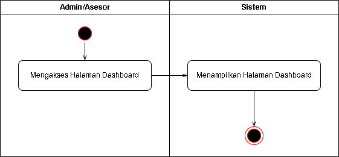

#### Diagram *Activity* Kelola Data Master Skema

Gambar \ref{fig:activity-kelola-skema} menunjukkan bagaimana admin dalam melakukan pengelolaan data skema, yang meliputi proses menambah, mengubah, melihat, serta menghapus data master skema sertifikasi yang tersedia di LSP UNTAN.

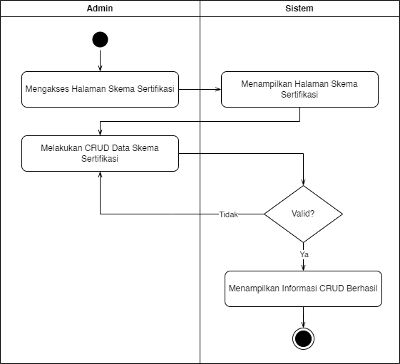

#### Diagram *Activity* Kelola Asesor

Gambar \ref{fig:activity-kelola-asesor} menunjukkan bagaimana admin mengelola data asesor, mulai dari menambah, mengubah, melihat, dan menghapus asesor.

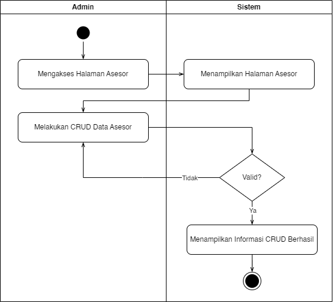

#### Diagram *Activity* Kelola Pengguna

Gambar \ref{fig:activity-kelola-pengguna} menunjukkan bagaimana admin mengelola akun pengguna di dalam sistem dengan menangguhkan atau membatalkan penangguhan akun pengguna. Pengguna yang ditangguhkan tidak dapat melakukan proses *login* hingga statusnya diaktifkan kembali.

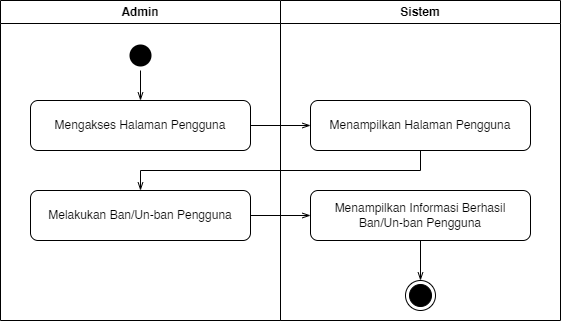

#### Diagram *Activity* Melihat Log Aktivitas

Gambar \ref{fig:activity-melihat-log} menunjukkan bagaimana admin mengakses rekam jejak aktivitas yang terjadi di dalam sistem.

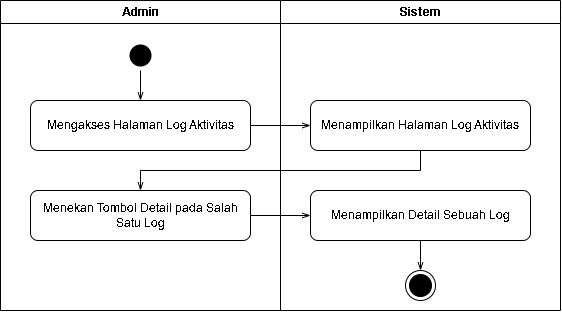

#### Diagram *Activity* Kelola Sertifikasi

Gambar \ref{fig:activity-kelola-sertifikasi} ini menunjukkan bagaimana admin mengelola data sertifikasi meliputi menambah/membuka pendaftaran, mengubah, melihat, dan membatalkan.

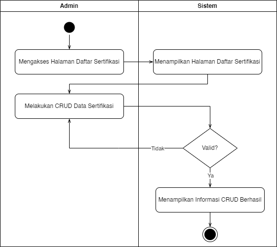

#### Diagram *Activity* Mendaftar Sertifikasi

Gambar \ref{fig:activity-daftar-sertif} menunjukkan tahapan yang dilakukan oleh calon asesi untuk memilih skema sertifikasi yang tersedia, mengisi formulir pendaftaran, hingga mengunggah dokumen persyaratan awal secara mandiri.

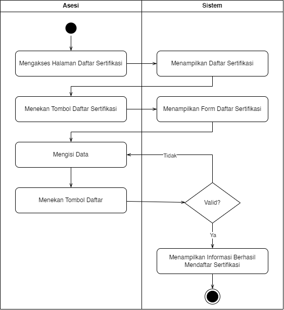

#### Diagram *Activity* Lihat Detail dan Status Pendaftaran

Gambar \ref{fig:activity-lihat-detail-pendaftaran} menunjukkan bagaimana asesi melakukan pemantauan terhadap progres pendaftaran mereka, guna mengetahui apakah berkas telah diverifikasi atau memerlukan perbaikan.

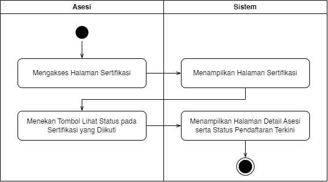

#### Diagram *Activity* Mengubah Status Berkas Asesi

Gambar \ref{fig:activity-ubah-status-berkas} menunjukkan proses transisi status berkas asesi berdasarkan hasil verifikasi dokumen oleh admin.

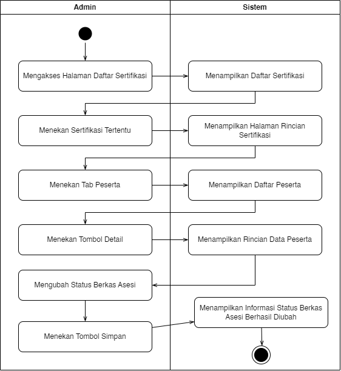

#### Diagram *Activity* Menetapkan Asesor ke Asesi

Gambar \ref{fig:activity-penetapan-asesor} menunjukkan proses penetapan asesor kepada asesi yang status berkasnya sudah lengkap.

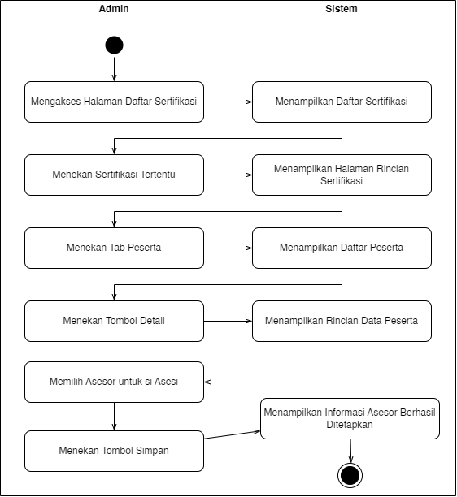

#### Diagram *Activity* Kelola Pengumuman Sertifikasi

Gambar \ref{fig:activity-kelola-news} menunjukkan bagaimana admin atau asesor membuat dan mempublikasikan informasi atau berita terkait kegiatan sertifikasi tertentu agar dapat dilihat oleh asesi.

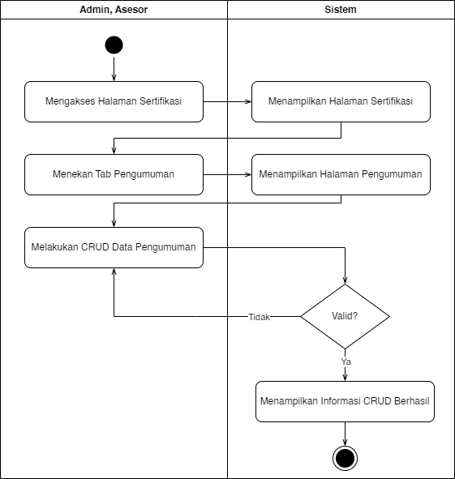

#### Diagram *Activity* Akses Pengumuman Sertifikasi

Gambar \ref{fig:activity-lihat-news} menunjukkan bagaimana asesi mengakses dan membaca informasi terbaru yang dipublikasikan oleh pihak LSP UNTAN untuk sertifikasi yang diikuti.

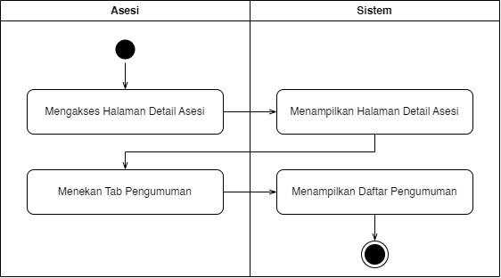

#### Diagram *Activity* Kelola Asesmen

Gambar \ref{fig:activity-kelola-asesmen} menunjukkan bagaimana asesor mengelola instruksi asesmen meliputi menambah, mengubah, melihat, dan menghapus asesmen.

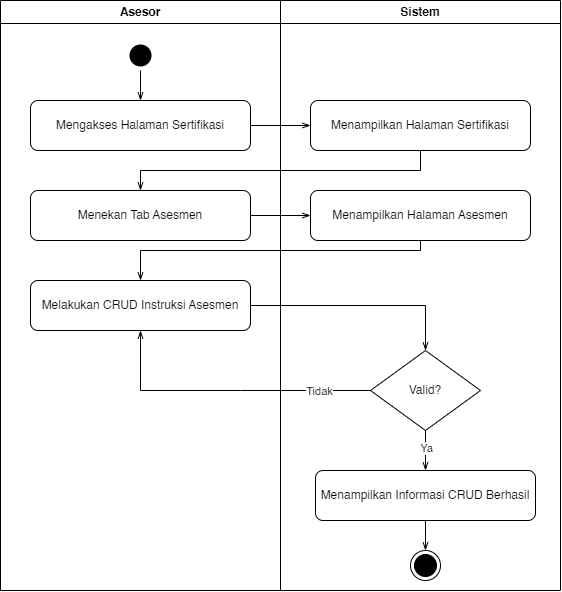

#### Diagram *Activity* Menginputkan Hasil Asesmen

Gambar \ref{fig:activity-unggah-asesmen} menunjukan bagaimana asesi mengumpulkan dokumen bukti kompetensi atau tugas-tugas asesmen yang diberikan oleh asesor sebagai bagian dari persyaratan uji kompetensi.

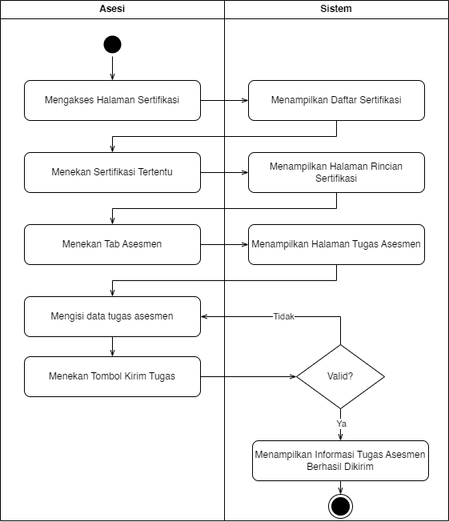

#### Diagram *Activity* Mengubah Status Akhir Asesi

Gambar \ref{fig:activity-ubah-status-akhir} menunjukkan proses penetapan status akhir asesi berdasarkan hasil asesmennya oleh asesor.

#### Diagram *Activity* Kelola Data Sertifikat

Gambar \ref{fig:activity-kelola-sertifikat-asesi} menunjukkan bagaimana admin mengelola data sertifikat meliputi menambah, mengubah, melihat, dan menghapusnya. Penyimpanan data sertifikat agar dapat divalidasi keabsahannya oleh publik.

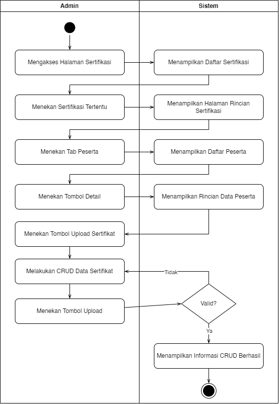

### Diagram *Class*

Diagram *class* pada Gambar \ref{fig:diagram-class} menunjukkan struktur sistem secara statis dengan memperlihatkan kelas-kelas yang ada, atribut, metode, serta hubungan antar objek dalam Sistem Informasi LSP UNTAN. Diagram ini berfungsi sebagai representasi dari struktur basis data dan logika perangkat lunak yang akan diimplementasikan.

\newpage
\begin{figure}[H]
    \centering
    \makebox[\textwidth][c]{\includegraphics[width=19cm]{images/class.png}}
    \caption{Diagram \textit{Class}}
    \label{fig:diagram-class}
\end{figure}

\newpage

### *Entity Relationship Diagram*

*Entity Relationship Diagram* (ERD) digunakan untuk memvisualisasikan struktur basis data dan hubungan antar entitas di dalam Sistem Informasi LSP UNTAN. Gambar \ref{fig:erd} menunjukkan bagaimana setiap tabel saling terintegrasi melalui *foreign key* guna menjamin integritas data.

Secara garis besar, relasi dalam sistem ini berpusat pada tabel sertifikasi sebagai objek utama, terhubung dengan tabel asesor melalui asesor_sertifikasi, serta tabel asesi yang berfungsi sebagai *pivot* bagi data pendaftaran mahasiswa. Struktur ini dirancang untuk mendukung skalabilitas data, seperti penambahan berkas lampiran pada tabel berkas_asesi.

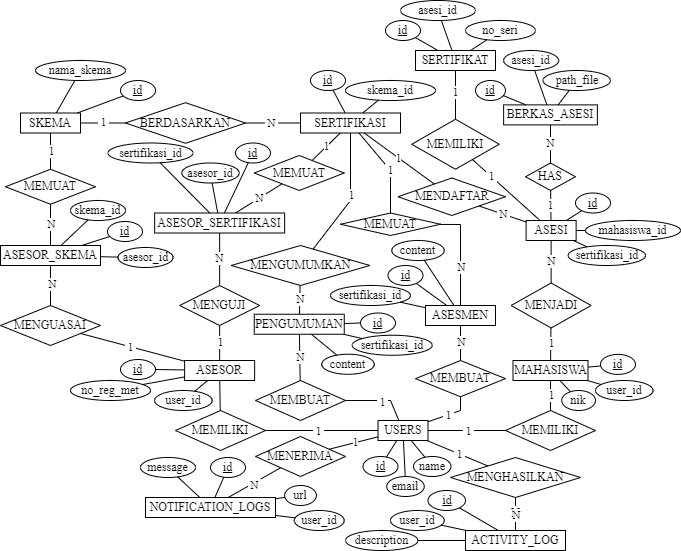

### *Data Dictionary*

Berikut adalah rincian struktur tabel yang digunakan dalam basis data Sistem Informasi LSP UNTAN. Penamaan tabel dan kolom dalam kamus data ini disesuaikan sepenuhnya dengan identitas fisik pada basis data sistem untuk menjaga konsistensi dokumentasi teknis.

#### Tabel *Users*

Tabel *users* digunakan untuk menyimpan data akun autentikasi serta pembagian hak akses (*role*) untuk semua aktor (admin, asesor, dan asesi).

\captionsetup[longtable]{justification=raggedright, singlelinecheck=false}
\setlength{\LTcapwidth}{14.3cm}
\addtolength{\LTcapwidth}{8\tabcolsep}
\addtolength{\LTcapwidth}{5\arrayrulewidth}
\begin{longtable}{|p{3cm}|p{2.5cm}|p{1.8cm}|>{\raggedright\arraybackslash}p{7cm}|}
\caption{Tabel \textit{Users}} \\
\hline
\textbf{Kolom} & \textbf{Tipe Data} & \textbf{\textit{Key}} & \textbf{Keterangan} \\ \hline
\endfirsthead \hline
\textbf{Kolom} & \textbf{Tipe Data} & \textbf{\textit{Key}} & \textbf{Keterangan} \\ \hline
\endhead \hline
\endfoot
id & BIGINT (20) & \textit{Primary Key} & ID unik pengguna \\ \hline
name & VARCHAR (255) & - & Nama lengkap pengguna \\ \hline
email & VARCHAR (255) & - & Alamat \textit{email} (unik) untuk \textit{login} \\ \hline
password  & VARCHAR (255) & - & Kata sandi terenkripsi \\ \hline
role & VARCHAR (255) & - & Peran pengguna (admin, asesor, asesi) \\ \hline
banned\_at & TIMESTAMP & - & Waktu ketika \textit{user} ditangguhkan (tidak bisa \textit{login}), \textit{null} untuk \textit{default} \\ \hline
email\_verified\_at & TIMESTAMP & - & Waktu ketika \textit{email} pengguna terverifikasi \\ \hline
no\_tlp\_hp & VARCHAR (255) & - & No. HP atau WA pengguna \\ \hline
fcm\_token & TEXT & - & Token Firebase Cloud Messaging, terisi ketika \textit{user} mengizinkan untuk memberikan \textit{push notification} \\ \hline
created\_at & TIMESTAMP & - & Waktu pembuatan data \\ \hline
updated\_at & TIMESTAMP & - & Waktu pembaruan data terakhir \\ \hline
\end{longtable}

#### Tabel Mahasiswa

Tabel mahasiswa digunakan untuk menyimpan profil biodata mahasiswa yang berelasi *one-to-one* ke tabel *users*. Setiap satu data pada tabel mahasiswa hanya berhubungan dengan satu data pada tabel *users*.

\captionsetup[longtable]{justification=raggedright, singlelinecheck=false}
\setlength{\LTcapwidth}{14.3cm}
\addtolength{\LTcapwidth}{8\tabcolsep}
\addtolength{\LTcapwidth}{5\arrayrulewidth}
\begin{longtable}{|p{3cm}|p{2.5cm}|p{1.8cm}|>{\raggedright\arraybackslash}p{7cm}|}
\caption{Tabel Mahasiswa} \\
\hline
\textbf{Kolom} & \textbf{Tipe Data} & \textbf{\textit{Key}} & \textbf{Keterangan} \\ \hline
\endfirsthead \hline
\textbf{Kolom} & \textbf{Tipe Data} & \textbf{\textit{Key}} & \textbf{Keterangan} \\ \hline
\endhead \hline
\endfoot
id & BIGINT (20) & \textit{Primary Key} & ID unik asesi \\ \hline
user\_id & BIGINT (20) & \textit{Foreign Key} & FK ke tabel \textit{users} \\ \hline
nik & VARCHAR (255) & - & NIK  \\ \hline
nim & VARCHAR (255) & - & NIM asesi \\ \hline
tmpt\_lhr & VARCHAR (255) & - & Tempat lahir asesi \\ \hline
tgl\_lhr & DATE & - & Tanggal lahir asesi \\ \hline
kelamin & VARCHAR (255) & - & Jenis kelamin asesi \\ \hline
kebangsaan & VARCHAR (255) & - & Kebangsaan asesi \\ \hline
no\_tlp\_rmh & VARCHAR (255) & - & No. telepon rumah asesi \\ \hline
no\_tlp\_kntr & VARCHAR (255) & - & No. telepon kantor asesi \\ \hline
kualifikasi\_pendidikan & VARCHAR (255) & - & Kualifikasi pendidikan terakhir asesi \\ \hline
nama\_institusi & VARCHAR (255) & - & Institusi tempat asesi kerja atau mengenyam pendidikan \\ \hline
jabatan & VARCHAR (255) & - & Jabatan asesi di institusi tersebut \\ \hline
alamat\_kantor & VARCHAR (255) & - & Alamat kantor/institusi asesi \\ \hline
no\_tlp\_email\_fax & VARCHAR (255) & - & No. telpon, \textit{email}, atau fax kantor/institusi asesi \\ \hline
foto\_ktp & VARCHAR (255) & - & Lokasi berkas foto ktp asesi tersimpan \\ \hline
pas\_foto & VARCHAR (255) & - & Lokasi berkas pas foto asesi tersimpan \\ \hline
created\_at & TIMESTAMP & - & Waktu pembuatan data \\ \hline
updated\_at & TIMESTAMP & - & Waktu pembaruan data terakhir \\ \hline
\end{longtable}

#### Tabel Asesor

Tabel asesor digunakan untuk menyimpan profil asesor yang berelasi *one-to-one* ke tabel *users*. Setiap satu data pada tabel asesor hanya berhubungan dengan satu data pada tabel *users*.

\captionsetup[longtable]{justification=raggedright, singlelinecheck=false}
\setlength{\LTcapwidth}{14.3cm}
\addtolength{\LTcapwidth}{8\tabcolsep}
\addtolength{\LTcapwidth}{5\arrayrulewidth}
\begin{longtable}{|p{3cm}|p{2.5cm}|p{1.8cm}|>{\raggedright\arraybackslash}p{7cm}|}
\caption{Tabel Asesor} \\
\hline
\textbf{Kolom} & \textbf{Tipe Data} & \textbf{\textit{Key}} & \textbf{Keterangan} \\ \hline
\endfirsthead \hline
\textbf{Kolom} & \textbf{Tipe Data} & \textbf{\textit{Key}} & \textbf{Keterangan} \\ \hline
\endhead \hline
\endfoot
id & BIGINT(20) & \textit{Primary Key} & ID unik asesor \\ \hline
user\_id & BIGINT(20) & \textit{Foreign Key} & FK ke tabel \textit{users} \\ \hline
no\_reg\_met & VARCHAR(255) & - & No. registrasi asesor \\ \hline
masa\_berlaku\_sertif\_ \newline teknis & DATE & - & Masa berlaku sertifikat teknis asesor \\ \hline
masa\_berlaku\_sertif\_ \newline asesor & DATE & - & Masa berlaku sertifikat asesor \\ \hline
created\_at & TIMESTAMP & - & Waktu pembuatan data \\ \hline
updated\_at & TIMESTAMP & - & Waktu pembaruan data terakhir \\ \hline
\end{longtable}

#### Tabel Skema

Tabel skema digunakan untuk menyimpan data master skema sertifikasi.

\captionsetup[longtable]{justification=raggedright, singlelinecheck=false}
\setlength{\LTcapwidth}{14.3cm}
\addtolength{\LTcapwidth}{8\tabcolsep}
\addtolength{\LTcapwidth}{5\arrayrulewidth}
\begin{longtable}{|p{3cm}|p{2.5cm}|p{1.8cm}|>{\raggedright\arraybackslash}p{7cm}|}
\caption{Tabel Skema} \\
\hline
\textbf{Kolom} & \textbf{Tipe Data} & \textbf{\textit{Key}} & \textbf{Keterangan} \\ \hline
\endfirsthead \hline
\textbf{Kolom} & \textbf{Tipe Data} & \textbf{\textit{Key}} & \textbf{Keterangan} \\ \hline
\endhead \hline
\endfoot
id & BIGINT(20) & \textit{Primary Key} & ID unik skema \\ \hline
format\_apl\_1 & VARCHAR(255) & - & Lokasi berkas FR APL 1 \\ \hline
format\_apl\_2 & VARCHAR(255) & - & Lokasi berkas FR APL 2 \\ \hline
format\_asesmen & VARCHAR(255) & - & Lokasi berkas zip untuk lampiran asesmen \\ \hline
created\_at & TIMESTAMP & - & Waktu pembuatan data \\ \hline
updated\_at & TIMESTAMP & - & Waktu pembaruan data terakhir \\ \hline
\end{longtable}

#### Tabel Asesor_skema

Tabel asesor_skema merupakan tabel pivot yang menghubungkan tabel asesor dan tabel skema.

\captionsetup[longtable]{justification=raggedright, singlelinecheck=false}
\setlength{\LTcapwidth}{14.3cm}
\addtolength{\LTcapwidth}{8\tabcolsep}
\addtolength{\LTcapwidth}{5\arrayrulewidth}
\begin{longtable}{|p{3cm}|p{2.5cm}|p{1.8cm}|>{\raggedright\arraybackslash}p{7cm}|}
\caption{Tabel Asesor\_skema} \\
\hline
\textbf{Kolom} & \textbf{Tipe Data} & \textbf{\textit{Key}} & \textbf{Keterangan} \\ \hline
\endfirsthead \hline
\textbf{Kolom} & \textbf{Tipe Data} & \textbf{\textit{Key}} & \textbf{Keterangan} \\ \hline
\endhead \hline
\endfoot
id & BIGINT(20) & \textit{Primary Key} & ID unik tiap baris data \\ \hline
skema\_id & VARCHAR(255) & \textit{Foreign Key} & FK ke tabel skema \\ \hline
asesor\_id & VARCHAR(255) & \textit{Foreign Key} & FK ke tabel asesor \\ \hline
created\_at & TIMESTAMP & - & Waktu pembuatan data \\ \hline
updated\_at & TIMESTAMP & - & Waktu pembaruan data terakhir \\ \hline
\end{longtable}

#### Tabel Sertifikasi

Tabel sertifikasi digunakan untuk menyimpan data sertifikasi yang berelasi *many-to-one* ke tabel skema. Setiap satu data pada tabel skema bisa memiliki lebih dari satu data di tabel sertifikasi.

\captionsetup[longtable]{justification=raggedright, singlelinecheck=false}
\setlength{\LTcapwidth}{14.3cm}
\addtolength{\LTcapwidth}{8\tabcolsep}
\addtolength{\LTcapwidth}{5\arrayrulewidth}
\begin{longtable}{|p{3cm}|p{2.5cm}|p{1.8cm}|>{\raggedright\arraybackslash}p{7cm}|}
\caption{Tabel Sertifikasi} \label{tab:sertifikasi} \\
\hline
\textbf{Kolom} & \textbf{Tipe Data} & \textbf{\textit{Key}} & \textbf{Keterangan} \\ \hline
\endfirsthead \hline
\textbf{Kolom} & \textbf{Tipe Data} & \textbf{\textit{Key}} & \textbf{Keterangan} \\ \hline
\endhead \hline
\endfoot
id & BIGINT(20) & \textit{Primary Key} & ID unik sertifikasi \\ \hline
skema\_id & BIGINT(20) & \textit{Foreign Key} & FK ke tabel skema \\ \hline
tuk & VARCHAR(255) & - & Tempat uji kompetensi \\ \hline
no\_rek & VARCHAR(255) & - & Nomor rekening untuk pembayaran sertifikasi \\ \hline
bank & VARCHAR(255) & - & Bank dari nomor rekening \\ \hline
atas\_nama\_rek & VARCHAR(255) & - & Atas nama dari nomor rekening \\ \hline
biaya & VARCHAR(255) & - & Biaya sertifikasi \\ \hline
tgl\_apply\_dibuka & DATE & - & Tanggal pendaftaran sertifikasi dibuka \\ \hline
tgl\_apply\_ditutup & DATETIME & - & Tanggal pendaftaran sertifikasi ditutup \\ \hline
tgl\_asesmen\_mulai & DATETIME & - & Tanggal asesmen dimulai \\ \hline
tgl\_asesmen\_selesai & DATE & - & Tanggal asesmen selesai \\ \hline
status & VARCHAR(255) & - & Status dari sertifikasi (berlangsung/selesai/dibatalkan) \\ \hline
created\_at & TIMESTAMP & - & Waktu pembuatan data \\ \hline
updated\_at & TIMESTAMP & - & Waktu pembaruan data terakhir \\ \hline
\end{longtable}

#### Tabel Asesor_sertifikasi

Tabel asesor_sertifikasi merupakan tabel pivot yang menghubungkan tabel asesor dan tabel sertifikasi.

\captionsetup[longtable]{justification=raggedright, singlelinecheck=false}
\setlength{\LTcapwidth}{14.3cm}
\addtolength{\LTcapwidth}{8\tabcolsep}
\addtolength{\LTcapwidth}{5\arrayrulewidth}
\begin{longtable}{|p{3cm}|p{2.5cm}|p{1.8cm}|>{\raggedright\arraybackslash}p{7cm}|}
\caption{Tabel Asesor\_sertifikasi} \\
\hline
\textbf{Kolom} & \textbf{Tipe Data} & \textbf{\textit{Key}} & \textbf{Keterangan} \\ \hline
\endfirsthead \hline
\textbf{Kolom} & \textbf{Tipe Data} & \textbf{\textit{Key}} & \textbf{Keterangan} \\ \hline
\endhead \hline
\endfoot
id & BIGINT(20) & \textit{Primary Key} & ID unik tiap baris data \\ \hline
sertifikasi\_id & VARCHAR(255) & \textit{Foreign Key} & FK ke tabel sertifikasi \\ \hline
asesor\_id & VARCHAR(255) & \textit{Foreign Key} & FK ke tabel asesor \\ \hline
created\_at & TIMESTAMP & - & Waktu pembuatan data \\ \hline
updated\_at & TIMESTAMP & - & Waktu pembaruan data terakhir \\ \hline
\end{longtable}

#### Tabel Pengumuman

Tabel pengumuman digunakan untuk menyimpan data pengumuman tiap sertifikasi. Tabel ini memiliki relasi *many-to-one* terhadap tabel sertifikasi, di mana setiap satu sertifikasi dapat memiliki beberapa pengumuman. Selain itu, tabel ini juga *many-to-one* berelasi dengan tabel *users* untuk mengidentifikasi aktor (admin atau asesor) yang membuat pengumuman tersebut.

\captionsetup[longtable]{justification=raggedright, singlelinecheck=false}
\setlength{\LTcapwidth}{14.3cm}
\addtolength{\LTcapwidth}{8\tabcolsep}
\addtolength{\LTcapwidth}{5\arrayrulewidth}
\begin{longtable}{|p{3cm}|p{2.5cm}|p{1.8cm}|>{\raggedright\arraybackslash}p{7cm}|}
\caption{Tabel Pengumuman} \label{tab:pengumuman} \\
\hline
\textbf{Kolom} & \textbf{Tipe Data} & \textbf{\textit{Key}} & \textbf{Keterangan} \\ \hline
\endfirsthead \hline
\textbf{Kolom} & \textbf{Tipe Data} & \textbf{\textit{Key}} & \textbf{Keterangan} \\ \hline
\endhead \hline
\endfoot
id & BIGINT(20) & \textit{Primary Key} & ID unik pengumuman \\ \hline
sertifikasi\_id & BIGINT(20) & \textit{Foreign Key} & FK ke tabel sertifikasi \\ \hline
content & TEXT(65535) & - & Isi dari pengumuman \\ \hline
path\_file & VARCHAR(255) & - & lokasi berkas lampiran \\ \hline
is\_certif\_news & BOOLEAN & - & Menentukan apakah pengumuman itu untuk pengambilan sertifikat \\ \hline
user\_id & BIGINT(20) & \textit{Foreign Key} & FK ke tabel \textit{users}, menandakan siapa yang membuat pengumuman tersebut \\ \hline
created\_at & TIMESTAMP & - & Waktu pembuatan data \\ \hline
updated\_at & TIMESTAMP & - & Waktu pembaruan data terakhir \\ \hline
\end{longtable}

#### Tabel Asesmen

Tabel asesmen menyimpan data asesmen untuk suatu sertifikasi yang berelasi *one-to-one* ke tabel sertifikasi, artinya satu sertifikasi hanya punya satu data asesmen.

\captionsetup[longtable]{justification=raggedright, singlelinecheck=false}
\setlength{\LTcapwidth}{14.3cm}
\addtolength{\LTcapwidth}{8\tabcolsep}
\addtolength{\LTcapwidth}{5\arrayrulewidth}
\begin{longtable}{|p{3cm}|p{2.5cm}|p{1.8cm}|>{\raggedright\arraybackslash}p{7cm}|}
\caption{Tabel Asesmen} \label{tab:asesmen} \\
\hline
\textbf{Kolom} & \textbf{Tipe Data} & \textbf{\textit{Key}} & \textbf{Keterangan} \\ \hline
\endfirsthead \hline
\textbf{Kolom} & \textbf{Tipe Data} & \textbf{\textit{Key}} & \textbf{Keterangan} \\ \hline
\endhead \hline
\endfoot
id & BIGINT(20) & \textit{Primary Key} & ID unik asesmen \\ \hline
sertifikasi\_id & BIGINT(20) & \textit{Foreign Key} & FK ke tabel sertifikasi \\ \hline
content & TEXT(65535) & - & Instruksi tertulis dari asesmen \\ \hline
path\_file & VARCHAR(255) & - & lokasi berkas lampiran \\ \hline
deadline & TIMESTAMP & - & Batas akhir pengumpulan asesmen \\ \hline
user\_id & BIGINT(20) & \textit{Foreign Key} & FK ke tabel \textit{users}, menandakan siapa yang membuat asesmen tersebut \\ \hline
created\_at & TIMESTAMP & - & Waktu pembuatan data \\ \hline
updated\_at & TIMESTAMP & - & Waktu pembaruan data terakhir \\ \hline
\end{longtable}

#### Tabel Asesi
Tabel *asesi* merupakan tabel pivot yang menghubungkan tabel mahasiswa dan tabel sertifikasi. Tabel ini menyimpan data pendaftaran asesi, di mana satu mahasiswa dapat mendaftar ke berbagai sertifikasi (*one-to-many* dari mahasiswa), dan satu sertifikasi dapat diikuti oleh banyak mahasiswa (*one-to-many* dari sertifikasi).

\captionsetup[longtable]{justification=raggedright, singlelinecheck=false}
\setlength{\LTcapwidth}{14.3cm}
\addtolength{\LTcapwidth}{8\tabcolsep}
\addtolength{\LTcapwidth}{5\arrayrulewidth}
\begin{longtable}{|p{3cm}|p{2.5cm}|p{1.8cm}|>{\raggedright\arraybackslash}p{7cm}|}
\caption{Tabel Asesi} \label{tab:asesi} \\
\hline
\textbf{Kolom} & \textbf{Tipe Data} & \textbf{\textit{Key}} & \textbf{Keterangan} \\ \hline
\endfirsthead \hline
\textbf{Kolom} & \textbf{Tipe Data} & \textbf{\textit{Key}} & \textbf{Keterangan} \\ \hline
\endhead \hline
\endfoot
id & BIGINT(20) & \textit{Primary Key} & ID unik pendaftaran asesi \\ \hline
sertifikasi\_id & BIGINT(20) & \textit{Foreign Key} & FK ke tabel sertifikasi \\ \hline
mahasiswa\_id & BIGINT(20) & \textit{Foreign Key} & FK ke tabel mahasiswa \\ \hline
tujuan\_sert & VARCHAR(255) & - & Tujuan asesi mengikuti sertifikasi \\ \hline
apl\_1 & VARCHAR(255) & - & Lokasi berkas APL 1 yang diinputkan asesi \\ \hline
apl\_2 & VARCHAR(255) & - & Lokasi berkas APL 2 yang diinputkan asesi \\ \hline
foto\_ktm & VARCHAR(255) & - & Lokasi berkas KTM yang diinputkan asesi \\ \hline
bukti\_bayar & VARCHAR(255) & - & Lokasi berkas bukti pembayaran yang diinputkan asesi \\ \hline
catatan\_perbaikan & VARCHAR(255) & - & Catatan perbaikan dari admin jika berkas kurang sesuai \\ \hline
status\_berkas & VARCHAR(255) & - & Status verifikasi berkas (menunggu\_verifikasi\_admin/perlu\_perbaikan/sudah\_lengkap) \\ \hline
asesor\_id & BIGINT(20) & \textit{Foreign Key} & FK ke tabel asesor \\ \hline
status\_final & VARCHAR(225) & - & Status kelulusan akhir (kompeten/belum\_kompeten/diskualifikasi/belum\_ditetapkan) \\ \hline
created\_at & TIMESTAMP & - & Waktu pembuatan data \\ \hline
updated\_at & TIMESTAMP & - & Waktu pembaruan data terakhir \\ \hline
\end{longtable}

Tabel berkas_asesi menyimpan data berkas lampiran pendukung yang diunggah asesi ketika mendaftar sertifikasi, tabel ini dibuat terpisah dari tabel asesi agar tiap kemunculan datanya atomik. Tabel ini berelasi *many-to-one* ke tabel asesi, artinya seorang asesi bisa punya lebih dari satu berkas lampiran.

\captionsetup[longtable]{justification=raggedright, singlelinecheck=false}
\setlength{\LTcapwidth}{14.3cm}
\addtolength{\LTcapwidth}{8\tabcolsep}
\addtolength{\LTcapwidth}{5\arrayrulewidth}
\begin{longtable}{|p{3cm}|p{2.5cm}|p{1.8cm}|>{\raggedright\arraybackslash}p{7cm}|}
\caption{Tabel Berkas\_asesi} \label{tab:berkas_asesi} \\
\hline
\textbf{Kolom} & \textbf{Tipe Data} & \textbf{\textit{Key}} & \textbf{Keterangan} \\ \hline
\endfirsthead \hline
\textbf{Kolom} & \textbf{Tipe Data} & \textbf{\textit{Key}} & \textbf{Keterangan} \\ \hline
\endhead \hline
\endfoot
id & BIGINT(20) & \textit{Primary Key} & ID unik tiap baris \\ \hline
asesi\_id & BIGINT(20) & \textit{Foreign Key} & FK ke tabel asesi \\ \hline
path\_file & VARCHAR(255) & - & Lokasi penyimpanan berkas di \textit{server} \\ \hline
type & VARCHAR(255) & - & Tipe berkas (sertifikat\_pelatihan, dokumen\_pendukung\_lainnya, dsb.) \\ \hline
created\_at & TIMESTAMP & - & Waktu pembuatan data \\ \hline
updated\_at & TIMESTAMP & - & Waktu pembaruan data terakhir \\ \hline
\end{longtable}

#### Tabel Sertifikat

Tabel sertifikat digunakan untuk menyimpan data sertifikat asesi. Tabel ini berelasi *one-to-one* ke tabel asesi, artinya setiap satu catatan pendaftaran asesi hanya dapat menghasilkan maksimal satu sertifikat.

\captionsetup[longtable]{justification=raggedright, singlelinecheck=false}
\setlength{\LTcapwidth}{14.3cm}
\addtolength{\LTcapwidth}{8\tabcolsep}
\addtolength{\LTcapwidth}{5\arrayrulewidth}
\begin{longtable}{|p{3cm}|p{2.5cm}|p{1.8cm}|>{\raggedright\arraybackslash}p{7cm}|}
\caption{Tabel Sertifikat} \label{tab:sertifikat} \\
\hline
\textbf{Kolom} & \textbf{Tipe Data} & \textbf{\textit{Key}} & \textbf{Keterangan} \\ \hline
\endfirsthead \hline
\textbf{Kolom} & \textbf{Tipe Data} & \textbf{\textit{Key}} & \textbf{Keterangan} \\ \hline
\endhead \hline
\endfoot
id & BIGINT(20) & \textit{Primary Key} & ID unik tiap baris data \\ \hline
asesi\_id & BIGINT(20) & \textit{Foreign Key} & FK ke tabel asesi \\ \hline
nomor\_seri & VARCHAR(255) & - & Nomor seri sertifikat \\ \hline
nomor\_sertifikat & VARCHAR(255) & - & Nomor sertifikat \\ \hline
nomor\_registrasi & VARCHAR(255) & - & Nomor registrasi sertifikat \\ \hline
tanggal\_terbit & DATE & - & Tanggal terbit sertifikat \\ \hline
berlaku\_hingga & DATE & - & Tanggal kadaluarsa sertifikat \\ \hline
created\_at & TIMESTAMP & - & Waktu pembuatan data \\ \hline
updated\_at & TIMESTAMP & - & Waktu pembaruan data terakhir \\ \hline
\end{longtable}

#### Tabel *Activity_log*

Tabel *activity_log* digunakan untuk menyimpan data rekam jejak aktivitas sistem. Tabel ini menggunakan konsep relasi polimorfik melalui kolom causer_id dan subject_id untuk menyimpan referensi ID pengguna serta objek yang dimodifikasi tanpa terikat pada satu tabel spesifik. Hal ini agar semua rekam jejak bisa disimpan di satu tabel ini saja.

\captionsetup[longtable]{justification=raggedright, singlelinecheck=false}
\setlength{\LTcapwidth}{14.3cm}
\addtolength{\LTcapwidth}{8\tabcolsep}
\addtolength{\LTcapwidth}{5\arrayrulewidth}
\begin{longtable}{|p{3cm}|p{2.5cm}|p{1.8cm}|>{\raggedright\arraybackslash}p{7cm}|}
\caption{Tabel \textit{Activity\_log}} \label{tab:activity_log} \\
\hline
\textbf{Kolom} & \textbf{Tipe Data} & \textbf{\textit{Key}} & \textbf{Keterangan} \\ \hline
\endfirsthead \hline
\textbf{Kolom} & \textbf{Tipe Data} & \textbf{\textit{Key}} & \textbf{Keterangan} \\ \hline
\endhead \hline
\endfoot
id & BIGINT(20) & \textit{Primary Key} & ID unik tiap log \\ \hline
log\_name & VARCHAR(255) & - & Kategori atau nama grup log \\ \hline
description & TEXT(65535) & - & Deskripsi aktivitas yang dilakukan \\ \hline
subject\_id & BIGINT(20) & - & ID dari objek yang dimodifikasi \\ \hline
subject\_type & VARCHAR(255) & - & Nama model/tabel objek yang dimodifikasi \\ \hline
event & VARCHAR(255) & - & Jenis kejadian (\textit{created, updated, deleted}) \\ \hline
causer\_id & BIGINT(20) & - & ID pengguna yang melakukan aksi \\ \hline
causer\_type & VARCHAR(255) & - & Nama model pengguna (\textit{User}) \\ \hline
properties & JSON & - & Detail data sebelum dan sesudah perubahan \\ \hline
batch\_uuid & UUID & - & ID unik pengelompokkan aktivitas dalam satu transaksi \\ \hline
created\_at & TIMESTAMP & - & Waktu pembuatan data \\ \hline
\end{longtable}

#### Tabel *Notification_logs*

Tabel *notification_logs* digunakan untuk menyimpan data notifikasi yang diterima pengguna aplikasi. Tabel ini berelasi *many-to-one* ke tabel *users*, artinya setiap *user* bisa memiliki lebih dari satu notifikasi.

\captionsetup[longtable]{justification=raggedright, singlelinecheck=false}
\setlength{\LTcapwidth}{14.3cm}
\addtolength{\LTcapwidth}{8\tabcolsep}
\addtolength{\LTcapwidth}{5\arrayrulewidth}
\begin{longtable}{|p{3cm}|p{2.5cm}|p{1.8cm}|>{\raggedright\arraybackslash}p{7cm}|}
\caption{Tabel \textit{Notification\_logs}} \label{tab:notification-logs} \\
\hline
\textbf{Kolom} & \textbf{Tipe Data} & \textbf{\textit{Key}} & \textbf{Keterangan} \\ \hline
\endfirsthead \hline
\textbf{Kolom} & \textbf{Tipe Data} & \textbf{\textit{Key}} & \textbf{Keterangan} \\ \hline
\endhead \hline
\endfoot
id & BIGINT(20) & \textit{Primary Key} & ID unik tiap notifikasi \\ \hline
user\_id & BIGINT(20) & \textit{Foreign Key} & FK ke tabel \textit{users} \\ \hline
type & VARCHAR(255) & - & tipe notifikasi \\ \hline
message & VARCHAR(255) & - & isi pesan notifikasi \\ \hline
url & VARCHAR(2048) & - & URL tujuan notifikasi \\ \hline
read\_at & TIMESTAMP & - & Kapan notifikasi itu dibaca \\ \hline
created\_at & TIMESTAMP & - & Waktu pembuatan data \\ \hline
updated\_at & TIMESTAMP & - & Waktu pembaruan data terakhir \\ \hline
\end{longtable}

## Perancangan Skema Pengujian 

Bagian ini menjelaskan rencana pengujian yang akan dilakukan terhadap Sistem Informasi LSP UNTAN guna memastikan kualitas dan fungsionalitas perangkat lunak sesuai dengan persyaratan yang telah ditetapkan.

### Metode Pengujian

Pengujian sistem pada penelitian ini dibagi menjadi dua pendekatan utama untuk memastikan fungsionalitas dan performa aplikasi:

1. \textbf{\textit{Black Box Testing}}: Metode pengujian fungsionalitas utama yang dipilih adalah \textit{black box testing} dengan merujuk pada standar kualitas ISO/IEC 25010, khususnya pada karakteristik \textit{Functional Suitability} (sub-karakteristik: \textit{Functional Correctness} dan \textit{Functional Completeness}) [@ISO/IEC2011]. Skenario dan hasil pengujian didokumentasikan mengadaptasi standar spesifikasi uji ISO/IEC/IEEE 29119 dalam bentuk matriks kasus uji (\textit{Test Case Specification}) [@ISO/IEC/IEEE2013]. Pengujian ini ditujukan kepada fungsionalitas aktor admin, asesor, dan asesi tanpa melibatkan pengujian struktur kode internal.

2. \textbf{\textit{Lighthouse Testing} dan Validasi PWA}: Selain pengujian fungsional, penelitian ini juga melakukan pengujian performa dan kualitas standardisasi web menggunakan perangkat pengujian otomatis *Lighthouse* [@chrome_lighthouse]. Parameter yang diukur mencakup *Performance, Accessibility, Best Practices,* dan *Search Engine Optimization* (SEO). Pengujian ini bertujuan untuk memastikan bahwa sistem mampu memberikan pengalaman web yang responsif, optimal, serta memenuhi standar aksesibilitas web pada berbagai perangkat. Prosesnya dimulai dengan membuka *DevTools* pada halaman web yang ingin diuji. Kemudian membuka tab *Application*, memilih *Desktop*, dan menekan tombol "*Analyze page load*". Hasil pengujian divisualisasikan dalam bentuk persentase skor (0-100), di mana skor 90-100 menandakan kategori Baik (Hijau), 50-89 kategori Cukup (Kuning), dan 0-49 kategori Kurang (Merah) [@chrome_lighthouse]. Juga disertai dengan referensi bagaimana cara untuk memperbaiki kendala teknis yang ditemukan. Kriteria *Performance* diukur berdasarkan lima metrik yang ambang batasnya ditetapkan oleh Google \textit{Lighthouse} seperti yang disajikan pada Tabel \ref{tab:standar-performance}.

\captionsetup[longtable]{justification=raggedright, singlelinecheck=false}
\setlength{\LTcapwidth}{11.2cm}
\addtolength{\LTcapwidth}{10\tabcolsep}
\addtolength{\LTcapwidth}{6\arrayrulewidth}
\begin{longtable}{|>{\centering\arraybackslash}p{0.5cm}|p{5cm}|>{\centering\arraybackslash}p{1.9cm}|>{\centering\arraybackslash}p{1.9cm}|>{\centering\arraybackslash}p{1.9cm}|}
\caption{Ambang Batas Lima Metrik \textit{Performance} \textit{Lighthouse} pada \textit{Desktop}}
\label{tab:standar-performance} \\
\hline
\textbf{No} & \textbf{Nama Metrik} & \textbf{\textit{Fast}} & \textbf{\textit{Moderate}} & \textbf{\textit{Slow}} \\ \hline
\endfirsthead
\hline
\textbf{No} & \textbf{Nama Metrik} & \textbf{\textit{Fast}} & \textbf{\textit{Moderate}} & \textbf{\textit{Slow}} \\ \hline
\endhead
\hline
\endfoot
1 & \textit{First Contentful Paint} (FCP) & 0 -- 0,9 s & 0,9 -- 1,6 s & $>$ 1,6 s \\ \hline
2 & \textit{Speed Index} (SI) & 0 -- 1,3 s & 1,3 -- 2,3 s & $>$ 2,3 s \\ \hline
3 & \textit{Largest Contentful Paint} (LCP) & 0 -- 1,2 s & 1,2 -- 2,4 s & $>$ 2,4 s \\ \hline
4 & \textit{Total Blocking Time} (TBT) & 0 -- 150 ms & 150 -- 350 ms & $>$ 350 ms \\ \hline
5 & \textit{Cumulative Layout Shift} (CLS) & 0 -- 0,1 & 0,1 -- 0,25 & $>$ 0,25 \\ \hline
\end{longtable}

Adapun untuk karakteristik *Progressive Web App* (PWA), validasi kelayakan dilakukan melalui pendekatan inspeksi manual. Dikarenakan Google telah resmi memensiunkan (*deprecated*) kategori skor PWA pada *Lighthouse* sejak April 2024 [@lighthouse_changelog], pengujian untuk memastikan sistem memberikan pengalaman seperti aplikasi *native* dan memenuhi kriteria dapat diunduh dialihkan menggunakan panel *Application* pada *DevTools browser*. Aspek yang divalidasi meliputi pemenuhan kriteria *Web App Manifest* (seperti keabsahan ikon 192px dan 512px, *start URL*, dan *display mode*) serta status keaktifan *Service Worker* pada sistem.

### Lingkungan Pengujian

Sebelum melakukan skenario pengujian fungsionalitas dan \textit{push notification}, perlu ditetapkan lingkungan pengujian yang mencakup perangkat keras (\textit{hardware}) dan perangkat lunak (\textit{software}) yang digunakan. Hal ini bertujuan untuk memastikan bahwa fitur PWA dapat berjalan sesuai dengan spesifikasi perangkat penguji. Rincian perangkat yang digunakan dapat dilihat pada Tabel \ref{tab:perangkat-keras} dan Tabel \ref{tab:perangkat-lunak}.

\captionsetup[longtable]{justification=raggedright, singlelinecheck=false}
\setlength{\LTcapwidth}{13.5cm}
\addtolength{\LTcapwidth}{6\tabcolsep}
\addtolength{\LTcapwidth}{4\arrayrulewidth}
\begin{longtable}{|p{3.5cm}|p{4cm}|p{6cm}|}
\caption{Spesifikasi Perangkat Keras (\textit{Hardware})} \label{tab:perangkat-keras} \\
\hline
\textbf{Jenis Perangkat} & \textbf{Merek/Tipe} & \textbf{Peran Pengujian} \\ \hline
\endfirsthead \hline
\textbf{Jenis Perangkat} & \textbf{Merek/Tipe} & \textbf{Peran Pengujian} \\ \hline
\endhead \hline
\endfoot
Laptop/PC & Acer Aspire A314-32 & Perangkat utama (aktor admin atau asesor), \textit{server} lokal, dan pemicu notifikasi \\ \hline
\textit{Smartphone} & POCO X3 NFC & Perangkat klien (aktor asesi) dan penerima \textit{push notification} \\ \hline
\end{longtable}

\captionsetup[longtable]{justification=raggedright, singlelinecheck=false}
\setlength{\LTcapwidth}{13.5cm}
\addtolength{\LTcapwidth}{6\tabcolsep}
\addtolength{\LTcapwidth}{4\arrayrulewidth}
\begin{longtable}{|p{3.5cm}|p{4cm}|p{6cm}|}
\caption{Spesifikasi Perangkat Lunak (\textit{Software})} \label{tab:perangkat-lunak} \\
\hline
\textbf{Perangkat Lunak} & \textbf{Spesifikasi/Versi} & \textbf{Keterangan} \\ \hline
\endfirsthead \hline
\textbf{Perangkat Lunak} & \textbf{Spesifikasi/Versi} & \textbf{Keterangan} \\ \hline
\endhead \hline
\endfoot
Sistem Operasi (Laptop) & Windows 10 & Sistem operasi pengembang dan pengujian \textit{desktop} \\ \hline
Sistem Operasi (HP) & Android 12/MIUI 14.0.2 & Sistem operasi pengujian \textit{mobile} \\ \hline
\textit{Web Browser} (Laptop) & Microsoft Edge & Akses antarmuka \textit{desktop} dan \textit{Lighthouse testing} \\ \hline
\textit{Web Browser} (HP) & Google Chrome & Akses PWA \textit{mobile} dan penerima \textit{push notification} \\ \hline
\end{longtable}

### Struktur Kasus Uji

Setiap pengujian *black box* akan didokumentasikan ke dalam sebuah tabel kasus uji dengan format sebagai berikut.

\captionsetup[longtable]{justification=raggedright, singlelinecheck=false}
\setlength{\LTcapwidth}{13.5cm}
\addtolength{\LTcapwidth}{4\tabcolsep}
\addtolength{\LTcapwidth}{3\arrayrulewidth}
\begin{longtable}{|p{4cm}|p{9.5cm}|}
\caption{Definisi Komponen Skema Pengujian} \label{tab:def_pengujian} \\
\hline
\textbf{Komponen Kolom} & \textbf{Penjelasan Isi} \\ \hline
\endfirsthead \hline
\textbf{Komponen Kolom} & \textbf{Penjelasan Isi} \\ \hline
\endhead \hline
\endfoot
ID Tes & Kode unik untuk mengidentifikasi setiap kasus uji (contoh: TC-01, artinya \textit{test case} 01). \\ \hline
Skenario Pengujian & Langkah-langkah atau urutan tindakan yang dilakukan oleh penguji pada sistem. \\ \hline
Input & Data atau aksi yang dimasukkan oleh pengguna (seperti teks, berkas, atau klik tombol) untuk menjalankan fungsi. \\ \hline
Output yang Diharapkan & Respon atau keluaran sistem yang dianggap benar secara fungsional terhadap input yang diberikan. \\ \hline
Status & Hasil akhir pengujian untuk menentukan apakah fungsi berjalan sesuai harapan (Sesuai/Tidak Sesuai). \\ \hline
\end{longtable}

\newpage