# HASIL DAN PEMBAHASAN

\FrameImagestrue

## Tampilan Halaman

Berikut merupakan hasil implementasi tampilan halaman dari Sistem Informasi LSP UNTAN. Penjelasan di bawah ini mencakup visualisasi antarmuka pengguna beserta deskripsi fungsionalitas dari setiap komponen yang tersedia pada sistem, baik dari sisi mahasiswa maupun dari sisi admin dan asesor.

### Halaman Registrasi Akun

Halaman Registrasi Akun merupakan antarmuka yang dirancang untuk memfasilitasi calon asesi dalam melakukan pendaftaran akun baru pada sistem. Seperti yang terlihat pada Gambar \ref{fig:hal-register}, halaman ini memuat formulir *input* yang terdiri dari alamat surel (*email*) dan kata sandi. Terdapat validasi sisi klien untuk memastikan data yang dimasukkan sesuai dengan format yang ditentukan. Setelah pengguna menekan tombol "Daftar", sistem akan menyimpan data tersebut ke tabel `users` dan diarahkan ke halaman *login*.

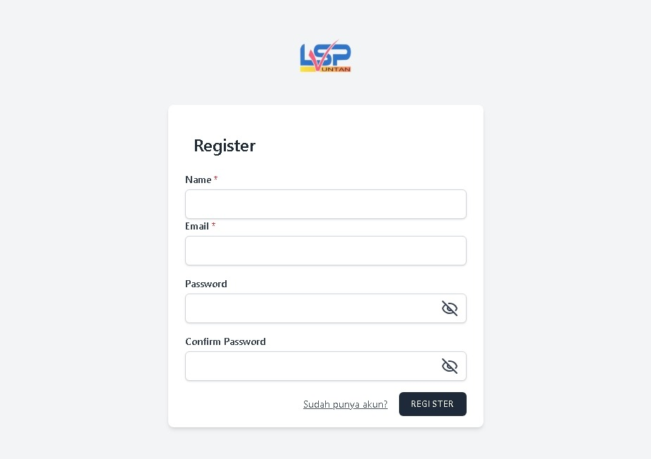

### Halaman *Login*

Halaman *Login* berfungsi sebagai gerbang autentikasi utama untuk menjamin keamanan akses data pada sistem. Antarmuka ini mencakup kolom *input* untuk *email* dan kata sandi seperti yang terlihat pada Gambar \ref{fig:hal-login}. Sistem akan mengidentifikasi *role* pengguna, baik sebagai Admin, Asesor, maupun Asesi dan mengarahkan pengguna ke *dashboard* yang sesuai dengan hak aksesnya masing-masing.

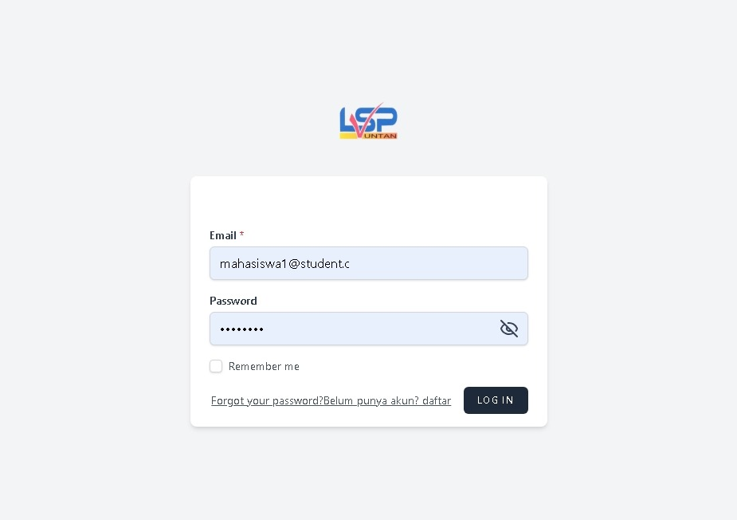

### Halaman *Dashboard* Asesi

Halaman *Dashboard* Asesi adalah tampilan utama yang pertama kali diakses oleh Asesi setelah proses *login* berhasil. Halaman ini (Gambar \ref{fig:hal-dash-asesi}) menampilkan adanya panel ringkasan yang memuat status pendaftaran sertifikasi terbaru, pengumuman terbaru dari sertifikasi yang diikuti. Halaman ini dirancang untuk memberikan *user experience* yang memudahkan Asesi memantau perkembangan proses sertifikasi mereka tanpa harus membuka banyak menu.

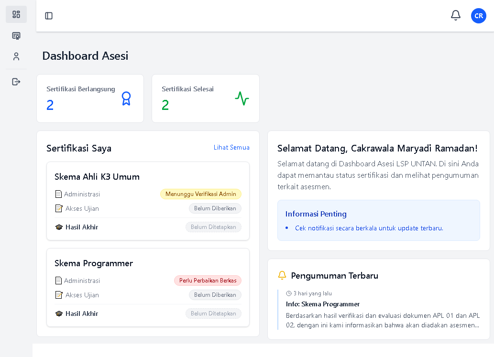

### Halaman Daftar Sertifikasi Asesi

Halaman Daftar Sertifikasi Asesi berfungsi sebagai katalog utama yang menampilkan daftar jadwal sertifikasi yang sedang aktif dan dibuka oleh LSP UNTAN. Pada tab "Tersedia" (Gambar \ref{fig:hal-katalog-sertif-asesi-1}), tiap jadwal ditampilkan menggunakan komponen *card* yang memuat rincian esensial seperti nama skema sertifikasi, biaya pendaftaran, serta periode pelaksanaan. Data tersebut ditarik secara dinamis melalui relasi tabel `sertifications` dan `skemas`. Sistem akan menampilkan tombol "Daftar" bagi asesi yang belum berpartisipasi, dan secara otomatis mengubahnya menjadi tombol "Lihat Status" apabila basis data mendeteksi bahwa asesi telah terdaftar pada event tersebut. Mekanisme validasi visual ini sangat efektif untuk mencegah terjadinya duplikasi pendaftaran (double entry) oleh pengguna yang sama.

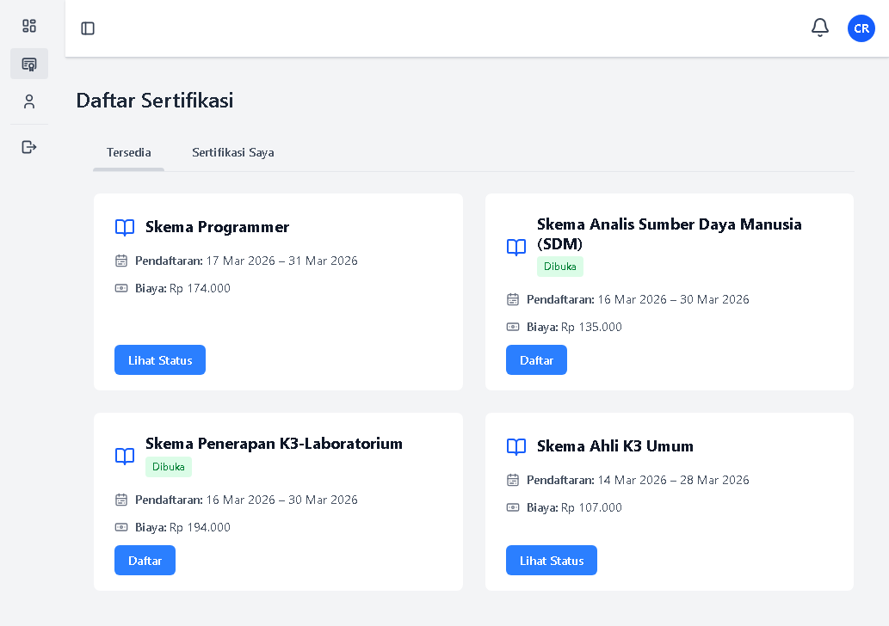

Di sebelah tab "Tersedia", juga ada tab "Sertifikasi Saya" (Gambar \ref{fig:hal-katalog-sertif-asesi-2}). Berpindah antar tab tidak akan memuat ulang halaman karena hanya mengubah DOM, berbeda dengan tampilan pada tab "Tersedia" yang menggunakan *card*, riwayat partisipasi asesi pada tab ini disajikan dalam bentuk tabel. Representasi tabular ini dirancang secara khusus untuk memudahkan asesi dalam melacak rekam jejak seluruh sertifikasi yang pernah diselesaikan pada masa lampau, sekaligus memantau perkembangan status sertifikasi yang sedang berjalan.

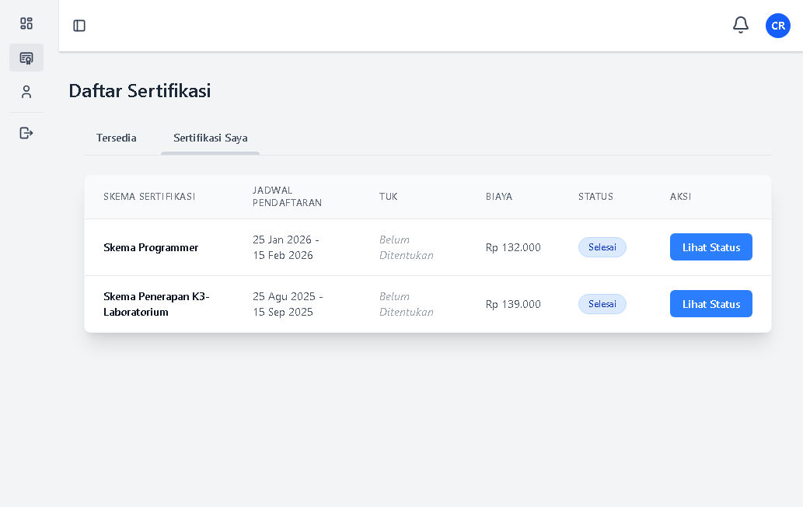

### Halaman *Apply* Sertifikasi

Halaman *Apply* Sertifikasi merupakan modul pendaftaran krusial di mana asesi melakukan pendaftaran resmi pada skema sertifikasi yang dipilih. Mengingat banyaknya parameter data yang diwajibkan oleh standar BNSP, formulir ini dirancang secara terstruktur dan komprehensif. Pada bagian pertama (Gambar \ref{fig:hal-apply-sertif-1}), sistem mengumpulkan identitas personal asesi (seperti nama, nomor KTP, tempat dan tanggal lahir) dan profil pekerjaan asesi saat ini.

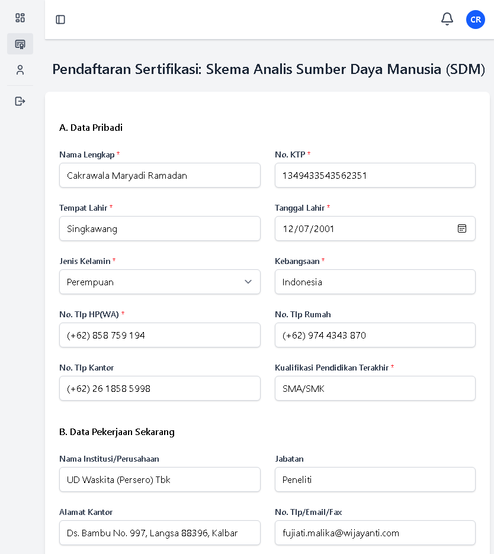

Pada bagian tengah formulir (Gambar \ref{fig:hal-apply-sertif-2}), Asesi diwajibkan mengisi tujuan sertifikasi, mata kuliah terkait beserta nilainya, pengunggahan bukti pembayaran, APL-01, APL-02, dan foto KTP.

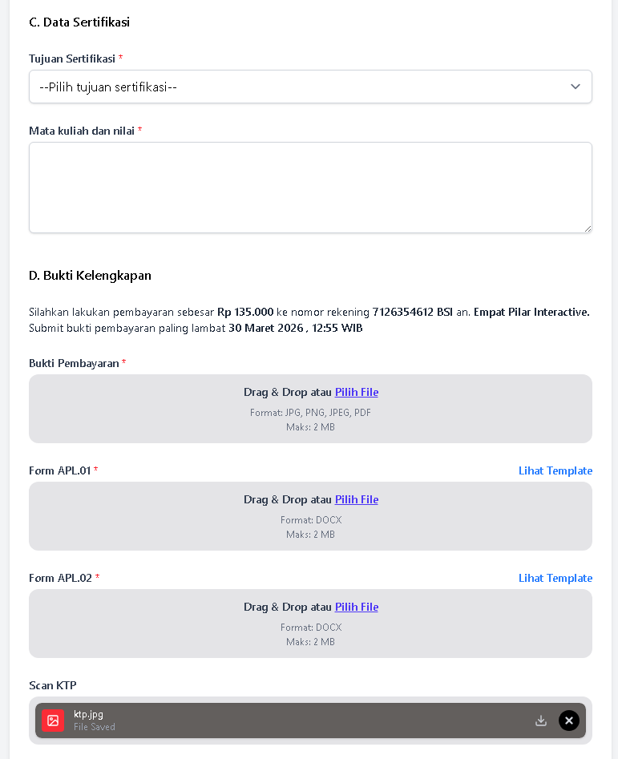

Pada bagian akhir formulir (Gambar \ref{fig:hal-apply-sertif-3}), Asesi melengkapi dokumen seperti pas foto, Kartu Tanda Mahasiswa (KTM), transkrip nilai, hingga sertifikat pelatihan dan surat magang (opsional). Seluruh *input* pengunggahan pada formulir ini telah dilengkapi dengan *client-side validation* yang membatasi format ekstensi dokumen dan ukuran maksimal berkas yang diizinkan. Rangkaian proses ini diakhiri dengan penekanan tombol "Daftar", yang akan memicu pengiriman seluruh paket data ke basis data untuk selanjutnya diverifikasi oleh Admin.

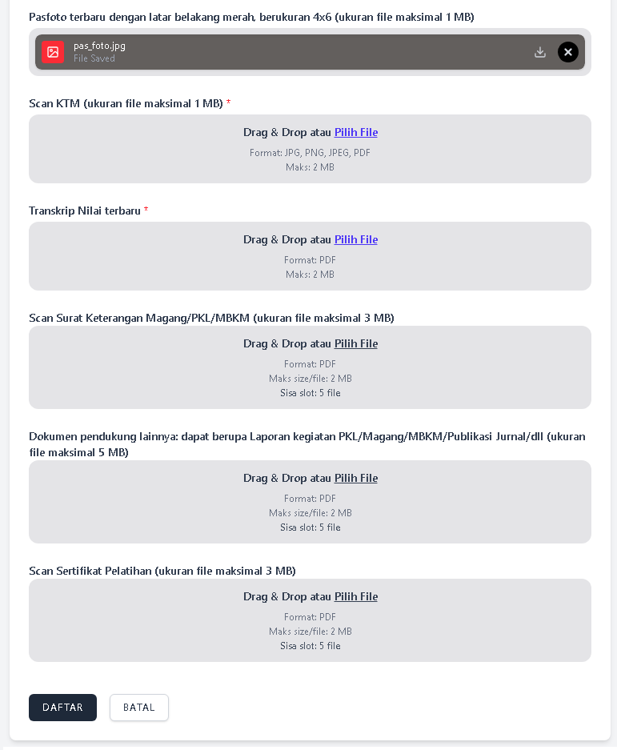

### Halaman Pengumuman Asesi

Halaman Pengumuman berfungsi sebagai pusat informasi bagi asesi untuk memantau instruksi atau pemberitahuan terbaru dari pihak Admin maupun Asesor. Pada antarmuka utama (Gambar \ref{fig:hal-news-asesi-1}), sistem menyajikan daftar pengumuman secara kronologis.

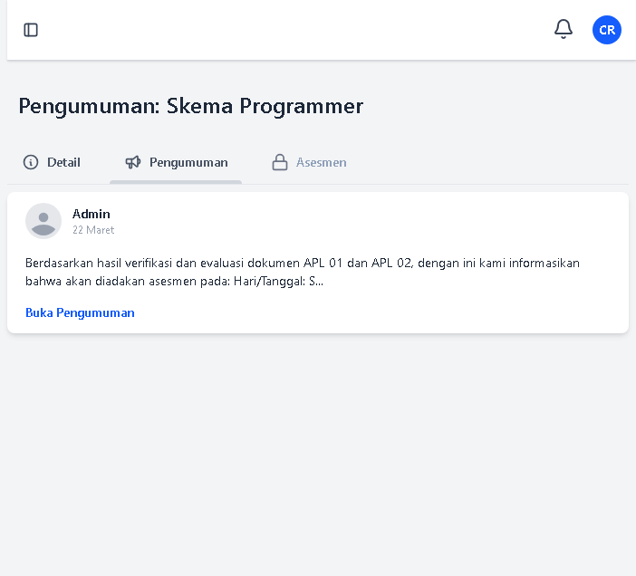

Ketika asesi menekan tombol 'Buka Pengumuman', sistem tidak memuat ulang halaman, karena hanya mengubah DOM dari daftar utama ke tampilan rincian pengumuman (Gambar \ref{fig:hal-news-asesi-2}). Pada tampilan rincian ini, asesi dapat membaca keseluruhan isi pengumuman serta mengunduh dokumen lampiran (jika ada). Penggunaan transisi berbasis state ini memastikan pengalaman pengguna yang sangat responsif dan mulus, termasuk saat asesi menekan tombol 'Kembali' untuk kembali ke daftar pengumuman.

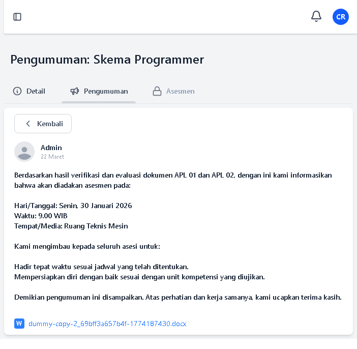

### Halaman Asesmen Asesi

Halaman Asesmen dirancang sebagai ruang kerja untuk mendukung proses uji kompetensi secara digital. Antarmuka ini hanya dapat diakses apabila Admin telah memberikan hak akses secara eksplisit kepada asesi. Hal ini bertujuan untuk memastikan alur kerja asesmen berjalan ketat sesuai dengan regulasi operasional LSP.

Pada kondisi awal saat asesi membuka halaman ini (Gambar \ref{fig:hal-asesmen-asesi-1}), sistem akan menyajikan rincian instruksi kerja dari Asesor, informasi tenggat waktu (jika ada), serta komponen pengunggahan berkas. Guna menyeragamkan format pengumpulan tugas teknis, input berkas ini hanya menerima dokumen berekstensi ZIP atau RAR.

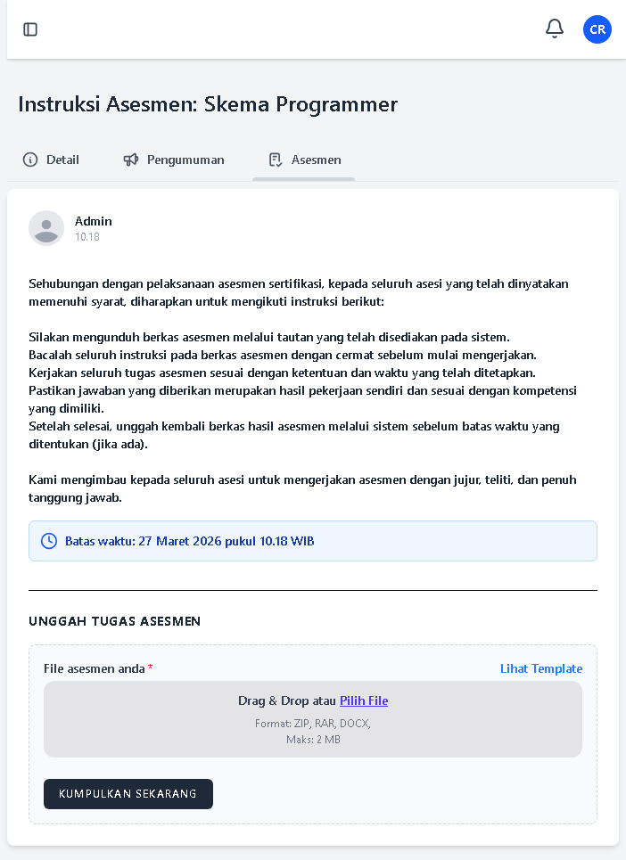

Setelah asesi berhasil melakukan submisi dokumen, antarmuka akan langsung memberikan umpan balik visual (Gambar \ref{fig:hal-asesmen-asesi-2}). Form pengunggahan akan disembunyikan dan digantikan dengan keterangan status penyerahan tugas, tombol pratinjau atau unduh berkas yang telah dikirim, serta tombol edit.

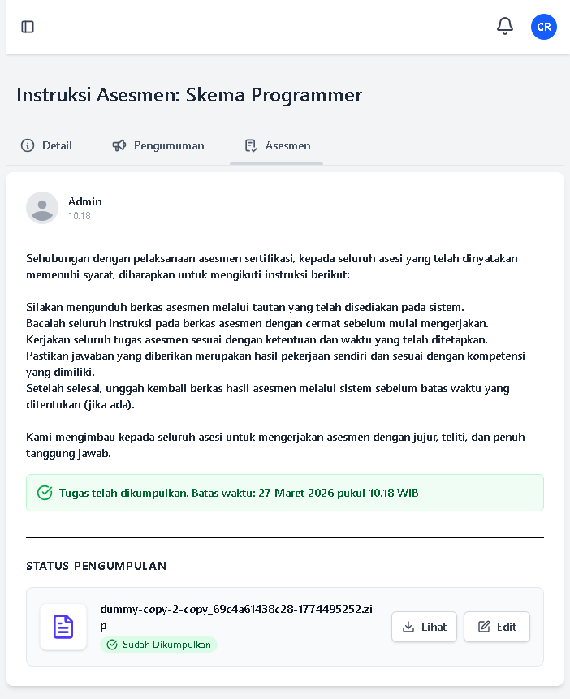

Apabila asesi perlu memperbaiki hasil pekerjaannya, penekanan tombol Edit akan memunculkan kembali formulir pembaruan dokumen (Gambar \ref{fig:hal-asesmen-asesi-3}), memungkinkan asesi untuk menimpa berkas lama dengan berkas yang baru.

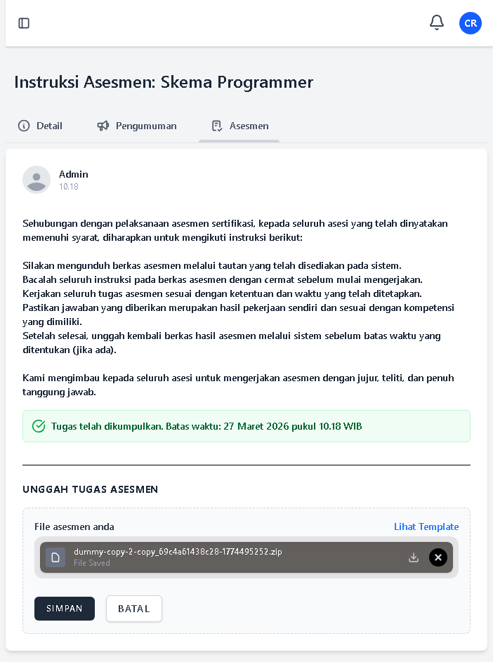

Sebagai bentuk ketegasan sistem terhadap kedisiplinan jadwal, modul ini juga punya logika pembatasan berbasis waktu. Apabila Asesor menetapkan batas waktu pengumpulan dan waktu server saat ini telah melewati batas waktu tersebut sementara asesi belum mengumpulkan tugas, sistem akan memblokir aksi submisi secara otomatis. Antarmuka (Gambar \ref{fig:hal-asesmen-asesi-4}) akan menampilkan peringatan "Batas Waktu Pengumpulan Telah Berakhir" dan komponen *file input* akan dinonaktifkan, sehingga mencegah asesi melakukan pengunggahan di luar jadwal yang disepakati.

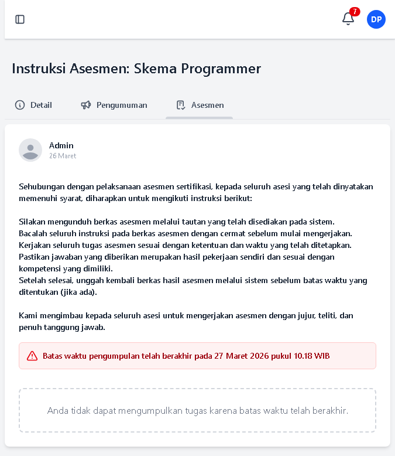

### Halaman Profil Asesi

Halaman Profil Asesi memungkinkan asesi mengelola data pribadi dan preferensi akun secara mandiri. Pada antarmuka utama (Gambar \ref{fig:hal-profil-asesi-1}), sistem menampilkan informasi yang bersifat persisten, seperti nama lengkap, nomor KTP, tempat dan tanggal lahir, serta dokumen identitas pokok (KTP dan pas foto). Modul ini mengimplementasikan prinsip *Single Source of Truth* yang terintegrasi langsung dengan alur pendaftaran. Dengan demikian, apabila asesi mendaftar pada skema sertifikasi lain di masa mendatang, sistem akan secara otomatis melakukan *auto-fill* data ini guna menghindari pengisian ulang secara manual.

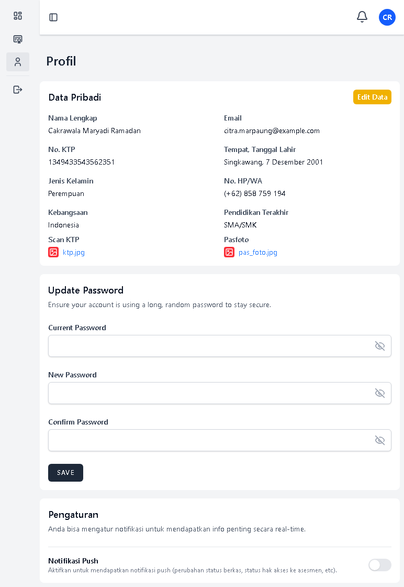

Apabila terdapat perubahan data diri, asesi dapat mengakses formulir pembaruan profil (Gambar \ref{fig:hal-profil-asesi-2}) melalui tombol edit. Tepat di bawah segmen profil, halaman ini juga mengakomodasi fitur keamanan bawaan dari ekosistem Laravel Breeze untuk pembaruan kata sandi, yang menerapkan validasi ketat dengan mewajibkan konfirmasi sandi lama dan sandi baru.

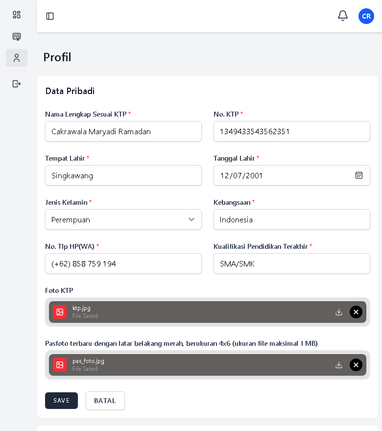

### Halaman *Dashboard* Admin 

Gambar \ref{fig:hal-dash-admin} menampilkan antarmuka bagian atas dari halaman *Dashboard* Admin yang berfungsi sebagai pusat informasi utama bagi Admin. Pada bagian ini, sistem menyajikan kartu metrik yang memuat akumulasi data seperti jumlah sertifikasi yang sedang berlangsung, sertifikasi selesai, total asesi terdaftar, dan jumlah lulusan. Selain itu, terdapat fitur pipeline status sertifikasi yang memudahkan Admin memantau antrean asesi yang mencakup jumlah asesi yang menunggu verifikasi admin, asesi dalam tahap perbaikan berkas, status akses asesmen, hingga asesi yang menunggu keputusan akhir (kompeten/belum kompeten). Untuk mendukung analisis visual, halaman ini juga dilengkapi dengan *line chart* tren pendaftaran selama 12 bulan terakhir serta *pie chart* rasio kelulusan asesi.

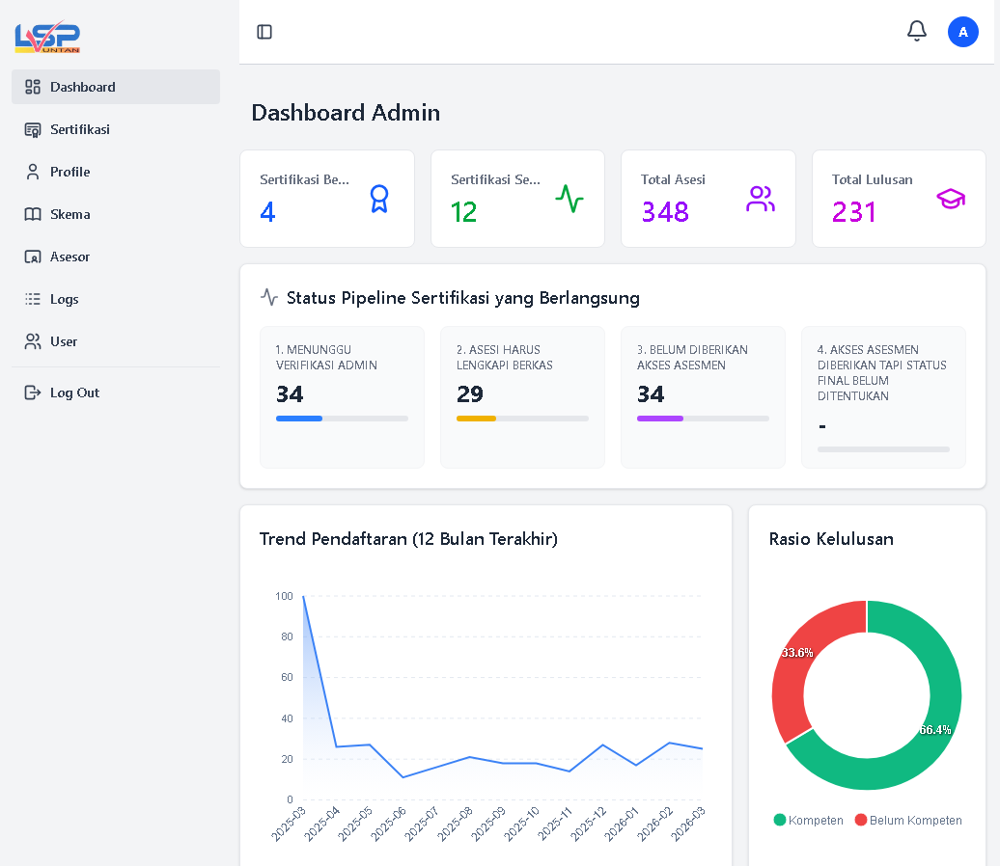

Sementara itu, Gambar \ref{fig:hal-dash-admin-2} menampilkan bagian bawah dari halaman *Dashboard* Admin yang difokuskan pada navigasi cepat dan auditabilitas sistem. Halaman ini memuat daftar lima sertifikasi dengan jumlah asesi terbanyak guna mengidentifikasi skema yang paling diminati. Di bawahnya, tersedia *shortcut* menuju detail jadwal sertifikasi yang sedang aktif, memungkinkan Admin untuk langsung mengelola data asesi tanpa harus menelusuri menu utama. Sebagai bentuk transparansi dan keamanan aplikasi, *Dashboard* ini juga mengintegrasikan fitur log aktivitas terbaru. Fitur ini menampilkan lima log aktivitas data terakhir di dalam sistem, mencakup informasi tindakan yang dilakukan beserta *user* yang mengeksekusinya. Adapun rincian seluruh riwayat aktivitas sistem secara komprehensif dapat diakses melalui menu Logs tersendiri.

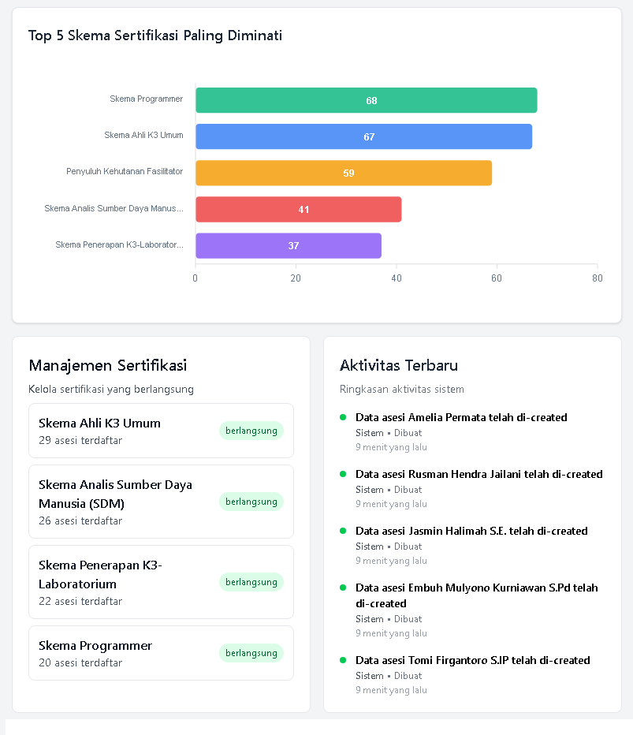

###  Halaman Skema Admin

Halaman Skema digunakan oleh Admin untuk mengonfigurasi data master skema sertifikasi. Halaman ini merupakan pondasi utama sistem, karena data skema akan menjadi rujukan referensi bagi seluruh tahapan pendaftaran hingga penerbitan sertifikat. Pada Gambar \ref{fig:hal-skema-1}, halaman ini menampilkan tabel daftar skema yang menginformasikan nama skema beserta tombol akses untuk mengunduh format dokumen persyaratan, yakni APL 1, APL 2, dan format berkas asesmen (berupa zip/rar).

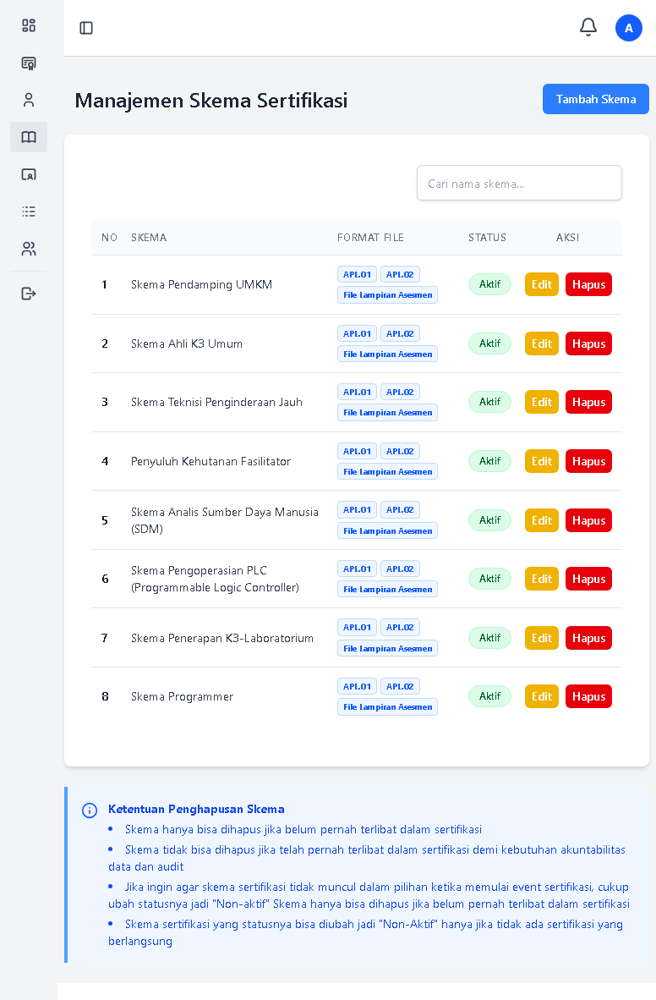

Modul ini telah dilengkapi dengan fungsionalitas CRUD (*Create, Read, Update, Delete*). Untuk penambahan dan pembaruan data (Gambar \ref{fig:hal-skema-2} dan Gambar \ref{fig:hal-skema-3}), sistem menyediakan formulir di mana Admin mengisi nama skema, mengunggah ketiga format berkas kelengkapan, serta mengatur status ketersediaan skema melalui fitur *checkbox* (Aktif/Tidak Aktif). Pengaturan status ini berfungsi sebagai kendali internal bagi Admin, hanya skema dengan status Aktif yang akan muncul sebagai pilihan saat Admin melakukan konfigurasi pembukaan jadwal sertifikasi baru.

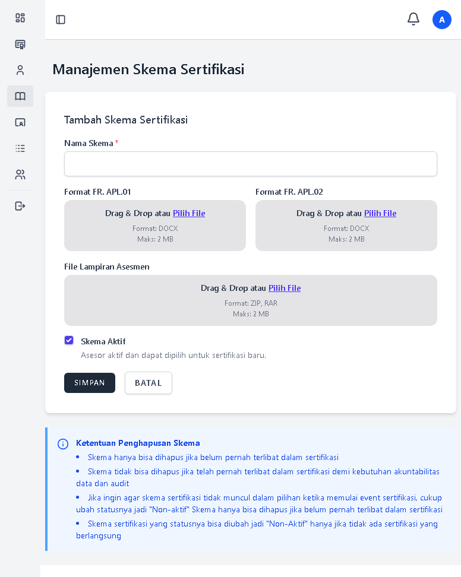

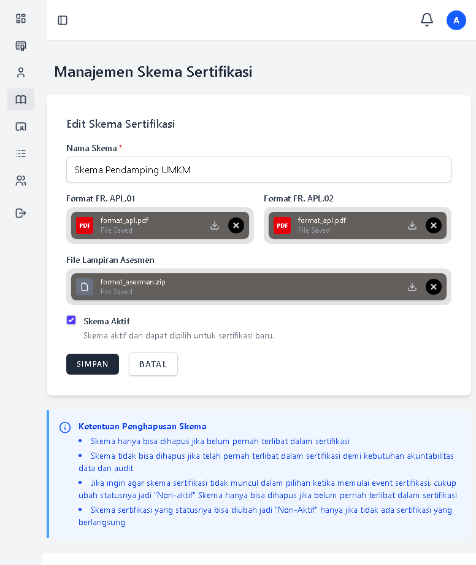

Sebagai langkah mitigasi kesalahan pengguna (*human error*), fitur penghapusan data skema dilengkapi dengan modal konfirmasi (Gambar \ref{fig:hal-skema-4}). Sistem akan meminta konfirmasi ulang sebelum data skema benar-benar dihapus dari basis data.

###  Halaman Asesor

Halaman Asesor digunakan oleh Admin untuk mengelola profil dan memetakan skema kompetensi data asesor. Pada Gambar \ref{fig:hal-asesor-1}, halaman ini menampilkan tabel daftar asesor yang menginformasikan nama asesor, daftar skema sertifikasi yang diampu, status keaktifan dan rekam jejak jumlah sertifikasi yang telah dilaksanakan oleh asesor bersangkutan.

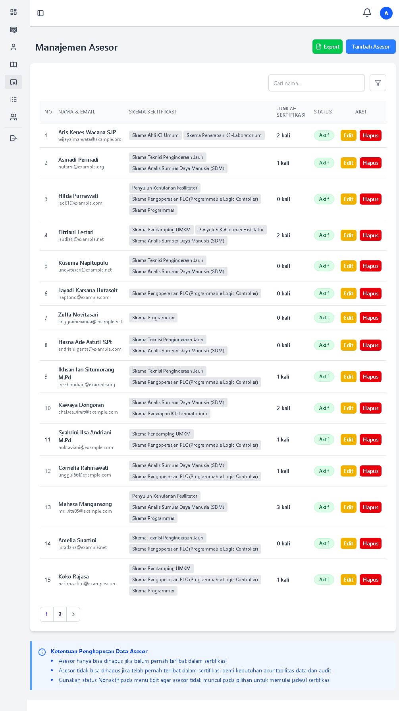

Modul ini telah dilengkapi dengan fungsionalitas CRUD. Untuk penambahan dan pembaruan data (Gambar \ref{fig:hal-asesor-2} dan Gambar \ref{fig:hal-asesor-3}), sistem menyediakan formulir di mana Admin mengisi nama asesor, skema-skemanya, serta mengatur status ketersediaan asesor melalui fitur *checkbox* (Aktif/Tidak Aktif). Pengaturan status ini berfungsi sebagai kendali internal bagi Admin, hanya asesor dengan status Aktif yang akan muncul sebagai pilihan saat Admin melakukan konfigurasi pembukaan jadwal sertifikasi baru.

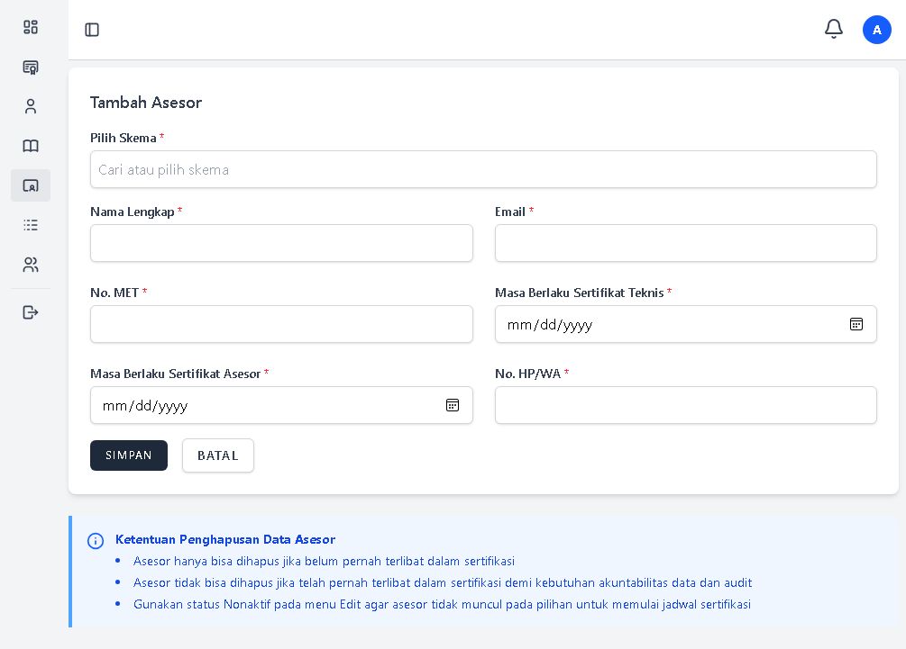

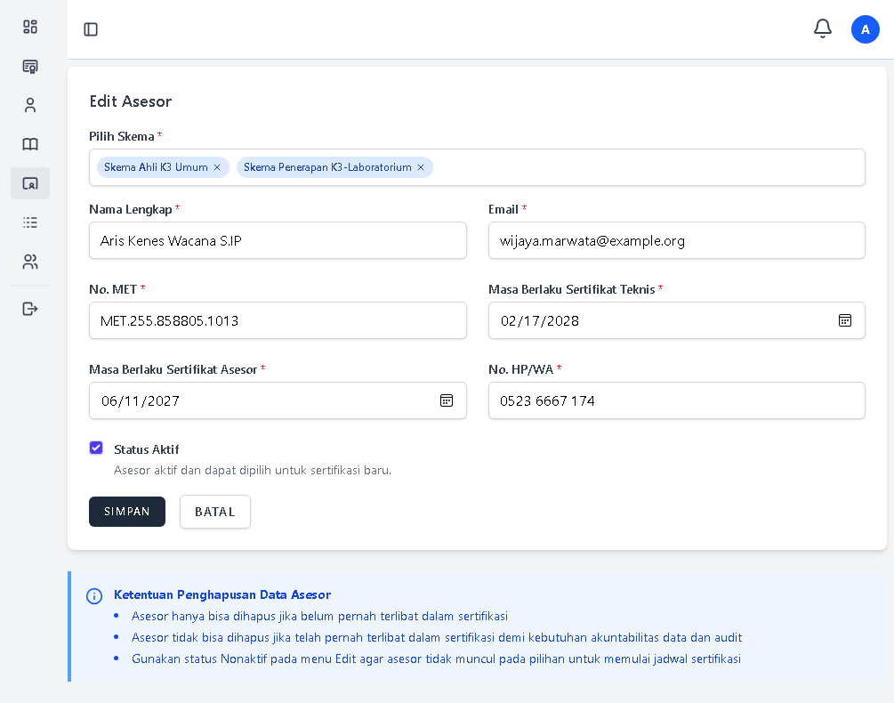

Sebagai langkah mitigasi kesalahan pengguna, fitur penghapusan data asesor dilengkapi dengan modal konfirmasi (Gambar \ref{fig:hal-asesor-4}). Sistem akan meminta konfirmasi ulang sebelum data asesor benar-benar dihapus dari basis data.

###  Halaman Kelola Sertifikasi

Halaman Kelola Sertifikasi merupakan modul yang digunakan oleh Admin untuk mengaktifkan dan mengawasi periode pendaftaran sertifikasi. Antarmuka pada modul ini memiliki tiga tab yaitu "Mulai Sertifikasi", "Sertifikasi Berlangsung", dan "Riwayat Sertifikasi". Navigasi antar tab dapat dilakukan secara instan karena sistem hanya melakukan perubahan DOM, tanpa memerlukan pemuatan ulang halaman maupun perubahan rute URL.

Pada tab untuk memulai sertifikasi baru (Gambar \ref{fig:hal-manage-sertif-1}), sistem menyediakan formulir yang dilengkapi dengan fitur dropdown dinamis, di mana daftar pilihan Asesor akan difilter secara otomatis menyesuaikan dengan Skema Sertifikasi yang dipilih oleh Admin. Selanjutnya, Admin menentukan parameter pelaksanaan seperti rentang tanggal pendaftaran, tanggal asesmen, dan tempat uji kompetensi. Pada formulir ini juga diatur rincian biaya, nama bank, nomor rekening, dan nama pemilik rekening, yang nantinya akan menjadi instruksi pembayaran resmi pada antarmuka *apply* sertifikasi di sisi Asesi.

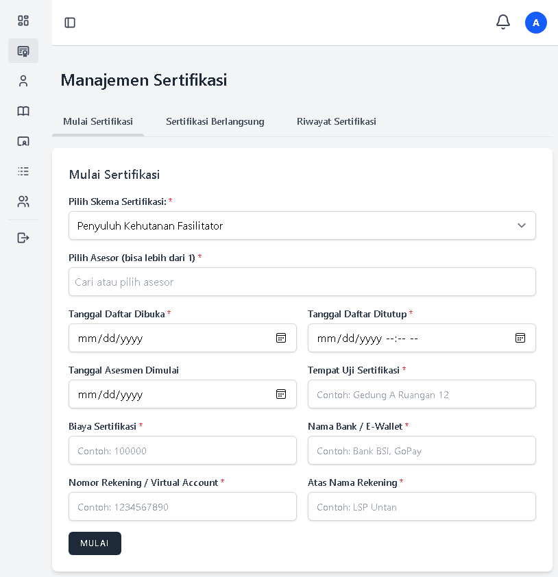

Untuk keperluan pemantauan, sistem menyediakan tab "Sertifikasi Berlangsung" (Gambar \ref{fig:hal-manage-sertif-2}) dan "Riwayat Sertifikasi" (Gambar \ref{fig:hal-manage-sertif-3}). Tabel data pada kedua tab ini menyajikan informasi komprehensif, mulai dari nama skema, daftar asesor bertugas, jadwal, TUK, biaya, status, hingga akumulasi jumlah asesi.

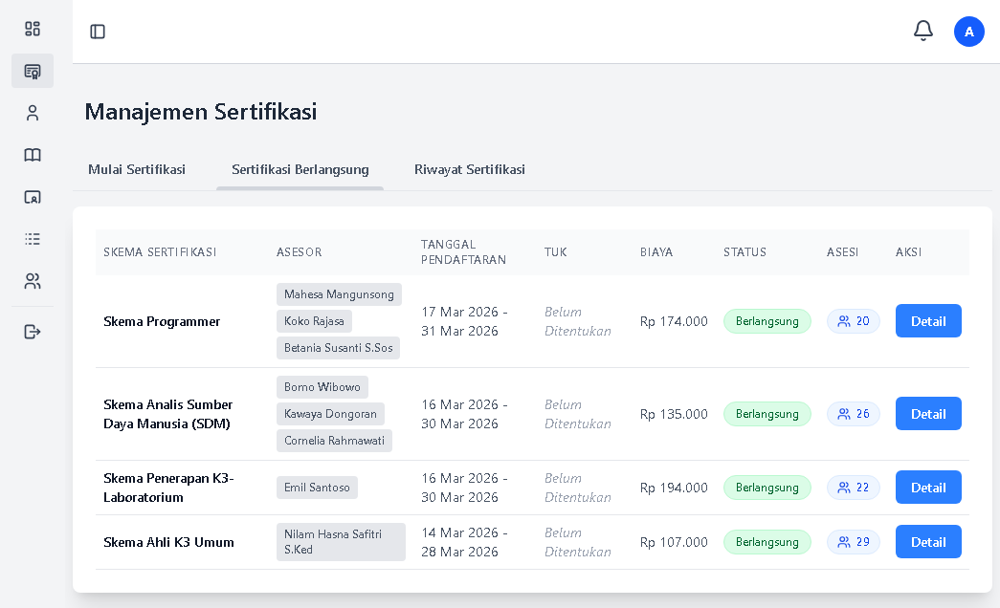

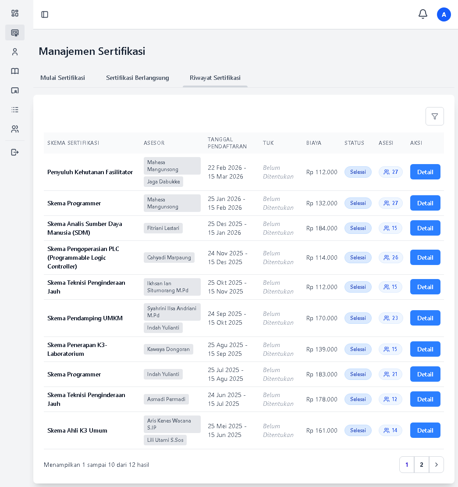

Apabila Admin menekan tombol "Detail" pada baris data, sistem akan menampilkan antarmuka Detail Sertifikasi (Gambar \ref{fig:hal-manage-sertif-4}). Halaman detail ini merangkum seluruh informasi jadwal sertifikasi beserta tombol edit dan tombol export ke CSV untuk memfasilitasi kebutuhan pelaporan dan rekapitulasi data asesi di luar sistem.

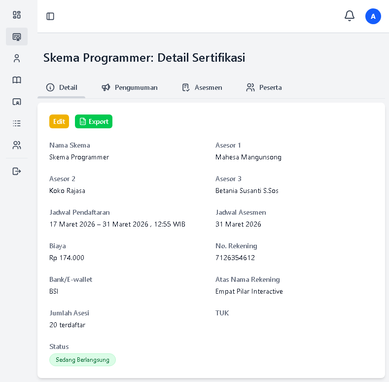

Untuk melakukan modifikasi jadwal, Admin diarahkan pada formulir pembaruan (Gambar \ref{fig:hal-manage-sertif-5}). Formulir ini memiliki struktur yang identik dengan formulir pembuatan awal, namun ditambahkan opsi *radio button* untuk mengelola status kegiatan secara eksplisit (Berlangsung, Selesai, atau Dibatalkan). Guna menjaga integritas basis data dan menghindari hilangnya riwayat pendaftaran asesi, sistem secara arsitektural tidak menyediakan fitur penghapusan data permanen pada jadwal sertifikasi ini, melainkan hanya mengizinkan modifikasi status menjadi Dibatalkan.

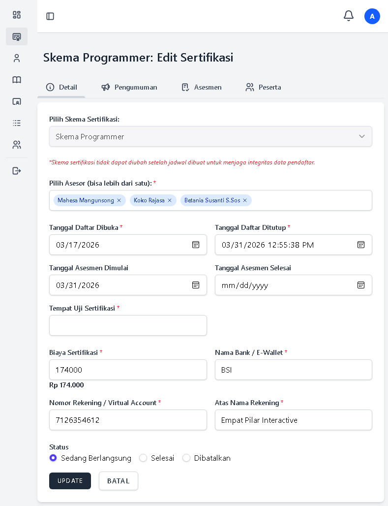

###  Halaman Kelola Pengumuman

Halaman Kelola Pengumuman (Gambar \ref{fig:hal-manage-news-1}) difungsikan sebagai media komunikasi antara Admin/Asesor dengan para asesi. informasi pada modul ini bersifat terikat langsung pada satu jadwal sertifikasi spesifik, jadi bukan pengumuman untuk semua pengguna.

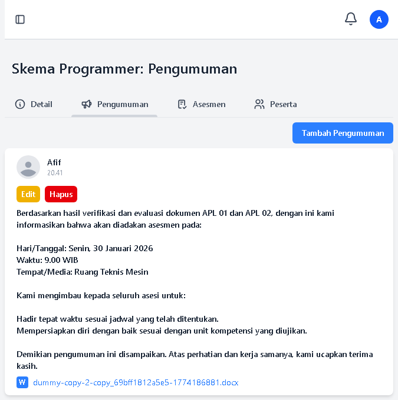

Modul ini telah dilengkapi dengan fungsionalitas CRUD (*Create, Read, Update, Delete*). Untuk penambahan dan pembaruan data (Gambar \ref{fig:hal-manage-news-2} dan Gambar \ref{fig:hal-manage-news-3}), sistem menyediakan formulir di mana Admin mengisi konten pengumuman, mengunggah berkas lampiran. Keunggulan utama pada fungsionalitas ini adalah tersedianya *Push Notification*. Dengan mencentang opsi persetujuan pengiriman notifikasi, sistem akan mendistribusikan pemberitahuan secara *real-time* kepada seluruh perangkat asesi yang terdaftar pada sertifikasi tersebut, asalkan asesi telah memberikan izin akses penerimaan notifikasi pada *browser* mereka.

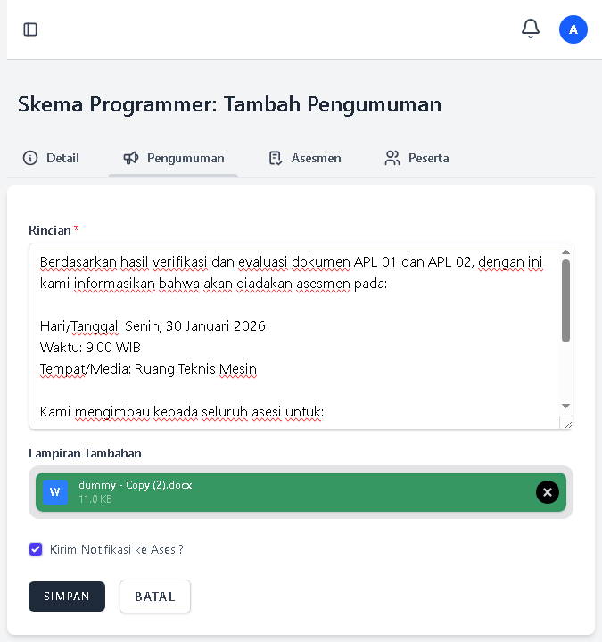

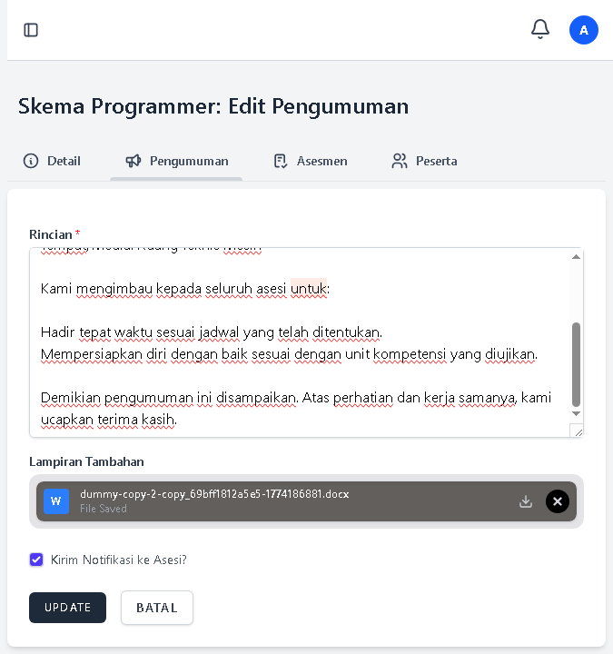

Sebagai langkah mitigasi kesalahan pengguna, fitur penghapusan data pengumuman dilengkapi dengan modal konfirmasi (Gambar \ref{fig:hal-manage-news-4}). Sistem akan meminta konfirmasi ulang sebelum data pengumuman benar-benar dihapus dari basis data.

###  Halaman Kelola Asesmen

Halaman Kelola Asesmen difungsikan bagi Asesor untuk mendistribusikan instruksi asesmen kepada para asesi. Pada kondisi awal di mana instruksi belum dibuat, sistem menampilkan antarmuka *empty state* (Gambar \ref{fig:hal-manage-asesmen-1}) yang menginformasikan bahwa Asesor belum memberikan penugasan, dilengkapi dengan tombol "Buat Asesmen" untuk membuat instruksi asesmen baru.

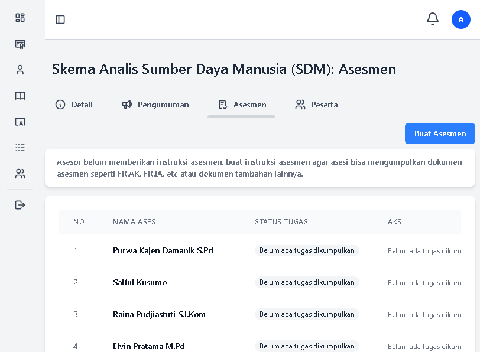

Ketika tombol pembuatan asesmen ditekan, sistem menampilkan formulir buat asesmen (Gambar \ref{fig:hal-manage-asesmen-2}). Asesor dapat menyusun rincian tugas melalui elemen textarea, menetapkan batas akhir pengumpulan (opsional), serta melampirkan berkas pendukung (opsional). Seperti halnya pada fitur buat/edit pengumuman, juga ada *checkbox* yang jika diceklis maka akan mengirim *push notification* ke asesi, sehingga Asesor punya kendali penuh untuk mengirimkan notifikasi tanpa memicu spam pada perangkat asesi, terutama jika terjadi pengubahan instruksi secara berulang.

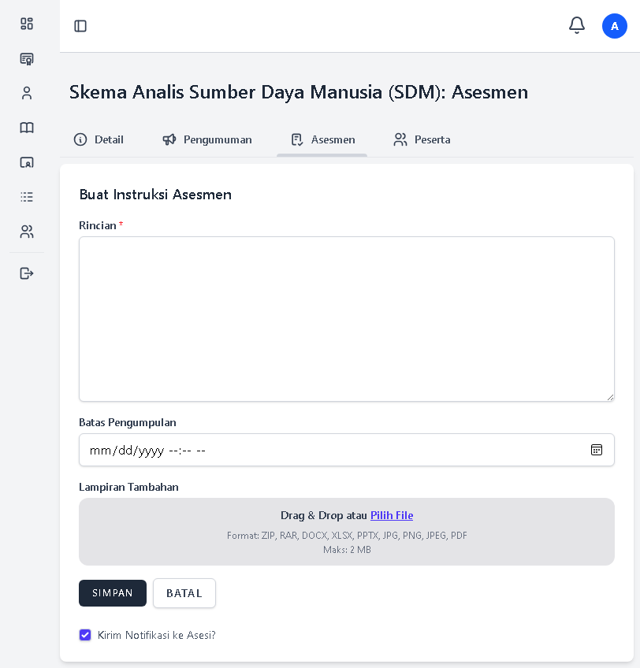

Setelah asesmen berhasil dibuat, antarmuka akan berubah menampilkan instruksi asesmen (Gambar \ref{fig:hal-manage-asesmen-4}) serta tombol "Edit" untuk memperbarui instruksi.

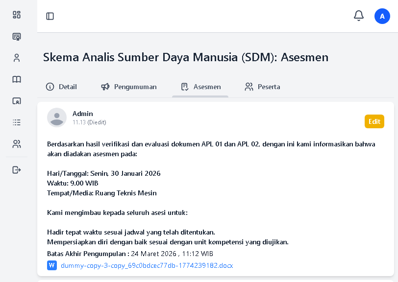

Setelah tombol "Edit" ditekan, akan muncul formulir edit instruksi (Gambar \ref{fig:hal-manage-asesmen-3}). Selain pembaruan data, antarmuka ini juga menyediakan opsi penghapusan asesmen yang dilengkapi dengan pengamanan modal konfirmasi (Gambar \ref{fig:hal-manage-asesmen-5}). Operasi penghapusan ini tidak akan menghapus berkas yang Asesi kumpulkan.

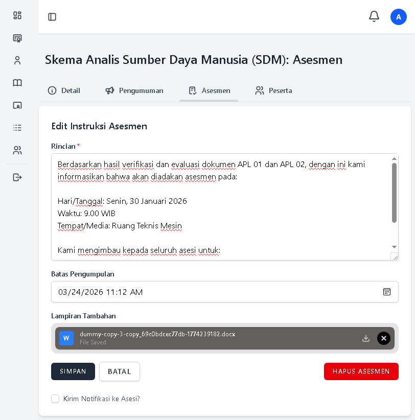

Guna mendukung proses evaluasi, sistem menampilkan daftar asesi (Gambar \ref{fig:hal-manage-asesmen-6}) yang diletakkan instruksi asesmen. Tabel ini menampilkan status pengumpulan berkas tiap asesi (belum dikumpulkan/diserahkan).

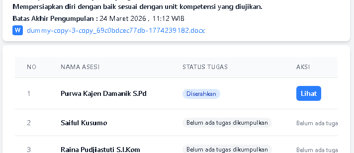

Asesor dapat menekan tombol "Detail" pada baris data terkait. Sistem akan menampilkan antarmuka rincian penyerahan (Gambar \ref{fig:hal-manage-asesmen-7}) yang menampilkan nama asesi, nama berkas yang diunggah, dan tombol "Unduh" serta tombol "Kembali" untuk memastikan Asesor saat memeriksa banyak berkas tetap berjalan efisien.

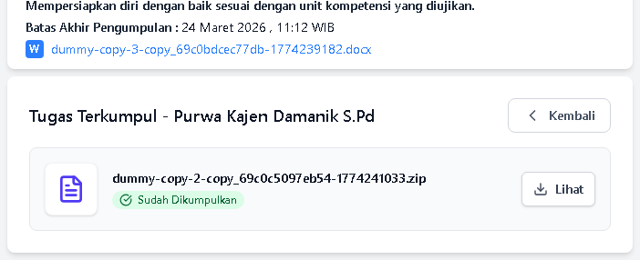

###  Halaman Kelola Asesi

Halaman Kelola Asesi difungsikan sebagai pusat kendali bagi Admin dan Asesor untuk memantau, memverifikasi, dan menetapkan status kelulusan peserta sertifikasi. Pada antarmuka utama (Gambar \ref{fig:hal-kelola-asesi-1}), sistem menyajikan tabel daftar asesi secara komprehensif. Tabel ini memuat indikator-indikator krusial perjalanan asesi, meliputi status verifikasi berkas (Lengkap, Menunggu Verifikasi atau Perlu Perbaikan), hak akses asesmen (Diberikan/Belum Diberikan), hingga status akhir sertifikasi (Kompeten, Tidak Kompeten, Belum Ditetapkan, atau Didiskualifikasi). Khusus pada kolom hak akses asesmen, sistem menerapkan logika *access control*, di mana asesi dengan status "Belum Diberikan" tidak akan dapat membuka menu asesmen.

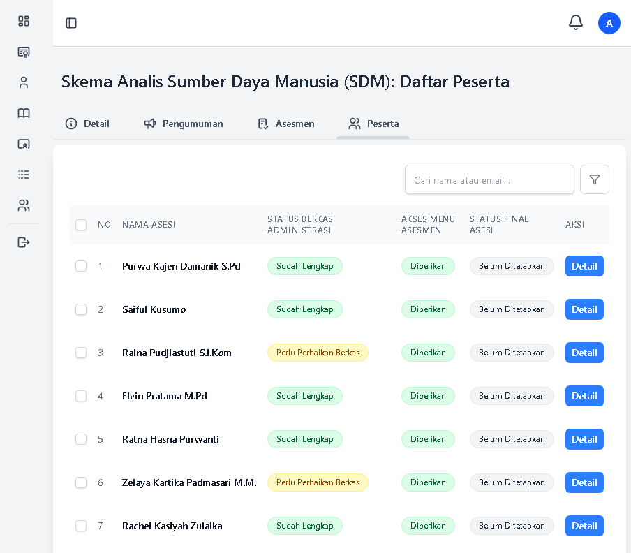

Untuk melakukan peninjauan mendalam terhadap seorang kandidat, Admin/Asesor dapat menekan tombol "Detail" yang akan membuka halaman Detail Asesi (Gambar \ref{fig:hal-kelola-asesi-2} dan Gambar \ref{fig:hal-kelola-asesi-2}). Bagian atas halaman menampilkan identitas pribadi dan riwayat pekerjaan. Sementara itu, bagian bawah halaman menampilkan tautan ke dokumen-dokumen bukti kelengkapan serta panel status untuk memperbarui status asesi.

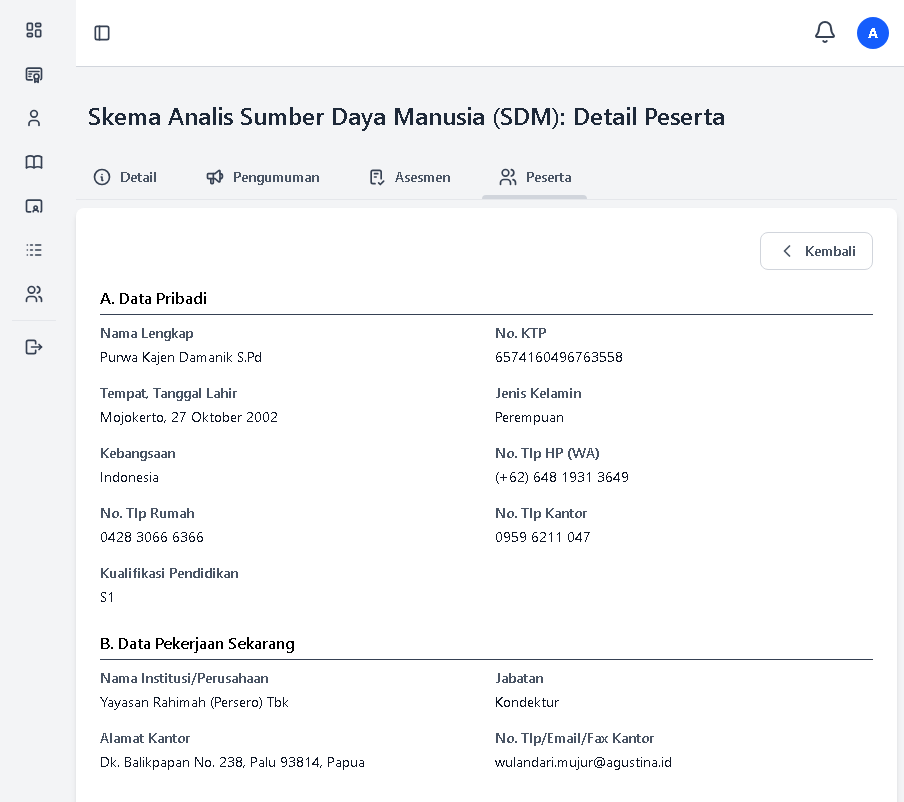

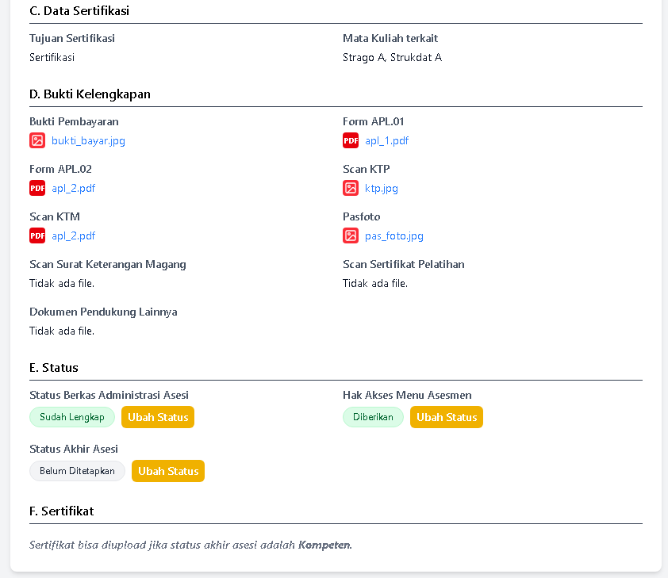

Pada bagian status di halaman detail (Gambar \ref{fig:hal-kelola-asesi-2}), terdapat tiga tombol utama yang mewakili tahapan evaluasi. Masing-masing tombol akan menampilkan modal konfirmasi. Gambar \ref{fig:hal-kelola-asesi-4} menampilkan formulir untuk memvalidasi kelengkapan berkas pendaftaran. Gambar \ref{fig:hal-kelola-asesi-5} menunjukkan formulir untuk membuka atau menutup akses ke halaman asesmen bagi asesi. Sedangkan Gambar \ref{fig:hal-kelola-asesi-6} merupakan formulir tahap finalisasi untuk menetapkan keputusan akhir (Kompeten/Tidak Kompeten) berdasarkan hasil evaluasi Asesor.

Guna meningkatkan efisiensi operasional dan mencegah repetisi navigasi saat Admin harus mengubah status puluhan asesi, sistem ini mengimplementasikan fitur pemrosesan data massal (*Bulk Action*). Seperti pada Gambar \ref{fig:hal-kelola-asesi-7}, Admin atau Asesor cukup mencentang *checkbox* pada baris data asesi di halaman daftar asesi. Saat sistem mendeteksi minimal satu asesi terpilih, antarmuka akan menampilkan rentetan tombol *bulk action* secara dinamis di bagian atas tabel.

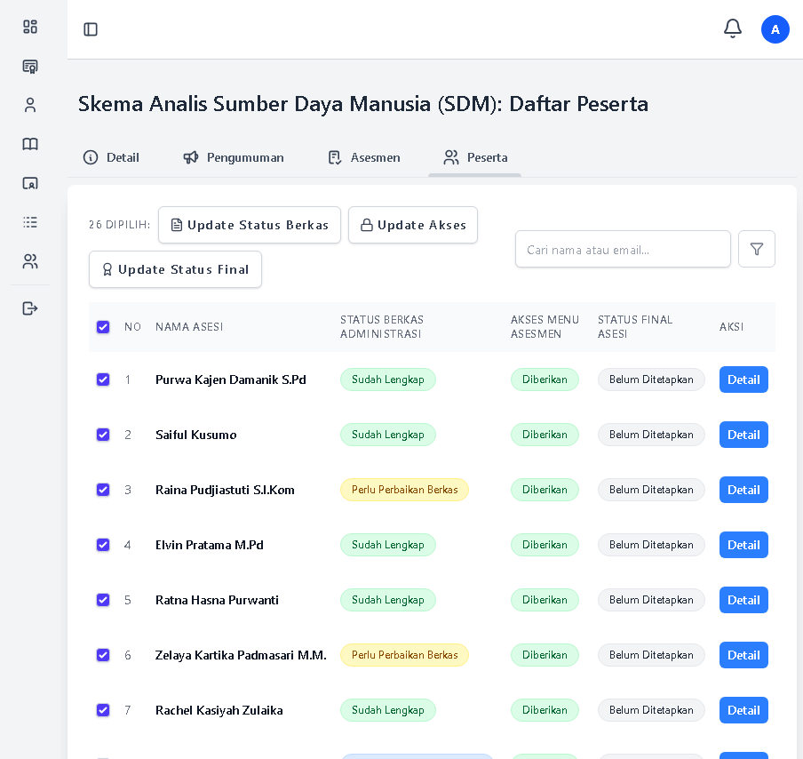

Ketika salah satu tombol aksi massal ditekan, sistem akan menampilkan modal konfirmasi (Gambar \ref{fig:hal-kelola-asesi-8}). Melalui fitur ini, Admin dapat mengubah status banyak asesi sekaligus (misalnya, memberikan hak akses asesmen secara serentak ke beberapa asesi) hanya dalam satu kali eksekusi demi memangkas waktu pengerjaan administratif.

### Unggah Sertifikat

Unggah sertifikat merupakan tahap akhir dari proses sertifikasi. Antarmuka detail asesi (Gambar \ref{fig:hal-unggah-sertif-1}) hanya akan menampilkan tombol "Upload Sertifikat" apabila status akhir asesi "Kompeten". Proteksi visual ini untuk mencegah terjadinya *human error*, seperti pemberian sertifikat kepada peserta yang belum memenuhi standar kelulusan.

Saat tombol tersebut ditekan, antarmuka akan menampilkan formulir penerbitan sertifikat (Gambar \ref{fig:hal-unggah-sertif-2}). Admin mengunggah berkas sertifikat digital serta mengisi data terkait lainnya.

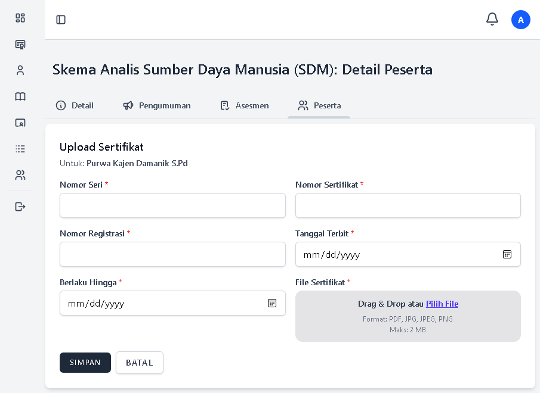

Setelah proses unggah berhasil, sistem memberikan umpan balik yang dinamis. Antarmuka yang sebelumnya berupa tombol, secara otomatis berubah menjadi komponen kartu informasi (Gambar \ref{fig:hal-unggah-sertif-3}). Komponen ini secara ringkas menampilkan nama berkas sertifikat yang terlampir, serta tombol mengunduh dan edit. Setelah tombol "Edit" ditekan, Admin dapat memperbarui data sertifikat (Gambar \ref{fig:hal-unggah-sertif-4}).

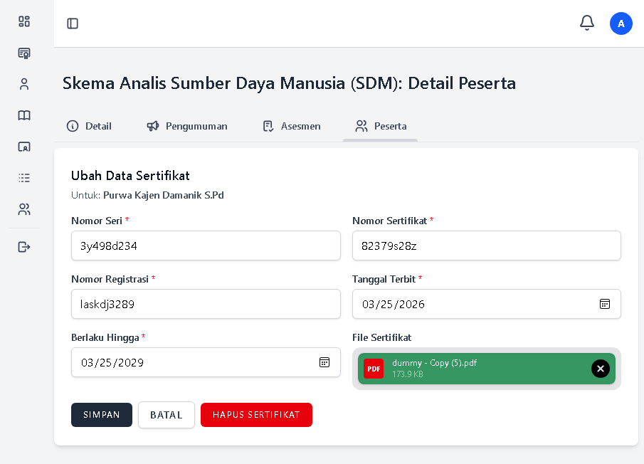

Sebagai langkah mitigasi kesalahan pengguna, fitur penghapusan data sertifikat dilengkapi dengan modal konfirmasi (Gambar \ref{fig:hal-unggah-sertif-5}), sebelum data sertifikat benar-benar dihapus dari basis data.

### Halaman Log Aktivitas Sistem

Halaman Log Aktivitas Sistem difungsikan sebagai fitur *audit trail* terpusat untuk merekam setiap mutasi data di dalam sistem. Fungsionalitas ini penting guna menjamin transparansi, akuntabilitas, serta keamanan operasional LSP. Pada antarmuka utama (Gambar \ref{fig:hal-log-sistem-1}), sistem menyajikan tabel riwayat aktivitas yang memuat kolom deskripsi tindakan, aktor yang mengeksekusi (*user*), waktu kejadian (*timestamp*), serta tombol "Detail" untuk melihat rincian lebih lanjut.

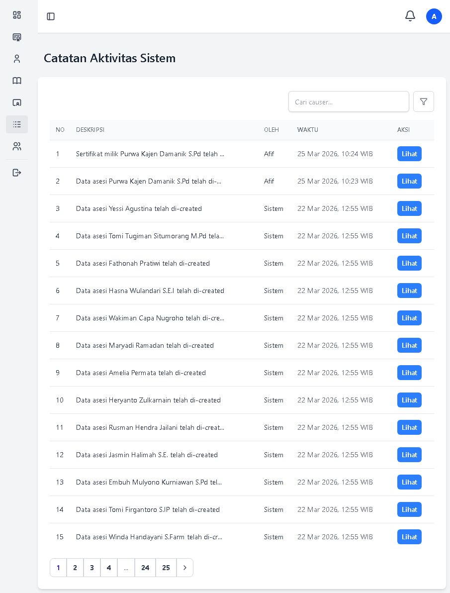

Apabila tombol "Detail" pada salah satu baris data ditekan, sistem akan menampilkan antarmuka detail log aktivitas (Gambar \ref{fig:hal-log-sistem-2}) yang memuat identitas aktor, waktu kejadian, jenis manipulasi data yang terjadi (*created*, *updated*, atau *deleted*), target datanya (tabel di basis data), dan perubahan data (*data properties*) dalam format *raw* JSON. Perekaman data ini guna melacak anomali perubahan data di kemudian hari.

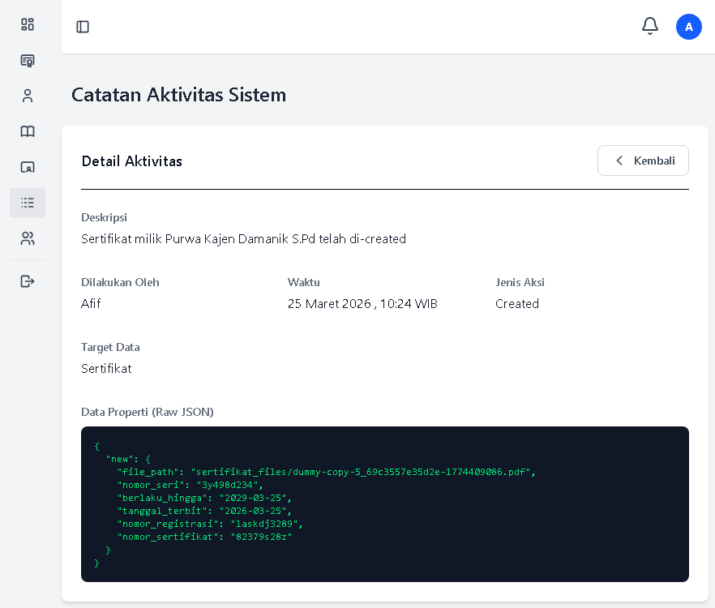

###  Halaman Daftar Pengguna

Halaman Daftar Pengguna berfungsi sebagai pusat kontrol bagi Admin untuk memantau dan mengelola seluruh akun yang terdaftar di dalam sistem. Pada antarmuka utama (Gambar \ref{fig:hal-kelola-user-1}), sistem menyajikan tabel daftar pengguna yang memuat kolom nama, *email*, *role*, tanggal registrasi akun, waktu verifikasi *email*, serta dua tombol aksi, yakni tombol "Edit" dan tombol pengendalian akses (*Ban*/*Unban*).

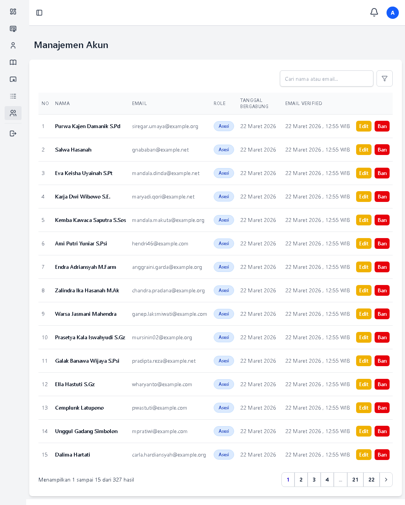

Saat tombol "Edit" ditekan, sistem menampilkan formulir modifikasi profil pengguna (Gambar \ref{fig:hal-kelola-user-2}). Admin hanya bisa mengubah nama dan nomor telepon. Namun, sistem memfasilitasi fitur elevasi hak akses secara dinamis khusus untuk pengguna dengan *role* "Asesor", di mana Admin bisa memberikan *role* tambahan (sebagai Admin) ke akun tersebut.

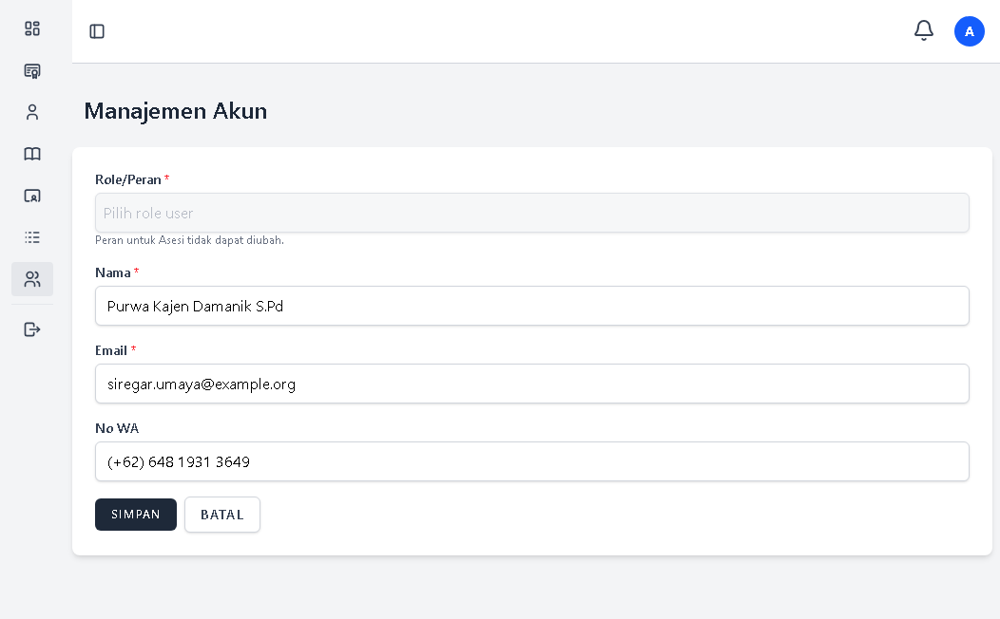

Sebagai mitigasi terhadap anomali pengguna atau pelanggaran sistem, sistem dilengkapi dengan fitur Penangguhan Akun. Ketika tombol "Ban" ditekan, sistem akan menampilkan modal konfirmasi (Gambar \ref{fig:hal-kelola-user-3}) untuk menghindari penangguhan yang tidak disengaja. Pengguna yang telah ditangguhkan tidak akan bisa *login*. Sistem memberikan umpan balik visual, tombol "Ban" berwarna merah pada akun yang ditangguhkan akan berubah menjadi tombol "Unban" berwarna hijau (Gambar \ref{fig:hal-kelola-user-4}).

Untuk memulihkan akun, Admin dapat menekan tombol "Unban" tersebut yang akan menampilkan modal konfirmasi (Gambar \ref{fig:hal-kelola-user-5}). Dan pengguna yang dipulihkan akunnya dapat kembali *login*.

### *Add to Home Screen*

Sebagai upaya untuk meningkatkan aksesibilitas dan mobilitas pengguna, aplikasi LSP ini telah dirancang dengan mengadopsi standar Progressive Web App (PWA). Salah satu implementasi utama dari arsitektur PWA pada sistem ini adalah ketersediaan fitur *Add to Home Screen* (Tambahkan ke Layar Utama). Alur pengunduhan PWA melalui fitur ini pada gawai Asesi direpresentasikan secara kronologis pada Gambar \ref{fig:pwa-flow-1} hingga Gambar \ref{fig:pwa-flow-4}.

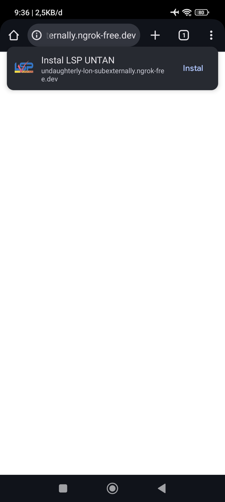

Gambar \ref{fig:pwa-flow-1} menampilkan antarmuka saat Asesi mengakses sistem melalui peramban web untuk pertama kalinya. Untuk memasang aplikasi, Asesi dapat mengakses opsi 'Add to Home Screen' melalui menu bawaan peramban seluler seperti yang ditunjukkan pada Gambar \ref{fig:pwa-flow-2}. Setelah opsi tersebut ditekan, sistem operasi perangkat akan memunculkan kotak dialog konfirmasi (Gambar \ref{fig:pwa-flow-3}) untuk memverifikasi persetujuan tindakan instalasi oleh pengguna (user consent).

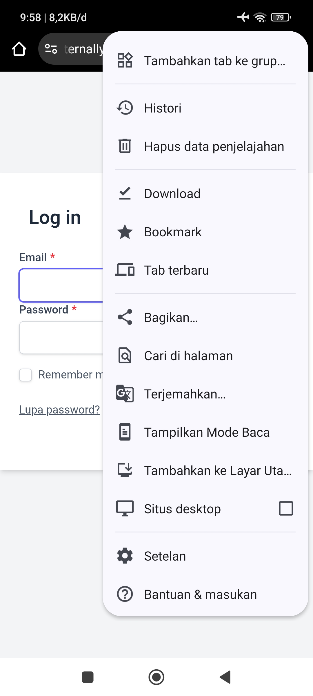
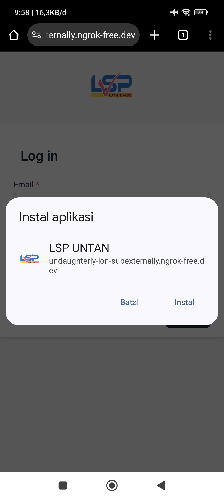

Konfirmasi pada tahap ini akan mengeksekusi proses pembuatan pintasan terintegrasi. Gambar \ref{fig:pwa-flow-4} mengilustrasikan hasil akhir dari proses tersebut, di mana ikon aplikasi 'LSP UNTAN' kini telah terpasang secara permanen pada layar utama gawai Asesi, bersanding dengan aplikasi native lainnya. Pintasan ini secara signifikan meningkatkan pengalaman pengguna (user experience) karena aplikasi dapat diakses secara instan hanya dengan satu ketukan, tanpa mengharuskan pengguna membuka peramban dan mengetikkan URL secara manual pada kunjungan berikutnya.

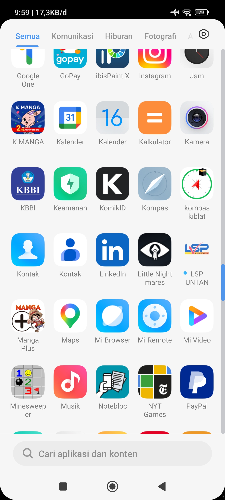

### *Push Notification*

Selain kemudahan instalasi, implementasi arsitektur PWA pada sistem ini juga mencakup kapabilitas pengiriman pesan berbasis Push Notification. Fitur ini memastikan Asesi tidak akan melewatkan informasi krusial dari LSP, karena pemberitahuan akan tetap diterima secara real time dan muncul mengambang (floating) pada layar perangkat, meskipun aplikasi sedang tidak dibuka atau berjalan di latar belakang.

Di halaman profil, integrasi pengaturan *Push Notification* yang direpresentasikan melalui komponen *toggle switch*. Fitur ini memberikan kuasa penuh kepada asesi terkait preferensi penerimaan informasi. Saat *toggle* ditekan untuk mengaktifkan notifikasi, sistem akan memunculkan modal konfirmasi (Gambar \ref{fig:hal-profil-asesi-3}).

Apabila izin diberikan, sistem akan melakukan permintaan ke Firebase Cloud Messaging (FCM) untuk membuat token unik perangkat. Setelah token berhasil disimpan di basis data, antarmuka akan memberikan umpan balik (Gambar \ref{fig:hal-profil-asesi-4}) berupa perubahan status *toggle* menjadi aktif dan indikator teks "Notifikasi aktif untuk perangkat ini".

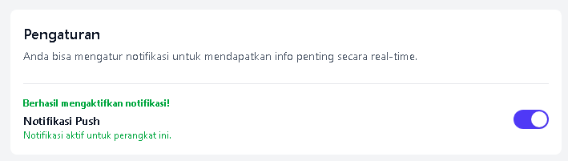

Apabila *toggle* ditekan kembali, antarmuka akan menampilkan modal konfirmasi penonaktifan (Gambar \ref{fig:hal-profil-asesi-5}). Konfirmasi pada tahap ini akan mengeksekusi perintah penghapusan nilai `fcm_token` pada tabel `users`, sehingga tidak akan bisa lagi menerima *Push Notification*.

Gambar \ref{fig:pwa-flow-5} hingga Gambar \ref{fig:pwa-flow-7} menampilkan contoh antarmuka gawai Asesi ketika menerima berbagai skenario Push Notification dari sistem.

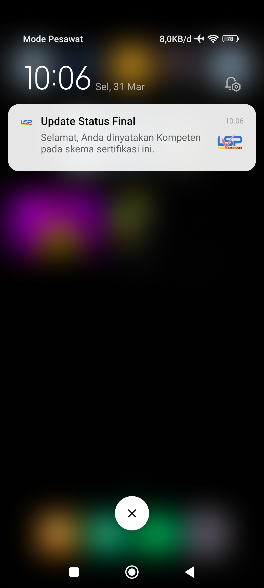

Gambar \ref{fig:pwa-flow-5} menunjukkan notifikasi otomatis yang terpicu ketika Admin telah menerbitkan status kelulusan final Asesi. Sementara itu, Gambar \ref{fig:pwa-flow-6} mengilustrasikan pemberitahuan yang diterima Asesi terkait hasil pembaruan verifikasi berkas persyaratan asesmen mereka, sehingga Asesi dapat segera melakukan tindakan lanjutan jika terdapat berkas yang ditolak.

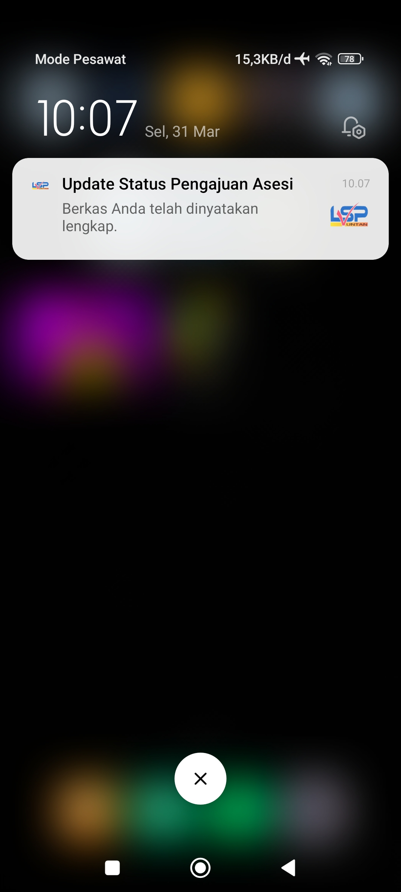

Skenario lainnya ditunjukkan pada Gambar \ref{fig:pwa-flow-7}, di mana sistem menembakkan notifikasi siaran (broadcast) secara serentak kepada seluruh Asesi yang terdaftar apabila terdapat informasi, jadwal, atau pengumuman baru yang diterbitkan oleh pihak LSP. Ketiga skenario ini membuktikan bahwa arsitektur PWA secara efektif mampu menggantikan fungsi aplikasi native dalam hal interaktivitas dan keterlibatan pengguna (user engagement).

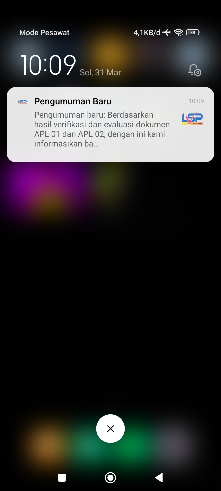

## Pengujian

Setelah seluruh antarmuka dan logika bisnis sistem selesai diimplementasikan, tahap selanjutnya adalah melakukan pengujian. Pengujian ini menggunakan metode *Black Box Testing*, yang bertujuan untuk memvalidasi apakah setiap fitur, masukan, dan keluaran pada sistem telah berjalan sesuai dengan spesifikasi kebutuhan sistem yang didefinisikan sebelumnya.

### Hasil Pengujian Umum

Pengujian pertama difokuskan pada fungsionalitas yang melibatkan semua aktor, artinya semua aktor bisa melakukannya. Adapun rincian skenario beserta status keberhasilan dari pengujian umum pada Tabel \ref{tab:pengujian-umum} berikut.

\begin{longtable}{|p{1cm}|p{3cm}|p{3.5cm}|p{4.5cm}|>{\raggedright\arraybackslash}p{1cm}|}
\caption{Tabel Hasil Pengujian Umum} \label{tab:pengujian-umum} \\
\hline
ID Tes & Skenario Pengujian & Input & Output yang diharapkan & Status \\ \hline
TC-01 & Autentikasi *login* & Memasukkan email dan kata sandi yang telah terdaftar & Masuk ke *dashboard* sesuai hak akses (Admin/Asesor/Asesi) & Sesuai \\ \hline
TC-02 & Perizinan *Push Notification* & Mengakses halaman profil dan menekan *toggle* notifikasi & Pengguna dapat menerima *Push Notification* & Sesuai \\ \hline

\end{longtable}

### Hasil Pengujian Asesi

Fase pengujian kedua difokuskan pada fungsionalitas yang melibatkan aktor Asesi. Adapun rincian skenario beserta status keberhasilan dari pengujian Asesi pada Tabel \ref{tab:pengujian-asesi} berikut.

\begin{longtable}{|p{1cm}|p{3cm}|p{3.5cm}|p{4.5cm}|>{\raggedright\arraybackslash}p{1cm}|}
\caption{Tabel Hasil Pengujian Asesi} \label{tab:pengujian-asesi} \\
\hline
ID Tes & Skenario Pengujian & Input & Output yang diharapkan & Status \\ \hline
TC-01 & Pendaftaran akun asesi & Memasukkan email valid dan kata sandi, lalu menekan tombol "Daftar" & Data tersimpan ke basis data dan diarahkan ke halaman *dashboard* & Sesuai \\ \hline
TC-04 & Menampilkan ringkasan data *dashboard* asesi & Mengakses halaman *dashboard* setelah proses *login* berhasil & Menampilkan status pendaftaran dan kartu informasi sertifikasi & Sesuai \\ \hline
TC-05 & Pemilihan jadwal sertifikasi pada katalog yang tersedia & Menekan tombol "Daftar" pada salah satu jadwal sertifikasi & Sistem mengarahkan ke halaman formulir pengajuan & Sesuai \\ \hline
TC-06 & Pengunggahan dokumen persyaratan sertifikasi dan pengisian data diri & Menginput data diri lengkap dan mengunggah seluruh dokumen persyaratan, lalu menekan tombol "Submit" & Sistem menyimpan data, lalu diarahkan ke halaman rincian asesi. Halaman menampilkan data yang diinput dengan status. \newline
1. Berkas: Menunggu Verifikasi Admin \newline
2. Hak Akses Asesmen: Belum Diberikan \newline
3. Status Final: Belum Ditentukan & Sesuai \\ \hline
TC-07 & Mengakses jadwal sertifikasi yang sudah didaftar pada tab "Tersedia" & Menekan tombol "Detail" pada kartu jadwal yang sudah didaftar sebelumnya & Sistem mengarahkan ke halaman rincian asesi. & Sesuai \\ \hline
TC-08 & Pemutakhiran data profil asesi & Mengubah data kontak pada menu profil dan menekan tombol 'Simpan' & Data profil diperbarui dan sinkron dengan formulir pengajuan & Sesuai \\ \hline
TC-09 & Mengakses halaman pengumuman & Menekan tab 'Pengumuman' pada halaman rincian asesi. & Sistem menampilkan daftar seluruh pengumuman yang dibuat oleh Admin atau Asesor & Sesuai \\ \hline
TC-10 & Menampilkan detail pengumuman & Menekan tombol 'Buka Pengumuman' pada salah satu pengumuman & Sistem menampilkan detail pengumuman dan menyembunyikan daftar pengumuman lainnya & Sesuai \\ \hline
TC-12 & Validasi hak akses menu asesmen (terkunci) & Mengakses menu asesmen saat status hak akses masih "Belum Diberikan" & Sistem menampilkan ikon gembok di samping menu asesmen, menu tidak dapat ditekan, dan asesi tidak bisa masuk ke halaman asesmen & Sesuai \\ \hline
TC-14 & Akses halaman asesmen & Mengakses menu asesmen saat hak akses sudah diberikan & Halaman menampilkan detail instruksi asesmen dan memunculkan formulir unggah berkas asesmen & Sesuai \\ \hline
TC-15 & Mengelola profil Asesi & Mengakses halaman profil dan mengubah profil & Data profil tersimpan di basis data & Sesuai \\ \hline

\end{longtable}

### Hasil Pengujian Admin dan Asesor

Fase pengujian ketiga difokuskan pada fungsionalitas yang melibatkan aktor Admin dan Asesor, artinya baik Admin maupun Asesor bisa melakukannya. Adapun rincian skenario beserta status keberhasilan dari pengujian Admin dan Asesor pada Tabel \ref{tab:pengujian-admin-asesor} berikut.

\begin{longtable}{|p{1cm}|p{3cm}|p{3.5cm}|p{4.5cm}|>{\raggedright\arraybackslash}p{1cm}|}
\caption{Tabel Hasil Pengujian Admin dan Asesor} \label{tab:pengujian-admin-asesor} \\
\hline
ID Test & Skenario Pengujian & Input & Output yang Diharapkan & Status \\ \hline
TC-15 & Manajemen status berkas dan hak akses asesi & Menekan tombol "Detail" pada Asesi, kemudian: \newline
1. Mengubah status berkas menjadi "Berkas Sudah Lengkap". \newline
2. Mengubah hak akses menjadi "Diberikan". & Status berkas dan hak akses asesmen pada asesi yang dipilih berubah sesuai input. & Sesuai \\ \hline
TC-16 & Penetapan hasil akhir asesi & Menekan tombol "Detail" pada Asesi, lalu mengubah status akhir menjadi "Kompeten" atau "Belum Kompeten". & Status akhir asesi diperbarui di basis data. & Sesuai \\ \hline
TC-18 & Validasi logika tombol "Upload Sertifikat" & Mengakses detail asesi dengan status akhir "Belum Kompeten"/"Belum Ditentukan"/"Didiskualifikasi" & Tombol "Upload Sertifikat" tidak muncul (disembunyikan) pada antarmuka halaman detail asesi & Sesuai \\ \hline
TC-19 & Penerbitan sertifikat & Mengakses asesi berstatus "Kompeten". Menekan tombol "Upload Sertifikat", mengisi nomor registrasi, masa berlaku, unggah berkas sertifikat digital dsb. & Data sertifikat tersimpan dan asesi dapat mengunduh sertifikat tersebut di halaman rincian asesi. & Sesuai \\ \hline
TC-20 & Pengelolaan instruksi asesmen & Menekan tombol "Buat Asesmen", mengisi detail tugas, dan menyimpan (termasuk Edit/Hapus) & Data instruksi berhasil disimpan/diperbarui di basis data dan muncul pada tampilan halaman asesmen asesi & Sesuai \\ \hline
TC-21 & Pemeriksaan dokumen unggahan asesi pada menu asesmen & Menekan tombol "Detail" pada data asesi yang sudah mengunggah tugas di halaman asesmen mereka, lalu menekan tombol "Unduh" dokumen yang telah diunggah & Sistem menampilkan detail unggahan asesi dan *browser* mengunduh dokumen yang diunggah asesi. & Sesuai \\ \hline

\end{longtable}

### Hasil Pengujian Admin

Fase pengujian keempat difokuskan pada fungsionalitas yang melibatkan aktor Admin, artinya hanya Admin yang bisa melakukannya. Adapun rincian skenario beserta status keberhasilan dari pengujian Admin pada Tabel \ref{tab:pengujian-admin} berikut.

\begin{longtable}{|p{1cm}|p{3cm}|p{3.5cm}|p{4.5cm}|>{\raggedright\arraybackslash}p{1cm}|}
\caption{Tabel Hasil Pengujian Admin} \label{tab:pengujian-admin} \\
\hline
ID Test & Skenario Pengujian & Input & Output yang diharapkan & Status \\ \hline
TC-22 & Visualisasi statistik data pada *dashboard* Admin & Mengakses halaman *dashboard* admin & Menampilkan grafik dan *widget* data & Sesuai \\ \hline
TC-23 & Pengelolaan data master skema sertifikasi & Menambah, mengubah, atau menghapus data skema & Perubahan data skema berhasil tersimpan ke basis data & Sesuai \\ \hline
TC-24 & Pengelolaan data master asesor & Menambah, mengubah, atau menghapus data pada asesor & Perubahan data asesor berhasil tersimpan ke basis data & Sesuai \\ \hline
TC-25 & Pengelolaan data jadwal sertifikasi & Memasukkan skema, jadwal, biaya, penugasan asesor dsb. Juga mengedit data tersebut. & Perubahan data sertifikasi berhasil tersimpan/diperbarui ke basis data. Event Sertifikasi yang dimulai muncul di halaman daftar sertifikasi di sisi asesi & Sesuai \\ \hline
TC-26 & Akses halaman log aktivitas sistem & Mengakses menu Log dan menekan tombol 'Detail' pada salah satu baris data & Sistem menampilkan daftar log aktivitas sistem dan riwayat aktivitas (siapa melakukan apa) serta detail perubahan data (*old value* dan *new value*) secara rinci & Sesuai \\ \hline
TC-28 & Akses Halaman daftar pengguna & Mengakses menu kelola pengguna & Sistem menampilkan daftar pengguna yang terdaftar di sistem & Sesuai \\ \hline
TC-29 & Penangguhan/pemulihan akses pengguna & Pada halaman daftar pengguna, menekan tombol "Ban" pada pengguna yang berstatus "Aktif" & Status pengguna berubah menjadi "Banned" dan pengguna tersebut tidak bisa melakukan login ke dalam sistem & Sesuai \\ \hline
TC-30 & Pemulihan akses pengguna & Menekan tombol "Un-ban" pada pengguna yang berstatus "Banned" & Status pengguna kembali menjadi "Aktif". Pengguna tersebut kini bisa login kembali ke dalam sistem. & Sesuai \\ \hline
\end{longtable}

\newpage

\FrameImagesfalse