# HASIL DAN PEMBAHASAN

\FrameImagestrue

## Tampilan Halaman

Berikut merupakan hasil implementasi tampilan halaman dari Sistem Informasi LSP UNTAN. Penjelasan di bawah ini mencakup visualisasi antarmuka pengguna beserta deskripsi fungsionalitas dari setiap komponen yang tersedia pada sistem, baik dari sisi mahasiswa maupun dari sisi admin dan asesor.

### Halaman Registrasi Akun

Halaman Registrasi Akun merupakan antarmuka yang dirancang untuk memfasilitasi calon asesi dalam melakukan pendaftaran akun baru pada sistem. Seperti yang terlihat pada Gambar \ref{fig:hal-register}, halaman ini memuat formulir *input* yang terdiri dari alamat surel (*email*) dan kata sandi. Terdapat validasi sisi klien untuk memastikan data yang dimasukkan sesuai dengan format yang ditentukan. Setelah pengguna menekan tombol "*Register*", sistem akan menyimpan data tersebut ke tabel users dan diarahkan ke halaman *login*.

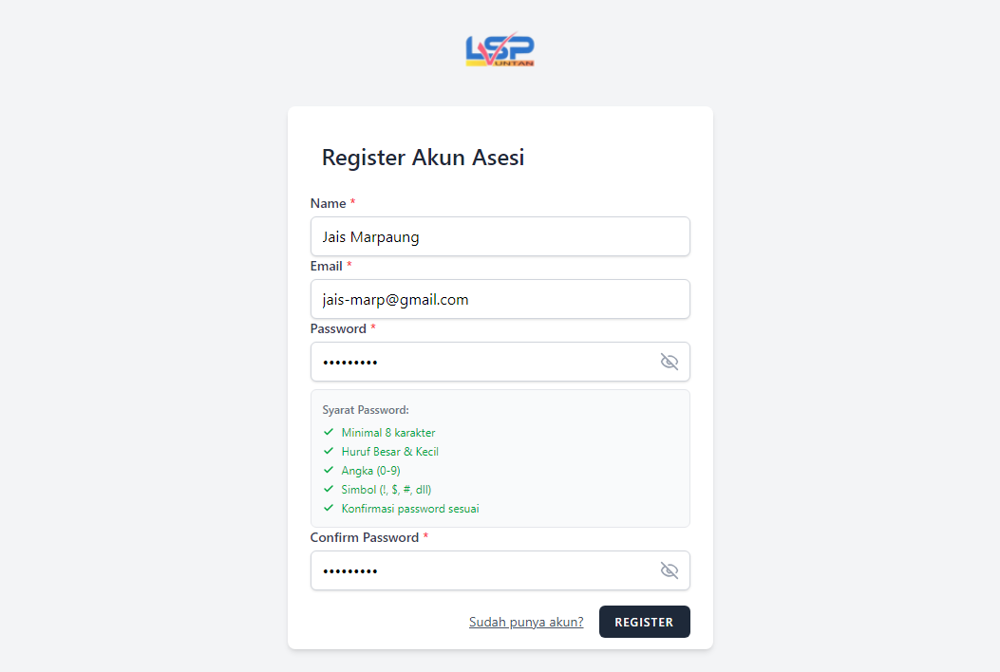

### Halaman *Login*

Halaman *Login* berfungsi sebagai gerbang autentikasi utama untuk menjamin keamanan akses data pada sistem. Antarmuka ini mencakup kolom *input* untuk *email* dan kata sandi seperti yang terlihat pada Gambar \ref{fig:hal-login}. Sistem akan mengidentifikasi *role* pengguna, baik sebagai admin, asesor, maupun asesi dan mengarahkan pengguna ke *dashboard* yang sesuai dengan hak aksesnya masing-masing.

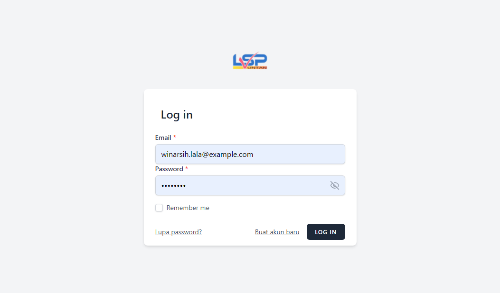

### Halaman *Dashboard* Admin

Gambar \ref{fig:hal-dash-admin} menampilkan antarmuka bagian atas dari halaman *Dashboard* Admin yang berfungsi sebagai pusat informasi utama bagi admin. Pada bagian ini, sistem menyajikan kartu metrik yang memuat akumulasi data seperti jumlah sertifikasi yang sedang berlangsung, sertifikasi selesai, total asesi terdaftar, dan jumlah lulusan. Selain itu, terdapat fitur *pipeline* status sertifikasi yang memudahkan admin memantau antrean asesi yang mencakup jumlah asesi yang menunggu verifikasi admin, asesi dalam tahap perbaikan berkas, hingga asesi yang menunggu keputusan akhir ("Kompeten" atau "Belum Kompeten"). Untuk mendukung analisis visual, halaman ini juga dilengkapi dengan *line chart* tren pendaftaran selama 12 bulan terakhir serta *pie chart* rasio kelulusan asesi.

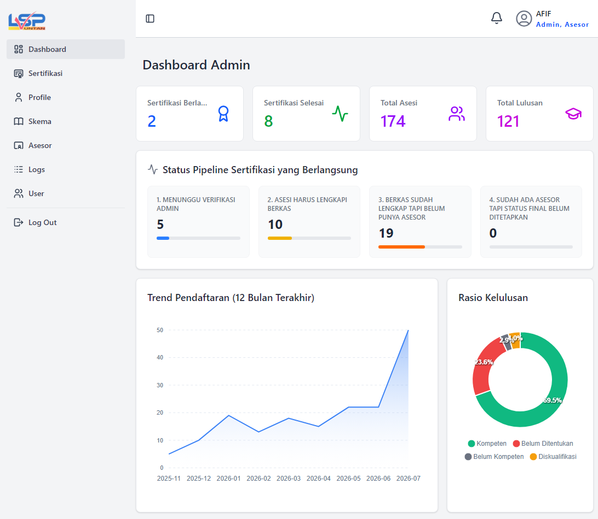

Sementara itu, Gambar \ref{fig:hal-dash-admin-2} menampilkan bagian bawah dari halaman *Dashboard* Admin yang difokuskan pada navigasi cepat dan auditabilitas sistem. Halaman ini memuat daftar lima sertifikasi dengan jumlah asesi terbanyak guna mengidentifikasi skema yang paling diminati. Di bawahnya, tersedia *shortcut* menuju detail jadwal sertifikasi yang sedang aktif, memungkinkan admin untuk langsung mengelola data asesi tanpa harus menelusuri menu utama. Sebagai bentuk transparansi dan keamanan aplikasi, halaman ini juga mengintegrasikan fitur log aktivitas terbaru. Fitur ini menampilkan lima log aktivitas data terakhir di dalam sistem, mencakup informasi tindakan yang dilakukan beserta *user* yang mengeksekusinya. Adapun rincian seluruh riwayat aktivitas sistem secara komprehensif dapat diakses melalui menu Log tersendiri.

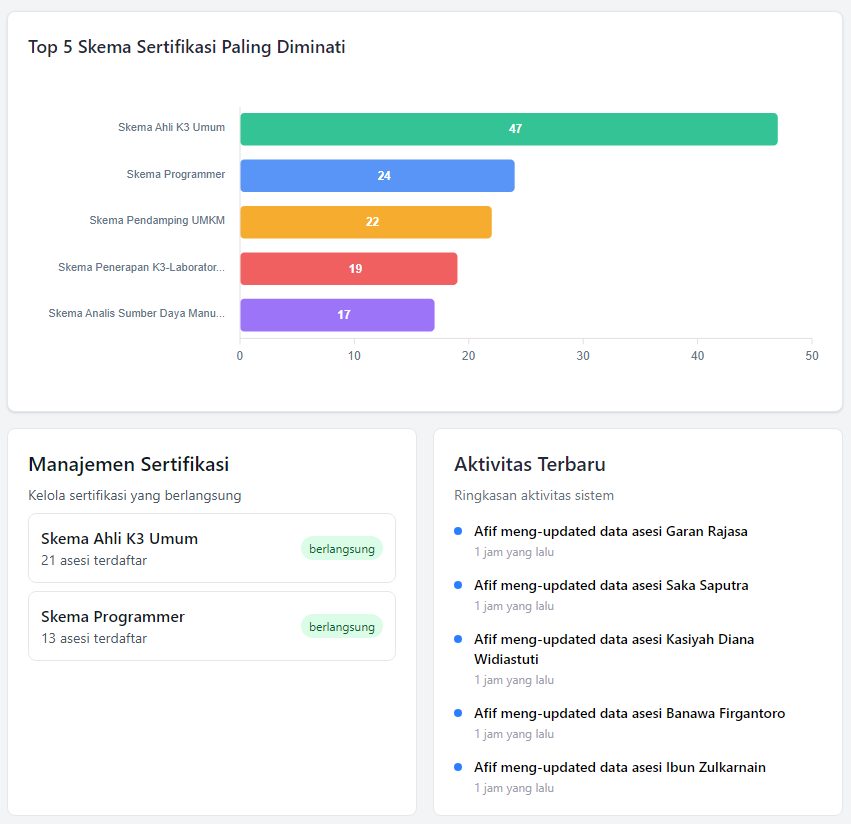

###  Halaman Kelola Sertifikasi

Halaman Kelola Sertifikasi merupakan modul yang digunakan oleh admin untuk mengaktifkan dan mengawasi periode pendaftaran sertifikasi. Antarmuka pada modul ini memiliki tiga tab yaitu "Mulai Sertifikasi", "Sertifikasi Berlangsung", dan "Riwayat Sertifikasi". Navigasi antar tab dapat dilakukan secara instan karena sistem hanya melakukan perubahan DOM, tanpa memerlukan pemuatan ulang halaman maupun perubahan rute URL.

Pada tab untuk memulai sertifikasi baru (Gambar \ref{fig:hal-manage-sertif-1}), sistem menyediakan formulir yang dilengkapi dengan fitur *dropdown* dinamis, di mana daftar pilihan asesor akan difilter secara otomatis menyesuaikan dengan skema sertifikasi yang dipilih oleh admin. Selanjutnya, admin menentukan parameter pelaksanaan seperti rentang tanggal pendaftaran, tanggal asesmen, dan tempat uji kompetensi. Pada formulir ini juga diatur rincian biaya, nama bank, nomor rekening, dan nama pemilik rekening, yang nantinya akan menjadi instruksi pembayaran resmi pada antarmuka pengajuan sertifikasi di sisi asesi.

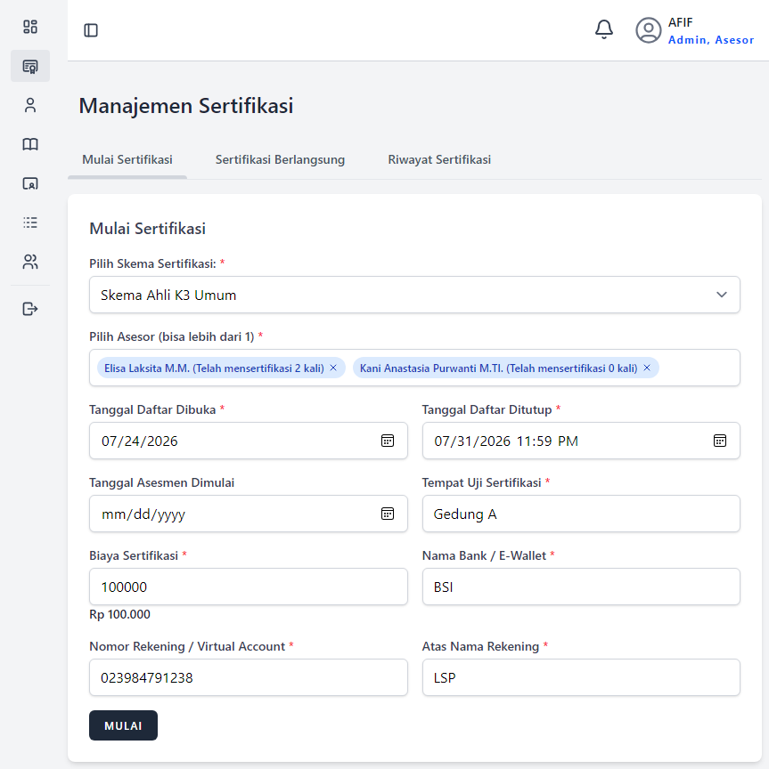

Untuk keperluan pemantauan, sistem menyediakan tab "Sertifikasi Berlangsung" (Gambar \ref{fig:hal-manage-sertif-2}) dan "Riwayat Sertifikasi" (Gambar \ref{fig:hal-manage-sertif-3}). Tabel data pada kedua tab ini menyajikan informasi komprehensif, mulai dari nama skema, daftar asesor bertugas, jadwal, TUK, biaya, status, hingga akumulasi jumlah asesi.

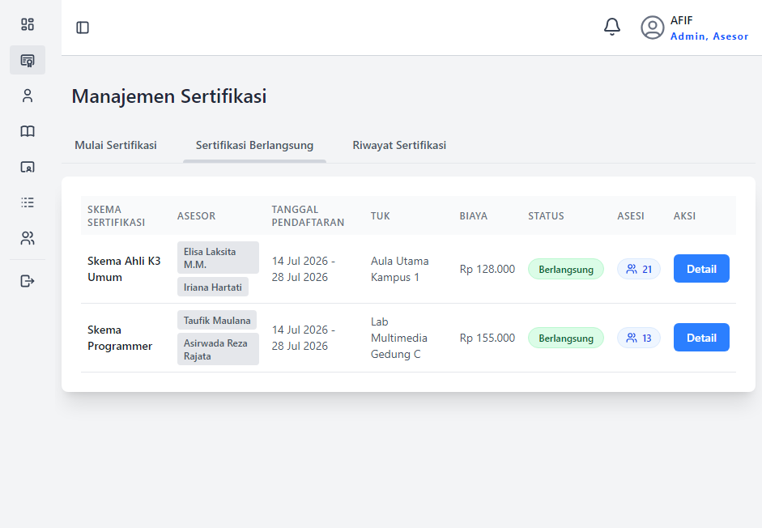

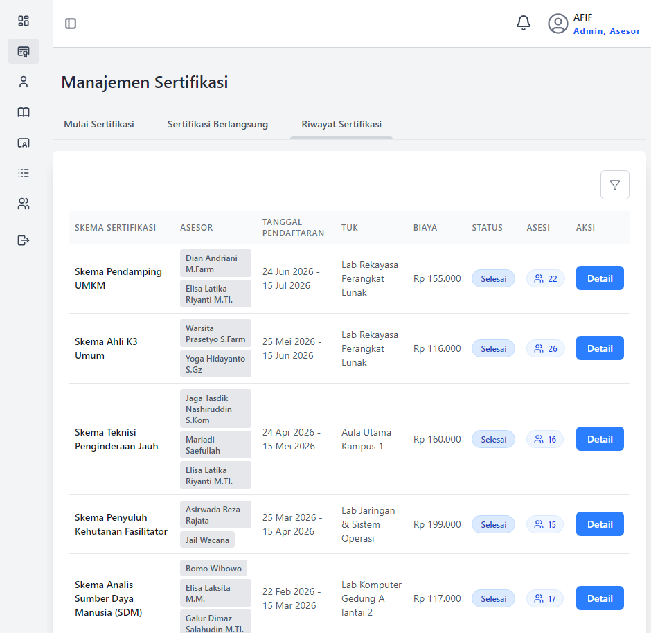

Apabila admin menekan tombol "Detail" pada baris data, sistem akan menampilkan antarmuka Detail Sertifikasi (Gambar \ref{fig:hal-manage-sertif-4}). Halaman detail ini merangkum seluruh informasi jadwal sertifikasi beserta tombol edit dan tombol *export* ke CSV untuk memfasilitasi kebutuhan pelaporan dan rekapitulasi data asesi di luar sistem.

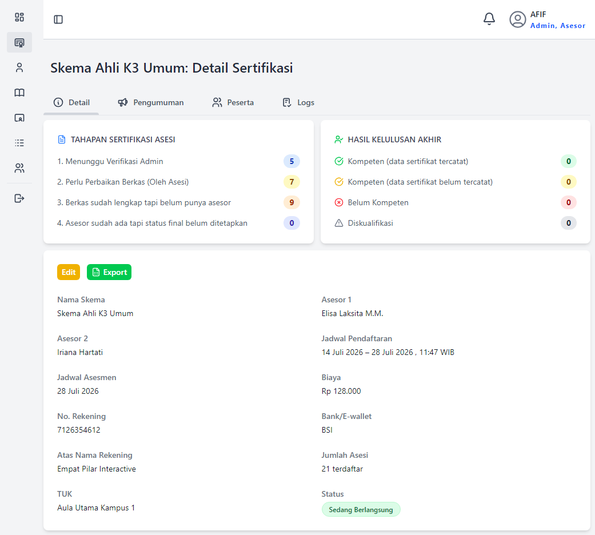

Untuk melakukan modifikasi jadwal, admin diarahkan pada formulir pembaruan (Gambar \ref{fig:hal-manage-sertif-5}). Formulir ini memiliki struktur yang identik dengan formulir pembuatan awal, namun ditambahkan opsi *radio button* untuk mengelola status kegiatan secara eksplisit (berlangsung, selesai, atau dibatalkan). Guna menjaga integritas basis data dan menghindari hilangnya riwayat pendaftaran asesi, sistem secara arsitektural tidak menyediakan fitur penghapusan data permanen pada jadwal sertifikasi ini, melainkan hanya mengizinkan modifikasi status menjadi "Dibatalkan".

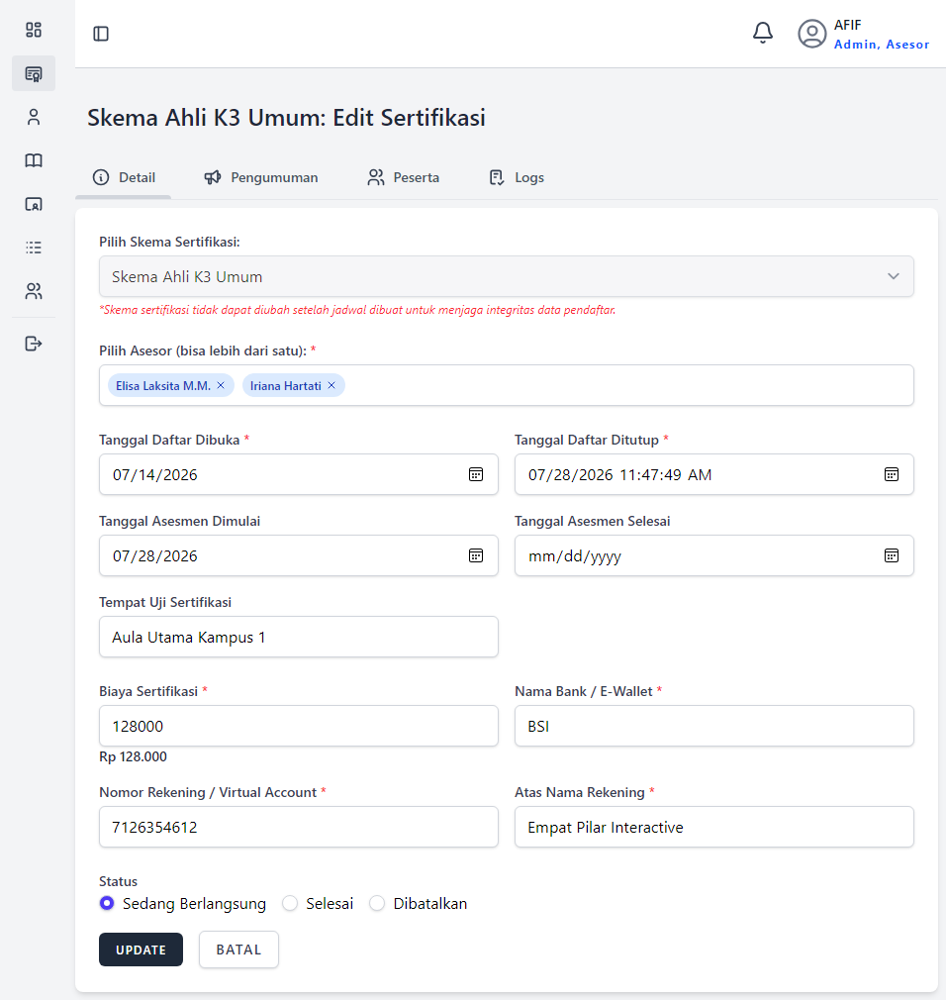

### Halaman *Dashboard* Asesi

Halaman *Dashboard* Asesi adalah tampilan utama yang pertama kali diakses oleh asesi setelah proses *login* berhasil. Halaman ini (Gambar \ref{fig:hal-dash-asesi}) menampilkan adanya panel ringkasan yang memuat status pendaftaran sertifikasi terbaru, pengumuman terbaru dari sertifikasi yang diikuti. Halaman ini dirancang untuk memberikan *user experience* yang memudahkan asesi memantau perkembangan proses sertifikasi mereka tanpa harus membuka banyak menu.

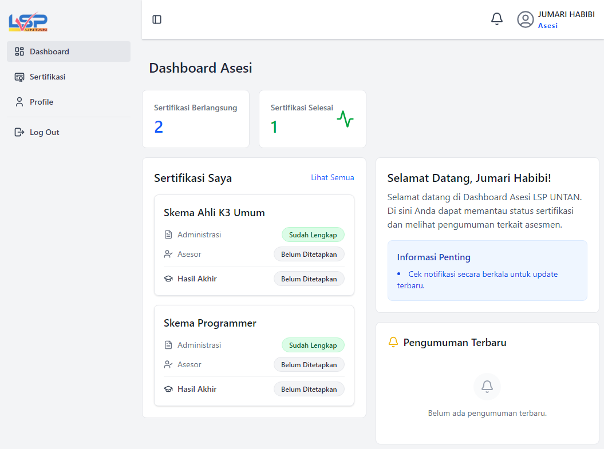

### Halaman Profil Asesi

Halaman ini memungkinkan asesi mengelola data pribadi dan preferensi akun secara mandiri. Pada antarmuka utama (Gambar \ref{fig:hal-profil-asesi-1}), sistem menampilkan informasi yang bersifat persisten, seperti nama lengkap, nomor KTP, tempat dan tanggal lahir, serta dokumen identitas pokok (KTP dan pas foto). Modul ini mengimplementasikan prinsip *Single Source of Truth* yang terintegrasi langsung dengan alur pendaftaran. Dengan demikian, apabila asesi mendaftar pada skema sertifikasi lain di masa mendatang, sistem akan melakukan pengisian data secara otomatis guna menghindari pengisian ulang secara manual.

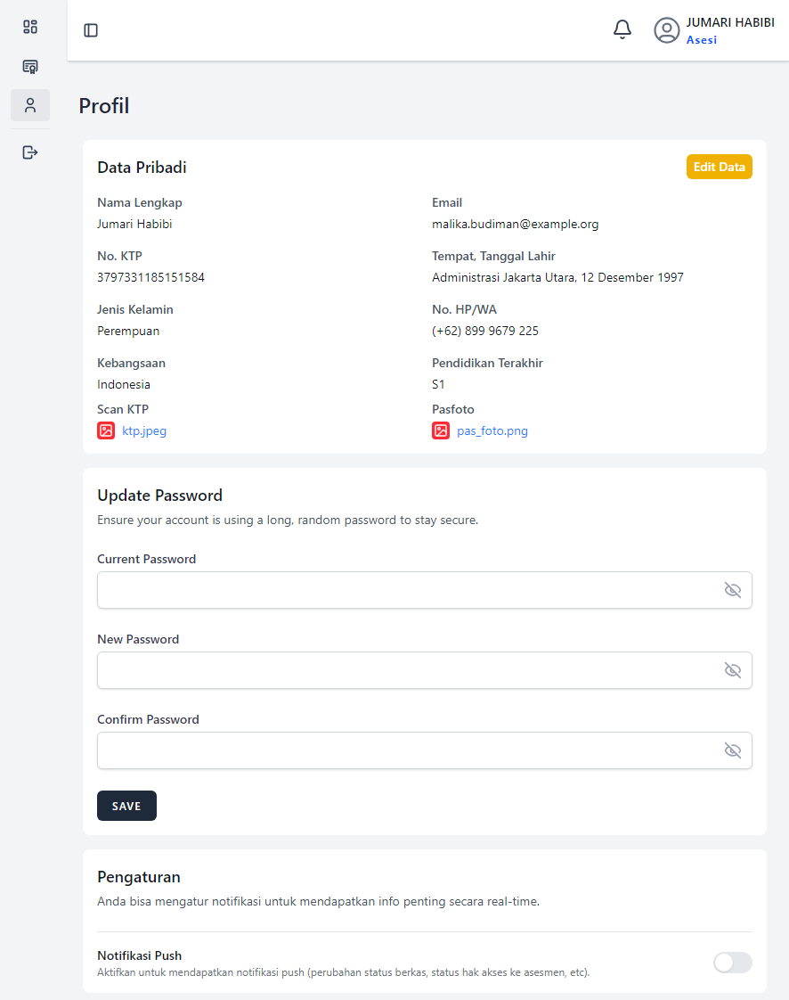

Apabila terdapat perubahan data diri, asesi dapat mengakses formulir pembaruan profil (Gambar \ref{fig:hal-profil-asesi-2}) melalui tombol "Edit Data". Tepat di bawah segmen profil, halaman ini juga mengakomodasi fitur keamanan bawaan dari ekosistem Laravel Breeze untuk pembaruan kata sandi, yang menerapkan validasi ketat dengan mewajibkan konfirmasi sandi lama dan sandi baru.

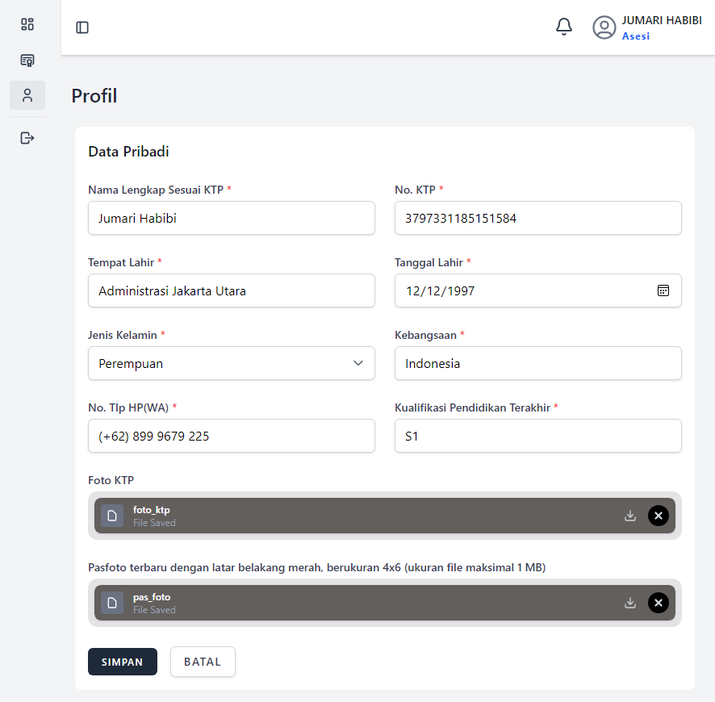

### Halaman Daftar Sertifikasi Asesi

Halaman Daftar Sertifikasi Asesi berfungsi sebagai katalog utama yang menampilkan daftar jadwal sertifikasi yang sedang aktif dan dibuka oleh LSP UNTAN. Pada tab "Tersedia" (Gambar \ref{fig:hal-katalog-sertif-asesi-1}), tiap jadwal ditampilkan menggunakan komponen *card* yang memuat rincian esensial seperti nama skema sertifikasi, biaya pendaftaran, serta periode pelaksanaan. Sistem akan menampilkan tombol "Daftar" bagi asesi yang belum berpartisipasi, dan secara otomatis mengubahnya menjadi tombol "Lihat Status" apabila basis data mendeteksi bahwa asesi telah terdaftar pada jadwal tersebut. Mekanisme validasi visual ini sangat efektif untuk mencegah terjadinya duplikasi pendaftaran oleh pengguna yang sama.

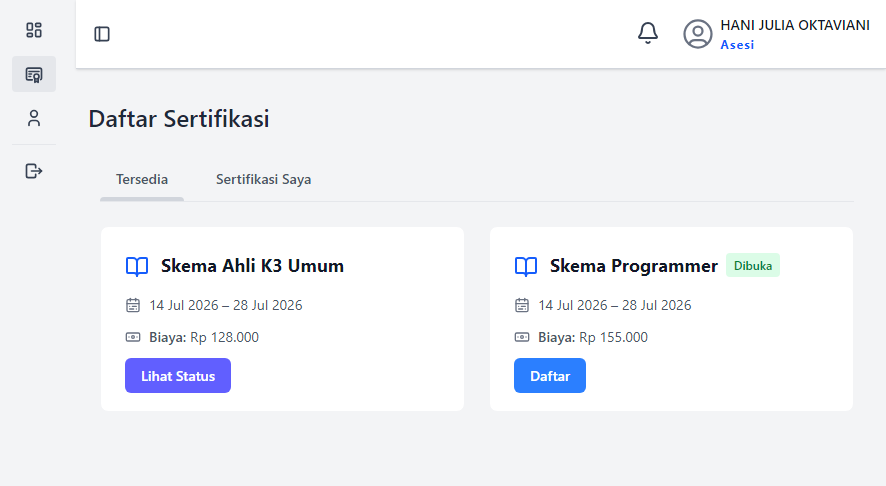

Di sebelah tab "Tersedia", juga ada tab "Sertifikasi Saya" (Gambar \ref{fig:hal-katalog-sertif-asesi-2}). Berpindah antar tab tidak akan memuat ulang halaman karena hanya mengubah DOM, berbeda dengan tampilan pada tab "Tersedia" yang menggunakan *card*, riwayat partisipasi asesi pada tab ini disajikan dalam bentuk tabel. Representasi tabular ini untuk memudahkan asesi dalam melacak rekam jejak seluruh sertifikasi yang pernah diselesaikan pada masa lampau.

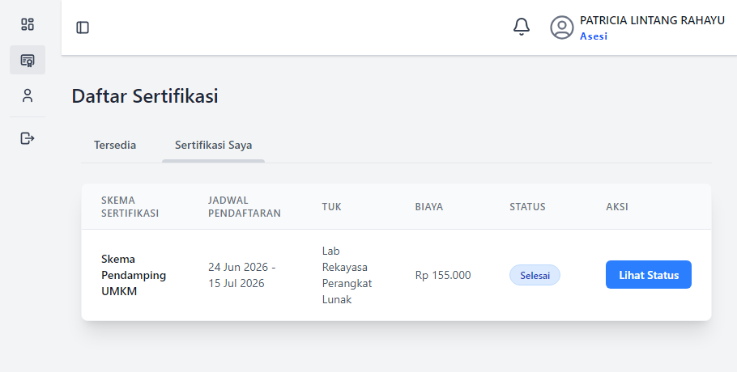

### Halaman Pendaftaran Sertifikasi

Halaman Pendaftaran Sertifikasi merupakan modul pendaftaran krusial di mana asesi melakukan pendaftaran resmi pada skema sertifikasi yang dipilih. Mengingat banyaknya parameter data yang diwajibkan oleh standar BNSP, formulir ini dirancang secara terstruktur dan komprehensif. Pada bagian pertama (Gambar \ref{fig:hal-apply-sertif-1}), sistem mengumpulkan identitas personal asesi (seperti nama, nomor KTP, tempat dan tanggal lahir) dan profil pekerjaan (jabatan, asal instansi) asesi saat ini.

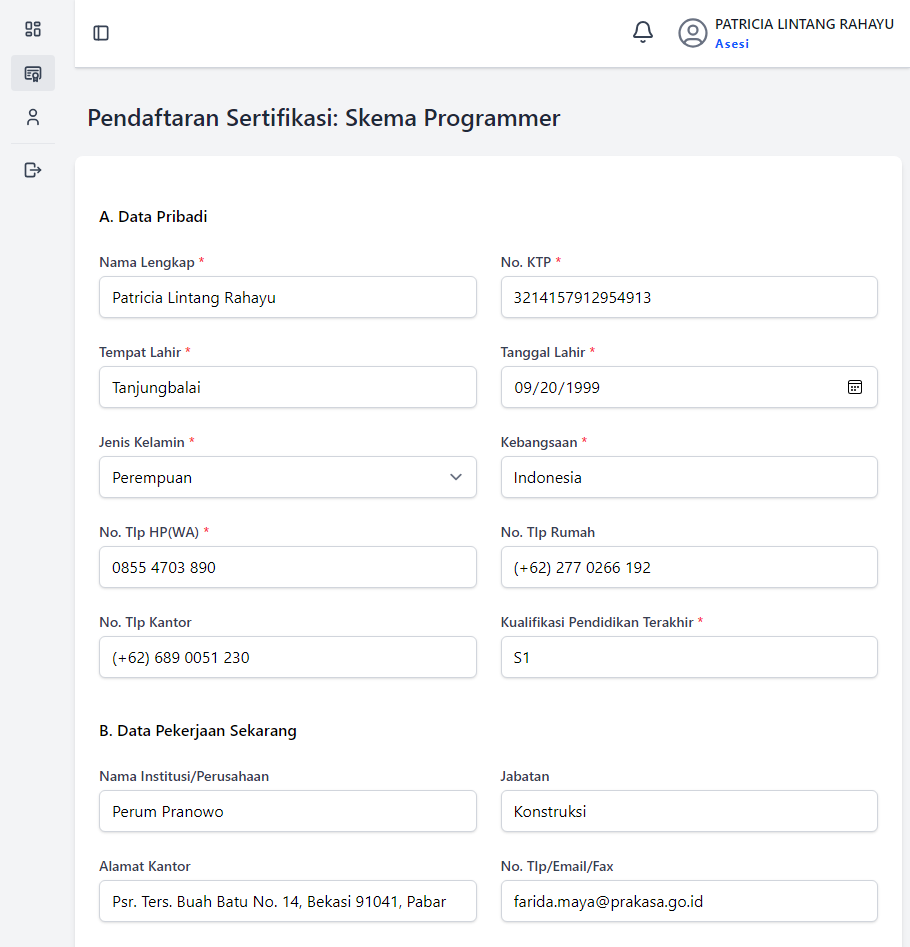

Pada bagian tengah formulir (Gambar \ref{fig:hal-apply-sertif-2}), asesi diwajibkan mengisi tujuan sertifikasi, mata kuliah terkait beserta nilainya, pengunggahan bukti pembayaran, APL-01, APL-02, dan foto KTP. Pada input APL-01 dan APL-02, terdapat tombol untuk mengunduh format kedua berkas tersebut.

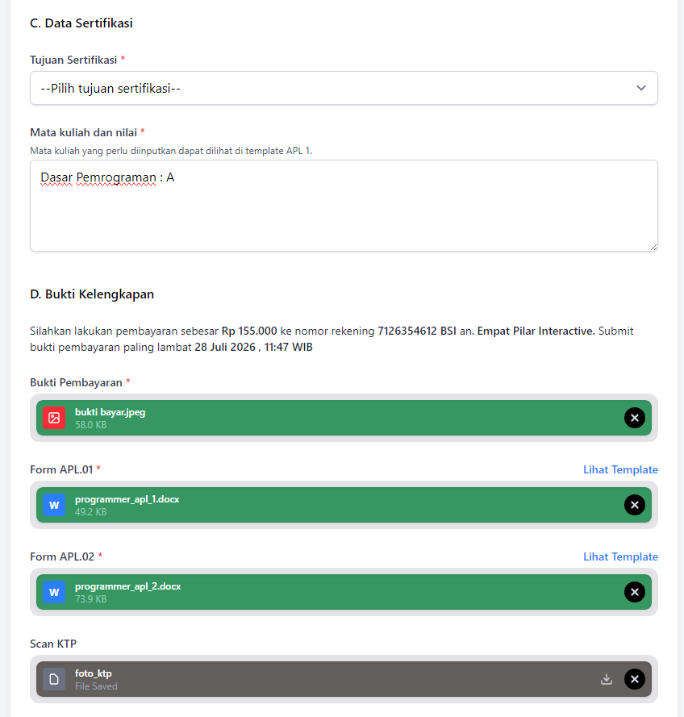

Pada bagian akhir formulir (Gambar \ref{fig:hal-apply-sertif-3}), asesi melengkapi dokumen seperti pas foto, Kartu Tanda Mahasiswa (KTM), transkrip nilai, hingga sertifikat pelatihan dan surat magang (opsional). Seluruh input pengunggahan berkas pada formulir ini telah dilengkapi dengan *client-side* dan *server-side validation* yang membatasi format ekstensi dokumen dan ukuran maksimal berkas yang diizinkan, misalnya berkas APL-1 dan APL-2 hanya menerima format DOCX dengan ukuran maksimal 2 MB. Rangkaian proses ini diakhiri dengan penekanan tombol "Daftar", yang akan memicu pengiriman seluruh paket data ke basis data untuk selanjutnya diverifikasi oleh admin.

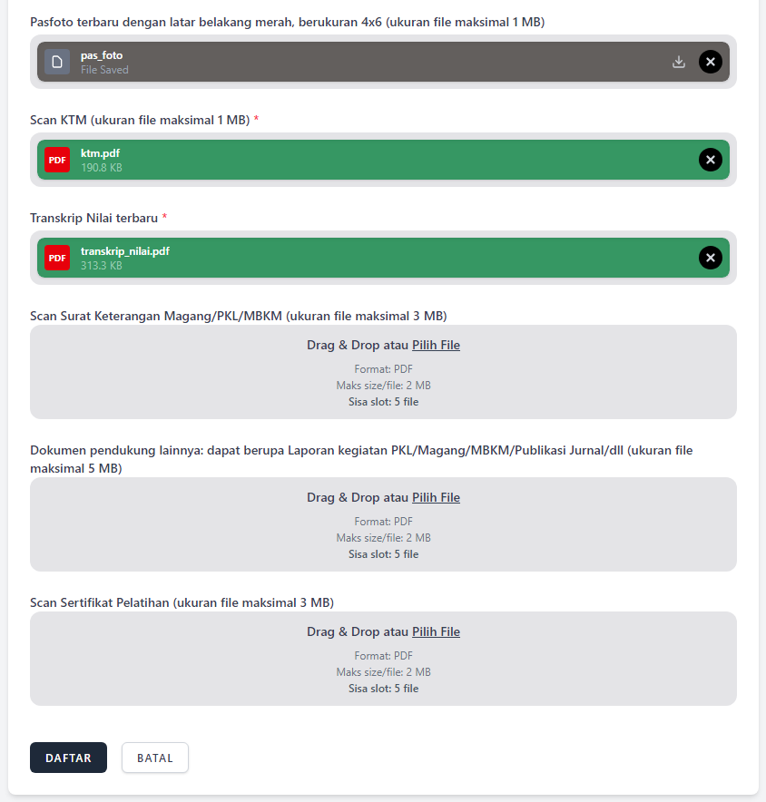

Setelah berhasil mendaftar maka asesi akan diarahkan ke halaman detail asesi yang berisi informasi yang sudah diinputkan asesi di halaman pendaftaran sebelumnya seperti yang terlihat pada Gambar \ref{fig:hal-apply-sertif-4}. Di bagian kanan atas terdapat tombol "Edit Data" untuk mengubah berkas pendaftaran, jika status berkas asesi sudah berstatus "Sudah Lengkap" maka asesi tidak akan bisa lagi mengubah berkas pendaftarannya.

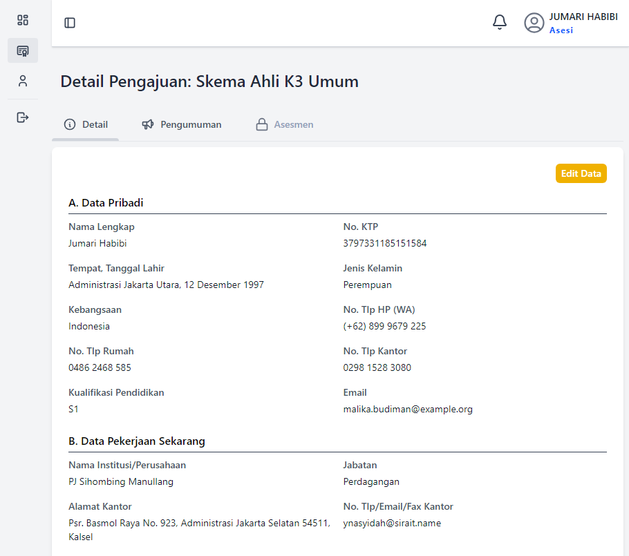

Status awal asesi setelah berhasil mengajukan pendaftaran adalah status berkasnya "Menunggu Verifikasi Admin", asesornya dan status akhirnya belum ditetapkan seperti yang terlihat pada Gambar \ref{fig:hal-apply-sertif-5}.

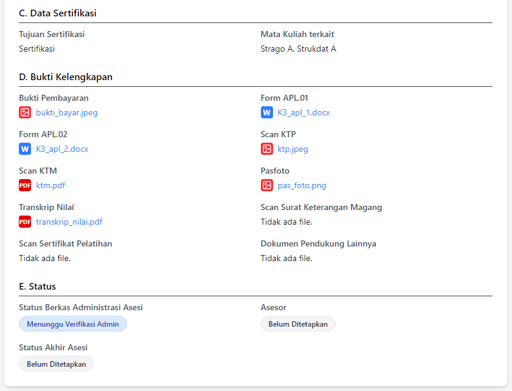

###  Perbarui Status Berkas Asesi

Halaman Daftar Peserta difungsikan sebagai pusat kendali bagi admin dan asesor untuk memantau, memverifikasi, dan menetapkan status kelulusan peserta sertifikasi. Pada antarmuka utama (Gambar \ref{fig:hal-kelola-asesi-1}), sistem menyajikan tabel daftar asesi secara komprehensif. Tabel ini memuat indikator-indikator krusial perjalanan asesi, meliputi status verifikasi berkas ("Sudah Lengkap", "Menunggu Verifikasi" atau "Perlu Perbaikan"), penugasan asesor tiap asesi, hingga status akhir sertifikasi ("Kompeten", "Tidak Kompeten", "Belum Ditetapkan", atau "Didiskualifikasi"). Khusus pada kolom status berkas, sistem menerapkan logika *access control*, di mana hanya asesi dengan status berkas "Sudah Lengkap" yang dapat membuka menu asesmen.

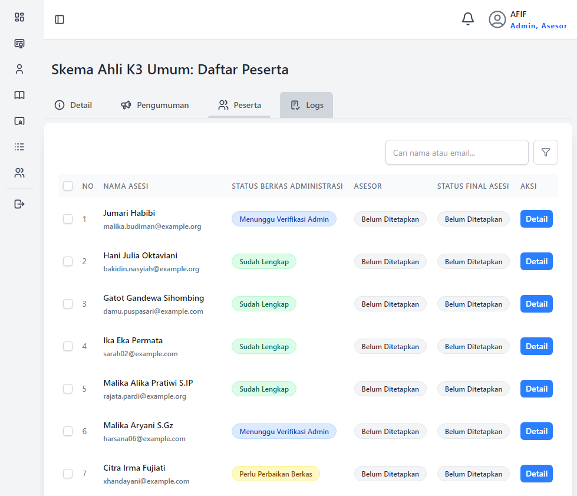

Untuk melakukan peninjauan mendalam terhadap seorang kandidat, admin dapat menekan tombol "Detail" yang akan membuka halaman Detail Asesi (Gambar \ref{fig:hal-kelola-asesi-2} dan Gambar \ref{fig:hal-kelola-asesi-3}). Bagian atas halaman menampilkan identitas pribadi dan riwayat pekerjaan. Sementara itu, bagian bawah halaman menampilkan tautan ke dokumen-dokumen bukti kelengkapan seperti KTM, transkrip nilai, bukti pembayaran serta panel status untuk memperbarui status asesi.

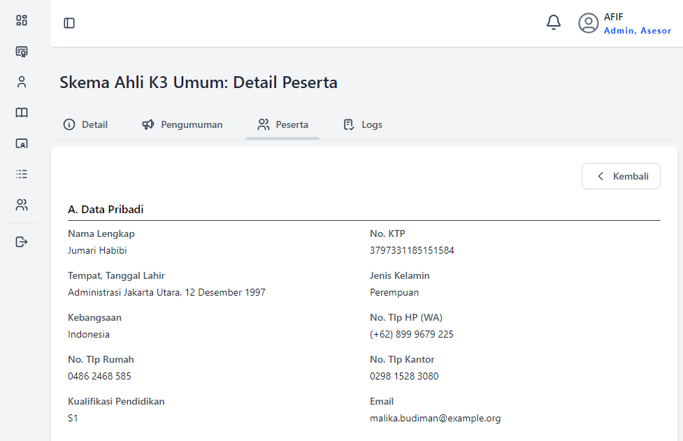

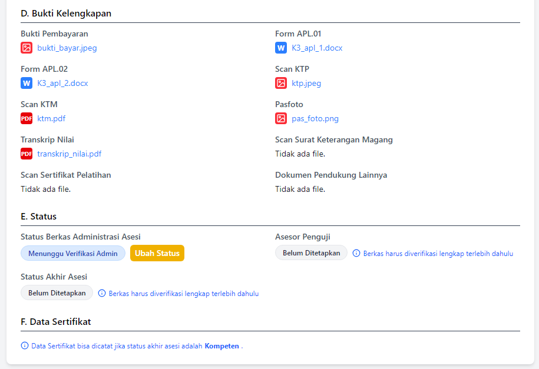

Pada bagian status di halaman detail (Gambar \ref{fig:hal-kelola-asesi-3}), terdapat tiga status yang mewakili tahapan evaluasi yaitu status berkas, asesor, dan status akhir asesi. Jika menekan tombol "Ubah Status" maka akan menampilkan modal konfirmasi. Gambar \ref{fig:hal-kelola-asesi-4} menampilkan formulir untuk memvalidasi kelengkapan berkas pendaftaran yang hanya bisa dilakukan admin.

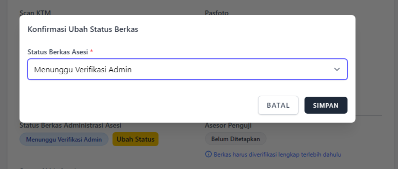

Gambar \ref{fig:hal-kelola-asesi-5} menampilkan perubahan status berkas asesi menjadi "Sudah Lengkap" setelah diubah dari status "Menunggu Verifikasi Admin".

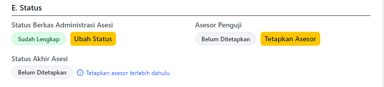

Guna meningkatkan efisiensi operasional dan mencegah repetisi navigasi saat admin harus mengubah status puluhan asesi, sistem ini mengimplementasikan fitur pemrosesan data massal. Seperti pada Gambar \ref{fig:hal-kelola-asesi-6}, admin atau asesor cukup mencentang *checkbox* pada baris data asesi di halaman daftar asesi. Saat sistem mendeteksi minimal satu asesi terpilih, antarmuka akan menampilkan rentetan tombol *bulk action* secara dinamis di bagian atas tabel.

Ketika salah satu tombol aksi massal ditekan, sistem akan menampilkan modal konfirmasi (Gambar \ref{fig:hal-kelola-asesi-7}). Melalui fitur ini, admin dapat mengubah status banyak asesi sekaligus (misalnya, memperbarui status berkas secara serentak ke beberapa asesi) hanya dalam satu kali eksekusi demi memangkas waktu pengerjaan administratif.

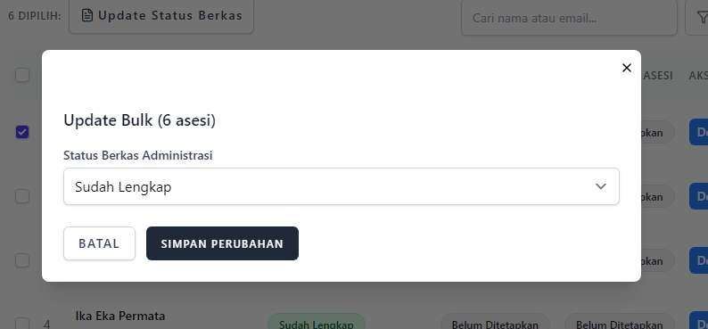

###  Tetapkan Asesor ke Asesi

Gambar \ref{fig:hal-kelola-asesi-8} menunjukkan detail asesi ketika status berkasnya telah dinyatakan lengkap, di mana tombol untuk menetapkan asesor akan muncul secara otomatis. Fitur penetapan asesor ini hanya bisa dilakukan oleh admin. 

Ketika tombol "Tetapkan Asesor" ditekan, maka aplikasi akan menampilkan modal konfirmasi pilihan asesor (Gambar \ref{fig:hal-kelola-asesi-9}). Setelah asesor berhasil dialokasikan, asesi yang bersangkutan dapat menerima instruksi asesmen langsung dari asesor tersebut.

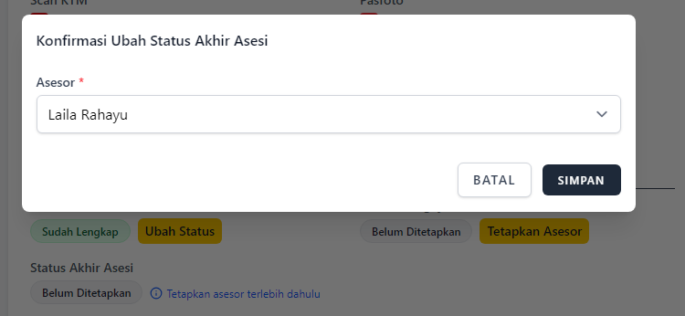

Gambar \ref{fig:hal-kelola-asesi-10} menampilkan perubahan status alokasi asesor yang terisi nama Lila Rahayu dari yang sebelumnya bernilai "Belum Ditetapkan". Bersamaan dengan penetapan tersebut, tombol pembaruan status berkas dinonaktifkan secara otomatis oleh sistem sebagai mekanisme penguncian status.

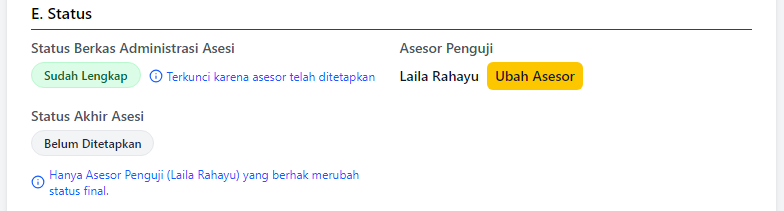

###  Halaman Kelola Pengumuman

Halaman Kelola Pengumuman (Gambar \ref{fig:hal-manage-news-1}) difungsikan sebagai media komunikasi antara admin atau asesor dengan para asesi. Informasi pada modul ini bersifat terikat langsung pada satu jadwal sertifikasi spesifik, jadi bukan pengumuman untuk semua pengguna.

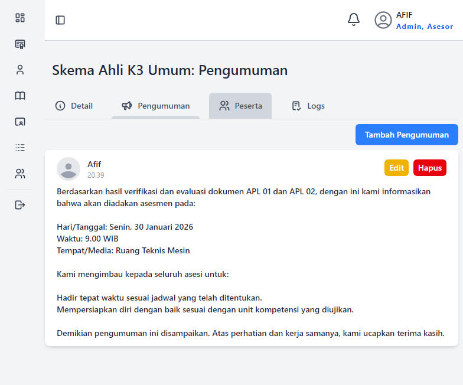

Modul ini telah dilengkapi dengan fungsionalitas CRUD. Untuk penambahan dan pembaruan data (Gambar \ref{fig:hal-manage-news-2} dan Gambar \ref{fig:hal-manage-news-3}), sistem menyediakan formulir di mana admin mengisi konten pengumuman, mengunggah berkas lampiran. Keunggulan utama pada fungsionalitas ini adalah tersedianya *push notification*. Dengan mencentang opsi persetujuan pengiriman notifikasi, sistem akan mendistribusikan pemberitahuan secara *real-time* kepada seluruh perangkat asesi yang terdaftar pada sertifikasi tersebut, asalkan asesi telah memberikan izin akses penerimaan notifikasi pada *browser* mereka.

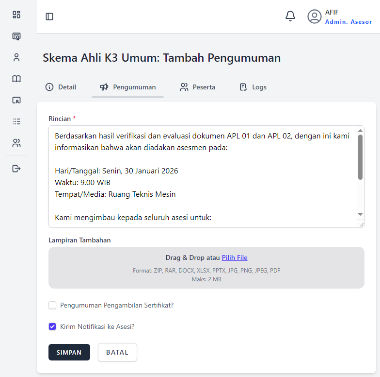

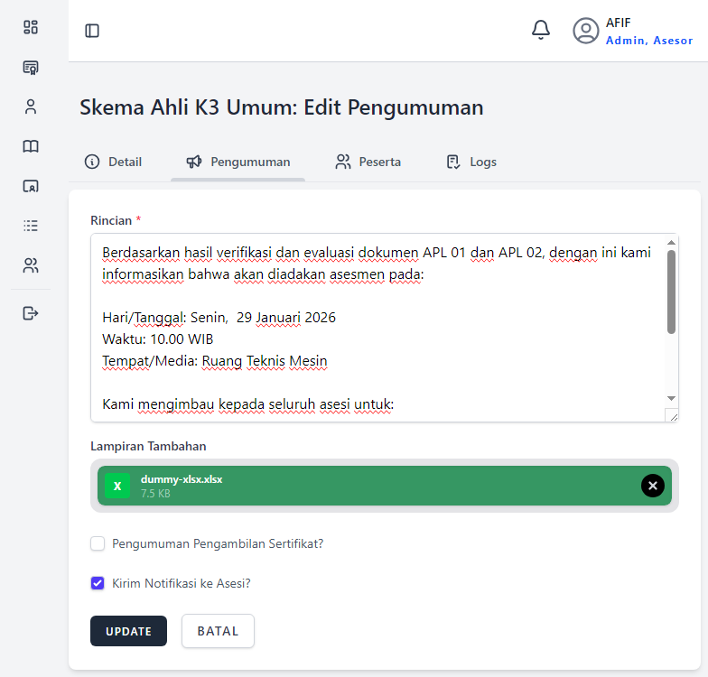

Sebagai langkah mitigasi kesalahan pengguna, fitur penghapusan data pengumuman dilengkapi dengan modal konfirmasi (Gambar \ref{fig:hal-manage-news-4}). Sistem akan meminta konfirmasi ulang sebelum data pengumuman benar-benar dihapus dari basis data.

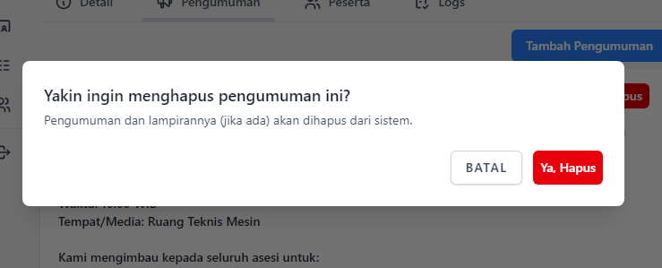

### Halaman Pengumuman Asesi

Halaman Pengumuman di sisi asesi berfungsi sebagai pusat informasi bagi asesi untuk memantau instruksi atau pemberitahuan terbaru dari pihak admin maupun asesor. Pada antarmuka utama (Gambar \ref{fig:hal-news-asesi-1}), sistem menyajikan daftar pengumuman secara kronologis.

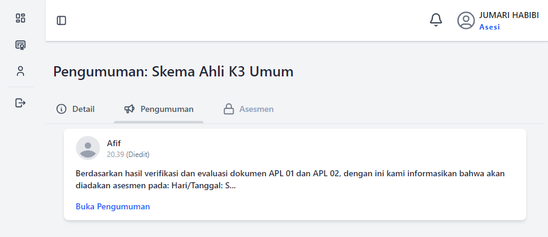

Ketika asesi menekan tombol "Buka Pengumuman", sistem tidak memuat ulang halaman, karena hanya mengubah DOM dari daftar utama ke tampilan rincian pengumuman (Gambar \ref{fig:hal-news-asesi-2}). Pada tampilan rincian ini, asesi dapat membaca keseluruhan isi pengumuman serta mengunduh dokumen lampiran (jika ada). Penggunaan transisi berbasis *state* ini memastikan pengalaman pengguna yang sangat responsif dan mulus, termasuk saat asesi menekan tombol "Kembali" untuk kembali ke daftar pengumuman.

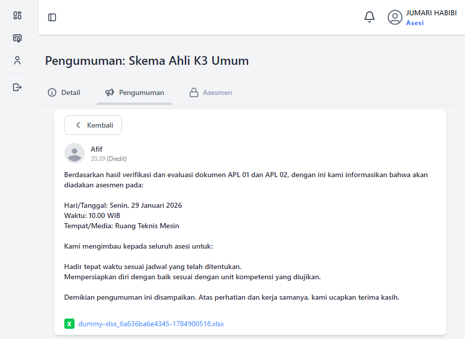

###  Halaman Kelola Asesmen

Halaman Asesmen difungsikan bagi asesor untuk mendistribusikan instruksi asesmen kepada para asesi. Pada kondisi awal di mana instruksi belum dibuat, sistem menampilkan antarmuka *empty state* (Gambar \ref{fig:hal-manage-asesmen-1}) yang menginformasikan bahwa asesor belum memberikan penugasan, dilengkapi dengan tombol "Buat Asesmen" untuk membuat instruksi asesmen baru.

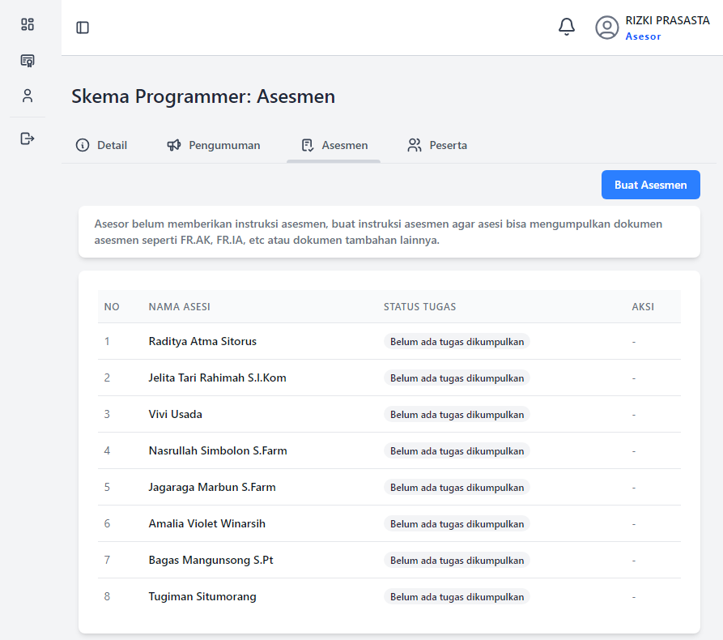

Ketika tombol pembuatan asesmen ditekan, sistem menampilkan formulir buat asesmen (Gambar \ref{fig:hal-manage-asesmen-2}). asesor dapat menyusun rincian tugas melalui elemen textarea, menetapkan batas akhir pengumpulan (opsional), serta melampirkan berkas pendukung (opsional). Seperti halnya pada fitur buat/edit pengumuman, juga ada *checkbox* yang jika diceklis maka akan mengirim *push notification* ke asesi, sehingga asesor punya kendali penuh untuk mengirimkan notifikasi tanpa memicu spam pada perangkat asesi, terutama jika terjadi pengubahan instruksi secara berulang.

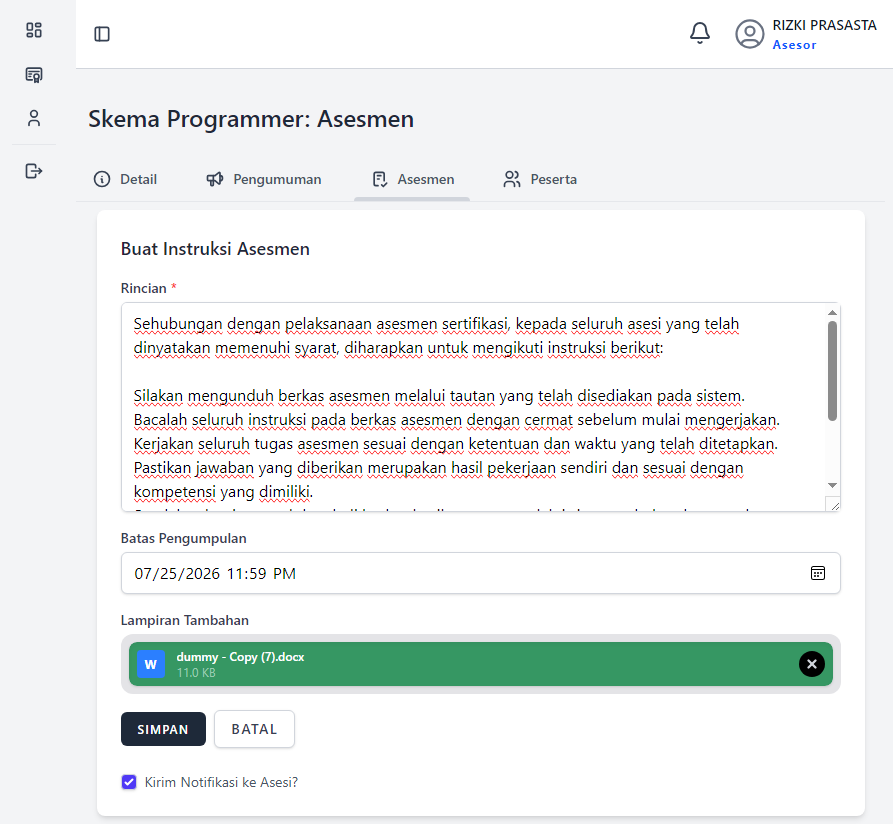

Setelah asesmen berhasil dibuat, antarmuka akan berubah menampilkan instruksi asesmen (Gambar \ref{fig:hal-manage-asesmen-3}) serta tombol "Edit" untuk memperbarui instruksi.

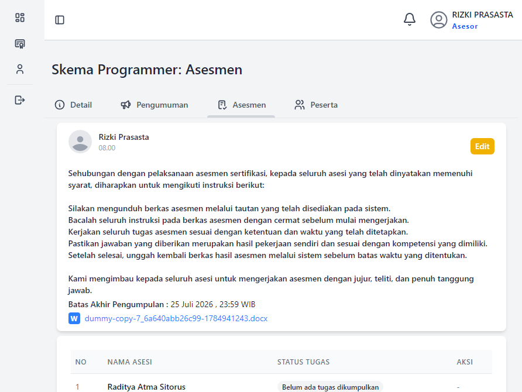

Setelah tombol "Edit" ditekan, akan muncul formulir edit instruksi (Gambar \ref{fig:hal-manage-asesmen-4}). Selain pembaruan data, antarmuka ini juga menyediakan opsi penghapusan asesmen yang dilengkapi dengan pengamanan modal konfirmasi (Gambar \ref{fig:hal-manage-asesmen-5}). Operasi penghapusan ini tidak akan menghapus berkas yang asesi kumpulkan.

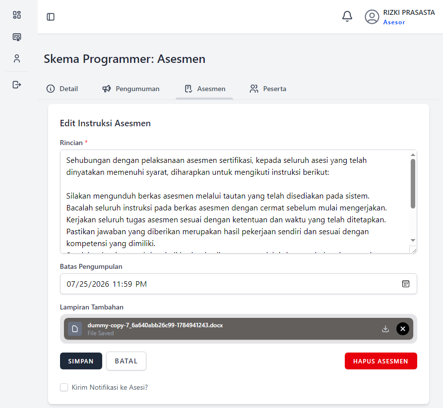

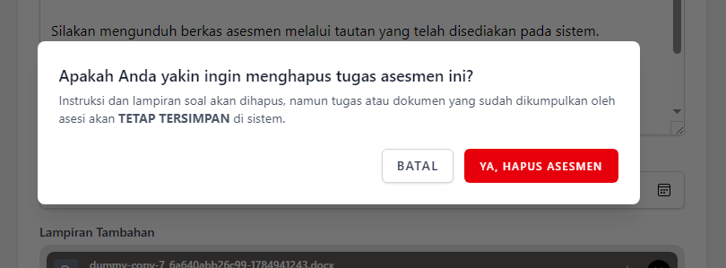

Guna mendukung proses evaluasi, sistem menampilkan daftar asesi (Gambar \ref{fig:hal-manage-asesmen-6}) yang diletakkan instruksi asesmen. Tabel ini menampilkan status pengumpulan berkas tiap asesi ("Belum Ada Tugas Dikumpulkan" atau "Diserahkan").

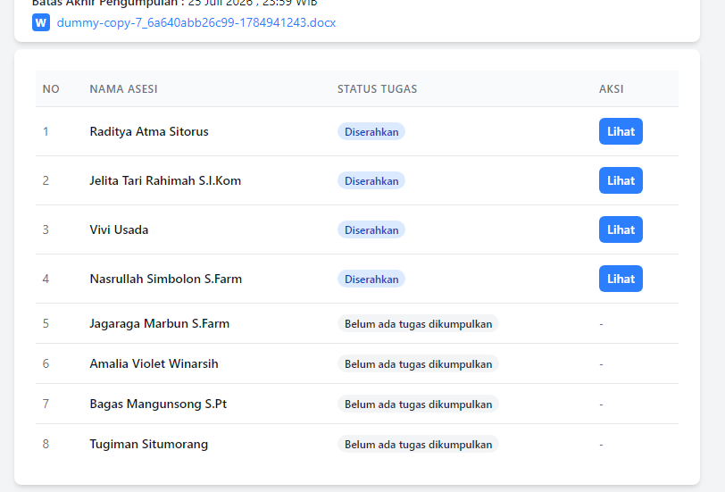

Asesor dapat menekan tombol "Lihat" pada baris data terkait. Sistem akan menampilkan antarmuka rincian penyerahan (Gambar \ref{fig:hal-manage-asesmen-7}) yang menampilkan nama asesi, nama berkas yang diunggah, dan tombol "Lihat" serta tombol "Kembali" untuk memastikan asesor saat memeriksa banyak berkas tetap berjalan efisien.

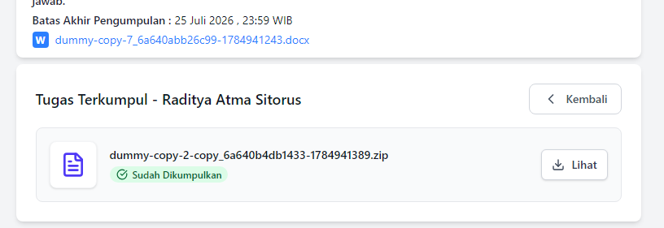

### Halaman Asesmen Asesi

Halaman Asesmen di sisi asesi dirancang sebagai ruang kerja untuk mendukung proses uji kompetensi secara digital. Antarmuka ini hanya dapat diakses oleh asesi apabila status berkasnya sudah lengkap. Hal ini bertujuan untuk memastikan alur kerja asesmen berjalan ketat sesuai dengan regulasi operasional LSP.

Pada kondisi awal saat asesi membuka halaman ini (Gambar \ref{fig:hal-asesmen-asesi-1}), sistem akan menyajikan rincian instruksi kerja dari asesor, informasi tenggat waktu (jika ada), serta komponen pengunggahan berkas. Guna menyeragamkan format pengumpulan tugas teknis, input berkas ini hanya menerima dokumen berekstensi ZIP atau RAR.

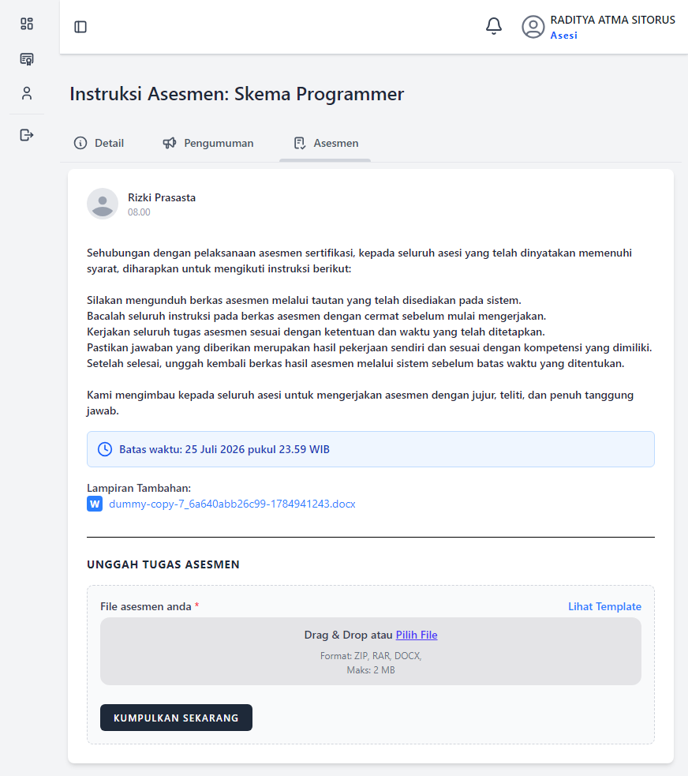

Setelah asesi berhasil melakukan submisi dokumen, antarmuka akan langsung memberikan umpan balik visual (Gambar \ref{fig:hal-asesmen-asesi-2}). Formulir pengunggahan akan disembunyikan dan digantikan dengan keterangan status penyerahan tugas, tombol pratinjau atau unduh berkas yang telah dikirim, serta tombol "Edit".

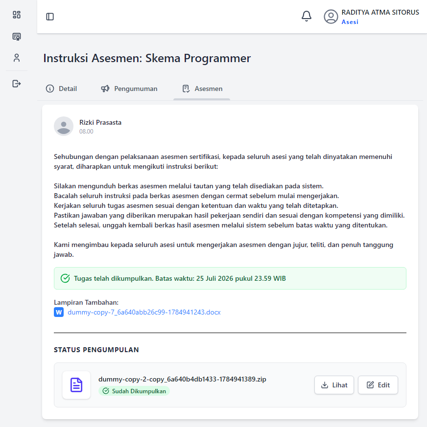

Apabila asesi perlu memperbaiki hasil pekerjaannya, penekanan tombol "Edit" akan memunculkan kembali formulir pembaruan dokumen (Gambar \ref{fig:hal-asesmen-asesi-3}), memungkinkan asesi untuk menimpa berkas lama dengan berkas yang baru. Jika status akhir asesi telah ditetapkan (baik itu kompeten atau tidak kompeten atau diskualifikasi) ataupun ketika batas akhir pengumpulan telah lewat maka asesi tidak akan bisa lagi mengubah berkas asesmennya.

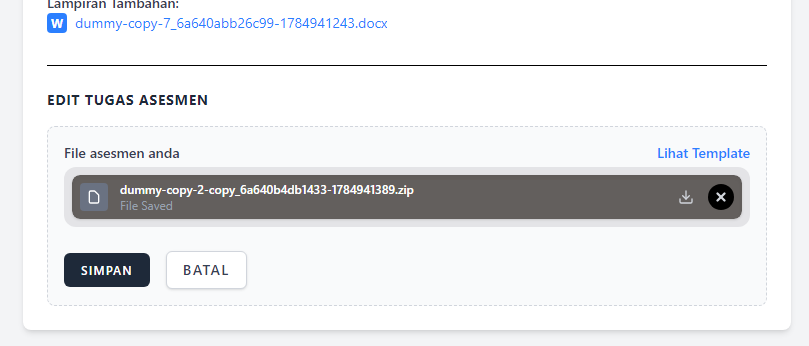

Sebagai bentuk ketegasan sistem terhadap kedisiplinan jadwal, modul ini juga punya logika pembatasan berbasis waktu. Apabila asesor menetapkan batas waktu pengumpulan dan waktu *server* saat ini telah melewati batas waktu tersebut sementara asesi belum mengumpulkan tugas, sistem akan memblokir aksi submisi secara otomatis. Antarmuka (Gambar \ref{fig:hal-asesmen-asesi-4}) akan menampilkan peringatan "Batas waktu pengumpulan telah berakhir" dan komponen pengunggahan berkasnya akan dinonaktifkan, sehingga mencegah asesi melakukan pengunggahan di luar jadwal yang disepakati.

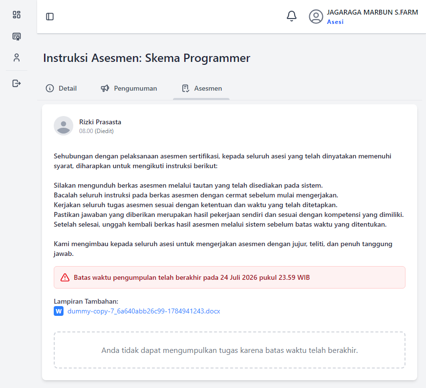

### Tetapkan Status Akhir Asesi

Gambar \ref{fig:status-akhir-asesi-1} menampilkan antarmuka penetapan status akhir asesi oleh asesor. Untuk menjaga integritas data dan mencegah manipulasi status, sistem menerapkan alur kerja bertingkat berurutan dengan mekanisme penguncian otomatis sebagai berikut:

\begin{enumerate}
    \item \textbf{Verifikasi Berkas Administrasi:} Admin melakukan verifikasi berkas pendaftaran asesi dengan tiga pilihan status, yaitu ``Menunggu Verifikasi Admin", ``Perlu Perbaikan Berkas", atau ``Sudah Lengkap".
    \item \textbf{Penetapan Asesor dan Penguncian Berkas:} Admin hanya dapat mengalokasikan asesor apabila status berkas asesi telah bernilai ``Sudah Lengkap". Begitu asesor berhasil ditetapkan, status berkas terkunci secara otomatis dan tidak dapat diubah kembali ke status sebelumnya.
    \item \textbf{Penetapan Status Akhir dan Penguncian Alokasi:} Hak akses penetapan status akhir (``Kompeten", ``Belum Kompeten", atau ``Diskualifikasi") hanya dimiliki oleh asesor yang telah ditunjuk. Ketika asesor menetapkan status akhir, alokasi asesor dan status berkas tetap terkunci sehingga tidak dapat diubah.
    \item \textbf{Pencatatan Metadata Sertifikat:} Admin hanya dapat mencatatkan metadata sertifikat apabila status akhir asesi bernilai ``Kompeten". Pencatatan ini menjadi tahap akhir yang mengunci seluruh riwayat data dan status asesi secara penuh.
\end{enumerate}

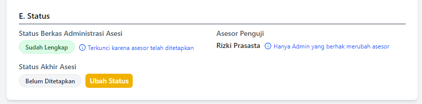

Jika tombol "Ubah Status" ditekan, aplikasi akan menampilkan modal konfirmasi (Gambar \ref{fig:status-akhir-asesi-2}) bagi asesor untuk memilih status akhir asesi, apakah "Kompeten", "Belum Kompeten", atau "Diskualifikasi".

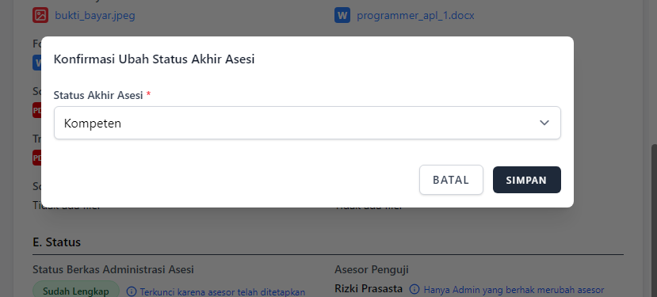

Gambar \ref{fig:status-akhir-asesi-3} menampilkan perubahan status akhir asesi menjadi "Kompeten" setelah diperbarui dari status "Belum Ditetapkan". Penyesuaian ini secara otomatis mengunci seluruh riwayat status berkas dan alokasi asesor sehingga tidak dapat diubah kembali.

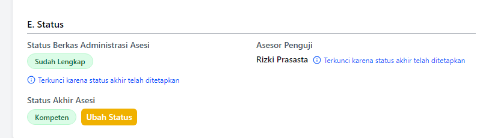

### Pengumuman Pengambilan Sertifikat

Selain pengumuman yang bersifat umum, sistem menyediakan mekanisme khusus untuk menyampaikan instruksi terkait alur dan tata cara pengambilan sertifikat fisik. Pada saat pembuatan atau pembaruan pengumuman (Gambar \ref{fig:hal-news-ambil-sertif-1}), admin dapat mencentang opsi khusus (*checkbox*) yang menandai entri tersebut sebagai pengumuman pengambilan sertifikat. Penandaan ini secara otomatis menerapkan logika pemfilteran hak akses pada basis data, di mana pengumuman tersebut dibatasi dan hanya bisa dilihat oleh asesi yang telah ditetapkan berstatus "Kompeten" pada status akhirnya.

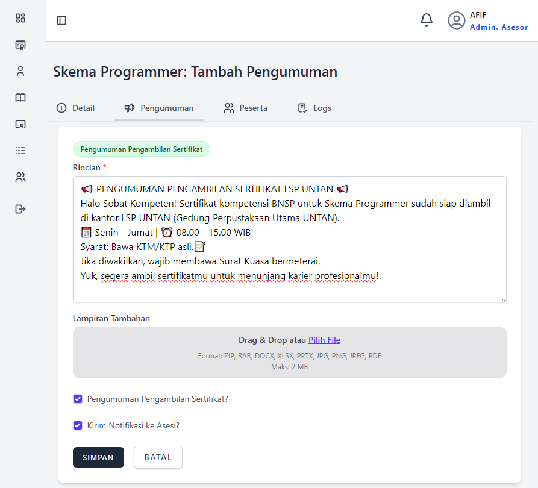

Pengumuman yang telah berhasil diterbitkan akan ditampilkan pada daftar pengumuman (Gambar \ref{fig:hal-news-ambil-sertif-2}) dengan indikator visual berupa label khusus. Keberadaan penanda ini memudahkan pengelola sistem dalam membedakan antara pengumuman informasi operasional biasa dengan instruksi resmi penyerahan sertifikat.

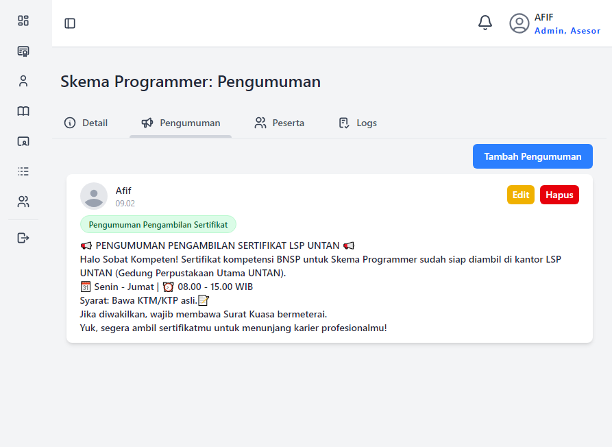

Pada antarmuka pengguna (Gambar \ref{fig:hal-news-ambil-sertif-3}), asesi yang dinyatakan kompeten juga dapat mengidentifikasi jenis informasi ini secara langsung melalui label khusus pada sudut kanan atas kartu pengumuman sebelum membaca rincian instruksi pengambilan sertifikat fisik, seperti lokasi kantor LSP, rentang waktu/jadwal operasional penyerahan, hingga berkas identitas yang wajib ditunjukkan saat pengambilan. Penerapan kriteria visibilitas berbasis status kelulusan beserta penandaan visual bertujuan untuk menjaga relevansi informasi serta mencegah kesalahpahaman bagi asesi yang belum mencapai status kompeten.

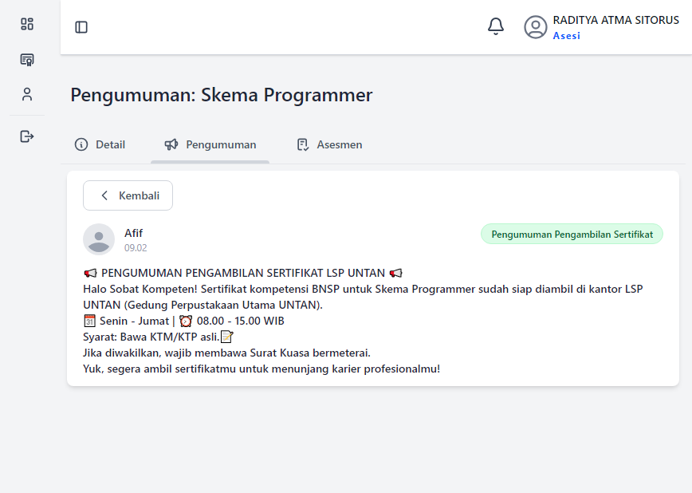

### Catat Data Sertifikat

Admin mencatat data sertifikat tiap asesi di aplikasi agar pihak luar seperti HR perusahaan bisa memverifikasi keabsahan sertifikat sang asesi. Antarmuka detail asesi (Gambar \ref{fig:hal-catat-sertif-1}) hanya akan menampilkan tombol "Catat Sertifikat" apabila status akhir asesi "Kompeten". Proteksi ini untuk mencegah terjadinya *human error*, seperti pemberian sertifikat kepada peserta yang belum memenuhi standar kelulusan.

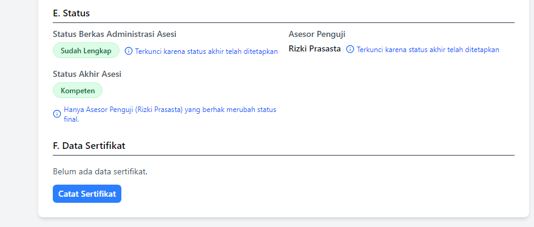

Saat tombol tersebut ditekan, antarmuka akan menampilkan formulir penambahan data sertifikat (Gambar \ref{fig:hal-catat-sertif-2}). Admin mengisi data sertifikat seperti nomor registrasi, tanggal sertifikat berlaku, dan data terkait lainnya.

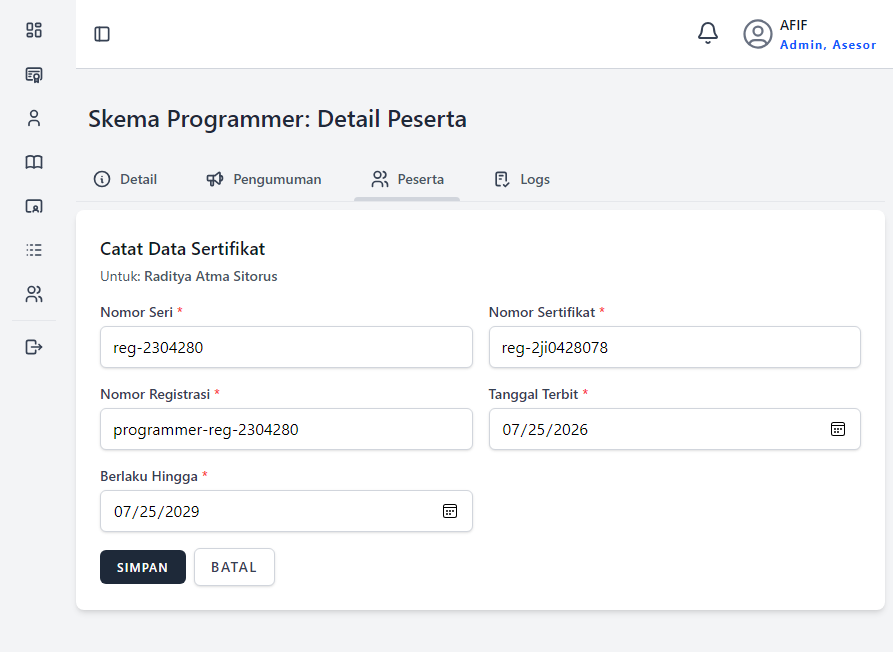

Setelah proses unggah berhasil, sistem memberikan umpan balik yang dinamis. Antarmuka yang sebelumnya berupa tombol, secara otomatis berubah menjadi komponen kartu informasi (Gambar \ref{fig:hal-catat-sertif-3}). Komponen ini secara ringkas menampilkan nama berkas sertifikat yang terlampir, serta tombol mengunduh dan edit. Setelah tombol "Edit" ditekan, admin dapat memperbarui data sertifikat (Gambar \ref{fig:hal-catat-sertif-4}).

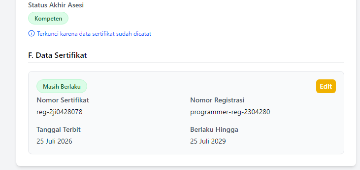

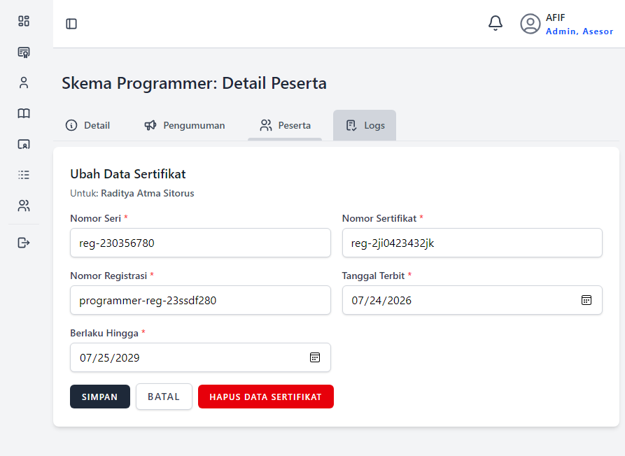

Sebagai langkah mitigasi kesalahan pengguna, fitur penghapusan data sertifikat dilengkapi dengan modal konfirmasi (Gambar \ref{fig:hal-catat-sertif-5}), sebelum data sertifikat benar-benar dihapus dari basis data.

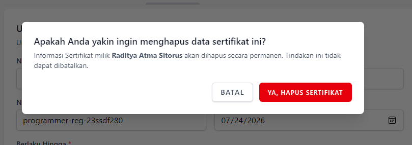

###  Halaman Data Master Skema

Halaman data master skema digunakan oleh admin untuk mengonfigurasi data master skema sertifikasi. Halaman ini merupakan pondasi utama sistem, karena data skema akan menjadi rujukan referensi bagi seluruh tahapan pendaftaran hingga penerbitan sertifikat. Pada Gambar \ref{fig:hal-skema-1}, halaman ini menampilkan tabel daftar skema yang menginformasikan nama skema beserta tombol akses untuk mengunduh format dokumen persyaratan, yakni APL 1, APL 2, dan format berkas asesmen (berupa .zip/.rar).

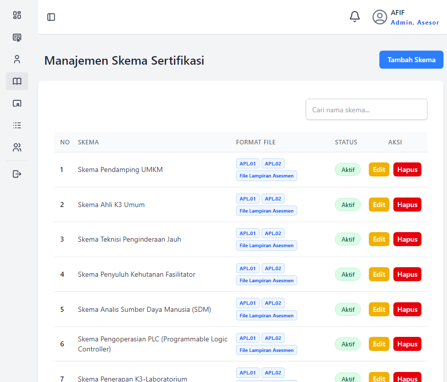

Modul ini telah dilengkapi dengan fungsionalitas CRUD (*Create, Read, Update, Delete*). Untuk penambahan dan pembaruan data (Gambar \ref{fig:hal-skema-2} dan Gambar \ref{fig:hal-skema-3}), sistem menyediakan formulir bagi admin mengisi nama skema, mengunggah ketiga format berkas kelengkapan, serta mengatur status ketersediaan skema melalui fitur *checkbox* ("Aktif" atau "Tidak Aktif"). Pengaturan status ini berfungsi sebagai kendali internal bagi admin, hanya skema dengan status "Aktif" yang akan muncul sebagai pilihan saat admin melakukan konfigurasi pembukaan jadwal sertifikasi baru.

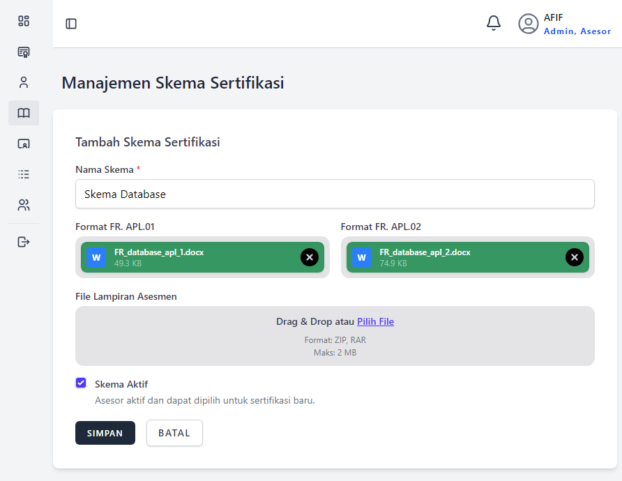

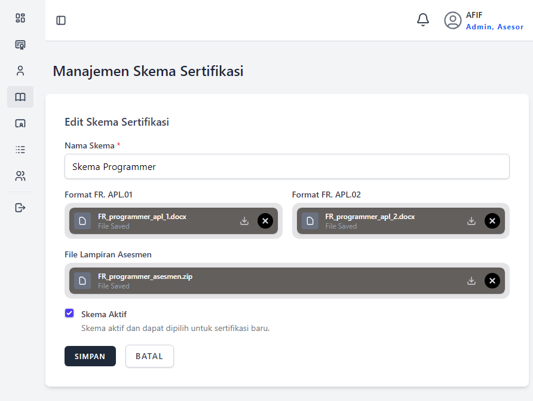

Sebagai langkah mitigasi kesalahan pengguna, fitur penghapusan data skema dilengkapi dengan modal konfirmasi (Gambar \ref{fig:hal-skema-4}). Sistem akan meminta konfirmasi ulang sebelum data skema benar-benar dihapus dari basis data.

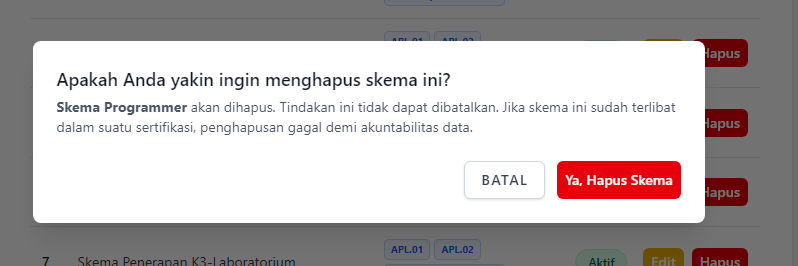

###  Halaman Asesor

Halaman Manajemen Asesor digunakan oleh admin untuk mengelola profil dan memetakan skema kompetensi data asesor. Pada Gambar \ref{fig:hal-asesor-1}, halaman ini menampilkan tabel daftar asesor yang menginformasikan nama asesor, daftar skema sertifikasi yang diampu, status keaktifan dan rekam jejak jumlah sertifikasi yang telah dilaksanakan oleh asesor bersangkutan.

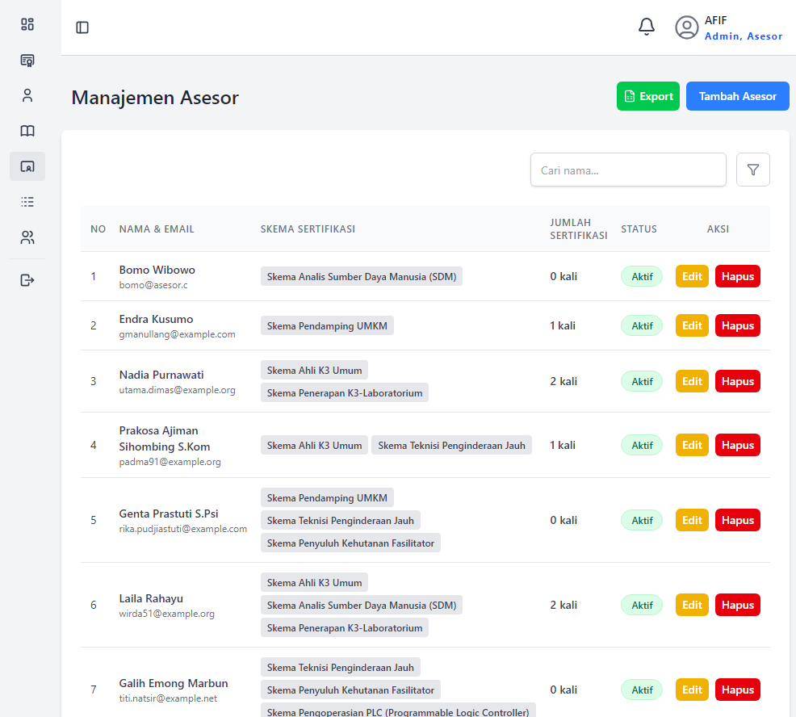

Modul ini telah dilengkapi dengan fungsionalitas CRUD. Untuk penambahan dan pembaruan data (Gambar \ref{fig:hal-asesor-2} dan Gambar \ref{fig:hal-asesor-3}), sistem menyediakan formulir bagi admin mengisi nama asesor, daftar skema yang diampu, serta mengatur status ketersediaan asesor melalui fitur *checkbox* ("Aktif" atau "Tidak Aktif"). Pengaturan status ini berfungsi sebagai kendali internal bagi admin, hanya asesor dengan status "Aktif" yang akan muncul sebagai pilihan saat admin melakukan konfigurasi pembukaan jadwal sertifikasi baru.

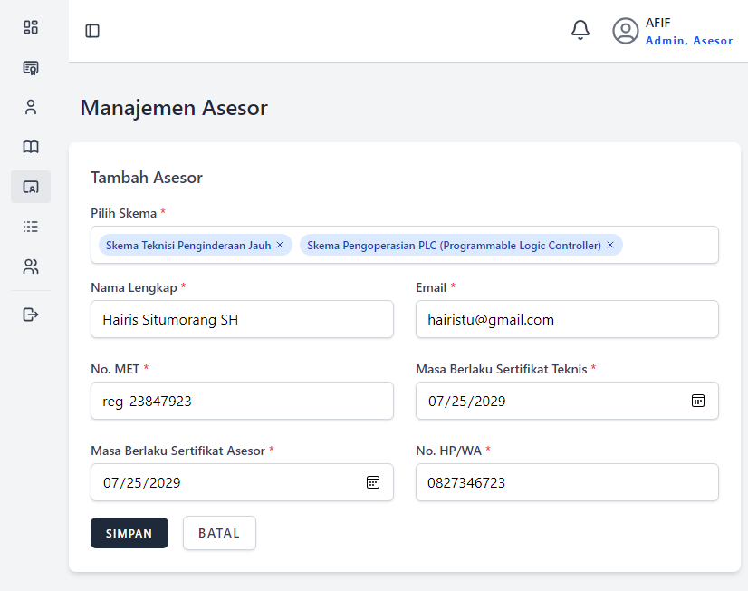

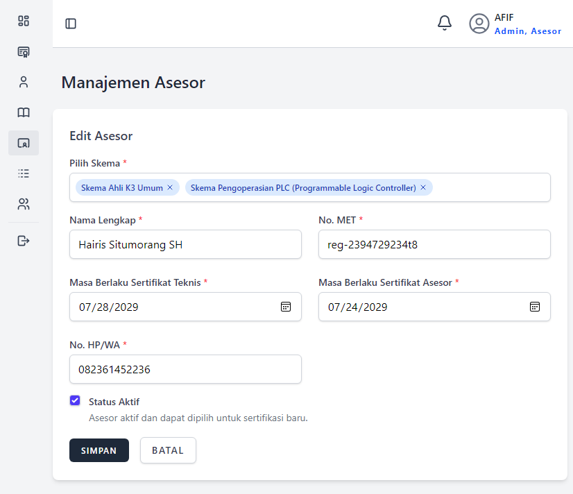

Sebagai langkah mitigasi kesalahan pengguna, fitur penghapusan data asesor dilengkapi dengan modal konfirmasi (Gambar \ref{fig:hal-asesor-4}). Sistem akan meminta konfirmasi ulang sebelum data asesor benar-benar dihapus dari basis data.

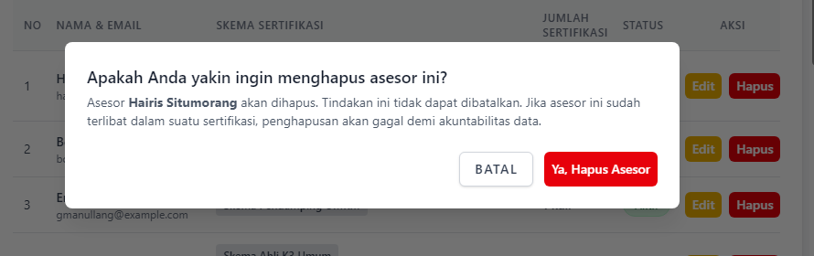

### Halaman Catatan Aktivitas Sistem

Halaman Catatan Aktivitas Sistem difungsikan sebagai fitur *audit trail* terpusat untuk merekam setiap mutasi data di dalam sistem. Fungsionalitas ini penting guna menjamin transparansi, akuntabilitas, serta keamanan operasional LSP. Pada antarmuka utama (Gambar \ref{fig:hal-log-sistem-1}), sistem menyajikan tabel riwayat aktivitas yang memuat kolom deskripsi tindakan, aktor yang mengeksekusi (*user*), waktu kejadian, serta tombol "Lihat" untuk melihat rincian lebih lanjut.

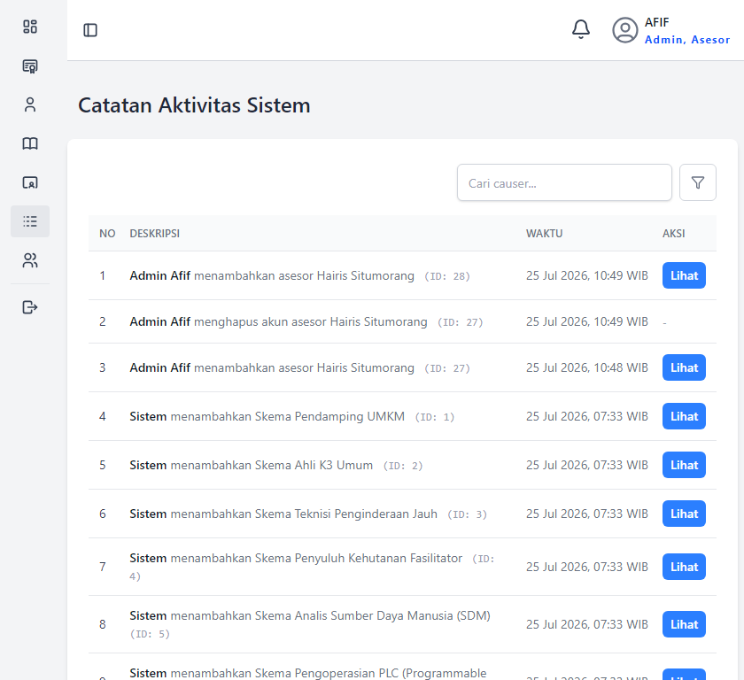

Apabila tombol "Lihat" pada salah satu baris data ditekan, sistem akan menampilkan antarmuka detail log aktivitas (Gambar \ref{fig:hal-log-sistem-2}) yang memuat identitas aktor, waktu kejadian, dan detail perubahan data. Perekaman data ini guna melacak siapa yang melakukan apa pada data skema sertifikasi, asesor, dan pengguna (penangguhan akun misalnya).

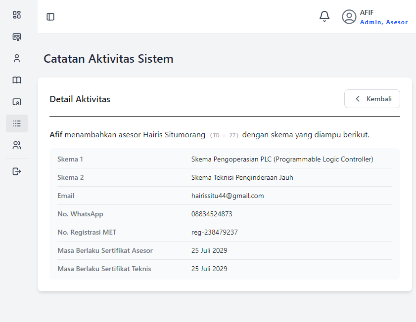

Tiap jadwal sertifikasi juga memiliki menu log aktivitas yang menampilkan kapan data jadwal itu dibuat, siapa yang melakukannya seperti pada (Gambar \ref{fig:hal-log-sistem-3}).

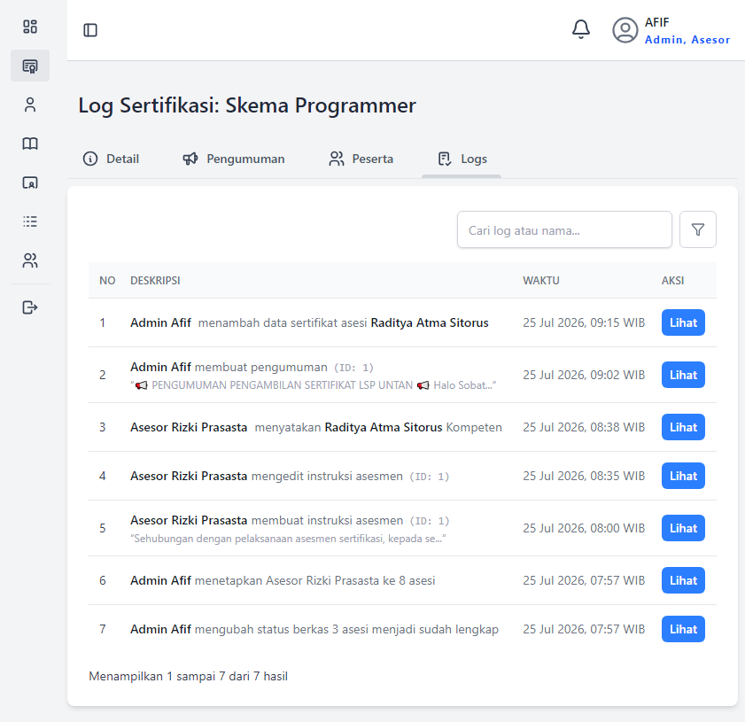

Apabila tombol "Lihat" pada salah satu baris data ditekan, sistem akan menampilkan antarmuka detail log aktivitas (Gambar \ref{fig:hal-log-sistem-4}) yang memuat identitas aktor, waktu kejadian, dan detail perubahan data. Perekaman data ini guna melacak siapa yang melakukan apa pada jadwal sertifikasi tertentu.

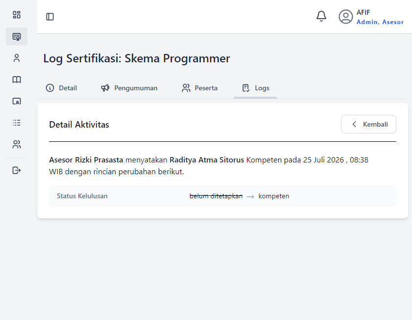

###  Halaman Daftar Pengguna

Halaman Manajemen Akun berfungsi sebagai pusat kendali bagi admin untuk memantau dan mengelola seluruh akun yang terdaftar di dalam sistem. Pada antarmuka utama (Gambar \ref{fig:hal-kelola-user-1}), sistem menyajikan tabel daftar pengguna yang memuat kolom nama, *email*, *role*, tanggal registrasi akun, waktu verifikasi *email*, serta dua tombol aksi, yakni tombol "Edit" dan tombol pengendalian akses ("*Ban*" atau "*Unban*").

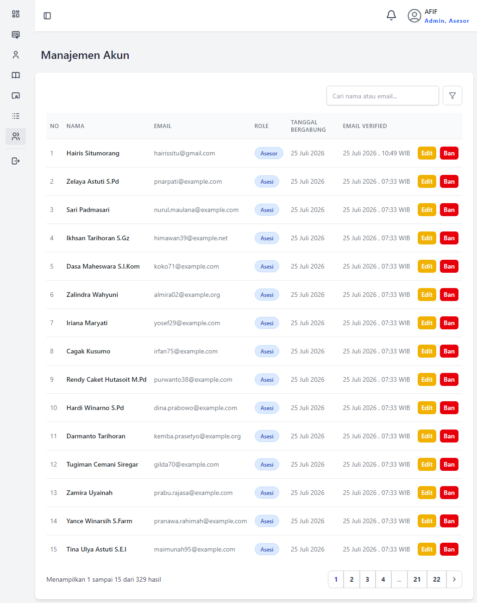

Saat tombol "Edit" ditekan, sistem menampilkan formulir modifikasi profil pengguna (Gambar \ref{fig:hal-kelola-user-2}). Admin hanya bisa mengubah nama dan nomor telepon.

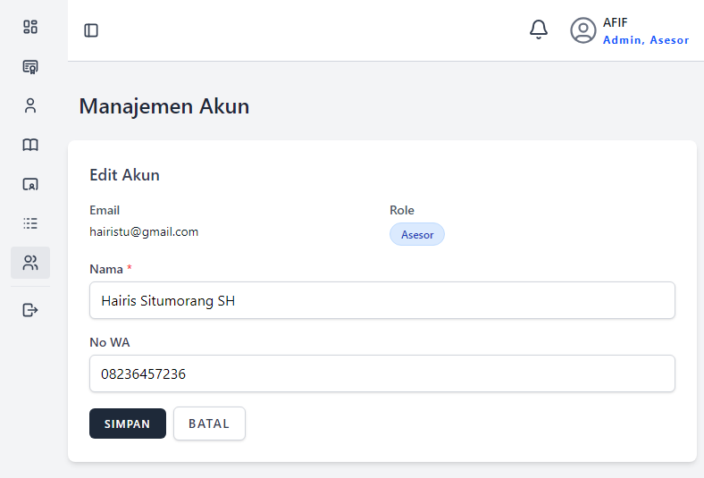

Sebagai mitigasi terhadap anomali pengguna atau pelanggaran sistem, sistem dilengkapi dengan fitur penangguhan akun. Ketika tombol "*Ban*" ditekan, sistem akan menampilkan modal konfirmasi (Gambar \ref{fig:hal-kelola-user-3}) untuk menghindari penangguhan yang tidak disengaja. Pengguna yang telah ditangguhkan tidak akan bisa *login*. Sistem memberikan umpan balik visual, tombol "*Ban*" berwarna merah pada akun yang ditangguhkan akan berubah menjadi tombol "*Unban*" berwarna hijau (Gambar \ref{fig:hal-kelola-user-4}).

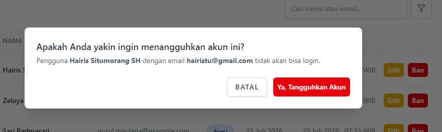

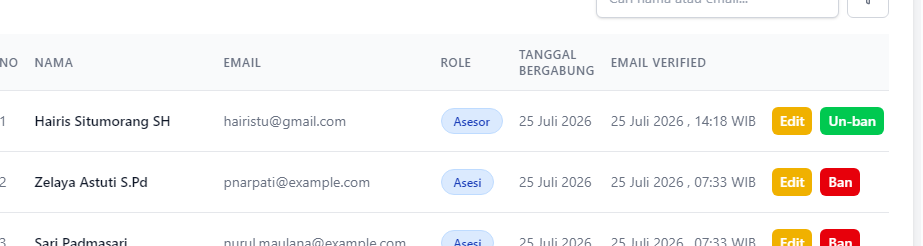

Untuk memulihkan akun, admin dapat menekan tombol "*Unban*" tersebut yang akan menampilkan modal konfirmasi (Gambar \ref{fig:hal-kelola-user-5}). Dan pengguna yang dipulihkan akunnya dapat kembali *login*.

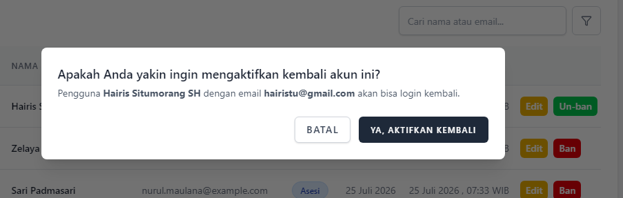

### *Add to Home Screen* (A2HS)

Sebagai upaya untuk meningkatkan aksesibilitas dan mobilitas pengguna, aplikasi LSP ini telah dirancang dengan mengadopsi standar PWA. Salah satu implementasi utama dari arsitektur PWA pada sistem ini adalah ketersediaan fitur *Add to Home Screen*. Alur pengunduhan PWA melalui fitur ini pada perangkat asesi direpresentasikan secara kronologis pada Gambar \ref{fig:pwa-flow-1} hingga Gambar \ref{fig:pwa-flow-4}.

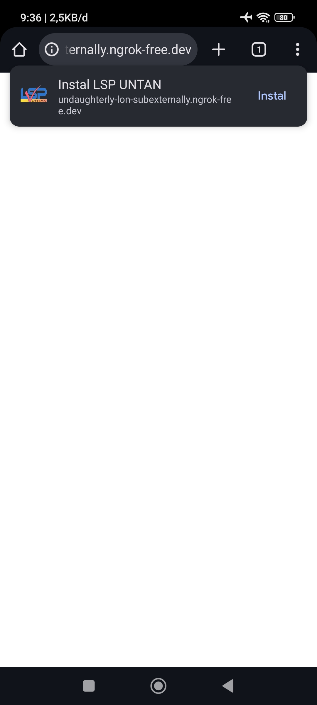{width=6cm}

Gambar \ref{fig:pwa-flow-1} menampilkan antarmuka saat asesi mengakses sistem melalui *browser* untuk pertama kalinya. Untuk memasang aplikasi, asesi dapat mengakses opsi A2HS melalui menu bawaan *browser* seperti yang ditunjukkan pada Gambar \ref{fig:pwa-flow-2}. Setelah opsi tersebut ditekan, *browser* akan menampilkan kotak dialog konfirmasi (Gambar \ref{fig:pwa-flow-3}) untuk memverifikasi persetujuan tindakan pengunduhan oleh pengguna (*user consent*).

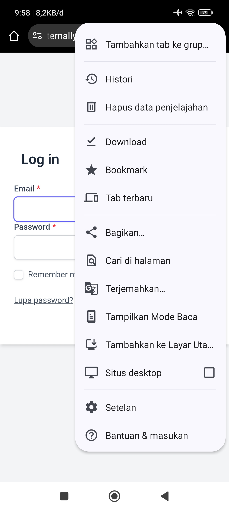{width=6cm}

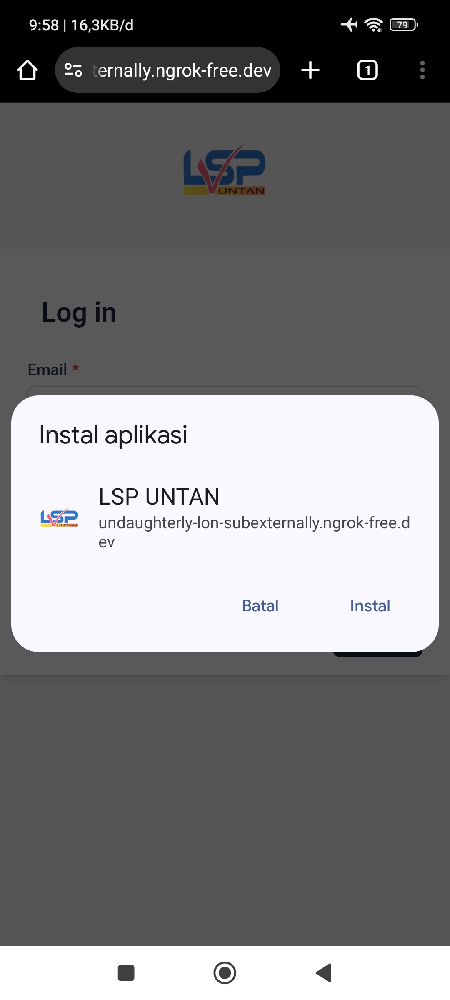{width=6cm}

Konfirmasi pada tahap ini akan mengeksekusi proses pembuatan pintasan terintegrasi. Gambar \ref{fig:pwa-flow-4} mengilustrasikan hasil akhir dari proses tersebut, di mana ikon aplikasi "LSP UNTAN" kini telah terpasang secara permanen pada layar utama perangkat asesi, bersanding dengan aplikasi *native* lainnya. Pintasan ini secara signifikan meningkatkan pengalaman pengguna karena aplikasi dapat diakses secara instan hanya dengan satu ketukan, tanpa mengharuskan pengguna membuka *browser* dan mengetikkan URL secara manual pada kunjungan berikutnya.

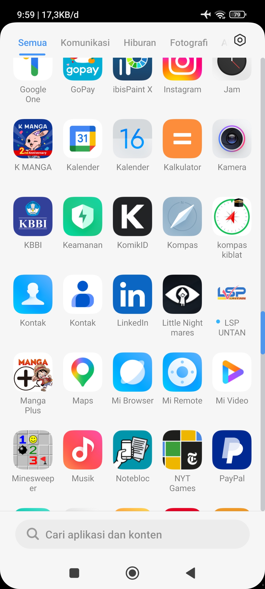{width=6cm}

Gambar \ref{fig:pwa-flow-5} menampilkan aplikasi saat dibuka melalui ikon aplikasi, aplikasi berjalan tanpa menampilkan bilah navigasi *browser* (seperti *address bar* dan menu opsi), sehingga memberikan pengalaman antarmuka yang tampak menyerupai aplikasi *native*.

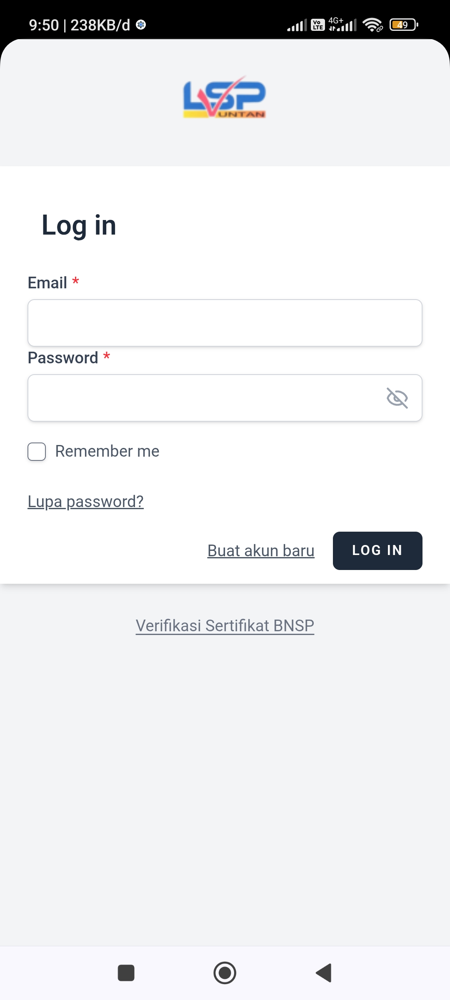{width=6cm}

### *Push Notification*

Selain kemudahan pengunduhan, implementasi arsitektur PWA pada sistem ini juga mencakup kapabilitas pengiriman pesan berbasis *push notification*. Fitur ini memastikan asesi tidak akan melewatkan informasi krusial dari LSP, karena pemberitahuan akan tetap diterima secara *real-time* dan muncul mengambang pada layar perangkat, meskipun aplikasi sedang tidak dibuka atau berjalan di latar belakang.

Di halaman profil, integrasi pengaturan *push notification* yang direpresentasikan melalui komponen *toggle switch* (Gambar \ref{fig:hal-izin-notif-1}). Fitur ini memberikan kuasa penuh kepada asesi terkait preferensi penerimaan informasi. Saat *toggle* ditekan untuk mengaktifkan notifikasi, sistem akan memunculkan modal konfirmasi (Gambar \ref{fig:hal-izin-notif-2}).

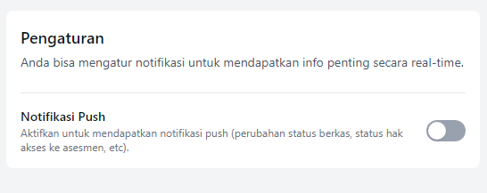

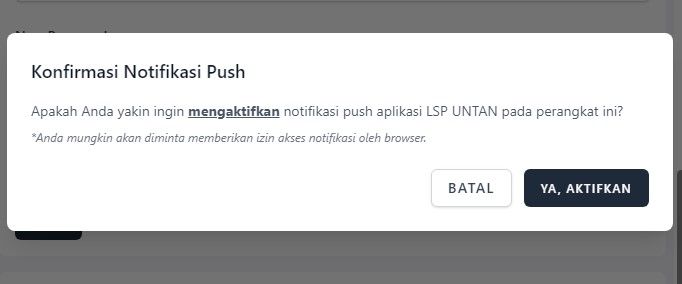

Apabila izin diberikan, sistem akan melakukan permintaan ke *server* Firebase Cloud Messaging (FCM) untuk membuat token unik perangkat. Setelah token berhasil disimpan di basis data, antarmuka akan memberikan umpan balik (Gambar \ref{fig:hal-izin-notif-3}) berupa perubahan status *toggle* menjadi aktif dan indikator teks "Notifikasi aktif untuk perangkat ini".

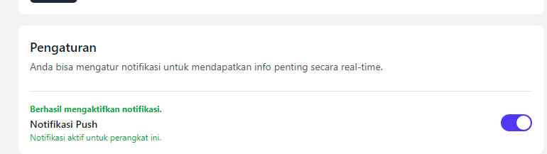

Apabila *toggle* ditekan kembali, antarmuka akan menampilkan modal konfirmasi penonaktifan (Gambar \ref{fig:hal-izin-notif-4}). Konfirmasi pada tahap ini akan mengeksekusi perintah penghapusan nilai fcm_token pada tabel *users*, sehingga tidak akan bisa lagi menerima *push notification*. Dan akan menampilkan *feedback* izin *push notification* berhasil dihapus (Gambar \ref{fig:hal-izin-notif-5}).

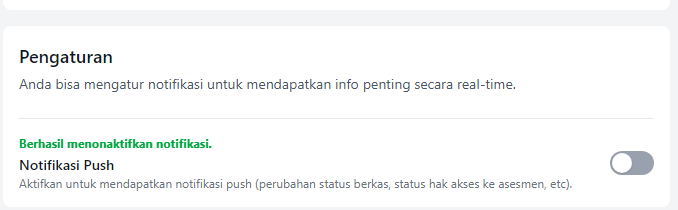

Gambar \ref{fig:notif-mengambang-1} hingga Gambar \ref{fig:notif-mengambang-3} menampilkan contoh antarmuka perangkat asesi ketika menerima berbagai skenario *push notification* dari sistem. Gambar \ref{fig:notif-mengambang-1} menunjukkan notifikasi otomatis yang terpicu ketika admin telah menerbitkan status kelulusan final asesi. Jika notifikasi tersebut ditekan maka akan langsung membuka aplikasinya di halaman yang sesuai.

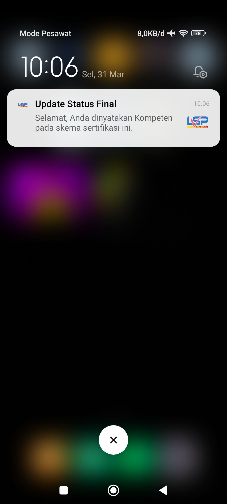{width=6cm}

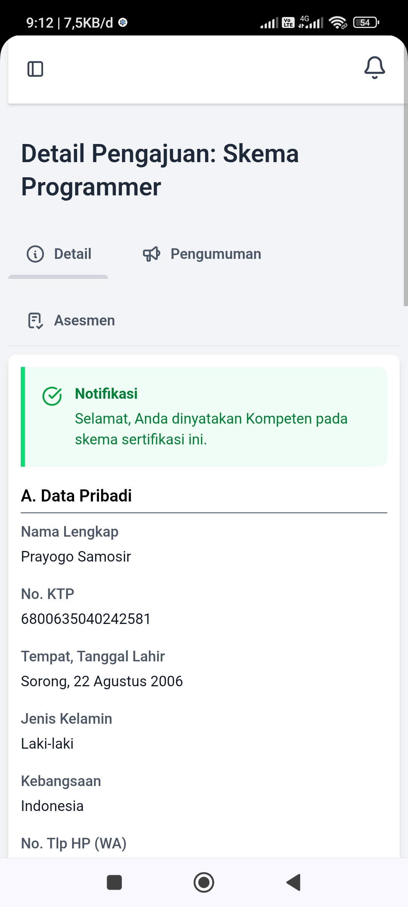{width=6cm}

Sementara itu, Gambar \ref{fig:notif-mengambang-2} mengilustrasikan pemberitahuan yang diterima asesi terkait hasil pembaruan verifikasi berkas persyaratan asesmen mereka, sehingga asesi dapat segera melakukan tindakan lanjutan jika terdapat berkas yang perlu perbaikan. Jika notifikasi tersebut ditekan maka akan langsung membuka aplikasinya di halaman yang sesuai (Gambar \ref{fig:notif-mengambang-2-hasil}).

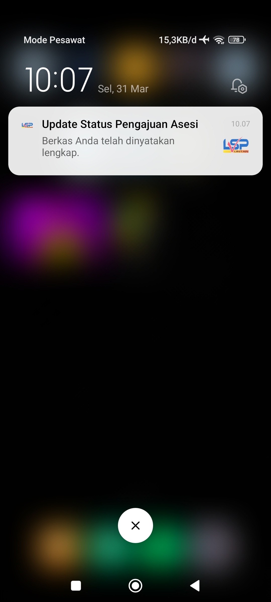{width=6cm}

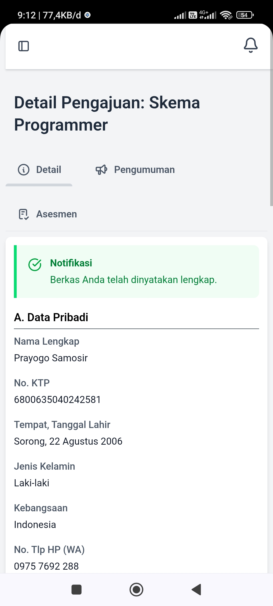{width=6cm}

Skenario lainnya ditunjukkan pada Gambar \ref{fig:notif-mengambang-3}, di mana sistem mengirimkan notifikasi secara serentak kepada seluruh asesi yang terdaftar apabila terdapat pengumuman baru. Ketiga contoh skenario ini membuktikan bahwa arsitektur PWA mampu menawarkan fungsionalitas yang setara dengan aplikasi *native* dalam hal interaktivitas dan keterlibatan pengguna.

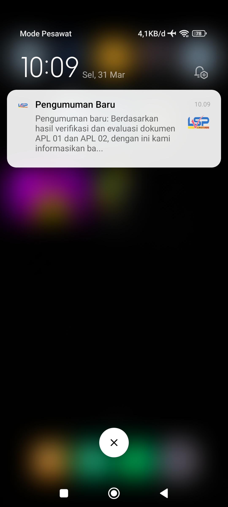{width=6cm}

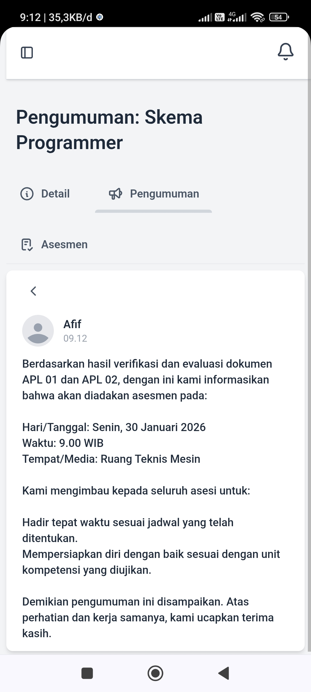{width=6cm}

### Implementasi Fitur Keamanan dan Otorisasi Akses

Untuk memenuhi aspek keamanan data dan mencegah akses berkas tanpa wewenang, sistem menerapkan mekanisme otorisasi berbasis Laravel \textit{Policy}. Fitur ini memastikan bahwa setiap berkas/data pendaftaran hanya dapat diakses oleh tiga pihak yang berhak, yaitu admin, asesor yang ditugaskan, dan asesi pemilik berkas tersebut. Jika pengguna berusaha mengakses berkas milik pengguna lain melalui manipulasi URL, sistem akan menolak akses secara otomatis dan menampilkan halaman respons khusus 403 \textit{Forbidden} seperti yang ditunjukkan pada Gambar \ref{fig:halaman-403}.

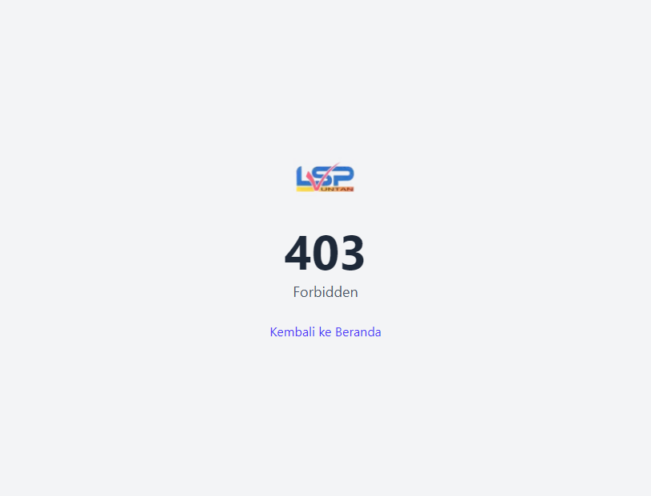

## *Black Box Testing*

Setelah seluruh antarmuka dan logika bisnis sistem selesai diimplementasikan, tahap selanjutnya adalah melakukan pengujian. Pengujian ini menggunakan metode *black box testing*, yang bertujuan untuk memvalidasi apakah setiap fitur, masukan, dan keluaran pada sistem telah berjalan sesuai dengan spesifikasi kebutuhan sistem yang didefinisikan sebelumnya.

### Hasil Pengujian Umum

Pengujian pertama difokuskan pada fungsionalitas yang melibatkan semua aktor, artinya semua aktor bisa melakukannya. Adapun rincian skenario beserta status keberhasilan dari pengujian umum pada Tabel \ref{tab:pengujian-umum} berikut.

\captionsetup[longtable]{justification=raggedright, singlelinecheck=false}
\setlength{\LTcapwidth}{13cm}
\addtolength{\LTcapwidth}{10\tabcolsep}
\addtolength{\LTcapwidth}{6\arrayrulewidth}
\begin{longtable}{|p{1cm}|p{3cm}|p{3.5cm}|p{4.5cm}|>{\raggedright\arraybackslash}p{1cm}|}
\caption{Tabel Hasil Pengujian Umum} \label{tab:pengujian-umum} \\
\hline
\textbf{ID Tes} & \textbf{Skenario Pengujian} & \textbf{Input} & \textbf{Output yang diharapkan} & \textbf{Status} \\ \hline
\endfirsthead \hline
\textbf{ID Tes} & \textbf{Skenario Pengujian} & \textbf{Input} & \textbf{Output yang diharapkan} & \textbf{Status} \\ \hline
\endhead \hline
\endfoot
TC-01 & Autentikasi \textit{login} & Memasukkan \textit{email} dan kata sandi yang telah terdaftar & Masuk ke \textit{dashboard} sesuai hak akses (admin/asesor/asesi) & Sesuai \\ \hline
TC-02 & Perizinan \textit{push notification} & Mengakses halaman profil dan menekan \textit{toggle} notifikasi & Pengguna dapat menerima \textit{push notification} & Sesuai \\ \hline
\end{longtable}

### Hasil Pengujian Asesi

Fase pengujian kedua difokuskan pada fungsionalitas yang melibatkan aktor asesi. Adapun rincian skenario beserta status keberhasilan dari pengujian asesi pada Tabel \ref{tab:pengujian-asesi} berikut.

\captionsetup[longtable]{justification=raggedright, singlelinecheck=false}
\setlength{\LTcapwidth}{13cm}
\addtolength{\LTcapwidth}{10\tabcolsep}
\addtolength{\LTcapwidth}{6\arrayrulewidth}
\begin{longtable}{|p{1cm}|p{3cm}|p{3.5cm}|p{4.5cm}|>{\raggedright\arraybackslash}p{1cm}|}
\caption{Tabel Hasil Pengujian Asesi} \label{tab:pengujian-asesi} \\
\hline
\textbf{ID Tes} & \textbf{Skenario Pengujian} & \textbf{Input} & \textbf{Output yang diharapkan} & \textbf{Status} \\ \hline
\endfirsthead \hline
\textbf{ID Tes} & \textbf{Skenario Pengujian} & \textbf{Input} & \textbf{Output yang diharapkan} & \textbf{Status} \\ \hline
\endhead \hline
\endfoot
TC-03 & Pendaftaran akun asesi & Memasukkan \textit{email} valid dan kata sandi, lalu menekan tombol ``Daftar'' & Data tersimpan ke basis data dan diarahkan ke halaman \textit{dashboard} & Sesuai \\ \hline
TC-04 & Menampilkan ringkasan data \textit{dashboard} asesi & Mengakses halaman \textit{dashboard} & Menampilkan status pendaftaran dan kartu informasi sertifikasi & Sesuai \\ \hline
TC-05 & Pemilihan jadwal sertifikasi pada katalog yang tersedia & Menekan tombol ``Daftar'' pada salah satu jadwal sertifikasi & Sistem mengarahkan ke halaman formulir pengajuan & Sesuai \\ \hline
TC-06 & Pengunggahan dokumen persyaratan sertifikasi dan pengisian data diri & Menginput data diri lengkap dan mengunggah seluruh dokumen persyaratan, lalu menekan tombol ``Daftar'' & Sistem menyimpan data dan mengirimkan \textit{push notification} ke perangkat admin, diarahkan ke halaman detail asesi. Halaman menampilkan data yang diinput dengan status berkas: menunggu verifikasi admin, asesor: belum ditetapkan, dan status final: belum ditetapkan & Sesuai \\ \hline
TC-07 & Mengakses jadwal sertifikasi yang sudah didaftar pada tab ``Tersedia'' & Menekan tombol ``Lihat Status'' pada kartu jadwal yang sudah didaftar sebelumnya & Sistem mengarahkan ke halaman detail asesi. & Sesuai \\ \hline
TC-08 & Pemutakhiran data profil asesi & Mengubah data kontak pada menu profil dan menekan tombol ``Simpan'' & Data profil diperbarui dan sinkron dengan formulir pengajuan & Sesuai \\ \hline
TC-09 & Mengakses halaman pengumuman & Menekan tab ``Pengumuman'' pada halaman detail asesi. & Sistem menampilkan daftar seluruh pengumuman yang dibuat oleh admin atau asesor & Sesuai \\ \hline
TC-10 & Menampilkan detail pengumuman & Menekan tombol ``Buka Pengumuman'' pada salah satu pengumuman & Sistem menampilkan detail pengumuman dan menyembunyikan daftar pengumuman lainnya & Sesuai \\ \hline
TC-11 & Validasi hak akses menu asesmen (terkunci) & Mengakses menu asesmen saat status berkas belum diverifikasi atau belum lengkap & Sistem menampilkan ikon gembok di samping menu asesmen, menu tidak dapat ditekan, dan asesi tidak bisa masuk ke halaman asesmen & Sesuai \\ \hline
TC-12 & Akses halaman asesmen & Mengakses menu asesmen saat status berkas sudah lengkap sudah diberikan & Halaman menampilkan detail instruksi asesmen dari asesor terkait dan menampilkan formulir unggah berkas asesmen & Sesuai \\ \hline
TC-13 & Unggah tugas asesmen & Mengunggah berkas tugas asesmen & Status pada halaman berubah menjadi ``Sudah Dikumpulkan'' dan sistem mengirimkan \textit{push notification} kepada asesor terkait & Sesuai \\ \hline
TC-14 & Otorisasi pengaksesan berkas & Asesi mengakses berkas pendaftaran miliknya via URL & Berkas berhasil diunduh/ditampilkan & Sesuai \\ \hline
TC-15 & Otorisasi pengaksesan berkas asesi oleh asesi yang tidak berhak & Asesi mengakses URL berkas milik asesi lain & Sistem menolak akses dan menampilkan halaman 403 \textit{Forbidden} & Sesuai \\ \hline

\end{longtable}

### Hasil Pengujian Asesor

Fase pengujian ketiga difokuskan pada fungsionalitas yang melibatkan aktor asesor. Adapun rincian skenario beserta status keberhasilan dari pengujian asesor pada Tabel \ref{tab:pengujian-asesor} berikut.

\captionsetup[longtable]{justification=raggedright, singlelinecheck=false}
\setlength{\LTcapwidth}{13cm}
\addtolength{\LTcapwidth}{10\tabcolsep}
\addtolength{\LTcapwidth}{6\arrayrulewidth}
\begin{longtable}{|p{1cm}|p{3cm}|p{3.5cm}|p{4.5cm}|>{\raggedright\arraybackslash}p{1cm}|}
\caption{Tabel Hasil Pengujian Asesor} \label{tab:pengujian-asesor} \\
\hline
\textbf{ID Tes} & \textbf{Skenario Pengujian} & \textbf{Input} & \textbf{Output yang diharapkan} & \textbf{Status} \\ \hline
\endfirsthead \hline
\textbf{ID Tes} & \textbf{Skenario Pengujian} & \textbf{Input} & \textbf{Output yang diharapkan} & \textbf{Status} \\ \hline
\endhead \hline
\endfoot
TC-16 & Pengelolaan pengumuman & Menekan tombol ``Tambah Pengumuman'', mengisi detail pengumuman, dan menyimpan (termasuk edit/hapus) & Data pengumuman berhasil disimpan/diperbarui di basis data, sistem mengirimkan \textit{push notification} kepada asesi terkait, dan muncul pada tampilan halaman pengumuman asesi & Sesuai \\ \hline
TC-17 & Validasi hak akses pengelolaan pengumuman asesor lain & Mengakses halaman pengumuman & Tombol ``Edit'' dan ``Hapus'' dari pengumuman yang dibuat asesor lain tidak muncul (disembunyikan) pada antarmuka. & Sesuai \\ \hline
TC-18 & Pengelolaan instruksi asesmen & Menekan tombol ``Buat Asesmen'', mengisi detail tugas, dan menyimpan (termasuk edit/hapus) & Data instruksi berhasil disimpan/diperbarui di basis data, sistem mengirimkan \textit{push notification} kepada asesi terkait, dan muncul pada tampilan halaman asesmen asesi & Sesuai \\ \hline
TC-19 & Pemeriksaan dokumen unggahan asesi pada menu asesmen & Menekan tombol ``Lihat'' pada data asesi yang sudah mengunggah tugas di halaman asesmen mereka, lalu menekan tombol ``Lihat'' pada dokumen yang telah diunggah & Sistem menampilkan detail unggahan asesi dan \textit{browser} mengunduh dokumen yang diunggah asesi. & Sesuai \\ \hline
TC-20 & Penetapan hasil akhir asesi & Menekan tombol ``Detail'' pada data asesi, lalu mengubah status akhir menjadi ``Kompeten'' atau ``Belum Kompeten'' atau ``Diskualifikasi''. & Status akhir asesi diperbarui di basis data dan sistem mengirimkan \textit{push notification} kepada asesi terkait. & Sesuai \\ \hline
TC-21 & Validasi logika tombol ``Catat Sertifikat'' & Mengakses detail asesi & Tombol ``Catat Sertifikat'' tidak muncul (disembunyikan) pada antarmuka halaman detail asesi yang kompeten karena hanya admin yang berhak mencatatnya. & Sesuai \\ \hline
TC-22 & Otorisasi pengaksesan berkas asesi oleh asesor yang tidak berhak & Asesor yang tidak ditugaskan mengakses URL berkas asesi & Sistem menolak akses dan menampilkan halaman 403 \textit{Forbidden} & Sesuai \\ \hline

\end{longtable}

### Hasil Pengujian Admin

Fase pengujian keempat difokuskan pada fungsionalitas yang melibatkan aktor admin. Adapun rincian skenario beserta status keberhasilan dari pengujian admin pada Tabel \ref{tab:pengujian-admin} berikut.

\captionsetup[longtable]{justification=raggedright, singlelinecheck=false}
\setlength{\LTcapwidth}{13cm}
\addtolength{\LTcapwidth}{10\tabcolsep}
\addtolength{\LTcapwidth}{6\arrayrulewidth}
\begin{longtable}{|p{1cm}|p{3cm}|p{3.5cm}|p{4.5cm}|>{\raggedright\arraybackslash}p{1cm}|}
\caption{Tabel Hasil Pengujian Admin} \label{tab:pengujian-admin} \\
\hline
\textbf{ID Tes} & \textbf{Skenario Pengujian} & \textbf{Input} & \textbf{Output yang diharapkan} & \textbf{Status} \\ \hline
\endfirsthead \hline
\textbf{ID Tes} & \textbf{Skenario Pengujian} & \textbf{Input} & \textbf{Output yang diharapkan} & \textbf{Status} \\ \hline
\endhead \hline
\endfoot
TC-23 & Visualisasi statistik data pada \textit{dashboard} admin & Mengakses halaman \textit{dashboard} admin & Menampilkan grafik dan \textit{widget} data & Sesuai \\ \hline
TC-24 & Pengelolaan data master skema sertifikasi & Menambah, mengubah, atau menghapus data skema & Perubahan data skema berhasil tersimpan ke basis data & Sesuai \\ \hline
TC-25 & Pengelolaan data master asesor & Menambah, mengubah, atau menghapus data pada asesor & Perubahan data asesor berhasil tersimpan ke basis data & Sesuai \\ \hline
TC-26 & Pengelolaan data jadwal sertifikasi & Memasukkan skema, jadwal, biaya, penugasan asesor dsb. Juga mengedit data tersebut. & Perubahan data sertifikasi berhasil tersimpan/diperbarui ke basis data. Jadwal sertifikasi yang dimulai muncul di halaman daftar sertifikasi di sisi asesi & Sesuai \\ \hline
TC-27 & Pengelolaan pengumuman & Menekan tombol ``Tambah Pengumuman'', mengisi detail pengumuman, dan menyimpan (termasuk edit/hapus) & Data pengumuman berhasil disimpan/diperbarui di basis data, sistem mengirimkan \textit{push notification} kepada asesi terkait, dan muncul pada tampilan halaman pengumuman asesi & Sesuai \\ \hline
TC-28 & Verifikasi kelengkapan berkas asesi & Mengubah status berkas asesi & Perubahan data diperbarui ke basis data, sistem mengirimkan \textit{push notification} kepada asesi terkait. & Sesuai \\ \hline
TC-29 & Penugasan asesor kepada asesi & Membuka halaman detail asesi dan menetapkan asesor kepada asesi & Perubahan data diperbarui ke basis data, sistem mengirimkan \textit{push notification} kepada asesi terkait. & Sesuai \\ \hline
TC-30 & Pencatatan data sertifikat & Mengakses halaman asesi berstatus ``Kompeten''. Menekan tombol ``Catat Sertifikat'', mengisi nomor seri, nomor sertifikat, nomor registrasi, tanggal terbit, dan masa berlaku, kemudian menyimpan formulir. & Data sertifikat berhasil tersimpan ke dalam basis data dan informasi sertifikat aktif untuk keperluan verifikasi publik. & Sesuai \\ \hline
TC-31 & Akses halaman log aktivitas sistem & Mengakses menu Log dan menekan tombol ``Detail'' pada salah satu baris data & Sistem menampilkan daftar log aktivitas sistem dan riwayat aktivitas (siapa melakukan apa) serta detail perubahan data (\textit{old value} dan \textit{new value}) secara rinci & Sesuai \\ \hline
TC-32 & Akses Halaman daftar pengguna & Mengakses menu kelola pengguna & Sistem menampilkan daftar pengguna yang terdaftar di sistem & Sesuai \\ \hline
TC-33 & Penangguhan akses pengguna & Pada halaman daftar pengguna, menekan tombol ``\textit{Ban}'' pada pengguna & Pengguna tersebut tidak bisa melakukan \textit{login} ke dalam sistem & Sesuai \\ \hline
TC-34 & Pemulihan akses pengguna & Menekan tombol ``\textit{Un-ban}'' pada pengguna yang ditangguhkan akunnya & Pengguna tersebut kini bisa \textit{login} kembali ke dalam sistem. & Sesuai \\ \hline
\end{longtable}

## *Lighthouse Testing*

*Lighthouse testing* dilakukan untuk mengukur kualitas aplikasi web secara keseluruhan, khususnya dalam memenuhi standar PWA. Pengujian ini mencakup 4 metrik utama: *Performance*, *Accessibility*, *Best Practices*, dan SEO. Pengujian dilakukan pada halaman utama aplikasi (*Dashboard*) menggunakan *DevTools Lighthouse* bawaan *browser*. Ringkasan hasil pengujian dapat dilihat pada Tabel \ref{tab:pengujian-lighthouse} berikut.

\captionsetup[longtable]{justification=raggedright, singlelinecheck=false}
\setlength{\LTcapwidth}{11cm}
\addtolength{\LTcapwidth}{8\tabcolsep}
\addtolength{\LTcapwidth}{5\arrayrulewidth}
\begin{longtable}{|>{\centering\arraybackslash}p{1cm}|p{4.5cm}|>{\centering\arraybackslash}p{2.5cm}|>{\centering\arraybackslash}p{3cm}|}
\caption{Tabel Hasil \textit{Lighthouse Testing} } \label{tab:pengujian-lighthouse} \\
\hline
\textbf{No} & \textbf{Kategori Metrik} & \textbf{Skor} & \textbf{Status} \\ \hline
\endfirsthead \hline
\textbf{No} & \textbf{Kategori Metrik} & \textbf{Skor} & \textbf{Status} \\ \hline
\endhead \hline
\endfoot
1 & \textit{Performance} & 87 & Cukup \\ \hline
2 & \textit{Accessibility} & 100 & Baik \\ \hline
3 & \textit{Best Practices} & 100 & Baik \\ \hline
4 & SEO & 100 & Baik \\ \hline
\end{longtable}

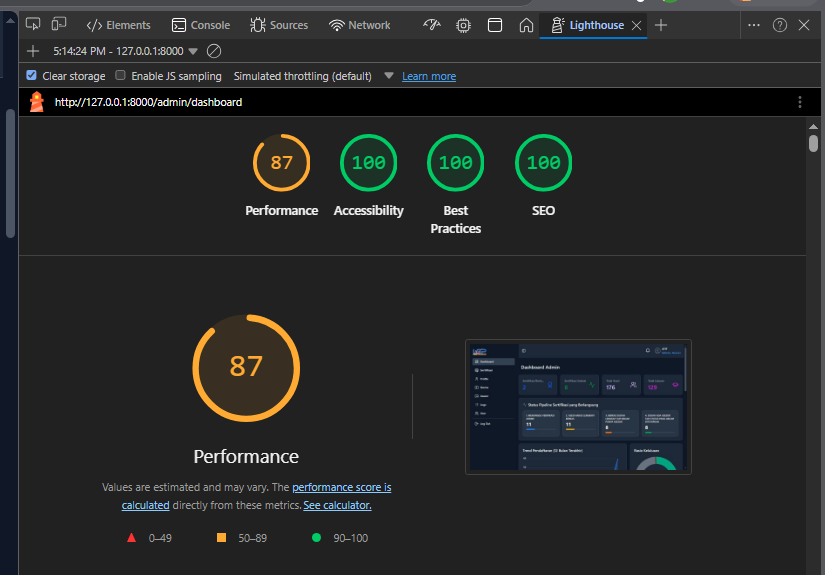

Berdasarkan Tabel \ref{tab:pengujian-lighthouse} dan Gambar \ref{fig:lighthouse-test}, dapat dilihat bahwa hasil pengujian otomatis menggunakan Google \textit{Lighthouse} menunjukkan performa sistem yang sangat baik. Aplikasi berhasil meraih nilai sempurna (100) pada kategori \textit{Accessibility}, \textit{Best Practices}, dan SEO. Hal ini membuktikan bahwa arsitektur antarmuka dan struktur kode yang dirancang telah memenuhi kriteria aksesibilitas digital secara inklusif, menerapkan praktik pengembangan web modern, serta memiliki kelengkapan \textit{meta tag} utama (seperti \textit{title}, \textit{description}, dan \textit{viewport}) yang optimal untuk indeksasi mesin pencari.

Namun, pada kategori \textit{Performance} (mode \textit{Desktop}), sistem mendapatkan skor keseluruhan sebesar 87 (kategori Cukup). Skor ini diperoleh berdasarkan lima metrik utama, dengan rincian capaian sebagai berikut:

\begin{enumerate}
    \item \textbf{\textit{First Contentful Paint} (FCP):} Mencapai 1,4 s (masuk kategori \textit{Moderate}, berada dalam rentang ambang batas 0,9--1,6 s).
    \item \textbf{\textit{Speed Index} (SI):} Mencapai 1,6 s (masuk kategori \textit{Moderate}, berada dalam rentang ambang batas 1,3--2,3 s).
    \item \textbf{\textit{Largest Contentful Paint} (LCP):} Mencapai 1,6 s (masuk kategori \textit{Moderate}, berada dalam rentang ambang batas 1,2--2,4 s).
    \item \textbf{\textit{Total Blocking Time} (TBT):} Mencapai 110 ms (masuk kategori \textit{Fast}, berada di bawah batas maksimum 150 ms).
    \item \textbf{\textit{Cumulative Layout Shift} (CLS):} Mencapai 0 (masuk kategori \textit{Fast}, berada di bawah batas maksimum 0,1).
\end{enumerate}

Capaian skor akumulatif \textit{Performance} sebesar 87 ini dipengaruhi oleh tiga metrik utama (FCP, SI, dan LCP) yang masih berada pada kategori \textit{Moderate}. Selain itu, algoritma pembobotan \textit{Lighthouse} juga memberikan penalti berdasarkan temuan beberapa poin rekomendasi teknis pada bagian \textit{Insights} dan \textit{Diagnostics}. Rekomendasi tersebut memerlukan analisis lebih lanjut terkait kondisi teknis sistem dan \textit{environment} pengujian, di antaranya:

1. \textbf{\textit{Use Efficient Cache Lifetimes} dan \textit{Document Request Latency}}: Kedua rekomendasi ini muncul akibat keterbatasan karakteristik \textit{server} pengembangan lokal (php artisan serve). Pada lingkungan lokal, \textit{server} bawaan belum mengonfigurasi \textit{header} HTTP untuk manajemen \textit{caching} (\textit{Cache-Control}) secara optimal dan belum menerapkan fitur kompresi berkas (seperti Gzip). Hambatan ini bersifat sementara karena pada lingkungan \textit{production} berbasis \textit{web server} (seperti Nginx atau Apache), fitur kompresi dan pengelolaan \textit{cache} dapat diaktifkan secara penuh. Pengaktifan fitur tersebut pada \textit{server production} diperkirakan dapat mereduksi transfer data dokumen hingga 41 KiB serta mengoptimalkan pemuatan ulang aset statis sebesar 587 KiB.

2. \textbf{\textit{Reduce Unused JavaScript}}: Saran ini merujuk pada beberapa bagian kode di dalam berkas app.js yang dinilai tidak dieksekusi saat halaman \textit{Dashboard} pertama kali dimuat. Hal ini merupakan karakteristik bawaan dari arsitektur \textit{single page application} (SPA) berbasis Inertia.js. Penggunaan fungsi import.meta.glob untuk pemetaan halaman (\textit{dynamic page routing}), sementara pustaka Ziggy mengemas seluruh data rute Laravel ke sisi \textit{frontend}. Ditambah dengan keberadaan pustaka Vue sebagai fondasi utama \textit{rendering}, seluruh dependensi ini dikemas sejak awal. Kode ini dianggap \textit{"unused"} oleh *Lighthouse* karena tidak dipakai pada detik pertama halaman aktif, namun krusial untuk menjaga navigasi antar halaman agar tetap instan tanpa \textit{reload}.

3. \textbf{\textit{Render Blocking Requests}}: \textit{Lighthouse} mendeteksi potensi penghematan waktu sebesar 80 ms pada pemuatan berkas app.css. Hal ini terjadi karena berkas \textit{stylesheet} utama berbasis Tailwind CSS tersebut dimuat pada bagian <head> dokumen HTML sebelum proses \textit{rendering} halaman selesai. Kendati demikian, kondisi ini dibiarkan secara sengaja (\textit{by design}) guna menjaga konsistensi tampilan antarmuka. Apabila pemuatan berkas CSS dilakukan secara \textit{asynchronous} demi mengejar peningkatan skor, hal tersebut berpotensi memicu fenomena \textit{Flash of Unstyled Content} (FOUC), suatu kondisi saat struktur halaman tampil tanpa gaya visual selama beberapa milidetik sebelum CSS selesai dimuat, yang dapat merusak pengalaman pengguna.

Secara keseluruhan, sisa rekomendasi performa yang diberikan oleh Google *Lighthouse* mayoritas bersumber dari karakteristik dependensi eksternal dan batasan *server* lokal yang digunakan selama pengujian. Skor 87 menegaskan bahwa optimasi kode dari sisi pengembang (seperti penerapan format gambar modern AVIF dan pemisahan *file* bundel Javascript) telah berhasil memangkas waktu muat hingga berada pada batas yang sangat responsif bagi pengguna.

## Validasi PWA

Pengujian kriteria *Progressive Web Apps* (PWA) dilakukan menggunakan alat bantu *DevTools* pada tab *Application* dan tab *Network*. Pengujian ini dilakukan untuk memverifikasi secara langsung fungsionalitas utama PWA, mengingat fitur penilaian otomatis PWA pada Google *Lighthouse* telah dihentikan secara resmi sejak pembaruan April 2024. Aspek yang divalidasi mencakup pendaftaran *service worker*, kelengkapan *Web App Manifest*, kemampuan akses saat tanpa koneksi (*Offline Mode*), serta kriteria instalasi aplikasi.

1. \textbf{Validasi \textit{Service Worker}}: *Service worker* berperan sebagai *proxy* di tingkat latar belakang yang mengontrol komunikasi jaringan dan pengelolaan *cache*. Berdasarkan hasil pengujian pada tab *Application*, menu *Service Workers* yang ditunjukkan pada Gambar \ref{fig:application-sw}, kode *service worker* terdeteksi dalam status *Activated and is running*. Hal ini membuktikan bahwa *service worker* berhasil terdaftar dan aktif untuk mengelola lalu lintas data serta *caching* secara independen.

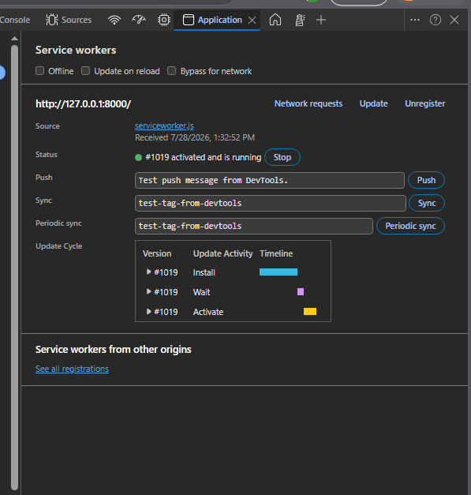

2. \textbf{Validasi \textit{Web App Manifest}}: *Web App Manifest* merupakan berkas konfigurasi JSON yang mendefinisikan bagaimana aplikasi ditampilkan kepada pengguna saat diunduh. Berdasarkan hasil validasi pada tab *Application* bagian *Manifest* pada Gambar \ref{fig:application-manifest-1} dan Gambar \ref{fig:application-manifest-2}, seluruh atribut penting seperti *Name, Short name, Start URL*, konfigurasi tampilan *Display: standalone, Theme color*, serta spesifikasi *Icons* berhasil dimuat tanpa memunculkan pesan kesalahan.

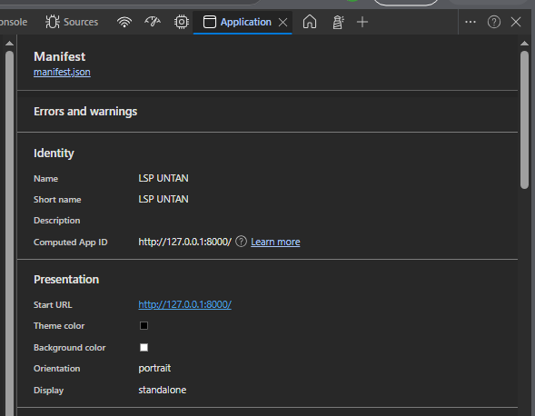

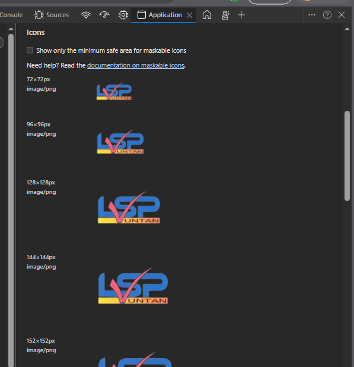

3. \textbf{Validasi Kemampuan \textit{Offline}}: Pengujian kemampuan *offline* dilakukan dengan mengaktifkan mode *Offline* pada tab *Network* di panel *DevTools* untuk mensimulasikan kondisi di mana perangkat tidak terhubung ke jaringan internet. Berdasarkan hasil pengujian pada Gambar \ref{fig:application-offline}, aplikasi tetap dapat menampilkan antarmuka *custom offline fallback* dan tidak menampilkan halaman *error* bawaan *browser*. Hal ini membuktikan bahwa strategi *caching* yang diterapkan oleh *service worker* berjalan sebagaimana mestinya.

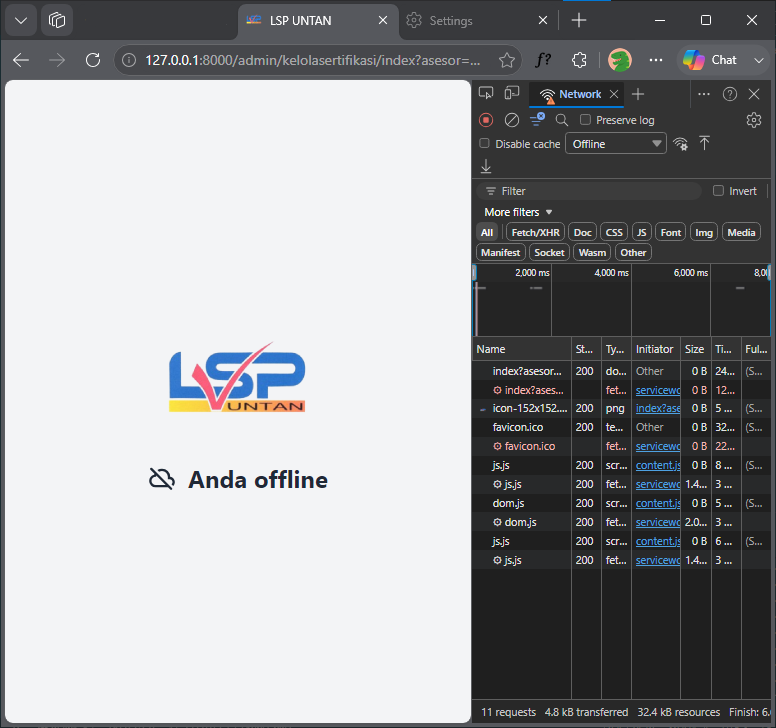

4. \textbf{Validasi Kemampuan Instalasi}: Kriteria instalasi memastikan bahwa aplikasi web dapat diunduh dan berjalan layaknya aplikasi *native* pada perangkat pengguna. Pemenuhan kriteria instalasi ini ditandai dengan munculnya petunjuk instalasi serta tombol pasang pada *browser*. Pengujian dan bukti tangkapan layar untuk fitur instalasi ini telah dijelaskan sebelumnya pada Gambar \ref{fig:pwa-flow-1} sampai Gambar \ref{fig:pwa-flow-5} di subbab *Add to Home Screen*.

\newpage

\FrameImagesfalse